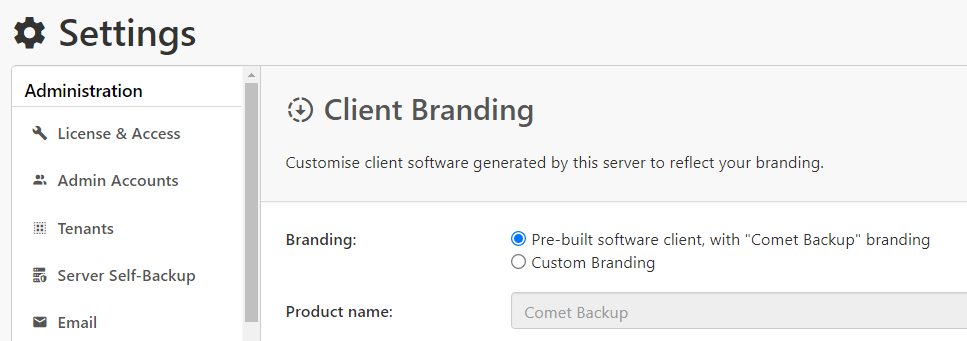
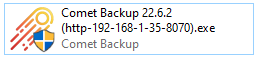
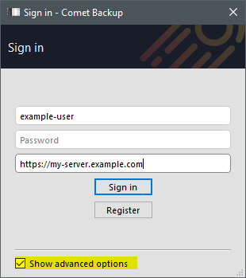
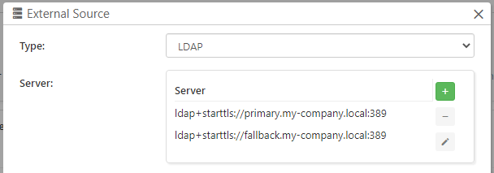
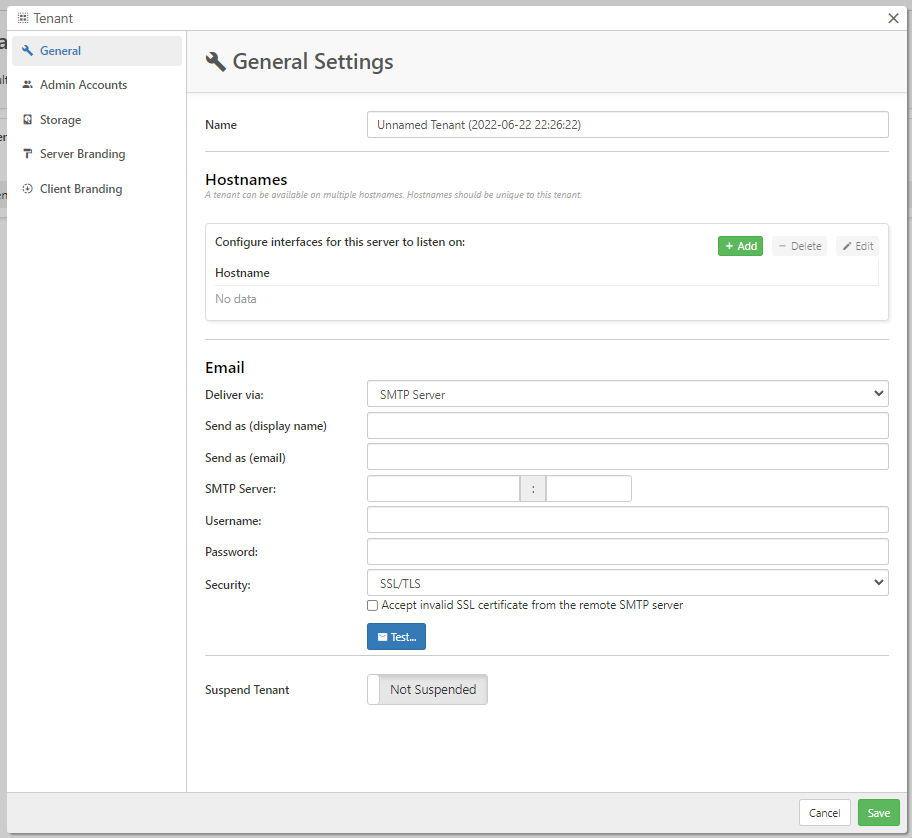

## What's New?

_"What's New?" is a new blog series covering recent changes to Comet in more detail. This article covers the latest changes in Comet Voyager over June 2022._

After our 22.5.x "Lysithea" release last month, June saw the reopening of Voyager under the 22.6.x release track. This month we shipped four software releases - one Lysithea point upgrade and three Voyager versions. There were many interesting improvements:

## Spread out peak load with a randomized job delay

If you have a large customer base on your Comet Server, it's likely that across your users, there is a large number of jobs starting at 7pm, 8pm, and 9pm, and in general a pattern where a lot of jobs start at the top of the hour. In some cases, this can cause a performance issue with the Comet Server to have to accept so many jobs at once.

There is now [a new feature in the backup job schedules, to specify a random delay](https://docs.cometbackup.com/latest/installation/user-configuration/#job-execution-delay). The random delay is calculated based on per-user, per-schedule parameters, and if applied to many customers, it will stochastically have the effect of spreading out this peak load spike over a longer time period.

Early next month we're looking at extending this to support bulk application in the Policies system and also server-side, so watch this space!

## Presigned clients and server addresses

This month in Comet 22.6.2, there is a new option to download a pre-built codesigned client installer (Comet branded):

Until now, Comet Server has always generated a custom Comet Backup client installer, customized to embed your own branding and Comet Server login URL. But this makes all our MSP partners into distributors of custom software, and therefore subject to some of the problems faced by software distributors.

If you are experiencing issues with SmartScreen, Gatekeeper, or AV products with your custom-generated client installer, and you are in a position to allow the default Comet branding, then using a pre-built codesigned client installer may resolve the issue.

## Default server URL features

When using a pre-built client installer, Comet Server no longer has an opportunity to embed your default server login URL into the application. To compensate for this, we've made three other changes:

Firstly for the silent install process on Windows, there is a new `/SERVER=` command-line parameter to override the default login URL

The silent installer has long since allowed pre-filling the username and password on the command-line, but it always relied on the internally embedded Comet Server login URL. The new pre-built codesigned installer does not embed any Comet Server login URL, and you must enter the Comet Server URL at the Comet Backup login screen. This is a problem for the silent installer which is resolved with this new `/SERVER=` parameter.

If your silent install runs under `cmd.exe`, you should use double-quotes as per `/SERVER="https://example.com"` to avoid issues with character escaping.

Secondly, the Comet Backup Windows installer now allows reading the default URL from the installer's filename if there is no embedded default URL. On Windows, the Comet Server URL will be read from the installer's EXE filename (e.g. `Comet Backup (http-my-company-com-8060).exe`) if present. This information is only used if there is no default URL embedded into the installer itself.

Thirdly and finally - if the default server login URL could not be determined - then the user is of course required to enter it in the login dialog in the software. Generally this field is hidden behind the 'Advanced Options' checkbox:

We now automatically open this area up in more cases if no default URL is known.

We've also decided to automatically open this area up if a 192.168.x.x address is used for the Comet Server. When you are first configuring Comet you may be accessing the Comet Server by its LAN or localhost IP address. This address may get compiled in to a custom client installer and be difficult to troubleshoot. Comet already showed the server URL by default if a localhost IP was used, but also showing it for a LAN IP can help speed up troubleshooting this issue.

## Fallback LDAP servers

Comet Server supports [using external authentication sources for admin accounts](https://docs.cometbackup.com/latest/installation/comet-server-configuration/#ldap). If you have a highly-available LDAP server infrastructure using multiple servers, such as an Active Directory failover cluster with primary- and fallback- domain controllers, you are now able to configure multiple LDAP server addresses in Comet Server. When an admin user tries to authenticate at the Comet Server login screen, if a connection to the first entry on the list fails, Comet will try the remaining entries on the list before denying the authentication attempt.

## Custom SMTP servers for Tenants

In Comet Server, [the Tenants feature allows you to create an isolated zone within the Comet Server](https://docs.cometbackup.com/latest/installation/comet-server-configuration/#tenants) that has its own user accounts, admin accounts, domain name, and branding settings. You can use Tenants for resellers, branding imprints, or just general customer grouping. It's a very flexible feature but every Tenant is ultimately under the jurisdiction of the top-level system administrator, and there are some limitations on the allowable settings.

A Tenant can have customized email settings, so that the Tenant's customers will receive their email reports "From" the tenant company's email address. This month, we've expanded this to also allow customizing the SMTP server used for a specific tenant.

In the last few years, email has become highly rigid and standardized. In order for your email to be properly delivered to the recipient's Inbox folder, there is [a certain amount of administrative work required to authorize domain names, set up SPF and DKIM](https://docs.cometbackup.com/latest/troubleshooting/#email-delivery-failed-when-using-mx-direct), before allowing someone to control these fields arbitrarily. An incorrect email configuration can result in tarnishing your IP address's reputation. As a result, we only allow the top-level Comet Server administrator to configure these email settings on behalf of the tenant.

Our own Comet-Hosted service is based on the Tenants feature. We expect to be able to offer custom SMTP support to Comet-Hosted users soon!

## Storage Templates

We have renamed "Requestable storage" to "Storage Templates". This is the feature of Comet Server that can [provision new per-customer credentials](https://docs.cometbackup.com/latest/installation/comet-server-configuration/#authentication-role-request-storage-vault) for your storage platform.

This change is currently rolling out across our online documentation and the Comet-Hosted service. If you are operating a Self-Hosted Comet Server, the change will appear after the 22.6.2 upgrade in the Comet Server settings page and in the Comet Backup desktop app.

Overall, the new name should make the behavior clearer to new Comet partners.

## PHP SDK v4 and Ruby SDK v2

We've released new major versions of [our PHP SDK](https://github.com/CometBackup/comet-php-sdk) and [Ruby SDK](https://github.com/CometBackup/comet-ruby-sdk). These SDKs allow you to very easily write code that talks to the Comet Server API to list users, create accounts, and change settings - doing anything at all that the Comet Server web interface can do.

Our SDKs use [Semantic Versioning ("semver")](https://semver.org/) and bumping the major version is done to indicate a compatibility break, as has happened here. We take backwards compatibility very seriously at Comet, it's a key aspect of how our API is designed. The API itself remains fully backward compatible at the HTTP / JSON wire-level. Old versions of the SDK will continue to work, even against new versions of Comet Server.

So why make a "semver-major" breaking change at all? **The compatibility break is solely in SDK code, not in the Comet Server API.** We cautiously made a change to the `MAJOR` number in response to some minor type definition changes. These changes are fully compatible at the HTTP / JSON level, but if your application was using these type definitions - for instance, declaring variables explicitly using these types - then you might get an error when upgrading the library. Please read the full changelog ([PHP](https://github.com/CometBackup/comet-php-sdk/blob/master/CHANGELOG.md) / [Ruby](https://github.com/CometBackup/comet-ruby-sdk/blob/master/CHANGELOG.md)) for detailed upgrading guidance.

As long as a "semver-major" change was required to clean this up, we've taken the opportunity to modernize our system requirements for the PHP SDK. The PHP SDK now uses PHP 7 [return type declarations](https://www.php.net/manual/en/migration70.new-features.php#migration70.new-features.return-type-declarations), as well as [parameter type hinting for scalar values](https://www.php.net/manual/en/migration70.new-features.php#migration70.new-features.scalar-type-declarations). This should give a better development experience and help you catch bugs sooner before they make it to production. If your PHP server platform is still using PHP 5.x, we advise looking at upgrade options - or else the previous 3.x major version will remain available on GitHub and in Composer.

## Translation updates

We're always happy to see work taking place in our language translations. In the course of June we saw updates to the Thai (22.6.0) and Dutch (22.6.1) translations for Comet.

As always - Our staff mostly only speak English, so we do hire translation contractors for the bulk of this work - but over the years we have consistently found that the best-quality translations come from our customers, who have a full understanding of both the software and the IT / MSP backup industry. If you see a typo in our translations, or if you want to help translate Comet into a new language, we'd love your contribution and it couldn't be easier to get started - just [head to our GitHub page and follow the instructions](https://github.com/CometBackup/translations#readme).
