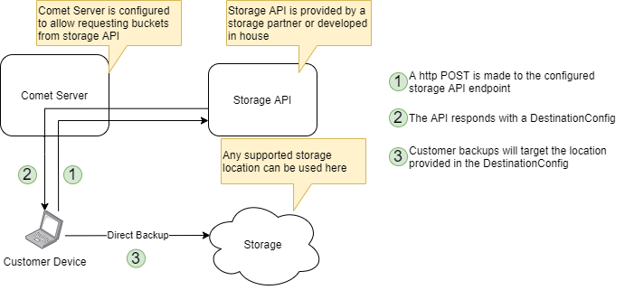

# API Guide

## Overview

The Comet Server can be controlled via an API over HTTP / HTTPS. Every action that can be performed via the Comet Server web interface or the Comet Backup client software interface can also be performed by the API.

You can see the full list of Comet Server API endpoints in the "API Reference" document. This document includes information about

- Supported API endpoints,
- Data structures used by the API, and
- Constant values used by the API.

The Comet Server web interface is developed solely using this publicly documented API. You are invited to use the Web Browser network inspector tools to help find real-world example API calls.

## Compatibility

The Comet Server API is backward compatible: Integration code developed against older versions of Comet Server should continue to work with newer versions of Comet Server. For the API endpoints publicly documented in this section, our company intends to maintain this compatibility in perpetuity.

We recommend using the latest available online documentation. However, you can refer to the documentation for a specific version of Comet Server, included as local files with your copy of Comet Server.

## Quick Start (examples)

These examples make a network request to a Comet Server at `http://127.0.0.1/`, with the Auth Role enabled, using the administrator credentials `admin:admin`, to retrieve a list of user accounts.

### cURL

    curl -X POST -d 'Username=admin&AuthType=Password&Password=admin' 'http://127.0.0.1/api/v1/admin/list-users'

### PHP (Composer)

A set of PHP classes are available to simplify using the Comet Server API. Please see [CometBackup/comet-php-sdk at GitHub](https://github.com/CometBackup/comet-php-sdk) for more information.

    $server = new \Comet\Server("http://127.0.0.1:8060/", "admin", "admin");var_dump( $server->AdminListAccounts() );

### PHP (cURL)

    <?php$ch = curl_init();curl_setopt($ch, CURLOPT_URL,  'http://127.0.0.1/api/v1/admin/list-users');curl_setopt($ch, CURLOPT_POST, 1);curl_setopt($ch, CURLOPT_POSTFIELDS, http_build_query([    'Username' => 'admin',    'AuthType' => 'Password',    'Password' => 'admin',]));curl_setopt($ch, CURLOPT_RETURNTRANSFER, true);$response = curl_exec($ch);curl_close($ch);var_export($response);

### Powershell

    Invoke-Webrequest -Uri http://127.0.0.1/api/v1/admin/list-users -Method POST -Body @{Username="admin"; AuthType="Password"; Password="admin"} | select Content

#### Compatibility with Server 2012 R2 and earlier

If your Comet Server is using HTTPS, the version of Powershell on Windows Server 2012 R2 will not make a TLS 1.2 connection by default. Comet Server requires TLS 1.2 or higher when accessed over HTTPS. You can resolve this issue by adding this line to the top of your Powershell script:

    [Net.ServicePointManager]::SecurityProtocol = [Net.SecurityProtocolType]::Tls12

#### Modifying an account

    # Look up an account profile$lookup = Invoke-Webrequest -Uri http://127.0.0.1/api/v1/admin/get-user-profile -Method POST -Body @{    Username="admin"; AuthType="Password"; Password="admin";    TargetUser="testuser"}$profile = ConvertFrom-Json $lookup# Modify the profile however you like$profile.PolicyID = "8876b0d8-8f26-4fab-9ac9-9274ae030cfc"# Convert back to JSON and submit to the server$updated_json = ConvertTo-JSON $profile -Depth 99Invoke-WebRequest -Uri http://127.0.0.1/api/v1/admin/set-user-profile -Method POST -Body @{    Username="admin"; AuthType="Password"; Password="admin";    TargetUser="testuser";    ProfileData=$updated_json}

#### Find all Comet-type Storage Vault URLs

    # Look up all account profiles$lookup = Invoke-Webrequest -Uri http://127.0.0.1/api/v1/admin/list-users-full -Method POST -Body @{    Username="admin"; AuthType="Password"; Password="admin";}$all_users = ConvertFrom-Json $lookup# CSV headerWrite-Host "Username,Storage Vault Description,Comet Server URL"# Look at each user's profileforeach ($user in $all_users | Get-Member -type NoteProperty) {     foreach ($storage_vault_id in $all_users."$($user.Name)".Destinations | Get-Member -type NoteProperty) {                $storage_vault = $all_users."$($user.Name)".Destinations."$($storage_vault_id.Name)"        if ($storage_vault.DestinationType -eq 1003) { # DESTINATIONTYPE_COMET = 1003            Write-Host "$($user.Name),$($storage_vault.Description),$($storage_vault.CometServer)"        }    }}

#### Set policies for all user accounts

    # Class keyword requires PowerShell 5.0+ or greaterclass CometServer {    [string]$Address    [string]$AdminUsername    [string]$AdminPassword    CometServer([string]$Address, [string]$AdminUsername, [string]$AdminPassword) {        $this.Address = $Address        $this.AdminUsername = $AdminUsername        $this.AdminPassword = $AdminPassword    }    [string[]]ListUsers() {        return $this._request("api/v1/admin/list-users")    }    [Object]GetUserProfile([string]$Username) {        return $this._request("api/v1/admin/get-user-profile", @{"TargetUser"= $Username})    }    [Object]SetUserProfile([string]$Username, [Object]$Profile) {        $ProfileJSON = ConvertTo-JSON $Profile -Depth 99        return $this._request("api/v1/admin/set-user-profile", @{"TargetUser"=$Username; "ProfileData"=$ProfileJSON})    }    [Object]_request([string]$Endpoint) {        return $this._request($Endpoint, @{})    }    [Object]_request([string]$Endpoint, [hashtable]$extraParams) {        $allParams = @{            Username = $this.AdminUsername;            AuthType = "Password";            Password = $this.AdminPassword;        }        foreach ($h in $extraParams.GetEnumerator()) {            $allParams[$h.Name] = $h.Value        }        $response = Invoke-Webrequest -Uri ($this.Address + $Endpoint) -Method POST -Body $allParams        $ret = ConvertFrom-Json $response        return $ret    }}$cs = [CometServer]::new("http://127.0.0.1:8060/", "adminuser", "adminpass")$all_users = $cs.ListUsers()foreach($username in $all_users) {    $profile = $cs.GetUserProfile($username)    $profile.PolicyID = "00000000-0000-4a00-0000-000000000000"    $cs.SetUserProfile($username, $profile)}

### VBScript

    set oRequest = CreateObject("Microsoft.XMLHTTP")oRequest.open "POST", "http://127.0.0.1/api/v1/admin/list-users", falseoRequest.setRequestHeader "Content-Type", "application/x-www-form-urlencoded"oRequest.send "Username=admin&AuthType=Password&Password=admin"MsgBox oRequest.responseText

### Go (golang)

A Go SDK is available to simplify using the Comet Server API. Please see [CometBackup/comet-go-sdk at GitHub](https://github.com/CometBackup/comet-go-sdk) for more information. The repo includes some code examples using the SDK as well.

Here's a small example:

    import (    "encoding/json"    "fmt"    cometsdk "github.com/CometBackup/comet-go-sdk")func PrintRecentJobs() {    client, err := cometsdk.NewCometAPIClient("http://localhost:8060", "admin", "admin")    if err != nil {        panic(err)    }    profile, err := client.AdminGetJobsRecent()    if err != nil {        panic(err)    }    bytes, err := json.MarshalIndent(profile, "", "   ")    if err != nil {        panic(err)    }    fmt.Println(string(bytes))}

Alternatively, you can handcraft the request, but you lose the benefit of having data types to marshal/unmarshal JSON with:

    import (    "fmt"    "net/http"    "io/ioutil")func ListUsers() {    resp, err := http.Post(        "http://127.0.0.1/api/v1/admin/list-users",        "application/x-www-form-urlencoded",        []byte("Username=admin&AuthType=Password&Password=admin"),    )    if err != nil {        panic(err)    }    defer resp.Body.Close()    body, err := ioutil.ReadAll(resp.Body)    if err != nil {        panic(err)    }    fmt.Println(string(body))}

### Python 3

    #!/usr/bin/python3import jsonimport urllib.parseimport urllib.requestclass CometServer(object):    def __init__(self, url, adminuser, adminpass):        self.url = url        self.adminuser = adminuser        self.adminpass = adminpass            def AdminListUsers(self):        """List all usernames on the Comet Server"""        return self._request("api/v1/admin/list-users", {})    def _request(self, endpoint, extraparams):        """Make API request to Comet Server and parse response JSON"""        apiRequest = urllib.request.Request(            url = self.url + endpoint,            data = urllib.parse.urlencode({                "Username": self.adminuser,                "AuthType": "Password",                "Password": self.adminpass,                **extraparams            }).encode('utf-8')        )        ret = None        with urllib.request.urlopen(apiRequest) as apiResponse:            ret = json.loads( apiResponse.read() )                return retdef main():    cs = CometServer("http://127.0.0.1:8060/", "admin", "admin")    print( cs.AdminListUsers() )    if __name__ == "__main__":    main()

### Ruby (Gem)

A Ruby Gem is available to simplify using the Comet Server API. Please see [comet_backup_ruby_sdk at RubyGems.org](https://rubygems.org/gems/comet_backup_ruby_sdk) for more information.

    require 'comet_backup_ruby_sdk'client = Comet::CometServer.new("http://127.0.0.1:8060", "admin", "admin")client.admin_list_users

### Ruby (net/http)

    require 'net/http'uri = URI('http://127.0.0.1:8060/api/v1/admin/list-users')params = {    'Username' => 'admin',    'AuthType' => 'Password',    'Password' => 'admin'}res = Net::HTTP.post_form(uri, params)if res.is_a?(Net::HTTPSuccess)    puts res.bodyend

## Other API - Comet Server web interface postMessage API

As well as making API requests to your Comet Server instances described above, an API is also available for the Comet Server web interface frontend.

This additional API allows you to control some parts of the web interface by making `postMessage` calls in Javascript. Messages will be sent in either direction, as Javascript objects, in the general form `{msg: "message_type", other_parameters: .... }`.

To use this API, create a Comet Server web interface window (e.g. by using `window.open()` or `<iframe>`), and add a `message` event listener to wait for the `AppLoaded` API message described below.

### AppLoaded

Notification sent to the opener window when the Comet Server web interface is ready to receive other `postMessage` requests.

- Message format: Object
- Direction: Response (Sent by Comet Server web interface to caller)

Object parameters:

| Parameter name | Value        |
| -------------- | ------------ |
| `msg`          | `app_loaded` |

### SessionLogin

Perform a single sign-on (SSO) login to the Comet Server web interface, as an administrator account.

- Message format: Object
- Direction: Request (Sent by caller to Comet Server web interface)

Object parameters:

<!-- Parameter name

Value

`msg`

`session_login`

`username`

Admin username

`sessionkey`

Pre-generated admin session key from the `AdminAccountSessionStart` or `HybridSessionStart` server API -->

| Parameter name | Value                                                                                                  |
| -------------- | ------------------------------------------------------------------------------------------------------ |
| `msg`          | `session_login`                                                                                        |
| `username`     | Admin username                                                                                         |
| `sessionkey`   | Pre-generated admin session key from the `AdminAccountSessionStart` or `HybridSessionStart` server API |

### UserSessionLogin

Perform a single sign-on (SSO) login to the Comet Server web interface, as an end-user account.

- Message format: Object
- Direction: Request (Sent by caller to Comet Server web interface)

Object parameters:

<!-- Parameter name

Value

`msg`

`user_session_login`

`username`

Customer username

`sessionkey`

Pre-generated end-user session key from the `UserWebSessionStart` or `AdminAccountSessionStartAsUser` or `HybridSessionStart` server API -->

| Parameter name | Value                                                                                                                                    |
| -------------- | ---------------------------------------------------------------------------------------------------------------------------------------- |
| `msg`          | `user_session_login`                                                                                                                     |
| `username`     | Customer username                                                                                                                        |
| `sessionkey`   | Pre-generated end-user session key from the `UserWebSessionStart` or `AdminAccountSessionStartAsUser` or `HybridSessionStart` server API |

## Other API - Comet Server live event streaming

In addition to the method described above for making API requests to your Comet Server instances, there are some additional APIs available to receive live, realtime notifications from the Comet Server of new jobs, completed jobs, and user profile configuration changes.

Because of the reversed direction of information, these APIs do not entirely fit the general documented pattern and are documented separately here.

There are two ways to configure these live event notifications: either as a webhook or as a websocket.

### Webhooks

_This feature is available in Comet Server 20.6.1 and later._

You can configure a URL to receive events. The Comet Server will submit events by HTTP `POST` and must be able to reach the configured URL from its network position. The webhook's body is an event structure in JSON as described below in the "Message types" section.

An `x-Comet-Tracing-Id` header is present in the webhook request. Your webhook endpoint should respond with an HTTP `200 OK` code to all POST events. If your webhook endpoint fails to do so, the failure will be logged in the Comet Server log, along with its corresponding `x-Comet-Tracing-Id` header value; and Comet Server will retry the request a finite number of times.

Custom headers to be included in the webhook POST request can be configured using the `CustomHeaders` field of [`WebhookOption`](https://docs.cometbackup.com/latest/api/api-data-structures#api-struct-WebhookOption). This field can be set using the API endpoints as described below, or directly in the `cometd.cfg` file:

        ...    "WebhookOptions": {        "ExampleOrganization": {            "URL": "http://example.com/webhooks",            "WhiteListedEventTypes": [],            "CustomHeaders": {                "Authorization": "Bearer f1d2d2f9",                "X-Custom-Header": "Custom header value"            }        }    },    ...

Webhook messages are sent in parallel and may be unordered when received. When a webhook experiences an error and retries, the submission is not ordered.

You can use the webhook feature as follows:

1.  Use the [`AdminMetaWebhookOptionsGet`](https://docs.cometbackup.com/latest/api/api-methods#adminmetawebhookoptionsget-get-the-server-webhook-configuration) API to retrieve the current webhook configuration
2.  Modify the data structure to add your own additional webhook endpoint in [`WebhookOption`](https://docs.cometbackup.com/latest/api/api-data-structures#api-struct-WebhookOption) format.

    - If the `WhiteListedEventTypes` array is empty, all event types are sent. Otherwise, only [the specified event types](https://docs.cometbackup.com/latest/api/api-constants#sevt) are sent.

3.  Use the [`AdminMetaWebhookOptionsSet`](https://docs.cometbackup.com/latest/api/api-methods#adminmetawebhookoptionsset-update-the-server-webhook-configuration) API to replace the server's current webhook configuration with the updated configuration.
4.  You should immediately receive the initial [SEVT_META_HELLO](https://docs.cometbackup.com/latest/api/api-constants#sevt) webhook event to your configured endpoint.

    - A [SEVT_META_HELLO](https://docs.cometbackup.com/latest/api/api-constants#sevt) message will be sent every time the webhook queue is flushed. For instance, it will occur if the Comet Server is restarted.

The webhook configuration will be persisted in the `cometd.cfg` file. You may also choose to make changes to this file directly.

### Websocket

_This feature is available in any version of Comet Server._

Instead of using a Webhook, you can make an outbound websocket connection. This method does not require your application to have a public URL. Messages will always be delivered sequentially in-order and will be delivered for as long as the websocket is held open.

If the websocket client is unable to drain messages sufficiently quickly from the TCP stream, event messages will be queued for publication up to an implementation-defined limit. After this limit, the websocket connection would be dropped by the Comet Server; in this case, a client should reconnect and perform a remedial sync using the standard Comet Server APIs to catch up on any missed status changes.

You can use the websocket feature as follows:

1.  Make a GET request to `/api/v1/events/stream`.
2.  The server will perform an HTTP Upgrade to a WebSocket connection.
3.  The client must emit five text message frames in order, containing `Username`, `AuthType`, `Password`, `SessionKey`, and `TOTP` parameter values respectively. An empty-string text message frame can be used to skip providing a value.
4.  If the authentication failed, the server will emit a text message frame containing the string `403 Unauth`, and then drop the connection. If the authentication succeeded, the server will emit a text message frame containing the string `200 OK`.
5.  The server will then send a text message frame for each event, containing an event structure in JSON as described below in the "Message types" section.

### Message types

For both webhook and websocket sources, you will receive a JSON-encoded [StreamableEvent](https://docs.cometbackup.com/latest/api/api-data-structures#api-struct-StreamableEvent) structure. The `Type` field indicates the type of the event and will be one of the [SEVT\_ constant values](https://docs.cometbackup.com/latest/api/api-constants#sevt).

The first message you receive will have the [`SEVT_META_HELLO`](https://docs.cometbackup.com/latest/api/api-constants#sevt) type. This indicates that a new live-event-streaming session has been created.

## Other API - account.CometBackup.com API

As well as making API requests to your Comet Server instances described above, an API is also available for the account.CometBackup.com web application.

This additional API allows you to control some parts of your account.CometBackup.com account by making HTTP POST requests:

#### Supported Authentication Methods

You may use a password or API token for authentication with the account.cometbackup.com API. Specify the authentication type using the `authType` parameter. If the `authType` parameter is not specified, then it will default to the 'password' authentication type.

<!-- Authentication Type

Required Parameters

'password'

Provide the `email` and `password` parameters in the POST body

'apiToken'

Provide the `apiToken` parameter in the POST body -->

| Authentication Type | Required Parameters                                            |
| ------------------- | -------------------------------------------------------------- |
| 'password'          | Provide the `email` and `password` parameters in the POST body |
| 'apiToken'          | Provide the `apiToken` parameter in the POST body              |

Example API request using the apiToken method of authentication:

    curl -v -d 'apiToken=W2FAKETOKEN7Y&authType=apiToken&format=json' https://account.cometbackup.com/api/v1/downloads/list

You can manage API tokens for your account from the [API token management page](https://account.cometbackup.com/manage_api_tokens)

### LicenseRelax

Relax an existing Comet Server serial number.

- Endpoint: `POST https://account.cometbackup.com/api/v1/license/relax`
- Request body in `application/x-www-form-urlencoded` format

Request parameters:

<!-- Parameter name

Value

`authType`

Specify the authentication type ('password' or 'authToken')

`authToken`

Specify the authentication token (for 'authToken' method of authentication)

`email`

Email address to log in to account.CometBackup.com

`password`

Password to log in to account.CometBackup.com

`serial`

Target serial number to relax -->

| Parameter name | Value                                                                       |
| -------------- | --------------------------------------------------------------------------- |
| 'authType'     | Specify the authentication type ('password' or 'authToken')                 |
| 'authToken'    | Specify the authentication token (for 'authToken' method of authentication) |
| 'email'        | Email address to log in to account.CometBackup.com                          |
| 'password'     | Password to log in to account.CometBackup.com                               |
| 'serial'       | Target serial number to relax                                               |

Possible responses:

<!-- HTTP Code

Content-Type

Response Body

200

`text/plain`

OK, the serial was relaxed successfully

400

`text/plain`

Invalid or missing parameter

403

`text/plain`

Invalid credentials

500

`text/plain`

Internal error -->

| HTTP Code | Content-Type | Response Body                           |
| --------- | ------------ | --------------------------------------- |
| 200       | text/plain   | OK, the serial was relaxed successfully |
| 400       | text/plain   | Invalid or missing parameter            |
| 403       | text/plain   | Invalid credentials                     |
| 500       | text/plain   | Internal error                          |

This API can be accessed via an additional 1 endpoint(s) for backward compatibility. These aliases will be maintained indefinitely, but new applications should not use them.

- `POST https://account.cometbackup.com/api/v1/relax_license` _("RelaxLicense")_

### LicenseCreate

Generate a new Comet Server serial number.

- Endpoint: `POST https://account.cometbackup.com/api/v1/license/create`
- Request body in `application/x-www-form-urlencoded` format

Request parameters:

<!-- Parameter name

Value

`authType`

Specify the authentication type ('password' or 'authToken')

`authToken`

Specify the authentication token (for 'authToken' method of authentication)

`email`

Email address to log in to account.CometBackup.com

`password`

Password to log in to account.CometBackup.com

`target_name`

Friendly name for the serial number (optional) -->

| Parameter name | Value                                                                       |
| -------------- | --------------------------------------------------------------------------- |
| 'authType'     | Specify the authentication type ('password' or 'authToken')                 |
| 'authToken'    | Specify the authentication token (for 'authToken' method of authentication) |
| 'email'        | Email address to log in to account.CometBackup.com                          |
| 'password'     | Password to log in to account.CometBackup.com                               |
| 'target_name'  | Friendly name for the serial number (optional)                              |

Possible responses:

<!-- HTTP Code

Content-Type

Response Body

200

`text/plain`

Newly generated serial (plain text)

400

`text/plain`

Invalid or missing parameter

403

`text/plain`

Invalid credentials

500

`text/plain`

Internal error -->

| HTTP Code | Content-Type | Response Body                       |
| --------- | ------------ | ----------------------------------- |
| 200       | text/plain   | Newly generated serial (plain text) |
| 400       | text/plain   | Invalid or missing parameter        |
| 403       | text/plain   | Invalid credentials                 |
| 500       | text/plain   | Internal error                      |

This API can be accessed via an additional 1 endpoint(s) for backward compatibility. These aliases will be maintained indefinitely, but new applications should not use them.

- `POST https://account.cometbackup.com/api/v1/create_license` _("CreateLicense")_

### LicenseArchive

Deactivate and archive an existing Comet Server serial number

- Endpoint: `POST https://account.cometbackup.com/api/v1/license/archive`
- Request body in `application/x-www-form-urlencoded` format

Request parameters:

<!-- Parameter name

Value

`authType`

Specify the authentication type ('password' or 'authToken')

`authToken`

Specify the authentication token (for 'authToken' method of authentication)

`email`

Email address to log in to account.CometBackup.com

`password`

Password to log in to account.CometBackup.com

`serial`

Target serial number to relax -->

| Parameter name | Value                                                                       |
| -------------- | --------------------------------------------------------------------------- |
| 'authType'     | Specify the authentication type ('password' or 'authToken')                 |
| 'authToken'    | Specify the authentication token (for 'authToken' method of authentication) |
| 'email'        | Email address to log in to account.CometBackup.com                          |
| 'password'     | Password to log in to account.CometBackup.com                               |
| 'serial'       | Target serial number to relax                                               |

Possible responses:

<!-- HTTP Code

Content-Type

Response Body

200

`text/plain`

OK, the serial was archived successfully

400

`text/plain`

Invalid or missing parameter

403

`text/plain`

Invalid credentials

500

`text/plain`

Internal error -->

| HTTP Code | Content-Type | Response Body                            |
| --------- | ------------ | ---------------------------------------- |
| 200       | text/plain   | OK, the serial was archived successfully |
| 400       | text/plain   | Invalid or missing parameter             |
| 403       | text/plain   | Invalid credentials                      |
| 500       | text/plain   | Internal error                           |

This API can be accessed via an additional 1 endpoint(s) for backward compatibility. These aliases will be maintained indefinitely, but new applications should not use them.

- `POST https://account.cometbackup.com/api/v1/archive_license` _("ArchiveLicense")_

### LicenseListAll

List all your current Comet Server serial numbers

- Endpoint: `POST https://account.cometbackup.com/api/v1/license/list_all`
- Request body in `application/x-www-form-urlencoded` format

Request parameters:

<!-- Parameter name

Value

`authType`

Specify the authentication type ('password' or 'authToken')

`authToken`

Specify the authentication token (for 'authToken' method of authentication)

`email`

Email address to log in to account.CometBackup.com

`password`

Password to log in to account.CometBackup.com -->

| Parameter name | Value                                                                       |
| -------------- | --------------------------------------------------------------------------- |
| 'authType'     | Specify the authentication type ('password' or 'authToken')                 |
| 'authToken'    | Specify the authentication token (for 'authToken' method of authentication) |
| 'email'        | Email address to log in to account.CometBackup.com                          |
| 'password'     | Password to log in to account.CometBackup.com                               |

Possible responses:

<!-- HTTP Code

Content-Type

Response Body

200

`application/json`

Array of objects, each object describing the Comet Server serial license

400

`text/plain`

Invalid or missing parameter

403

`text/plain`

Invalid credentials

500

`text/plain`

Internal error -->

| HTTP Code | Content-Type     | Response Body                                                            |
| --------- | ---------------- | ------------------------------------------------------------------------ |
| 200       | application/json | Array of objects, each object describing the Comet Server serial license |
| 400       | text/plain       | Invalid or missing parameter                                             |
| 403       | text/plain       | Invalid credentials                                                      |
| 500       | text/plain       | Internal error                                                           |

### ReportActiveServices

List all currently active services

- Endpoint: `POST https://account.cometbackup.com/api/v1/report/active_services`
- Request body in `application/x-www-form-urlencoded` format

Request parameters:

<!-- Parameter name

Value

`authType`

Specify the authentication type ('password' or 'authToken')

`authToken`

Specify the authentication token (for 'authToken' method of authentication)

`email`

Email address to log in to account.CometBackup.com

`password`

Password to log in to account.CometBackup.com

`format`

One of `csv`, `json`, or `xlsx` -->

| Parameter name | Value                                                                       |
| -------------- | --------------------------------------------------------------------------- |
| 'authType'     | Specify the authentication type ('password' or 'authToken')                 |
| 'authToken'    | Specify the authentication token (for 'authToken' method of authentication) |
| 'email'        | Email address to log in to account.CometBackup.com                          |
| 'password'     | Password to log in to account.CometBackup.com                               |
| 'format'       | One of 'csv', 'json', or 'xlsx'                                             |

Possible responses:

<!-- HTTP Code

Content-Type

Response Body

200

`text/csv`

My Active Services report in CSV format (if `format=csv` was supplied)

200

`application/json`

My Active Services report in JSON format (if `format=json` was supplied)

200

`application/vnd.openxmlformats-officedocument.spreadsheetml.sheet`

My Active Services report in XLSX format (if `format=xlsx` was supplied)

400

`text/plain`

Invalid or missing parameter

403

`text/plain`

Invalid credentials

500

`text/plain`

Internal error -->

| HTTP Code | Content-Type                                                      | Response Body                                                            |
| --------- | ----------------------------------------------------------------- | ------------------------------------------------------------------------ |
| 200       | text/csv                                                          | My Active Services report in CSV format (if `format=csv` was supplied)   |
| 200       | application/json                                                  | My Active Services report in JSON format (if `format=json` was supplied) |
| 200       | application/vnd.openxmlformats-officedocument.spreadsheetml.sheet | My Active Services report in XLSX format (if `format=xlsx` was supplied) |
| 400       | text/plain                                                        | Invalid or missing parameter                                             |
| 403       | text/plain                                                        | Invalid credentials                                                      |
| 500       | text/plain                                                        | Internal error                                                           |

### ReportBillingHistory

List all deductions from your account balance

- Endpoint: `POST https://account.cometbackup.com/api/v1/report/billing_history`
- Request body in `application/x-www-form-urlencoded` format

Request parameters:

<!-- Parameter name

Value

`authType`

Specify the authentication type ('password' or 'authToken')

`authToken`

Specify the authentication token (for 'authToken' method of authentication)

`email`

Email address to log in to account.CometBackup.com

`password`

Password to log in to account.CometBackup.com

`format`

One of `csv`, `json`, or `xlsx` -->

| Parameter name | Value                                                                       |
| -------------- | --------------------------------------------------------------------------- |
| 'authType'     | Specify the authentication type ('password' or 'authToken')                 |
| 'authToken'    | Specify the authentication token (for 'authToken' method of authentication) |
| 'email'        | Email address to log in to account.CometBackup.com                          |
| 'password'     | Password to log in to account.CometBackup.com                               |
| 'format'       | One of 'csv', 'json', or 'xlsx'                                             |

Possible responses:

<!-- HTTP Code

Content-Type

Response Body

200

`text/csv`

Credit Usage report in CSV format (if `format=csv` was supplied)

200

`application/json`

Credit Usage report in JSON format (if `format=json` was supplied)

200

`application/vnd.openxmlformats-officedocument.spreadsheetml.sheet`

Credit Usage report in XLSX format (if `format=xlsx` was supplied)

400

`text/plain`

Invalid or missing parameter

403

`text/plain`

Invalid credentials

500

`text/plain`

Internal error -->

| HTTP Code | Content-Type                                                      | Response Body                                                      |
| --------- | ----------------------------------------------------------------- | ------------------------------------------------------------------ |
| 200       | text/csv                                                          | Credit Usage report in CSV format (if `format=csv` was supplied)   |
| 200       | application/json                                                  | Credit Usage report in JSON format (if `format=json` was supplied) |
| 200       | application/vnd.openxmlformats-officedocument.spreadsheetml.sheet | Credit Usage report in XLSX format (if `format=xlsx` was supplied) |
| 400       | text/plain                                                        | Invalid or missing parameter                                       |
| 403       | text/plain                                                        | Invalid credentials                                                |
| 500       | text/plain                                                        | Internal error                                                     |

### LatestVersion

Retrieve information about the latest available version of Comet Server to download.

- Endpoint: `GET https://account.cometbackup.com/latestversion`
- No request body
- No authentication required for this endpoint

Request parameters:

- No request parameters

Possible responses:

<!-- HTTP Code

Content-Type

Response Body

200

`application/json`

Comet Server version information in JSON format

500

`text/plain`

Internal error -->

| HTTP Code | Content-Type       | Response Body                                   |
| --------- | ------------------ | ----------------------------------------------- |
| 200       | `application/json` | Comet Server version information in JSON format |
| 500       | `text/plain`       | Internal error                                  |

Example Response:

    {    "latest_stable": "20.8.3",    "latest_prerelease": "20.9.3",    "downloads_url": "https://account.cometbackup.com/downloads",    "updates_info": [        "20.8.3 Jupiter / 20.9.3 Voyager now available - release notes https://changelog.blog.cometbackup.com/ ",        "Disk Image overview - https://youtu.be/rcnMxvjQEfU"    ]}

### List Comet server version

Retrive a list of Comet Server versions, including the ids for usage in the

- Endpoint `POST` [https://account.cometbackup.com/api/v1/downloads/list](https://account.cometbackup.com/api/v1/downloads/list)
- Request body in `application/x-www-form-urlencoded` format

Request Parameters:

<!-- Parameter name

Value

email

Email address to log in to account.cometbackup.com

password

Password to log in to account.cometbackup.com -->

| Parameter name | Value                                              |
| -------------- | -------------------------------------------------- |
| 'email'        | Email address to log in to account.cometbackup.com |
| 'password'     | Password to log in to account.cometbackup.com      |

Possible responses:

<!-- HTTP Code

Content-Type

Response Body

200

`application/json`

A json list of server versions, ordered by the most recent release

500

`text/plain`

Internal error -->

| HTTP Code | Content-Type       | Response Body                                                      |
| --------- | ------------------ | ------------------------------------------------------------------ |
| 200       | `application/json` | A json list of server versions, ordered by the most recent release |
| 500       | `text/plain`       | Internal error                                                     |

Example Response:

    [    {        "version_key": "20.9.3",        "Name": "Comet Server Release Notes",        "Version": "20.9.3 \"Voyager\"",        "Download": "Download for Windows 107.68 MB Download for Linux (.deb) 98.53 MB Download for Linux (.rpm) 98.54 MB Download for Linux (other) 97.18 MB"    },    {        "version_key": "20.8.3",        "Name": "Comet Server Release Notes",        "Version": "20.8.3 \"Jupiter\"",        "Download": "Download for Windows 105.47 MB Download for Linux (.deb) 98.53 MB Download for Linux (.rpm) 98.54 MB Download for Linux (other) 97.18 MB"    }]

### Download Comet server Version

Download a version of the Comet Server.

- Endpoint `POST` [https://account.cometbackup.com/api/v1/downloads/get](https://account.cometbackup.com/api/v1/downloads/get)
- Request body in `application/x-www-form-urlencoded` format

Example:

     wget --method POST \      --body-data 'email=youremail&password=yourpassword&platform=download_windows&version_key=20.9.3' \      --content-disposition \      https://account.cometbackup.com/api/v1/downloads/get

Request Parameters:

<!-- Parameter name

Value

email

Email address to log in to account.cometbackup.com

password

Password to log in to account.cometbackup.com

version_key

A string key for this version, can be matched with the result of the Download List Api method

platform

the string for the platform, should be one of ("download_windows", "download_linux_deb", "download_linux_rpm", "download_linux_tar") -->

| Parameter name | Value                                                                                                                                |
| -------------- | ------------------------------------------------------------------------------------------------------------------------------------ |
| email          | Email address to log in to account.cometbackup.com                                                                                   |
| password       | Password to log in to account.cometbackup.com                                                                                        |
| version_key    | A string key for this version, can be matched with the result of the Download List Api method                                        |
| platform       | the string for the platform, should be one of ("download_windows", "download_linux_deb", "download_linux_rpm", "download_linux_tar") |

Possible responses:

<!-- HTTP Code

Content-Type

Response Body

200

`application/octet-stream`

a stream for the download

500

`text/plain`

Internal error -->

| HTTP Code | Content-Type               | Response Body             |
| --------- | -------------------------- | ------------------------- |
| 200       | `application/octet-stream` | a stream for the download |
| 500       | `text/plain`               | Internal error            |

### Create Comet-Hosted Server instance

Create a Comet-Hosted Server instance from the command line. This is an async action, It will return OK if the command is dispatched, but you need to check the server status to ensure it is ready for other operations. To be certain you should healthcheck the dns that will be created for the instance.

- Endpoint: `POST` [https://account.cometbackup.com/api/v1/cometgo](https://account.cometbackup.com/api/v1/cometgo)
- Request body in `application/x-www-form-urlencoded` format

Request parameters:

<!-- Parameter name

Value

email

Email address to log in to account.cometbackup.com

password

Password to log in to account.cometbackup.com

region

The region which this instance should be created in I.E 'ap-southeast-2'.

subdomain

Subdomain for the new Comet-Hosted Server instance.

server_name

Server Name for display in the accounts dashboard site -->

| Parameter name | Value                                                                    |
| -------------- | ------------------------------------------------------------------------ |
| 'email'        | Email address to log in to account.cometbackup.com                       |
| 'password'     | Password to log in to account.cometbackup.com                            |
| 'region'       | The region which this instance should be created in I.E 'ap-southeast-2' |
| 'subdomain'    | Subdomain for the new Comet-Hosted Server instance                       |
| 'server_name'  | Server Name for display in the accounts dashboard site                   |

Possible responses:

<!-- HTTP Code

Content-Type

Response Body

201

`application/json`

`{ "status": "OK" }`

403

`application/json`

`{ "status": "error" }`

500

`application/json`

`{"status": "error" }` -->

| HTTP Code | Content-Type       | Response Body           |
| --------- | ------------------ | ----------------------- |
| 201       | `application/json` | `{ "status": "OK" }`    |
| 403       | `application/json` | `{ "status": "error" }` |
| 500       | `application/json` | `{"status": "error" }`  |

### Get Comet-Hosted Server status

Returns the status, dns and admin crednetials for controlling the server

- Endpoint: `POST` [https://account.cometbackup.com/api/v1/cometgo/status](https://account.cometbackup.com/api/v1/cometgo/status)
- Request body in `application/x-www-form-urlencoded` format

Request parameters:

<!-- Parameter name

Value

hosted_server_id

the identifier of the hosted server -->

| Parameter name   | Value                               |
| ---------------- | ----------------------------------- |
| hosted_server_id | the identifier of the hosted server |

Possible responses:

<!-- HTTP Code

Content-Type

Response Body

200

`application/json`

The API response with status "OK" and attached instance details

403

`application/json`

`{ "status": "error" }` The request is denied for authorization

500

`application/json`

`{"status": "error" }` There was an error with the request, report to Comet Support. -->

| HTTP Code | Content-Type       | Response Body                                                                        |
| --------- | ------------------ | ------------------------------------------------------------------------------------ |
| 200       | `application/json` | The API response with status "OK" and attached instance details                      |
| 403       | `application/json` | `{ "status": "error" }` The request is denied for authorization                      |
| 500       | `application/json` | `{"status": "error" }` There was an error with the request, report to Comet Support. |

Sample instance status response:

    {    "status": "OK",    "data": {        "hosted_server_id": "506",        "install_status": "Deleting server...",        "aws_status": "terminated",        "region_name": "ap-southeast-2",        "user_dns": "neat-backup-company-3.offsitenetwork.net",        "created_at": "2020-04-20 15:02:10",        "date_deleted": "2020-04-29 10:50:30",        "admin_password": "<redacted>",        "admin_username": "admin",        "server_name": "hosted-server-3"    }}

### Terminate Comet-Hosted Server instance

Terminates a Comet-Hosted Server instance

- Endpoint: `POST` [https://account.cometbackup.com/api/v1/cometgo/terminate](https://account.cometbackup.com/api/v1/cometgo/terminate)
- Request body in `application/x-www-form-urlencoded` format

Request parameters:

| Parameter name   | Value                               |
| ---------------- | ----------------------------------- |
| hosted_server_id | the identifier of the hosted server |

Possible responses:

<!-- HTTP Code

Content-Type

Response Body

202

`application/json`

`{ "status": "OK"}` The command has been dispatched, and the server will be terminated eventually

403

`application/json`

`{ "status": "error" }` The request is denied for authorization

500

`application/json`

`{"status": "error" }` There was an error with the request, report to Comet Support. -->

| HTTP Code | Content-Type       | Response Body                                                                                     |
| --------- | ------------------ | ------------------------------------------------------------------------------------------------- |
| 202       | `application/json` | `{ "status": "OK"}` The command has been dispatched, and the server will be terminated eventually |
| 403       | `application/json` | `{ "status": "error" }` The request is denied for authorization                                   |
| 500       | `application/json` | `{"status": "error" }` There was an error with the request, report to Comet Support.              |

### List Comet-Hosted Server instances

List Comet-Hosted Server instances

- Endpoint: `POST` [https://account.cometbackup.com/api/v1/cometgo/list](https://account.cometbackup.com/api/v1/cometgo/list)
- Request body in `application/x-www-form-urlencoded` format

Request parameters:

<!-- Parameter name

Value

offset

the offset to start returning results from, by default this is 0

limit

the number of instances to return, by default this is 100 -->

| Parameter name | Value                                                            |
| -------------- | ---------------------------------------------------------------- |
| offset         | the offset to start returning results from, by default this is 0 |
| limit          | the number of instances to return, by default this is 100        |

Possible responses:

<!-- HTTP Code

Content-Type

Response Body

200

`application/json`

`{ "status": "OK", "data":[]}` contains a data array of the results, a result item matches what is returned for querying a single Comet Go! instance status

403

`application/json`

`{ "status": "error" }` The request is denied for authorization

500

`application/json`

`{"status": "error" }` There was an error with the request, report to Comet Support. -->

| HTTP Code | Content-Type       | Response Body                                                                                                                                               |
| --------- | ------------------ | ----------------------------------------------------------------------------------------------------------------------------------------------------------- |
| 200       | `application/json` | `{ "status": "OK", "data":[]}` contains a data array of the results, a result item matches what is returned for querying a single Comet Go! instance status |
| 403       | `application/json` | `{ "status": "error" }` The request is denied for authorization                                                                                             |
| 500       | `application/json` | `{"status": "error" }` There was an error with the request, report to Comet Support.                                                                        |

## Appendix

### Two-Factor Authentication for the Comet Server API

We would recommend against using two-factor authentication for the Comet API. It is possible to do this, but (A) it's not really meaningful for an automated process to have two factors of authentication; and also (B) it's not currently supported by our PHP SDK on GitHub.

We would recommend creating a new Comet Server admin account just for API purposes with a long random password.

#### Advanced usage

If it's really seriously needed, it is possible to make any of the API requests using these authentication types: any Comet Server API request needs to be authenticated, and you can authenticate by setting the AuthType parameter to any one of `Password`, `SessionKey`, `PasswordTOTP`, or `PasswordU2F`; the latter two (TOTP / U2F) being the two currently supported methods of two-factor authentication in Comet Server.

We would suggest only using `PasswordTOTP` and `PasswordU2F` only with the `AdminAccountSessionStart` API, that will give you a single `SessionKey` token to use with other API calls. Performing the entire TOTP / U2F handshake on every API call is probably an unreasonable amount of overhead. To authenticate using `SessionKey` mode, the API request should contain a valid `SessionKey` parameter that you get from the `AdminAccountSessionStart` API back in the `SessionKeyRegeneratedResponse` response structure.

To authenticate using `Password` mode, the API request should contain a valid `Password` parameter (of the admin account's password), as per the examples in [https://cometbackup.com/docs/api#quick-start-examples](https://cometbackup.com/docs/api#quick-start-examples) . Then, if a password-only is insufficient for the account, the API will respond with a HTTP 449 status ("Retry With"), and a `X-Comet-TOTP-Requested: 1` header or a `X-Comet-U2F-Challenge: ...` header. You should use this information to determine if a TOTP or U2F login is suitable.

To authenticate using `PasswordTOTP` mode, the API request should contain both a valid `Password` parameter (of the admin account's password) and a valid `TOTP` parameter. A TOTP code is a 6-digit number that changes every 30 seconds. Both the client and server calculate it from a shared secret. You should find the current secret by decoding the QR code for the user, and then use a library in your programming language to generate the current 6-digit value for the current timestamp.

To authenticate using `PasswordU2F` mode, the API request should contain a valid `Password` parameter (of the admin account's password) and a valid `U2FSign` POST parameter. You can use the information from the previous `X-Comet-U2F-Challenge` response header, to generate a U2F signature with your U2F hardware device, and fill in the `U2FSign` POST parameter as a `U2FSignResponse` struct in JSON encoding.

### EngineProps

The `EngineProps` member of the `SourceConfig` structure is used to store all Protected Item configuration that is particular to a certain Protected Item engine type.

#### API design rationale

By using a general `Dictionary<string,string>` data type, this allows us to use the same otherwise-strongly-typed JSON data structure across all Protected Item types.

However, it does mean that the data structure is not self-describing and you must have special knowledge about what dictionary keys are expected. This is an anomaly in our API design compared to other polymorphism implementations, however, we must maintain backward-compatibility with the API indefinitely. It does also allows for the simple ability to ignore unknown property types as the software evolves to gain more features.

#### Expected EngineProp keys

The expected EngineProp keys depend on the `Engine` parameter of the `SourceConfig` structure.

For `engine1/file`, current (20.12.x) versions of Comet understand the following EngineProp keys:

| Key                              | Value                                                                  |
| -------------------------------- | ---------------------------------------------------------------------- |
| Any key starting with `INCLUDE`  | A path that is included                                                |
| Any key starting with `EXCLUDE`  | An exclusion (glob format)                                             |
| Any key starting with `REXCLUDE` | An exclusion (regular expression format)                               |
| Any key starting with `PINCLUDE` | A JSON string `{"TopDirectory": "", "Value": ""}`                      |
| Any key starting with `RINCLUDE` | A JSON string `{"TopDirectory": "", "Value": ""}`                      |
| Any key starting with `SMBAUTH`  | A set of Windows network share credentials in `WinSMBAuth` JSON format |
| `USE_WIN_VSS`                    | If present, the 'Take filesystem snapshot' checkbox is checked         |
| `CONFIRM_EFS`                    | If present, the 'Dismiss EFS warning' checkbox is checked              |
| `RESCAN_UNCHANGED`               | If present, the 'Rescan unchanged files' checkbox is checked           |

For `engine1/mssql`, current (20.12.x) versions of Comet understand the following EngineProp keys:

| Key                | Value                                                                                                                                                                                                                                                                       |
| ------------------ | --------------------------------------------------------------------------------------------------------------------------------------------------------------------------------------------------------------------------------------------------------------------------- |
| `ALL_DATABASES`    | If present, include all databases with specified exclusions. If not present, only back up the specified inclusions                                                                                                                                                          |
| `DATABASE-`        | A database that is included. Only valid if `ALL_DATABASES` is not present.                                                                                                                                                                                                  |
| `EXCEPT-DATABASE-` | A database that is excluded. Only valid if `ALL_DATABASES` is present.                                                                                                                                                                                                      |
| `INSTANCE`         | The Microsoft SQL Server instance name                                                                                                                                                                                                                                      |
| `USERNAME`         | The username to connect to Microsoft SQL Server                                                                                                                                                                                                                             |
| `PASSWORD`         | The password to connect to Microsoft SQL Server                                                                                                                                                                                                                             |
| `AUTHMODE`         | Either "windows" or "native" (corresponding to the declared `MSSQL_AUTH_WINDOWS` and `MSSQL_AUTH_NATIVE` constant values). If not present, use native authentication if the `USERNAME` and/or `PASSWORD` fields are filled in, use windows authentication if they are blank |
| `METHOD`           | Either "OLEDB_NATIVE" or "OLEDB_32" (corresponding to the declared `MSSQL_METHOD_OLEDB_NATIVE` and `MSSQL_METHOD_OLEDB_32` constant values). If not present, defaults to Native                                                                                             |
| `DIFFBASE`         | If present, take a "Full (base image)" backup job. Otherwise, take a "Full (copy only)" backup job.                                                                                                                                                                         |
| `DIFFERENTIAL`     | If present, take a "Differential increment" backup job. Otherwise, take a "Full (copy only)" backup job.                                                                                                                                                                    |
| `LOGTRUNC`         | If present, take a "Log (truncating)" backup job. Otherwise, take a "Full (copy only)" backup job.                                                                                                                                                                          |
| `LOGNOTRUNC`       | If present, take a "Log (no truncation)" backup job. Otherwise, take a "Full (copy only)" backup job.                                                                                                                                                                       |

### Custom Remote Bucket



The "Custom Remote Bucket" is a possible option for the Requestable Storage Vault provider in the Comet Server configuration settings. The Requestable Storage Vault provider system allows administrators and authorized users to easily allocate new Storage Vaults inside a user account that are attached to a real storage location created by the provider.

As well as the built-in provider types for allocating Comet Storage Role, Backblaze B2, and Wasabi buckets, you can use the "Custom Remote Bucket" provider type to implement a custom storage location.

This is of interest for MSPs that want to bring an advanced direct-to-cloud storage option, or storage providers that want to develop an integration that easily plugs into Comet Servers to provide direct-to-cloud storage. The resulting Storage Vault can use any storage protocol supported by Comet, such as S3-compatible, Local Path, or SFTP.

To use this feature, you should provide a URL endpoint.

- Comet Server will make an HTTP POST request to your configured endpoint
- Your endpoint should respond with a HTTP 2xx status code.
- Your endpoint should respond with a `DestinationLocation` structure in JSON format
- Comet Server will add the resulting `DestinationLocation` structure into the requesting user's profile as a new Storage Vault.

#### Sample endpoint implementation

```txt
    #!/usr/bin/env python3
#
# This is an example script to show how Comet Server can request custom
# buckets from a web server script
#
# Usage:
#   1. python3 ./sample-custom-remote-bucket.py
#   2. Set up a Custom Remote Bucket in Comet Server using the URL: http://127.0.0.1:8000/request-bucket
#
# Configuration:

BIND_IP   = "127.0.0.1" # could be any IP; leave blank to bind to all IP addresses
BIND_PORT = 8000

#

import http.server
import socketserver

# CustomRemoteBucketHandler is the HTTP server that is able to respond to
# Comet Server's requests when they happen.
class CustomRemoteBucketHandler(http.server.BaseHTTPRequestHandler):

    def __init__(self, request, client_addr, server):
        """Boilerplate for a custom HTTP service"""
        super().__init__(request, client_addr, server)

    def do_GET(self):
        """Handle GET requests (regular page loads)"""
        if self.path == "/":
            self.do_homepage()
        else:
            self.send_error(404)

    def do_POST(self):
        """Handle POST requests (form submissions)"""
        if self.path == "/request-bucket":
            self.do_requestBucket()
        else:
            self.send_error(404)

    def do_homepage(self):
        """Render the home page for users who visit this server directly"""
        self.send_response(200)
        self.send_header('Content-Type', 'text/html;charset=UTF-8')
        self.end_headers()
        self.wfile.write("""<!DOCTYPE html>
<p style="color:red;font-weight:bold;">
This is a test server for the custom remote bucket feature! Not to be used directly!
</p>
        """.encode())

    def do_requestBucket(self):
        """Accept a Custom Remote Bucket request from Comet Server"""
        self.send_response(200)
        self.send_header('Content-Type', 'application/json')
        self.end_headers()

        # Talk to your storage platform to allocate new access credentials
        # TODO

        # Respond with a Comet DestinationLocation object in JSON format
        # The DestinationType should be a DESTINATIONTYPE_ number from https://account.cometbackup.com/docs/api-reference#destinationtype
        # Use any of the keys from https://account.cometbackup.com/docs/api-reference#destinationlocation
        self.wfile.write("""{
    "DestinationType": 1000,
    "S3Server": "minio.example.com",
    "S3UsesTLS": false,
    "S3AccessKey": "",
    "S3SecretKey": "",
    "S3BucketName": "",
    "S3Subdir": "",
    "S3UsesV2Signing": false
}""".encode())

# Application starts up here if it is run directly
if __name__ == "__main__":
    with socketserver.TCPServer((BIND_IP, BIND_PORT), CustomRemoteBucketHandler) as httpd:
        print("Serving at %s:%s..." % (BIND_IP, BIND_PORT))
        httpd.serve_forever()

```
