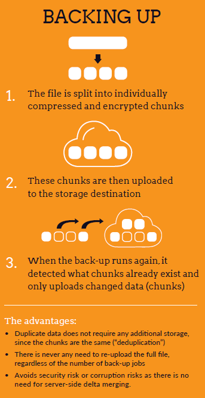
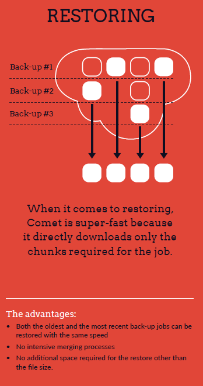

## Overview

At the core of Comet is our technology that allows us to back-up and restore faster than the competition: this is called "Chunking".

## Backing up​

Comet backs up data by first splitting it into variable-sized chunks, which are individually compressed, encrypted, and uploaded. Comet uses data-dependent chunking, efficiently splitting a file into consistent chunks even in the face of random inserts.

Further incremental back-up jobs simply realize that chunks already exist on the server and do not need to be re-uploaded.

## Restoring

When it comes to restoring, Comet is just as fast. Comet directly downloads only the chunks it needs for the file and requires no additional space other than the size of the file and has no CPU intensive merging processes.

