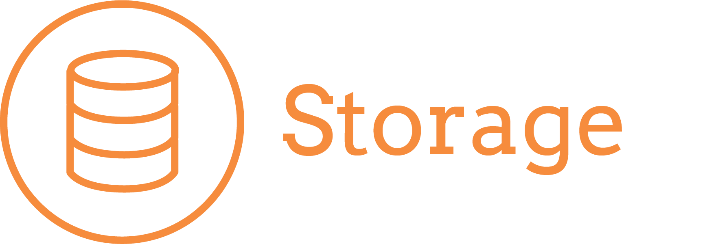

## Overview

This section provides an overview of the optional Comet Server roles that can be deployed.

At a minimum you will always need one server with Auth Role enabled. This role provides:

- Management of users & customers.
- General configuration options.
- Security and SSL management.
- Remote configuration management of Comet Backup.
- Branding workshop - allows creation of branded Comet Backup installers.
- Provides direct-to-cloud backup functionality.

This optional role is required if you are providing your own storage, it's not required if you are only backing up to a [cloud storage destination](https://docs.cometbackup.com/latest/cloud-storage-providers).

This role provides the following functions:

- Efficiently span data across multiple vaults, local and Cloud-based vaults simultaneously.
- Supports multiple [storage types](https://docs.cometbackup.com/latest/installation/storage-configuration#storage-configuration) and operable on all common versions of Windows and Linux.

This optional role provides highly efficient, automated, multi-threaded replication that you can rely on.

This role provides the following functions:

- One-to-one, one-to-many, many-to-many replication
- Full replication of user configuration and storage data

We highly recommend deploying a Constellation Role server if you are using replication as it provides the following benefits:

- Ensures that redundant data is correctly handled across multiple storage locations.
- Oversees all Comet Storage server and automatically purges unused storage buckets and performs general storage maintenance tasks.
