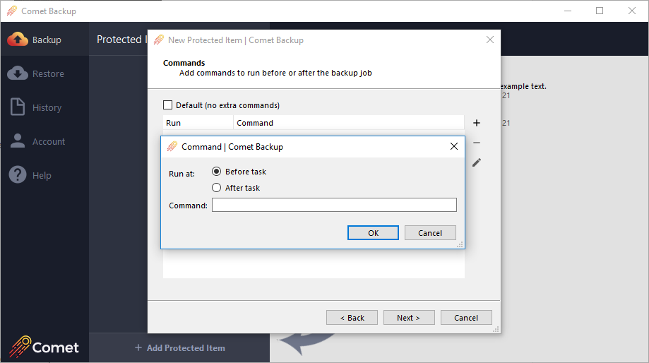

## Getting Started with Comet Backup

This guide follows on from the [Getting Started with Self-Hosted Comet](https://docs.cometbackup.com/latest/guides/guide-getting-started) or [Getting Started with Comet-Hosted](https://docs.cometbackup.com/latest/guides/guide-cometgo-getting-started) guides.

## Add a User

  

    
  

  Step 3 
  <strong
    style={{
      color: "white",
    }}
  >
    Create a new user
  </strong>

From the quick actions menu, select "Add User". This allows you to create a new user/customer that can login to the backup client for backups and restores.

During this process you can choose if you have access for reseting their password, a predefined Storage Vault, and if they will be part of a policy group. It's possible to configure pre-selected defaults for these options.

The 'Storage Vault' is for a device's data location within your server's storage destination, and each Storage Vault will contain the backup data in its own subdirectory. It's recommended to add a Storage Vault for each device, unless multiple devices share similar data, as in this case, they would be able to take advantage of cross-device deduplication (not required to upload the same data twice).

### 14-Day New User Credit

Provide free demos and trials of your backup service. If the service isn't a good fit, for whatever reason, then simply delete the user-account before the end of 14 days, and all charges are refunded.

## Download and install the Comet Backup client

  

    
  

  Step 4 
  <strong
    style={{
      color: "white",
    }}
  >
    Download the desktop client
  </strong>

Using the quick actions menu, you can download the Comet Backup client and install it on the device you wish to backup. The backup client can also be downloaded from the initial login page on the web interface.

### Log into the Comet Backup client

Once you have installed the backup client, you can login with the user details you just created and start setting up a backup by selecting '+ Add Protected Item'. Then simply follow through the short wizard to create a backup job. Upon completing this you can manually run the backup, or leave it to run on [schedule](https://docs.cometbackup.com/latest/installation/user-configuration#schedules).

## Setting up Comet client

  

    
  

  Step 5 
  <strong
    style={{
      color: "white",
    }}
  >
    Configure a backup
  </strong>

For testing, evaluation, and training purposes, we would suggest that you use separate machines for the Comet Server and the backup client (user device). This will help avoid confusion, as some processes have similar names, and can be easily mixed up.

Once you have configured your Comet Server and installed the backup client, log into the client and you will be able to configure Protected Items & Storage Vaults.

### Adding Storage Vault

Set up a Storage Vault in the Settings tab by clicking "+ Add Storage Vault". Now, either choose your [requestable Storage Vault](https://docs.cometbackup.com/latest/installation/comet-server-configuration#configuring-storage-role-servers-for-storage-vault-registration-optional) which you configured on your Comet Server, or select "Custom" if you want to have a unique Storage Vault for this client. The Custom option will allow you to set up local path storage, which can be used along side your Comet Server's storage location.

### Backing up (Files and Folders)

Go to the "Backup" tab and click "+ Add Protected Item", add a meaningful name for this Protected Item, and choose the Files and Folders backup type.

#### Select items to be backed up

Add the items you would like to be backed up. You can exclude a range of files from the backup job. An exclusion filter checks whether to exclude each file from backup, using either a glob pattern or a regular expression (regex). There is no limit to the number of exclusion filters you can add to a single Protected Item.

##### Take filesystem snapshot

On Windows, the "Take filesystem snapshot" option creates a VSS snapshot. This enables Comet to backup files that are currently in-use. It also provides disk-wide "crash-consistency", as all files for backup will originate from the precisely same timestamp.

#### Commands

You can register additional commands to run before- or after any backup job. For maximum flexibility, commands can be registered

    for a Protected Item (e.g. to dump a database), orfor a Storage Vault (e.g. to perform custom network authentication), orfor a Schedule (e.g. to shut down the computer afterward).

During a backup job, the commands are run in this order:

    Schedule BeforeProtected Item BeforeStorage Vault BeforeBackupStorage Vault AfterProtected Item AfterSchedule After

Shell built-ins can be used as part of the command execution - the specified command is passed to either `cmd.exe` or `/bin/sh` as appropriate for your operating system.

#### Schedules

Comet can run backup jobs automatically on a schedule. It is strongly recommended to automate your backups on a regular schedule. When a schedule is due to run, the backup job will run automatically into the selected Storage Vault.

You can also configure [advanced backup runtime options](https://docs.cometbackup.com/latest/installation/user-configuration#schedules).

#### Retention

You can configure a [retention](https://docs.cometbackup.com/latest/installation/user-configuration#retention-storage-vault) policy to apply just for this Protected Item. If you skip this step, the Storage Vault's own retention policy will apply. Note that a retention policy configured on a Protected Item will override the Storage Vault retention, for that specific Protected Item.

Enforcing a default retention policy for all Storage Vaults within an account is possible, and can be configured on the account policy.

#### Policy Groups

On the Comet Server, an administrator can create and assign a [Policy](https://docs.cometbackup.com/latest/installation/user-configuration#policies) to each user account to enhance, or limit, certain functionalities on the backup client. This includes:

    Default Retention PeriodsDefault Email ReportsDefault Protected ItemsDefault Schedules

The first policy created is the Default Policy. You should make this policy as generic as needs be, and customize this policy on a per-client basis, as you bring on-board new clients, or groups of clients and their devices.

Apply customized policies to individual clients by selecting the custom-policy name via the user-profile Policy tab.

## Run the backup

  

    
  

  Step 6 
  <strong
    style={{
      color: "white",
    }}
  >
    Run a backup!
  </strong>

You can run the backup job immediately after creating the Protected Item. Alternatively, you can run a manual backup job at any time by clicking the large "Backup" text on the left side of the Comet Backup app interface.

## Further assistance

Please see the [Comet Server configuration](https://docs.cometbackup.com/latest/installation/comet-server-configuration#comet-server-configuration) documentation for a more detailed explanation of the setup process.

If you need any further support, please open a ticket from inside the [Support](https://account.cometbackup.com/support) section of cometbackup.com.
