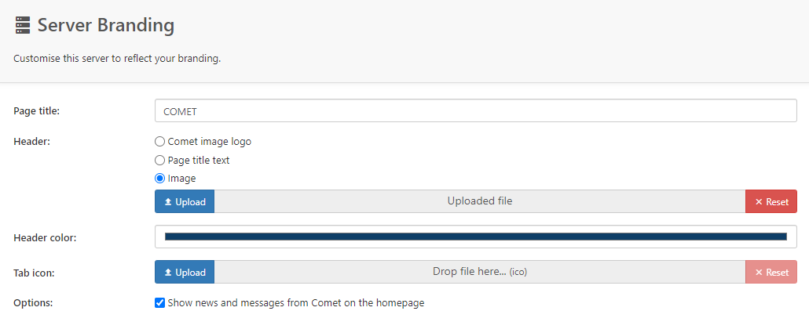

## Ready to configure your Comet-Hosted server?

  

    
  

  Step 1 
  <strong
    style={{
      color: "white",
    }}
  >
    Install the server
  </strong>

_As the actual setup process of Comet-Hosted is automatic, this guide covers configuring your branding settings_

To get started, from the 'My Servers page' in your account area on [cometbackup.com](https://cometbackup.com/), select 'Comet-Hosted Settings'

This section will allow you to configure a custom domain and email reporting.

### Custom Domain

Here you can configure the domain of your Comet-Hosted instance

### Email Setup

Your Comet Server can send email reports to the customer when a backup job completes. Configure the email settings here

## Login to your Comet-Hosted Server

  

    
  

  Step 2 
  <strong
    style={{
      color: "white",
    }}
  >
    Login to the server
  </strong>

Once you login to your server, you will be able to access the Settings page to configure your [branding settings](https://docs.cometbackup.com/latest/installation/comet-server-configuration#software-build-role) for the server and client software.

In here, you're also able to change the default storage, to connect either your [Backblaze](https://www.youtube.com/watch?v=OF8oZp76Unk) or [Wasabi](https://youtu.be/RDiihFwFiig) cloud storage.

### Comet Server Interface Branding

From here you can brand the appearance of your Comet-Hosted server web interface.

The top-left section of the Comet Server can be configured to display either a Comet brand logo, custom text, or a custom image.

### Desktop Client Branding

In this section you can brand the appearance of the desktop client, add an EULA, configure a custom help page and more.

**You have now completed the configuration options for your Comet-Hosted server.**

Next, set up the Comet Backup client »

## Video Guide

See our video guide explaining what each setting does.

<iframe
  width="100%"
  height="440"
  src="https://www.youtube.com/embed/EmUndzvBfpI"
  title="Comet Backup - Re-branding"
  frameborder="0"
  allow="accelerometer; autoplay; clipboard-write; encrypted-media; gyroscope; picture-in-picture"
  allowfullscreen
></iframe>

If you need any further support please open a ticket from inside the My Account section of [cometbackup.com](https://cometbackup.com/).
