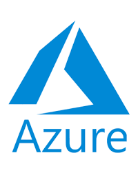

## Overview

This is a walkthrough of using the Disk Image backup type.

Note: The backed-up disk image data will deduplicate with other data existing inside the Storage Vault. A backup of Files and Folders in the same data volumes should achieve a high degree of space savings.

- [Click here for a video version of this walkthrough](https://youtu.be/rcnMxvjQEfU)
- [Click here for more technical information about Disk Image](https://docs.cometbackup.com/latest/installation/protected-items#disk-image-items)

## Backup using Disk Image

### Create a Protected Item using the Disk Image backup type

- Note: Using this Protected Item will incur a Booster charge - [see Pricing](https://cometbackup.com/pricing), and requires Windows 7, or Windows Server 2008 R2, or later.

### Select partitions for backup

Select any currently-attached drives or individual partitions from any drive for backup. It is possible to select “all drives” and exclude individual disks or partitions.

- If there is any change to the partition structure of a drive, it will cause that drive to be recognized differently in Comet. If such a drive is selected, Comet will warn that the drive can no longer be found. You must reselect the drive and/or partitions.

#### Include unused disk sectors for forensic data recovery

Comet will exclude unused space from the disk in the backup, but turning on this option will include any non-indexed and marked-as-deleted files in the free space. This could be used for forensic data recovery, but keep in mind that it will lengthen the backup time.

- [Click here for more information](https://docs.cometbackup.com/latest/installation/protected-items#unused-disk-sectors)

## Restore Disk Image protected items

### Restore options

The Restore wizard inside Comet Backup allows restoring of backed-up disks and partitions directly to physical disks and partitions, without requiring temporary spool space. Alternatively, it can be restored as virtual disk files.

- Comet stores the Disk Image files in VMDK format, from which single files can be extracted. [Click here for our recommended software for extraction](https://docs.cometbackup.com/latest/installation/protected-items#restoring).

### Restore to physical device(s)

In order to restore to physical hardware, the target disk or partition should be unmounted (not in use). Comet may be able to do this automatically from within the currently booted OS if no programs are using the target drive (e.g. for a non-boot drive).

- If the goal is to restore to the boot drive, first, reboot the PC into a recovery environment.
- When [restoring a smaller partition into a larger one](https://docs.cometbackup.com/latest/installation/protected-items#filesystem-smaller-than-target-volume), Comet will automatically extend the restored filesystem to the fill the target partition. Comet does not support restoring a large backed-up partition into a smaller physical partition. The partition must be shrunk using the OS’s partition manager prior to performing the backup.

#### Restore from Windows boot environment

1.  Select a backed-up disk or partition to restore, from the left-hand column
2.  Select a target disk or partition to write to, from the right-hand column
3.  Click the _Add to restore queue_ button
4.  Repeat steps 1-3 as necessary for other disks and partitions
5.  Click the _Restore_ button to begin the restore job

- The _Edit_ function can be used to repartition the local drives using Windows Disk Management. After doing so, the _Refresh_ function may be used to refresh the view of the local disks and partitions able to be selected for restore.

#### Restore from Linux boot environment

Steps to restore an entire disk, without spooling:

1.  Restore just the `disk.vmdk` file (without the data extents), and open it in a text editor in order to read the partition sizes.
2.  Recreate partitions to the exact target size
3.  Single partitions can be restored without any local spool disk, using the "Program Output" restore option, and selecting only a single partition file for restore: `dd of=/dev/sdx1 bs=8M`

- [Click here for other methods of restoring from a Linux boot environment](https://docs.cometbackup.com/latest/installation/protected-items#restore-from-linux-boot-environment)

### Restore as virtual disk files

There is one plain text VMDK descriptor file containing metadata about the whole drive, plus separate raw image files for each partition’s extent on the disk. The plain text file is labelled `disk.vmdk` by default.

Partitions of the disk that were not selected for backup are represented as zero extents in the VMDK descriptor file. The effect of this is that the restored disk image will appear to have the full disk size, even if only a small amount of partitions inside it were selected. However, the zero extents will be compressed inside the Storage Vault.

The VMDK disk images may be restored, then, optionally, do one of the following:

- [Extract single files from them](https://docs.cometbackup.com/latest/installation/protected-items#recovery-of-single-files-with-spooling), or
- [Recover to a local virtual machine](https://docs.cometbackup.com/latest/installation/protected-items#recovery-to-local-vm), or
- [Recover to a cloud server](https://docs.cometbackup.com/latest/installation/protected-items#recovery-to-cloud-server)

### Restore files and folders

This allows a user to browse the filesystem in a VMDK disk image and restore the single files and/or folders without downloading the whole VMDK disk image in advance. Currently it only supports for the NTFS.

### Create USB Recovery Media

The Comet Backup desktop app supports the creation of USB Recovery Media from the wizard on the Settings screen.

This allows a user to boot from the USB device, type-in the username and password for the Comet user profile, and make a full restoration from backup onto the drive(s) of the connected PC. In this fashion, bare-metal restorations can be achieved.

The following options are available:

- WinRE
- WinRE ISO
- Windows To Go

#### WinRE

Selecting this option allows the creation of a minimal USB Recovery Media based on the Windows Recovery Environment. [Click here for more information about this method](https://docs.cometbackup.com/latest/installation/protected-items/#1-winre-usb)

#### WinRE ISO

Selecting this option allows the creation of a minimal bootable ISO file based on the Windows Recovery Environment. [Click here for more information about this method](https://docs.cometbackup.com/latest/installation/protected-items/#2-winre-iso)

#### Windows To Go

Selecting this option allows the creation of a full Windows boot environment. [Click here for more information about this method](https://docs.cometbackup.com/latest/installation/protected-items/#3-windows-to-go)

#### Other boot environment

A recovery environment may also be created in other ways. Both Windows or Linux can be used as a suitable recovery environment. Some possible methods include:

    * creating a Linux bootable USB drive, or* using a third-party tool like [Rufus](https://rufus.ie/) to create a Windows-To-Go drive, or* using recovery media from your PC OEM vendor (e.g. Lenovo / Dell / HP)

Copy

In these cases, the Comet Backup app will need to be launched manually, once booted into the recovery environment.

## Video Tutorial

---

## Amazon Web Service AWS

### Creating a Virtual Machine in the AWS cloud from a Comet Disk Image Backup

- All example commands executed in Windows Powershell

You will need:

- An AWS account and API access keys for it
- Access to EC2 and S3 using your API access keys
- A correctly configured AWS EC2 environment
- Amazon generic guide: [https://docs.aws.amazon.com/vm-import/latest/userguide/vmimport-image-import.html#import-image-prereqs](https://docs.aws.amazon.com/vm-import/latest/userguide/vmimport-image-import.html#import-image-prereqs)

#### Perform restore in Comet to create VMDK files

- Note: The restored files will be the same size as the original disk size, so ensure you have enough space in your restore location.

- Produces files as shown below

#### Concatenate the restored files to produce a single VMDK

- When concatenating the files, don’t include the 1 KB descriptor file. Running the example command below will produce a singleton file the size of the original partition as shown.
- Example command: `cmd /c copy /b .\disk_f0000.vmdk+.\disk_f0001.vmdk+.\disk_f0002.vmdk diskname.vmdk`

#### Upload the VMDK file to the AWS folder

- Example command: `aws s3 cp .\diskname.vmdk s3://bucketname/subfolder/`
- Verify the contents of the storage folder: `aws s3 ls bucketname/subfolder/` (note the trailing '/')
- Create a local file.json file for importing the image into AWS

Example:

#### Run the AWS import-image command with file.json as parameter

- Example command: `aws ec2 import-image --region <yourregionname> --disk-containers "file://C:\path\to\file.json"`
- Initial response similar to:

Note the 'ImportTaskId' in the form of: **“import-ami-XXXX”**

- Example command to show ongoing progress: `aws ec2 describe-import-image-tasks --import-task-ids import-ami-XXXX --region <yourregionname>`
- Ongoing progress similar to:

- When the command to show ongoing progress returns `“Status”: “completed”,` note down the `AMI ID`

#### Connect via RDP

- Log in to AWS website
- Select ‘Services’ drop-down
- Select ‘EC2’

- Select 'AMIs'
- Tick to select the **`AMI ID`** from the previous step
- Actions
- Launch

- Configure and launch

- Select the launched instance
- Select Connect
- Download remote connection details
- Use your preferred Remote Desktop program to connect using the downloaded details

---

## Azure

### Creating a Virtual Machine in the Azure cloud from a Comet Disk Image Backup

- All example commands executed in Windows Powershell
- Azure accepts only VHD file format, so images must first be converted to this format. Example instructions included below.
- Install and configure MS Azure command-line interface (CLI): [https://aka.ms/installazurecliwindows](https://aka.ms/installazurecliwindows)
- If using an existing VM, Microsoft recommends that it be prepared first: [https://docs.microsoft.com/en-us/azure/virtual-machines/windows/prepare-for-upload-vhd-image?toc=/azure/virtual-machines/windows/toc.json](https://docs.microsoft.com/en-us/azure/virtual-machines/windows/prepare-for-upload-vhd-image?toc=/azure/virtual-machines/windows/toc.json)

#### Perform restore in Comet to create VMDK files

- Note: The restored files will be the same size as the original disk size, so ensure you have enough space in your restore location.

Produces files as shown below

#### Convert VMDK to VHD format

- We used QEMU utility with the 1 KB VMDK file from the previous step (with fixed-size-type required by Azure).
- Example command to convert VMDK file to VHD format: `.\qemu-img.exe convert C:\path\to\disk.vmdk -O vpc -o subformat=fixed C:\path\to\disk.vhd`
- Note: **The disk.vhd image just produced can now be imported, without further changes, into any locally-installed MS Hyper-V program**.

#### Resize the VHD file upwards to the nearest megabyte multiple if needed

- The size of the disk.vhd file from the previous step must be a multiple of megabytes (ie: the VHD file-size needs to be a number exactly divisible by 1024).
- Example command to find file size: `ls C:\path\to\diskname.vhd = X`
- Our example produced a file of size X = 41943040 KB
- X/1024/1024 must be a whole number. You may need to resize your own file upwards to a megabyte-multiple.
- An exact next-biggest megabyte-multiple for our example 40 GB disk = 42951770112 bytes.
- We resize our example file to illustrate:
- Example command to resize the disk.vhd file upwards to a megabyte multiple: `resize-vhd C:\path\to\diskname.vhd -SizeBytes 42951770112`
- Note: This creates a resized VHD file of size **42951770624** bytes. Azure 'resize' command adds 512 bytes for their footer **42951770112 + 512**

#### Create empty managed disk on Azure

- Example command to create empty managed disk on Azure using the size parameter from the previous step: `az disk create --name azure-disk-name --resource-group azure-resource-name --sku standardssd_lrs --hyper-v-generation V1 --location australiaeast --for-upload true --upload-size-bytes 42951770624`

- Use your own preference parameters for disk-name, resource-group, hard-disk type, location. Other VM parameters, such as CPU and RAM allocation, can be added later. Location parameter can be selected via: `az account list-locations -o table`

#### Grant write access to obtain ‘sasURI’

- Example command to grant write access to Azure: `az disk grant-access -n azure-disk-name -g azure-resource-name --access-level Write --duration-in-seconds 86400`
- Produces an **sas-URI**: similar to: "[https://xx-xxxxx-xxxxxxxxxx.blob.core.windows.net/xxxxxxxxxx/abcd?sv=2017-04-17&sr=b&si=xxxxxxxx-xxxx-xxxx-xxxx-xxxxxxxxxxxx&sig=xxxx%3D"](https://xx-xxxxx-xxxxxxxxxx.blob.core.windows.net/xxxxxxxxxx/abcd?sv=2017-04-17&sr=b&si=xxxxxxxx-xxxx-xxxx-xxxx-xxxxxxxxxxxx&sig=xxxx%3D%22)
- Note: **Azure charges while disk is writeable**

#### Upload the VHD file to Azure

- We used the convenient AzCopy [https://adamtheautomator.com/azcopy-setup/](https://adamtheautomator.com/azcopy-setup/)
- Command format: `AzCopy.exe copy "C:\path\to\diskname.vhd" "sas-URI" --blob-type PageBlob`
- Example command to upload the VHD file to Azure, using the **sas-URI** from the previous step: `AzCopy.exe copy "C:\path\to\diskname.vhd" "https://xx-xxxxx-xxxxxxxxxx.blob.core.windows.net/xxxxxxxxxx/abcd?sv=2017-04-17&sr=b&si=xxxxxxxx-xxxx-xxxx-xxxx-xxxxxxxxxxxx&sig=xxxx%3D" --blob-type PageBlob`
- Note: **To reduce costs, revoke write-access when finished uploading**.
- Example command to revoke write access: `az disk revoke-access -n azure-disk-name -g azure-resource-name`

#### Create the new VM in Azure

- Example command to create the new VM in Azure using the azure-disk-name file uploaded from the previous step: `az vm create --resource-group azure-resource-name --location australiaeast --name new-vm-name --os-type windows --attach-os-disk azure-disk-name`
- Use your parameters for resource group, location, vm name.

- Example result from command to create new VM in Azure:

- Copy the ‘publicIpAddress’ field

#### Connect via RDP

- Use your preferred Remote Desktop program to connect to the ‘publicIpAddress’ from previous step: “XXX.XXX.XXX.XXX”

---

## VirtualBox

### Creating a VirtualBox Virtual Machine from a Comet Disk Image Backup

#### Getting started

- This backup method requires VirtualBox v6.x if MS Hyper-V is running simultaneously, otherwise earlier versions will work.

#### Perform restore in Comet to create VMDK disk files

- Note: The restored files will be the same size as the original disk size, so ensure you have enough space in your restore location.

- Produces files as shown below

#### Open VirtualBox and create a new virtual machine

- Select ‘New’ on main screen of VirtualBox as shown below

- Allocate RAM and virtual hard disk space. Use your own preferences for system requirements

#### Add hard disk

- Open VirtualBox Settings as shown below
- Storage
- SATA Controller
- Add Hard Disk
- Select the 1 KB “disk.vmdk” file restored earlier (as shown below)

#### Finalize configuration and Start

- Finalize CPU, RAM, etc.
- Start the VM

