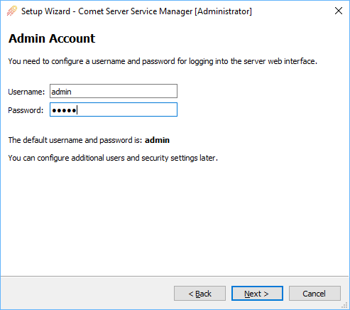
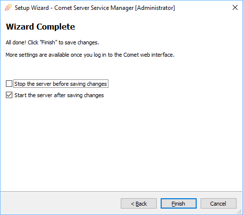

## Overview of Comet Backup

### Basic concepts and overview

The Comet Backup system works on the client-server model. The Comet Server program runs on a designated computer, and this Server acts to manage, control, and monitor backup jobs from client devices.

New clients have an account created first, in the list of Users in the Comet Server. Client devices download and install the client software directly from your Comet Server, using the username and password from the client account.

When running, the client software maintains a constant, online link to the Comet Server, enabling on-demand and scheduled backups of data. The Comet Server also maintains records of your clients, the Protected Items, the Storage Vault location, and Storage Vault access credentials.

## Setting up and configuring the Comet Server on a Windows platform

  

    
  

  Step 1 
  <strong
    style={{
      color: "white",
    }}
  >
    Install the server
  </strong>

Once you have [downloaded](https://account.cometbackup.com/downloads) and installed the Comet Server, you will be presented with the Comet Server Service Manager app, and the First-Run Setup Wizard. This wizard will help get your Comet Server up and running. The Comet Server web interface will then allow you to access the full range of configuration options on its main Settings page.

### Windows Comet Server Activation

To validate your Self-Hosted Comet Server, please enter your account details into the installer.

Alternatively, you can supply a Server serial number. Generate a serial from [cometbackup.com](https://cometbackup.com/). Log in to your Comet Account. On the Dashboard, select "My Servers" in the top menu, then click the "Add Server" button.

There are no additional charges for creating Server serials, and you can install as many Comet Servers as you need. In most cases, though, and for getting started, a single Comet Server and Server serial would be sufficient to centrally manage all of your customers.

### Web Interface

Comet Server is accessed via a web interface. From here you can configure access to the Server Web Interface. Please note the addresses in the drop down for the Server Interface. You can also configure SSL from this screen, or use our free [automatically-renewing SSL certificate](https://docs.cometbackup.com/latest/installation/comet-server-configuration#use-a-free-automaticallyrenewing-ssl-certificate) which integrates with [LetsEncrypt](https://letsencrypt.org/), by selecting the 'Automatic' option.

### Admin accounts

Configure administrative account access to your Comet Server web interface. We strongly suggest changing the password of the `admin` user.

### Customer Data Storage

From this screen, you can select the storage location of where your Comet Server will store the backup data.

If you are going to use Backblaze or Wasabi cloud storage and want the backup data to go directly from the end-user's device to the cloud; then skip this step and instead follow [this guide](https://docs.cometbackup.com/latest/installation/comet-server-configuration#video-tutorial) after logging into your server web interface.

### Wizard Complete

You have now setup the basic elements of your Comet Server and are almost ready to start running a backup. Press 'Finish' and your Comet Server will start. The Server web interface can be accessed at the address specified in step 2.

## Comet Server Login

  

    
  

  Step 2 
  <strong
    style={{
      color: "white",
    }}
  >
    Login to the server
  </strong>

After navigating to the address of your Comet Server in a browser, you will be able to login the server with the admin credential specified in step 3.

**That covers the basics of setting up your Self-Hosted Comet Server to run a backup.**

Next, set up the Comet Backup client »

## Video Guide

<iframe
  width="100%"
  height="440"
  src="https://www.youtube.com/embed/4-PoRdaPntI"
  title="Getting Started with a Self-Hosted Comet Server"
  frameborder="0"
  allow="accelerometer; autoplay; clipboard-write; encrypted-media; gyroscope; picture-in-picture"
  allowfullscreen
></iframe>
