## Seed Load Backup

### Overview

This is a graphical walkthrough of the Seed Load Backup process. For clients with slow internet connections, or with large data volumes, it is possible to perform the initial backup to a client-local external drive, and then send the external drive containing the encrypted data to the storage location administrator. This data is then copied directly to the client bucket, vastly speeding up the initial backup. Subsequent client backups are incremental, building on the data already-stored.

Comet Backup supports this technique under the name "Seed Load Backup".

### Process

#### Step 1

On the Comet backup client application, create a new "Local Path" Storage Vault. This will initially represent the seed device, and will later represent the remote device.

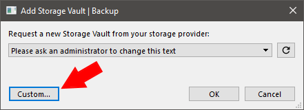

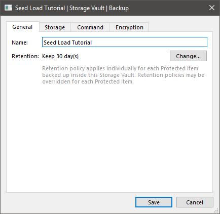

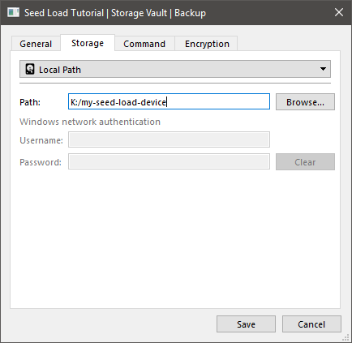

#### Step 2

Perform a backup to that Storage Vault.

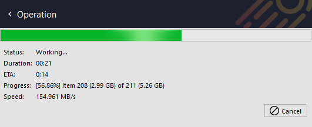

Now we have successfully backed up the data to the seed load device and the next step is to bring that data to your Comet Server.

#### Step 3

Create a new Bucket on a Comet Server

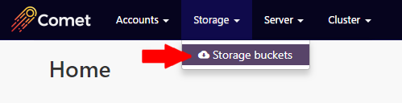

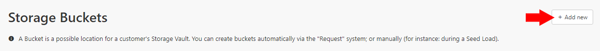

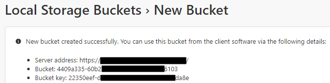

**WARNING:** This new bucket is currently unused. It will be used soon, but if you have Constellation enabled and **deleting** unused buckets, then Constellation may delete the bucket before the seed load process is finished. You should set the Constellation option to prevent it deleting unused buckets, and re-enable it only after the Seed Load process is complete.

#### Step 4

Navigate to the Storage Vault's directory on the seed device and move the content into the new Bucket's directory.

By default, the Bucket's data directory will either be (A) empty, or (B) contain only empty directories. Do not continue if the paste operation warns you that files will be overwritten.

**Copy the seed load vault's data:**

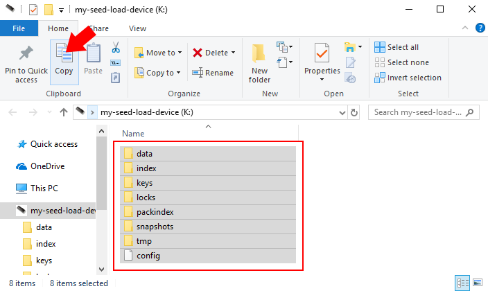

**Paste the data into the Bucket Directory:**

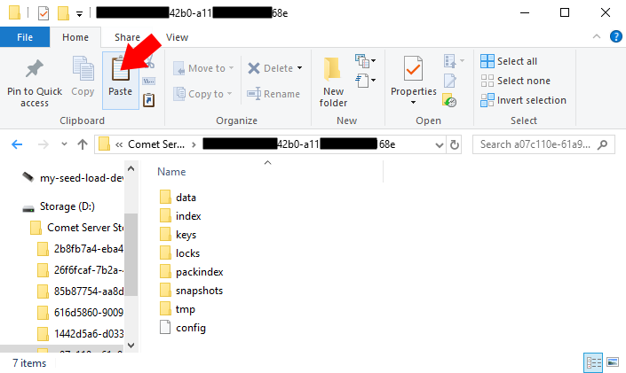

All on-disk paths are identical between "Local Copy" and "Comet" vault types. Your Comet Server will see the files immediately and does not need to be restarted.

#### Step 5

Edit the client's Storage Vault settings in the to point to the Bucket.

It's very **important** that you change the existing Storage Vault, _not_ create a new Storage Vault, because the data is encrypted with properties from this specific Vault.

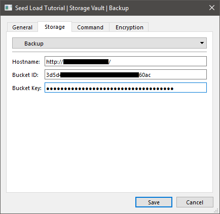

#### Step 6

Test backup/restore from the Storage Vault's new location.

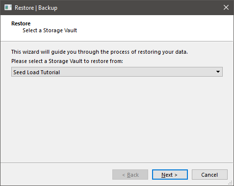

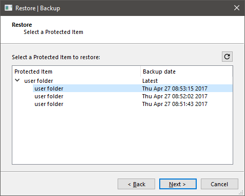

## Seed Load Restore

### Overview

This is a walkthrough of the Seed Load Restore process. These are the steps for restoring data from a Storage Role based Storage Vault (not a direct-to-cloud vault). For clients with slow internet connections, or with large data volumes, and who need their data more quickly than they may be able to download it (eg: post-disaster), it is possible to perform a data restore to a local external drive, and then to bring the data directly to the client, vastly speeding up the process. The restored data can be in the form of either:

1.  Unencrypted data ready for immediate deployment to the original location; or as the
2.  Encrypted contents of the storage bucket, from which the client-local backup tool can produce unencrypted data as above, ready for immediate deployment to the original location. For this type, a small amount of client-profile Storage Vault configuration is needed before and after the process.

Comet Backup supports these techniques under the name "Seed Load Restore".

### Process for obtaining an unencrypted copy of the original client data

#### Step 1

Install the Comet Backup application onto a local device, using the client user-profile username and password. This will register the device as a new device on the client's profile, but it will not incur charges unless the device adds a Protected Item.

#### Step 2

Attach a suitably-sized external drive, and perform a normal restore, using the external drive as the output directory. The external drive will now contain the unencrypted client data, and can be taken to the client for immediate deployment.

Finished.

### Process for obtaining a copy of the encrypted contents of the bucket containing the client's storage vaults

#### Step 1

Identify the ID of the client's bucket:

1.  On the Comet admin web interface, open Cluster -> About This Cluster -> Bucket Users.
2.  Note the bucket ID corresponding to the client name, under the Use Locations column

#### Step 2

Using a file-explorer tool, or similar, find the bucket in the storage location. Attach a suitably-sized external drive to your device, and copy the entire contents of the client's bucket onto the external drive.

#### Step 3

Take the external drive to the client, and attach it to the device which requires the restored data.

#### Step 4

Edit the client storage vault details:

1.  Open the Comet Server web admin interface.
2.  Open the client storage vault details for editing (Do Not Create A New Vault!)
3.  Note the existing storage vault location details for later.
4.  Edit the location to point to the attached external drive (eg: "E:\\").

#### Step 5

Perform a normal restore function. You, or the client, can either restore the unencrypted data to its original location, overwriting existing contents, or to some other directory, from where it can be moved at a later date.

#### Step 6

Edit the client storage vault details back to the original settings:

1.  Open the Comet Server web admin interface.
2.  Open the client storage vault details for editing.
3.  Edit the location to point back to the original storage location, as noted from earlier.

Finished.
