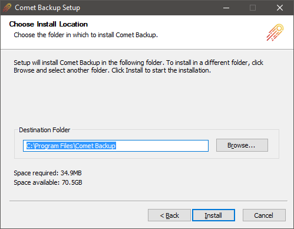
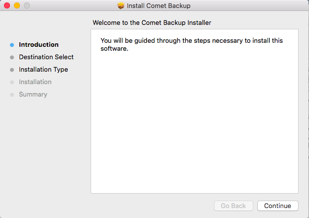
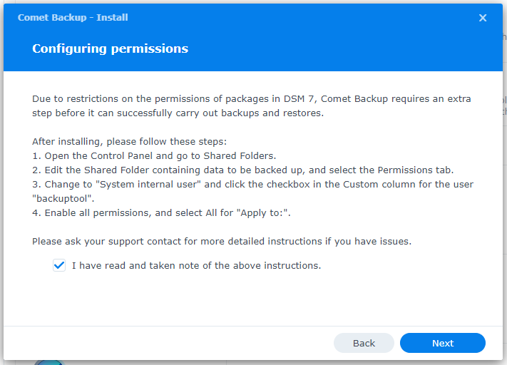
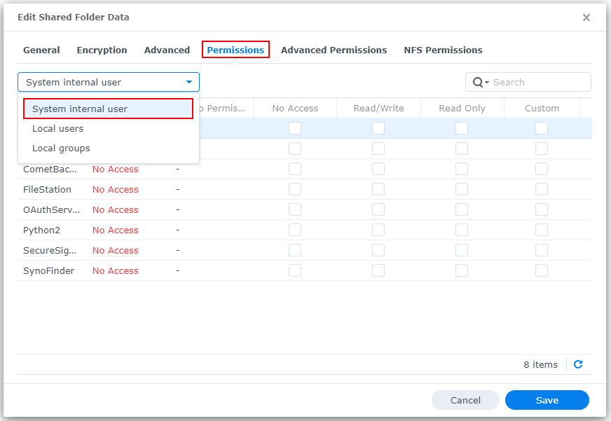
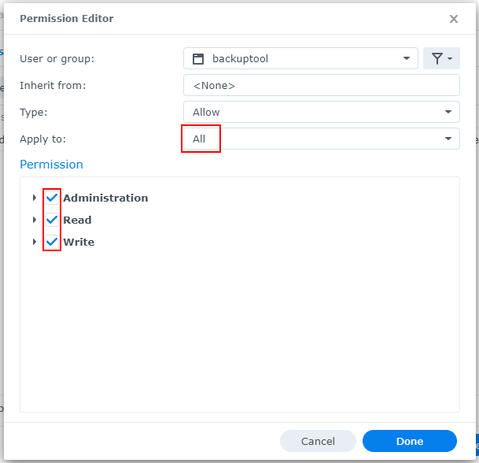
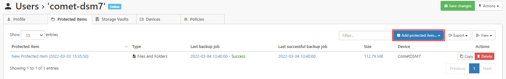
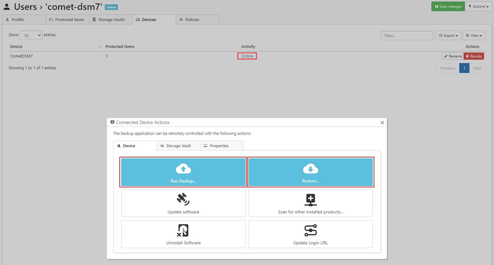

# Comet Backup installation

## Windows

### System Requirements

- `x86_32+SSE2` or `x86_64` CPU architecture
- Minimum 1024x600 screen resolution
- Windows Vista, 7, 8, 8.1, 10, or newer
- Windows Server 2008, 2008 R2, 2012, 2012 R2, 2016, or newer

As of Comet 19.12.5, TLS 1.2 is mandatory in Comet Server. Windows Server 2008 users may require [KB4019276](https://support.microsoft.com/en-us/help/4019276/update-to-add-support-for-tls-1-1-and-tls-1-2-in-windows) to continue accessing Comet Server; this update is also required for ESU (Extended Security Updates) for Windows Server 2008.

Microsoft ended Extended support for Windows 7, Server 2008, and Server 2008 R2 on January 14th 2020. Comet may not support older versions of Windows which are no longer under active security support from Microsoft.

#### Not compatible with Windows XP (released 2001)

At the time of writing, there is no version of Comet available for Windows XP / Server 2003. All versions of Comet rely heavily on features that were only introduced in Windows Vista / Server 2008.

Windows XP / Server 2003 no longer receives security patches from Microsoft. _It is **unsafe** to connect such a machine to the internet._ If you are attempting to supply backup services to a customer in this situation, you should arrange to first upgrade their operating system _with urgency_.

##### Workarounds

You can work around this issue by

- installing Comet Backup on another machine, and then backup the XP machine over the network; or
- virtualizing the XP machine, and backing up the VM guest from the VM host. This also allows you to remove internet access from the XP machine.

### Installation

Run the `CometBackup_install.exe` file and follow the prompts.



Once installed, the client software prompts for account details to log in.

#### Silent installation (Windows advanced)

**With username and password**  
Comet allows you to install and configure the software silently, by running `install.exe /S /CONFIGURE=user:password` via your remote management software. Silent installations must be started by running from the installer directory.

If you make a mistake with the username/password prompt, you can run the `` cd "C:\Program Files\Comet Backup"; echo "USER`nPASSWORD" | .\backup-tool.exe login prompt `` Powershell command to re-enter login details. Please take care with the `` `n `` character separating the username and password.

**With install token (passwordless)**  
Comet also allows you to install the software and register the device silently, by running `install.exe /S /TOKEN=installtoken` via your remote management software. Silent installations must be started by running from the installer directory.

You can generate the installation token by calling API [AdminCreateInstallToken](https://docs.cometbackup.com/latest/api/api-methods#admincreateinstalltoken-create-token-for-silent-installation-windows-only) and the token is for a single use only. It can be used to hide the username and password from the command-line parameters.

**Other optional arguments**

**Disable shortcuts**  
Comet allows you to disable the software shortcuts for the silent installation, by adding command-line argument `/SHORTCUT="disable"`. For example, if you want to install with token while no shortcuts are created, you can run the command-line `install.exe /S /TOKEN=installtoken /SHORTCUT="disable"`

**Disable tray icon**  
Comet allows you to disable the tray icon for the silent installation, by adding command-line argument `/TRAYICON="disable"`.

**Log on `backup.delegate` service as Local System account**  
Comet allows you to explicitly set `backup.delegate` service to log on as Local System account for the silent installation, by adding command-line argument `/ISLOCALSYSTEM="yes"`

#### Service account

Comet automatically creates a Virtual Account (`NT SERVICE\backup.delegate`) with all necessary permissions to back up files on the PC.

Isolating Comet Backup under a Virtual Account is supported on Windows 7 or later, and Windows Server 2008 R2 or later when that server is not a Domain Controller. On other machines (e.g. Windows Server 2008 RTM, and domain controllers) the backup service will run as `LOCAL SYSTEM` by default.

On a Domain Controller running Windows Server 2008 R2 or later, we recommend configuring a Managed Service Account inside Active Directory for the backup service. This allows you to isolate the backup service permissions in a password-less service account. You should apply this to the `backup.delegate` service (but not the `backup.elevator` service, used for software updates).

### Upgrading

The installer will safely remove and upgrade any prior version of Comet Backup, including those with a different software branding.

If the product name is changed as a result of the installation process, the newly-branded software may be installed into the old-branded directory name. You can avoid this issue by completely uninstalling and reinstalling the software.

#### Silent upgrade (advanced)

You can silently upgrade the software remotely via the Comet Server interface, or by running `install.exe /S` via your remote management software.

#### Service account

If you customize the `backup.delegate` service to use any other user account, your changes will be preserved in any future software upgrade.

### Uninstall

The software can be uninstalled via the "Apps and Features" section in the Windows Control Panel.

During this process, you may be prompted whether you wish to preserve any username/password credentials saved on this computer.

Prior to Comet 20.6.3, you can also remove the saved credentials manually by deleting the `AppData\Roaming\backup-tool\config.dat` file. If the `backup.delegate` service was running as the `NT SERVICE\backup.delegate` user, this is stored in the `C:\Users\backup.delegate\AppData\Roaming\backup-tool\` directory; the path may differ if the service was running as another user account.

In Comet 21.9.10 and later, you can also remove the saved credentials manually by running the `backup-tool.exe login disconnect` command.

#### Silent uninstallation

You can silently uninstall Comet Backup for Windows by passing the `/S` command-line argument (e.g. `"C:\Program Files\Comet Backup\Uninstall.exe" /S`).

If you also want to remove the saved username/password credentials, add this command-line `"C:\Program Files\Comet Backup\Uninstall.exe" /S /ISDELETECREDENTIAL=yes`

## macOS

### System Requirements

- `x86_64` CPU architecture
  - Including `x86_64h`
- OS X 10.10 or later
  - We recommend using a version of macOS that receives ongoing security support from Apple (usually the last 3 versions)
  - OS X 10.9 was supported by Comet 19.12.1, the Comet 19.11.x series, and older versions of Comet
  - macOS 10.12.1 is required for [Let's Encrypt's ISRG Root X1](https://letsencrypt.org/docs/certificate-compatibility/)

### Installation

The macOS operating system requires codesigning to be enabled in order to launch a downloaded `.pkg` file. If you have not configured codesigning for macOS, you will be unable to launch the installer. However, you can bypass this by right-clicking the `.pkg` file and choosing Open.

Run the `Comet Backup.pkg` file and follow the prompts.



Once installed, the client software prompts for account details to log in.

If you are running the `.pkg` file from the Downloads directory, macOS will offer to move the `.pkg` file to the Trash after a successful installation.

### Silent Installation

_Silent installation on macOS requires Comet 20.12.5 or later._

**With username and password**

Comet allows you to install and configure the software silently, by running the below command via your remote management software. Silent installations must be started by running from the installer directory.

`sudo launchctl setenv BACKUP_APP_CONFIGURE "user:password" && sudo /usr/sbin/installer -allowUntrusted -pkg "Comet Backup.pkg" -target /`

**With install token (passwordless)**

Comet also allows you to install the software and register the device silently, by running the below command via your remote management software. Silent installations must be started by running from the installer directory.

`sudo launchctl setenv BACKUP_APP_TOKEN "installtoken" && sudo /usr/sbin/installer -allowUntrusted -pkg "Comet Backup.pkg" -target /`

You can generate the installation token by calling API [AdminCreateInstallToken](https://docs.cometbackup.com/latest/api/api-methods/#admincreateinstalltoken-create-token-for-silent-installation-windows-only) and the token is for a single use only. It can be used to hide the username and password from the command-line parameters.

**Silently granting Full Disk Access permission**

macOS 10.14 Mojave and later have added a requirement to grant the "Full Disk Access" permission. macOS does not allow programs to set this permission automatically and it cannot be set as part of the silent install with the above instructions.

However, if you are intending to use the silent install feature via an RMM software that acts as the device's MDM (e.g. Jamf / Addigy / Meraki Systems Manager / ...) then you can set a [Privacy Preferences Policy Control (PPPC)](https://support.apple.com/en-us/guide/mdm/mdm38df53c2a/web) that remotely enables the "Full Disk Access" option for Comet Backup's application ID. The application ID for Comet Backup can be customized via your Comet Server as part of the macOS client branding settings.

### Upgrading

The installer will safely remove and upgrade any prior versions of Comet Backup, including those with a different software branding.

#### Silent upgrade (advanced)

You can silently upgrade the software remotely via the Comet Server interface, or by running `/usr/sbin/installer -allowUntrusted -pkg "Comet Backup.pkg" -target /` via your remote management software.

### Uninstallation

macOS does not have a standard system for uninstalling programs. However, you can still uninstall Comet by running the following command from a terminal window:

`sudo -u root "/Applications/Comet Backup.app/Contents/Resources/uninstall"`

This will automatically stop all running Comet processes, unregister Comet's `launchd` services, and remove all application files from the disk.

In Comet 19.12.7 and earlier, the `uninstall` program was in the `MacOS` subdirectory instead.

Uninstalling the software preserves any username/password credentials saved on this computer. If you also want to remove the saved username/password credentials, add this command-line:

`sudo -u root "/Applications/Comet Backup.app/Contents/Resources/uninstall" --also-remove-saved-passwords`

In Comet 21.9.10 and later, you can also remove the saved credentials manually prior to uninstallation by running the `/Applications/Comet Backup.app/Contents/MacOS/backup-tool login disconnect` command.

## Linux (Debian, Ubuntu)

Install Comet Backup using the "Other Distribution" package.

## Linux (Red Hat Enterprise Linux (RHEL), CentOS)

Install Comet Backup using the "Other distribution" package.

## Linux NAS (Synology, QNAP)

### Synology

Since Comet 21.12.6, branded Synology SPKs can be generated and downloaded from the Comet Server web interface. The web interface offers two downloads for Synology: one for DSM 6 and one for DSM 7. Due to Synology packaging rules, these SPKs are not interchangeable.

SPKs are available for Synology NAS' which meet the following requirements:

- CPU: x86_64, i686, ARMv7, or ARMv8
- DSM version: 6 or 7

The Synology SPK does not include a graphical client. Instead, creating Protected Items and running backups and restores can be done from your Comet Server.

#### Installation

**DSM 6 only:** Installation of packages published by any publisher must be allowed before Comet can be installed. This setting can be enabled from the Package Center; in `Settings > General > Trust Level`, select the "Any publisher" radio button and accept the settings.

Installation of Comet on a Synology NAS follows the same process as installing any other SPK:

1.  Open the Package Center
    - If on DSM 6, ensure the settings noted above have been applied.
2.  Click "Manual Install" in the top right
3.  Upload the `.spk` file downloaded from Comet Server
    - If on DSM 7, accept the prompt to allow the installation of a third-party package.
4.  Accept the license agreement
5.  Enter credentials the appropriate Comet Server and user
    - If a previous version of Comet has been installed on the NAS and its settings were not removed when it was uninstalled, the installer will automatically detect the credentials. Leaving all fields blank will reuse the existing credentials; new credentials can also be entered as usual and will take precedence.
6.  Click "Apply" to complete the installation

#### Permissions

On DSM 7, Comet runs a special package-specific user named `backuptool`. In order to perform backups and restores, this user must be granted permissions to access the appropriate Shared Folders. _This does not apply to DSM 6_.



1.  Log in to the Synology NAS
2.  Open the Control Panel and go to Shared Folders
3.  Select the Shared Folder containing the data to be backed up and click Edit
4.  In the Permissions tab, select "System internal user" from the dropdown menu on the left !



5.  For the user `backuptool`, click the checkbox in the Custom column
6.  In the dialog that appears, ensure the following:
    1.  "Apply to:" is set to "All"
    2.  All permissions are checked



#### Limitations

Due to restrictions placed on packages by Synology for DSM 7, Comet runs as a special package-specific user, which results in some limitations:

- Remote upgrade/uninstall is not supported. This is because third-party SPKs are no longer allowed to run as root, which means Comet cannot initiate a package upgrade/uninstall from within a package itself.
- When performing a restore to a Synology NAS, permissions/ownership may not be restored correctly. This is because a package user is not allowed to `chown` to a user other than themselves.

#### After installation

The Synology SPK does not provide a graphical client for Comet. Creating Protected Items and manually running backups or restores is done from the Comet Server web interface.

Creating a Protected Item can be done from the Protected Items tab on the user's page:



Backups and restores can be run by selecting the connection to the online Synology device from the Devices tab on the user's page:



### Other NAS

Install Comet Backup using the "Other distribution" package.

## Linux (Other Distribution)

This is a distribution-agnostic package that can be used if Comet does not have a more specific package available for your Linux distribution.

Please note that in order to avoid distribution-specific differences, the package does not automatically start on boot. You should configure your system to run the launch script in `/opt/` on boot (e.g. via a systemd unit, upstart script, `/etc/init.d/` script, or a line in `init.rc`).

### System Requirements

- CPU: `x86_64`, or `x86_32` with `SSE2`, or `ARM` (see below)
- Kernel 2.6.23 or later
- Support for ISRG root X1 certificates for [Let's Encrypt requirements](https://letsencrypt.org/docs/certificate-compatibility/)
- Unique SSH host keys ([This can be an issue with cloned VMs](https://docs.cometbackup.com/latest/troubleshooting/#multiple-devices-are-detected-as-being-the-same-device))
- Dependencies
  - `bash`, `xz`, GNU `awk`, and standard GNU/Linux system utilities
  - `ca-certificates` and `tzdata` (see below)

#### ARM CPU support

Comet Backup is available for multiple ARM platform variants. The Comet Backup installer will select the best available binary for your hardware at install-time.

The following platform variants are supported:

| Platform  | Description                                                                            |
| --------- | -------------------------------------------------------------------------------------- |
| `ARMv8l`  | ARM 64-bit (`Aarch64`), no `glibc` required                                            |
| `ARMv7l`  | ARM 32-bit with `vfp`, and a `glibc`\-based OS with the "hard-float" ABI (`gnueabihf`) |
| `ARMv6kl` | ARM 32-bit with `vfp`, no `glibc` required                                             |

#### Timezone database dependency

Comet Backup on Linux requires the OS to provide an up-to-date timezone database, to perform timezone calculations

- On many Linux distributions, installing the `tzdata` or `timezone` package should be sufficient
- Otherwise, Comet will look for a timezone database in all of the following locations;
  - `/usr/share/zoneinfo`
  - `/usr/share/lib/zoneinfo`
  - `/usr/lib/locale/TZ`

#### CA certificate database dependency

Comet Backup on Linux requires the OS to provide an up-to-date set of root certificate authorities, to validate HTTPS / SSL connections.

- On many Linux distributions, installing the `ca-certificates` package should be sufficient
- Otherwise, Comet will look for a certificate bundle in all of the following locations;
  - `/etc/ssl/certs/ca-certificates.crt` (used by Debian/Ubuntu/Gentoo etc.)
  - `/etc/pki/tls/certs/ca-bundle.crt` (used by Fedora/RHEL 6)
  - `/etc/ssl/ca-bundle.pem` (used by OpenSUSE)
  - `/etc/pki/tls/cacert.pem` (used by OpenELEC)
  - `/etc/pki/ca-trust/extracted/pem/tls-ca-bundle.pem` (used by CentOS/RHEL 7)

### Installation

Run the `.run` file. This is a self-extracting archive, and will need to be executed in an elevated environment.

The installer will

1.  install the software into a branded `/opt/BRANDNAME/` subdirectory
2.  prompt you for an initial username and password
3.  register the current Linux device into that Comet account
4.  start running Comet Backup in the background.

If you make a mistake with the username/password prompt, you can run the `/opt/BRANDNAME/backup-tool login prompt` command to re-enter login details.

Prior to Comet 21.9.10, if you make a mistake with the username/password prompt should follow the instructions below to completely remove the software, and then start the installation again.

#### Linux Installation options

You can control the installer by setting environment variables in your shell before running the `.run` file.

The following options are available:

- `WRITE_INSTALL_LOG`. Set this to a file path, to record details of the installation.
- `OVERRIDE_INSTALL_SERVER`. Set this to a URL (including `http`/`https` and trailing slash) to override the Comet Server URL used by Comet Backup.

You can set an environment variable in bash either on the same line (e.g. `WRITE_INSTALL_LOG=install.log ./Comet_Backup-xx.x.x.run`) or as a separate `export` command (e.g. `export WRITE_INSTALL_LOG=install.log` followed by `./Comet_Backup-xx.x.x.run`).

#### Silent installation (Linux advanced)

Comet allows you to install and configure the software silently. This allows you to remotely push client installations remotely, using your preferred remote management software.

To run the installer silently, run:

1.  `export COMET_USERNAME=xxxx`
2.  `export COMET_PASSWORD=xxxx`
3.  `(echo $COMET_USERNAME; echo $COMET_PASSWORD;) | ./Comet_Backup-xx.x.x`

NOTE: `COMET_USERNAME` and `COMET_PASSWORD` are for the user profile, not the Comet Server administrator.

You can also silently reconfigure the software using the same pipe syntax: `(echo $COMET_USERNAME; echo $COMET_PASSWORD;) | /opt/BRANDNAME/backup-tool login prompt`

### Restarting at boot

The installer creates a `backup-daemon-start.sh` script that can start the service. The Comet Backup agent on "Other Distribution" Linux can be restarted by running the `backup-daemon-start.sh` script.

In order for Comet Backup to start after a system reboot, you must configure this script to be run on system boot. Different Linux distributions support different methods for running commands on system boot: choose the most appropriate method for your Linux distribution. Some common choices are documented below.

#### Preserve HOME environment variable

Comet uses the `$HOME` environment variable to find its saved credentials. When configuring Comet to start at system boot, ensure that the `$HOME` environment variable is set (i.e. to `/root/`), to ensure that Comet can find its saved credentials. If Comet is unable to log in, it's possible that your Linux distribution does not set `$HOME` at this early-boot stage. In that case, you should try running `HOME=/root/ /opt/CometBackup/backup-daemon-start.sh &` instead. Comet will automatically try to use `/root/` as the `$HOME` directory if `$HOME` is not already set or if it is set to a blank path.

Note: If you execute the .run installation script as root, this may have different results than if you execute the .run script using an elevated terminal session with 'sudo'. The 'sudo' command preserves the `$HOME` variable on Ubuntu; whilst on Debian the `$HOME` variable is erased, and sudo then sets it to the home directory of the originating user.

#### Start in the background

If you are running commands over SSH, please be aware that the `backup-daemon-start.sh` script runs in the foreground and will die when the SSH session is closed. You can avoid this by running the script in the background.

You can run the script in the background (daemonize) by using the `backup-daemon-start-background.sh` file instead.

#### Startup via `rc.local`

You can make Comet Backup start at system boot by adding an entry to the `rc.local` file.

First, find the `rc.local` file on your system:

- `/etc/rc.local` (Debian/Ubuntu)
- `/etc/rc.d/rc.local` (CentOS/RHEL)

Add the following content to the `rc.local` file:

`/opt/CometBackup/backup-daemon-start.sh &`

If the `rc.local` file contains an `exit 0` statement, the additional command should be added _before_ such a statement.

As of CentOS 7, the `rc.local` file is not executable by default. You should run `chmod +x` on the `rc.local` file to enable using this method for startup scripts.

#### Startup via `rc.d`

You can make Comet Backup start at system boot by adding a file to the `rc.d` directory.

First, find the `rc.d` directory on your system:

- `/usr/local/etc/rc.d` (Synology DSM 6.1+)

Add a new file to the `rc.d` directory with the following contents:

```txt
    #!/bin/bash/opt/CometBackup/backup-daemon-start-background.sh

```

Mark the file as executable: `chmod +x /usr/local/etc/rc.d/my-comet-startup-script.sh`

#### Startup via `cron`

You can make Comet Backup start at system boot by adding an entry to `root`'s crontab.

1.  Run `crontab -e -u root` to launch a crontab editor
2.  Add the line `@reboot /opt/CometBackup/backup-daemon-start-background.sh`

#### Startup via `init.d`

_No further documentation is currently available for this topic._

#### Startup via `systemd`

You can use the following unit as an basic example:

```txt
    [Unit]Description=Comet Backup ClientAfter=network-online.target[Service]Type=simpleRemainAfterExit=trueKillMode=processUser=rootExecStart=/opt/CometBackup/backup-daemon-start.sh[Install]WantedBy=multi-user.target
```

This unit file correctly starts the Comet Backup service at system boot.

However, the process management in `systemd` is not fully compatible with the way Comet's multi-process model works. In particular, there are compatibility issues with the software updater. As a result, the above unit is (A) unable to take advantage of process group cleanup; (B) unable to auto-restart the Comet Backup agent service; and (C) after a software upgrade, Comet will keep running but the unit will remain in "exited" state.

#### Autostart for graphical desktop application

In the "Other Distribution" package, the graphical application is not automatically configured to start when the desktop logs in. You may add `backup-interface --background` as an autostart command to your desktop environment's settings.

### Upgrading

The "Other Distribution" version of Comet supports upgrading the software, with some caveats:

- The `.run` file will automatically upgrade the existing version
- The software can be remotely upgraded via the Comet Server web interface.

However, the existing service will only be replaced with the upgraded version if the product brand name is unchanged.

Note: If you delete the branded Comet directory and all its contents in /opt/, this will trigger a full-reinstallation of the client software, requiring the username and password.

### Uninstall

To uninstall "Other Distribution" versions of Comet, you should

1.  Stop all Comet processes
2.  Remove the relevant subdirectory under `/opt/`
3.  Remove any custom startup scripts

### Change password on Linux client

Use the 'Change Password' function in the client web interface, or change the password in the admin web interface.

Then fully uninstall and reinstall the client, using the new credential. Your device settings and Protected Items will be preserved.

### Graphical desktop application for Linux

_This feature is available in Comet 21.3.6 and later._

By default, the Comet Backup application for Linux runs on the command-line only. You can control and configure the application via the web interface.

If you have a graphical Linux desktop environment (e.g. GNOME / KDE / XFCE, using X11 / Wayland), it is optionally possible to run the Comet Backup desktop application. In addition to the general Linux system requirements, use of this feature has the following additional requirements:

- x86_64 CPU architecture
- Qt 5.7 or later
- Glibc 2.24 or later

These Qt and Glibc versions are present on most Linux distributions from 2017 or later, such as Ubuntu 17.04 "Zesty Zapus", Debian 9 "Stretch", Fedora 25 Workstation, CentOS 8, and any more recent Linux distribution version.

On Debian/Ubuntu, you may need to install the following package dependencies:

- `apt-get install libqt5gui5 libqt5svg5`

On Fedora/CentOS, you may need to install the following package dependencies:

- `yum install qt5-qtbase.x86_64 qt5-qtsvg.x86_64`

After installing Comet Backup for Linux for command-line usage, you can launch the `/opt/CometBackup/backup-interface` program. It is not necessary to launch this program as root; it will communicate with the installed Comet Backup background service regardless of what user account it runs as.
