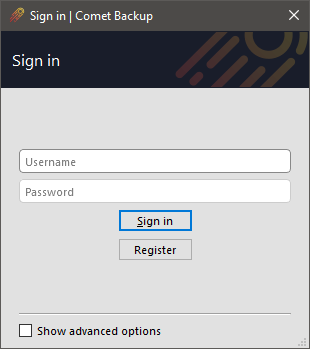
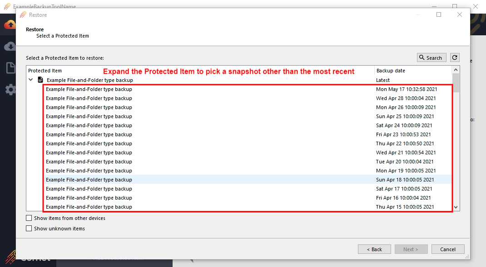
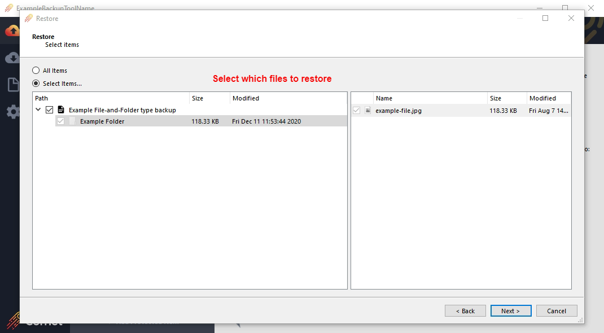
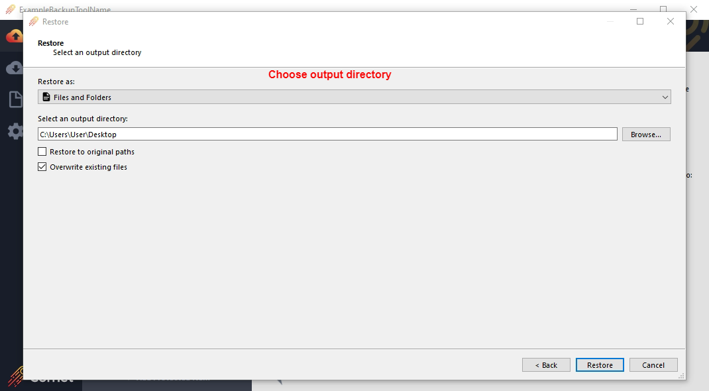
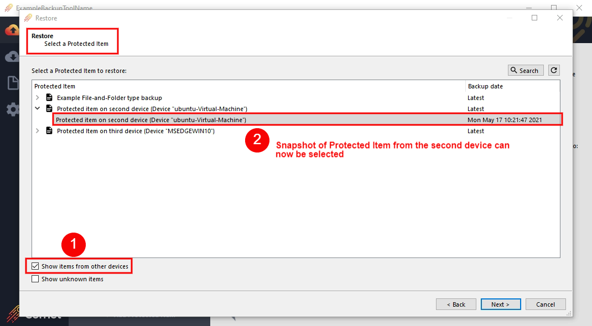
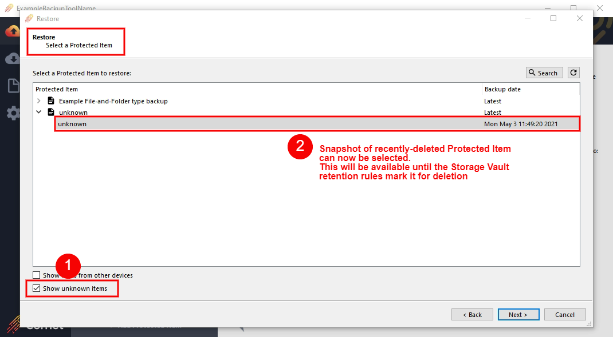
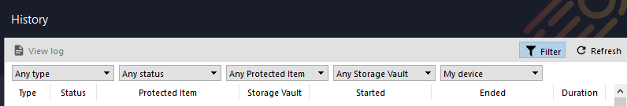

# Comet Backup usage

## Log in

Enter the client's username and password, and click the button to log in.

### Custom server address

The server address will be automatically filled, pointing to the Comet Server that generated the client software.

You can connect the Comet Backup application to a different Comet Server:

- Check the "Advanced Settings" option, to display the Server field
- Enter the server address.
  - The address should include the protocol (`http`/`https`); any non-default port; and a trailing forward-slash (`/`) character.

### Device registration

If this is the first time logging in to your Comet Backup account from this device, you will be prompted to register the device into your account.

## Backup tab

### Add a new Protected Item

To add a new Protected Item, mouse over the "Protected Items" text and click the "Add" button.

For more information about configuring a Protected Item, see the "User configuration" section. No changes are applied until the Save button is pressed.

### Edit an existing Protected Item

To edit an existing Storage Vault, either double-click the row, or right-click the row and choose Edit.

For more information about configuring a Protected Item, see the "User configuration" section. No changes are applied until the Save button is pressed.

### Back up data

Data should be backed up automatically on schedule as per the schedule setting options above. The backup schedules will still run even if logged out of the client GUI, as the background service will stay logged in.

At times, you may wish to immediately start a backup job, or back up to a different Storage Vault than usual. You can back up any Protected Item to any Storage Vault as follows:

1.  Click a Protected Item, and click the Backup Now button
2.  Step through the wizard to select a destination Storage Vault
3.  The backup job starts within the main window interface.

## Restore tab

Clicking the Restore tab opens the Restore dialog. Multiple actions are possible from within the Restore dialog:

### Restore data

You can restore data from any Storage Vault as follows:

1.  Click the Restore button in the left-hand menu bar
2.  Select the Storage Vault containing the backed-up data, and click Next
3.  Select the Protected Item that you want to restore, and click Next
    - (Optional) Unfold the Protected Item to pick a snapshot other than the most recent
    - (Optional) Use the Search button to search for files to restore

4.  Select which files to restore, and click Next
    - (Optional) By default, all files are restored. You can use the "Choose files" radio option to select individual files or folders to restore.

5.  Select the destination path to restore to, and click Next

- The restore job starts within the main window interface.

If you are restoring from a Protected Item that is known to your current device, the progress operation will appear on the Backup tab under the Protected Item in question. If you are restoring from a Protected Item that is unknown to your current device, the progress operation will appear on the Account tab under the Storage Vault in question.

#### Restore types

When restoring files, you can choose to restore data as:

- Files and Folders
  - The files you selected for restore will be restored from the Storage Vault to the local harddrive in the path you have selected.
  - The following options are available:
    - Restore to original paths _(>= 20.12.4)_
      - If this option is checked, the selected files will be restored to their original on-disk locations.
      - This checkbox is only available if the necessary original path information was preserved during the backup job. This is the behavior for all "File and Folder"-type backup jobs in Comet 20.12.4 and later.
      - This option is not presently available for Protected Item types other than "File and Folder" and will be greyed-out in the user interface.
    - Overwrite existing files
      - If this option is checked, any file that already exists will be silently overwritten with the restored file. If this option is not checked, any file that already exists will be silently skipped from the restore operation.
- Simulate restore only
  - The files you selected for restore will be downloaded from the Storage Vault, and reassembled, but not saved onto the local harddrive. This option can be useful as a test of the restore process.
- Program Input
  - The files you selected for restore will be streamed as the standard input (`stdin`) to a command-line program.
  - If you have selected multiple files for restore, you can choose whether they will result in multiple commands being run sequentially, or if the files are virtually archived before streaming into a single command-line program.
- Compressed archive file (zip / tar)
  - The files you selected for restore will be restored from the Storage Vault to an archive file on your local harddrive.
  - If you select a compressed archive format, the files will consume less space on the local disk. No spool space is required when using a compressed archive format. This may be particularly useful for restoring large, highly compressible files (e.g. SQL dumps with repeated INSERT statements, or non-sparse disk images containing zero extents).
  - The following file formats are available:
    - zip (compressed)
    - tar (uncompressed)
      - The tar file format has many different specifications (V7 (1979), oldgnu (1992), GNU (1997), USTAR/POSIX (1998), PAX/POSIX (2001)). Comet uses POSIX 1003.1-2001 (pax) TAR format files to preserve fidelity of file metadata. If your tar program does not fully support PAX extensions, you may see a hidden `PaxHeader.0` directory.
    - tar.gz (compressed)
    - sqfs (compressed)
      - SquashFS is a compressed archive file that can be mounted as a read-only virtual drive, using `mount` on Linux. This allows you to work with the compressed data while only requiring a low amount of physical disk space. Third-party programs are available for Windows to allow mounting zip files as virtual drives for a similar effect (e.g. [WinArchiver Virtual Drive](http://www.winarchiver.com/virtual-drive.htm)).

### Remove a single backup snapshot

You can remove a single snapshot from within a Storage Vault as follows:

1.  Click the Restore button in the left-hand menu bar
2.  Select the Storage Vault containing the backed-up data, and click Next
3.  Identify the Protected Item snapshot that you want to remove from the Storage Vault, expanding the selection as necessary
4.  Right click the Protected Item snapshot, and select "Delete this snapshot"

Comet will remove the snapshot from the Storage Vault, and then immediately clean up unused data within the Storage Vault to save on disk space.

### Restore a Protected Item from a different device

1.  Install the client software onto the second device, login using the user-profile username and password of the first device. If a new device, this will register a new device into the user-profile
2.  Open the Restore section of the client software, tick 'Show items from other devices'. Then click the 'Refresh' button top right to show the available snapshots from the first device

3.  Choose the snapshot you want to restore, and restore to a location of your choosing.

- Note: Devices will not attract fees or charges unless the device has Protected Items or performs a backup.
- Note: If the first user-profile has a Policy which adds default Protected Items, the second device will be have Protected Items, and will attract charges. You can temporarily disable the Policy from the user-profile so that any default Protected Items are not added to the test device when it registers for the first time.

### Restore an accidentally-deleted Protected Item

1.  Login using the user-profile username and password of the first device. If a new device, this will register a new device into the user-profile
2.  Open the Restore section of the client software, tick 'Show unknown items'. This will list snapshots which are available, but have no detail, because they have been deleted from the list of Protected Items.

3.  Choose the snapshot you want to restore, and restore to a location of your choosing.

## History tab

Click the "history" button at the top of the Comet Backup window to browse through job history.

### Filter

Click the filter icon to toggle displaying the Filter pane. The Filter pane allows you to filter the displayed jobs by status, classification, Protected Item, Storage Vault, and device.

When the filter bar is closed, the data area shows all jobs from the current device. You can use the filter bar to show historic jobs from other devices in the account.

## Account tab

The account tab shows

- A list of your Storage Vaults, where data can be stored
- A list of devices registered within your account
- Additional actions ("Account" button; "Import" button; and the software version number).

### Add a new Storage Vault

To add a new Storage Vault, mouse over the "Storage Vaults" text and click the "Add" button.

For more information about configuring a Storage Vault, see the "User configuration" section. No changes are applied until the Save button is pressed.

### Edit an existing Storage Vault

To edit an existing Storage Vault, right-click the row and choose Edit from the context menu.

### Operations on Storage Vaults

Further operations are available under the "Advanced" sub-menu when you right-click a Storage Vault.

#### Run retention pass now

Comet will automatically perform a retention pass after each backup job. You can immediately run a retention pass by choosing the "Run retention pass now" menu item.

#### Rebuild indexes

This is a technical feature to repair a specific type of potential issue. It is safe to use at any time, but should generally only be used if your support agent recommends it.

### Account dialog

The Account dialog allows you to configure your username, password, privacy, language, timezone, and email settings. For more information, please see the "User configuration" section.

#### Lock and Disconnect

The Comet Backup desktop app allows you to view and manage your backup settings. However, backup jobs will continue to run in the background even when the desktop app is closed.

- Use the Close button to close the desktop app, without logging out or locking the app. The app can be launched again and will open to the main screen, not the login screen. Backup jobs will continue to run in the background.
- Use the "Lock" button to log out of the desktop app, while still allowing backup jobs to run in the background. The app can be launched again and will open to the login screen, with the username pre-filled.
- Use the "Disconnect" button to log out of the desktop app and also from the background service. Scheduled backup jobs will no longer run. The app can be launched again and will open to the login screen, with no username pre-filled.

### Importing data

Comet Backup will scan your local device for certain online backup products from other software vendors. If a supported product is found, you may be prompted to import settings from the detected product.

For more details about supported products, please see the "Importing backup settings from other products" section in the Appendix.
