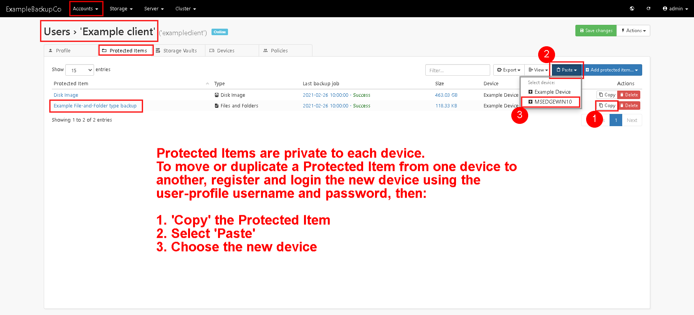
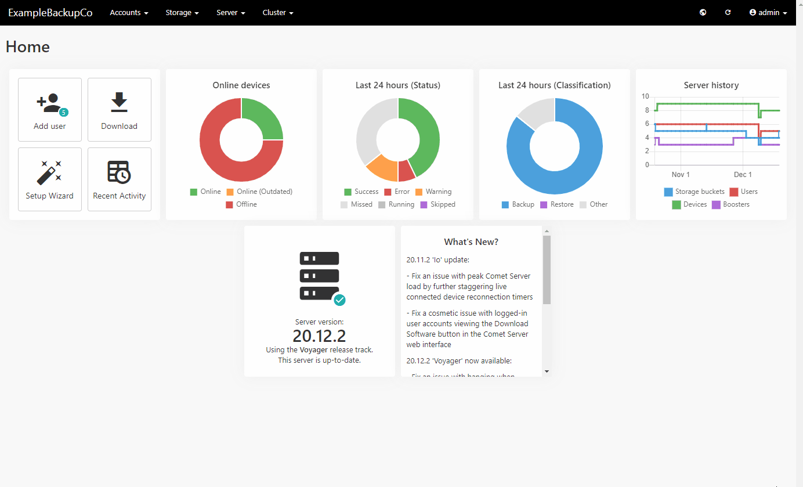
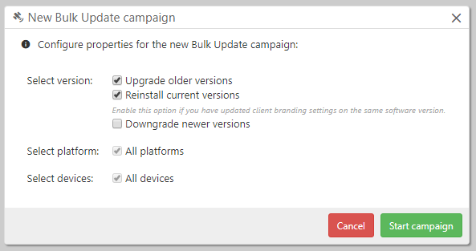
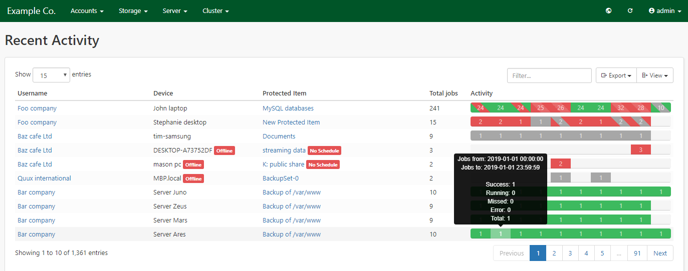
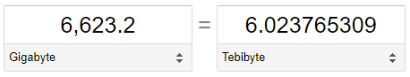
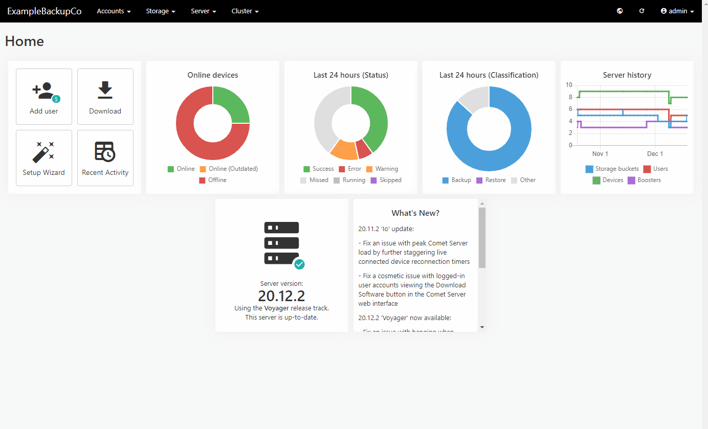

## First use

Start the Comet Server background service.

Once Comet Server has started, you should be able to load the Comet Server web interface in your web browser, and then log in using your configured credentials.

The default web address is `http://127.0.0.1:8060/`.

### Log in

The default username and password are both `admin`. There is no default two-factor authentication code.

#### Web browser compatibility

The Comet Server web interface supports all recent desktop and mobile web browsers, including Internet Explorer 9 or later.

The Comet 18.8.x series was the last release to support Internet Explorer 8. IE 8 no longer receives security patches from Microsoft and is unsafe to use on the public internet.

##### Safari and "Ghostery" extension

If you experience an error logging in to the Comet Server web interface with the Safari web browser, please check whether the "Ghostery" browser extension is installed. The Safari version of this extension has not been updated in several years and prevents the use of the Comet Server web interface. Updated versions of this extension are safe to use on other web browsers.

### Log out

Once you are logged in, you can log out at any time by using the "Log out" option in the user menu in the top right corner.

Web-based login sessions will expire after 30 minutes of inactivity. After this inactivity timer expires, the Comet Server will refuse any requests from the web interface. The session timeout can be modified on the Settings page.

### Time display

Comet Server uses universal time (UTC) internally for all time calculations. A single worldwide instant can be displayed in any local timezone.

When you log in to the web interface, all times displayed (e.g. backup job start / stop times) will be converted to your browser's timezone (which is inherited from your operating system timezone).

### Table views

All table views in Comet Server have the following features:

#### Pagination

The "Show ## entries" dropdown in the top-left corner of a table allows you to choose the number of rows that are displayed in the table. By default, only the first 15 items are displayed in a table.

You can switch between pages of the table by using the page selector in the bottom-right corner of the table.

Your current page is displayed in the bottom-left corner of the table.

#### Filter

The "Filter..." text field allows you to enter text that will be used to filter the result set in the table. The search filter is applied in realtime as you type.

#### Export

You can export the contents of any in table in Comet Server.

The following export formats are supported:

- the clipboard, with tab-separated columns
- a CSV (Comma Separated Values) file
- an Excel (`*.xlsx`) spreadsheet.

#### Column selection

You can use the column selection icon to choose individual columns to hide. It may be possible to show additional information in a table by enabling a column that was hidden by default.

## User menu

### My Account

The My Account page allows you to view and change basic details about your Comet Server administrative login account.

#### Configure two-factor authentication

Two-factor authentication is an additional layer of protection for your Comet Server administrative login account. When this feature is enabled, an additional device (such as a cellphone app, or a hardware token) is also required to log in to the web interface. This means that a stolen password is insufficient to break into the web interface.

If you have any external API integrations that are accessing Comet Server using your user account, this may prevent that functionality. In order to continue using the API simultaneously with protecting your account with two-factor authentication, you should create an additional separate administrator user account exclusively for API usage, with a long randomly generated password.

##### TOTP

The Comet Server application supports two-factor authentication for administrator accounts in compliance with the TOTP standard. This standard describes a six-digit code that changes every 30 seconds.

You can enable TOTP-based two-factor authentication for your account as follows:

1.  Click the "Regenerate TOTP code" button
2.  Scan the displayed QR code with any TOTP application.

- At the time of writing, we recommend the following applications:
  - Android: [FreeOTP](https://play.google.com/store/apps/details?id=org.fedorahosted.freeotp), [Google Authenticator](https://play.google.com/store/apps/details?id=com.google.android.apps.authenticator2)
  - iOS: [FreeOTP](https://itunes.apple.com/us/app/freeotp-authenticator/id872559395), [Google Authenticator](https://itunes.apple.com/us/app/google-authenticator/id388497605)

3.  Configure Comet Server so that a TOTP code is required to log in to the web interface.

- For more information, see the "Comet Server configuration" document > "Admin accounts" section.

##### FIDO2 WebAuthn

Comet Server supports using a WebAuthn authenticator as two-factor authentication for administrator accounts. This includes the following authenticator types:

- CTAP1/CTAP2-compatible hardware security keys (e.g., a YubiKey)
  - Any U2F-compatible hardware security keys can be seamlessly used with WebAuthn
- Android devices using screen lock authentication (e.g., fingerprint or PIN)
- Windows Hello (e.g., fingerprint, facial recognition, or PIN) on Windows devices with a valid TPM

As of Comet 21.12.1, Comet Server does not support using Apple Face ID or Apple Touch ID as a WebAuthn authenticator.

WebAuthn registration and login are only available if your Comet Server is using HTTPS.

WebAuthn is supported in all major modern browsers. WebAuthn is _not_ available in Internet Explorer 11.

You can enable WebAuthn-based two-factor authentication for your account as follows:

1.  Click the green "+" button in the FIDO2 WebAuthn table
2.  Select the authenticator you would like to use, if prompted
    - If only one authenticator is available on the device you are using, you won't be prompted
3.  Follow the on-screen prompts on your device to allow the Comet Server web interface to access and use your authenticator
4.  Close the WebAuthn registration dialog. If the registration succeeded, the newly-registered authenticator should be displayed in the WebAuthn table
5.  Enable WebAuthn two-factor authentication at login by toggling from "Not required" to "Required" and clicking the "Save changes" button

###### FIDO U2F

Prior to Comet 21.12.1, Comet supported FIDO U2F for two-factor authentication. U2F is no longer available from Comet 21.12.1 onwards, as it is deprecated and will be removed from the only major browser supporting it by default, Google Chrome, [in Google Chrome 98](https://developer.chrome.com/blog/deps-rems-95/#deprecate-u2f-api-cryptotoken) (expected in February 2022).

Comet Server's WebAuthn implementation is fully backwards-compatible with existing U2F registrations. Existing U2F registrations will be automatically migrated to WebAuthn registrations when Comet Server is updated to Comet 21.12.1; this upgrade process does not require any manual intervention by an administrator. If U2F was enabled for login for an admin user, WebAuthn will automatically be enabled.

### Advanced Options

You can select this checkbox to enable some additional features in the Comet Server web interface.

The exact functionality is subject to change, and mostly covers highly technical and/or uncommon functionality, that may be useful in specific situations.

As of Comet 21.12.8, the following features are enabled:

| Page location                        | Advanced action                       |
| ------------------------------------ | ------------------------------------- |
| All users page                       | Bulk replace addresses                |
| User detail page                     | Edit raw profile                      |
| User detail page                     | Login as user                         |
| Add user dialog                      | Create multiple accounts by CSV       |
| Live connected device actions dialog | (Multiple actions)                    |
| Restore dialog                       | Delete single snapshot _(>= 19.12.2)_ |
| Restore dialog                       | View snapshot IDs _(>= 21.12.8)_      |
| Policy page                          | Edit raw policy                       |
| Client News page                     | Remove all                            |
| About this Server page               | Shut down server                      |
| About this Server page               | Restart server                        |
| About this Server page               | Edit raw settings                     |

## Accounts menu

If the Authentication role was enabled, the "Accounts" menu should appear when logged in, containing "Users" and "Job history" entries.

### Users page

#### Add user

The "Add user" button allows you to create a new customer account.

On a Comet Server with the Authentication Role enabled (default), take the following steps:

- Select the "Users" menu item > "Add user" button
- Enter a username and password
- click the Add User button

If the account was created successfully, it is then possible to install and log in to the client software as this user.

There are some character and length restrictions on the username and password. For details, see the "Username and Password" section in the "User configuration" document.

#### Modifying user account properties

For more information about modifying an existing account, please see the "User configuration" section.

#### Copy and Paste

Comet Server allows you to copy and paste Protected Item configurations, between users or devices. To perform this action, on the user page > Protected Items tab, click the "Copy" link on the right-hand side.

A "Paste" button appears in the top bar, allowing you to paste this configuration into any device. You can also navigate to a different user and paste the protected item.

Copying and pasting a Protected Item does not copy nor share any backup data nor encryption keys between the accounts or devices.

#### Storage Vault analysis

A Storage Vault can contain data from multiple Protected Items, all deduplicated together. It is possible to analyze the content of a Storage Vault to see how the data usage is distributed between different Protected Item sources and how much deduplication is being applied.

On the user page > Storage Vaults tab, the value in the "Stored" column may be a blue link. If so, clicking this link opens a dialog window displaying information about the storage breakdown.

Current = The most recent backup job for that Protected Item within that Storage Vault. Historic = The accumulated backup jobs for that Protected Item, except for the most recent one.

The analysis is generated as part of a retention pass. Because retention passes only run when necessary, the analysis information may become outdated by a few jobs; or, no analysis may yet be available for a newly created Storage Vault. In this case, the "Stored" column will be black and cannot be clicked.

You can regenerate the analysis by running a Retention Pass for this Storage Vault, via the Devices tab or the "Connected Devices" page.

### Browsing log history for a customer

### Renaming a user

It's not currently possible to change the username for an account.

However, there is a workaround as follows:

1.  Create a second user account with a new name
    - You can choose any password; it will be reset to the original user's password
2.  Visit the first user's profile page, click 'View raw profile...' and copy the content
3.  Visit the second user's profile page, click 'View raw profile...', paste the content, change the 'Username' field, and then save the updated details
4.  Delete the first user
5.  Close and restart the client software, and log in as the second user

This workaround has the following caveats:

- All customer devices will need to manually re-log in
- As a new account, the billing cycle will be reset
- As a new account, the job history for this customer will be lost

### Send a client bulletin email

A client bulletin is an email message sent to all customers. Comet Server will send the email bulletin to all customers using your configured email settings.

You can customize the email subject and body text.

No body text formatting options are available. Any embedded URLs will not be made clickable.

### Connected Devices

The Connected Devices page shows you all the live connections made by Comet Backup.

For each connection, you can see

- the username
- the device name
- the device's operating system (e.g. Windows 64-bit)
- the device's software version

#### Live connection actions

You can instruct the live connection to perform an action remotely. At the time of writing, the following actions are available:

- Immediately run backup
- Immediately run a scheduled backup
- Apply retention rules now
- Unlock / clean up lock files (only available when "Advanced Options" is selected)
- Remote restore
- Refresh profile
- Update software
- Import / scan for other installed products
- Drop connection
- Terminate process (only available when "Advanced Options" is selected, or if a device is double-connected)

#### Double-connections

In some cases, the same device might connect to Comet Server multiple times. This can occur if the Comet Backup software is launched multiple times on the client's device. This behavior is prevented in almost all cases, across all operating systems, but it may still occur.

If this happens,

- the device will have two entries on the "Connected Devices" table
- the device will show "Online (2)" on the Users page > Devices tab
- scheduled backups might run twice
- a "terminate" button will appear in the corresponding row on the "Connected Devices" table to allow for resolving this issue.

### Bulk Update

Comet maintains a live-connection to customer devices. This allows you to remotely initiate a software update via the Device Actions dialog (from the Connected Devices page, or from the Devices tab on a user page). You can perform this at any time.

A bulk software upgrade across all customers must take on additional responsibility:

- The update should be delayed for devices that are currently offline, or are currently backing up
- The update should be delivered exactly once - preventing cascading failures if the update does not apply successfully
- It should be possible to track the status of the bulk upgrade across the entire customer base

The bulk update system allows you to create a "Campaign". The Campaign allows you to target which users should receive the software update.

#### Targeted upgrades

Comet allows you to target devices to be affected for the Campaign by the following properties:

- Software version
  - Upgrade older versions
  - Reinstall current versions _(Enable this option if you have updated client branding settings on the same software version.)_
  - Downgrade newer versions

If you receive the message "Ineligible" when running a Bulk Update, this means one or more of the target device/s is already on the latest version. Make sure to enable "Reinstall current versions" or "Downgrade newer versions" if required.

#### Upgrade logic

The bulk update campaign system may initiate a remote update for a device when

- (A) the bulk update campaign is created for the first time; or
- (B) immediately when a device comes online; or
- (C) in the background, on a timer interval.

If a device is currently performing a backup job, the bulk updater does not initiate a remote update. In this situation, the device would be left as "Pending" until either #C occurs above, or if the device goes offline and #B reoccurs above.

### Policies

An administrator can create policy restrictions to assign to user accounts. A policy can also be assigned during user account creation.

When creating a new user account, the Comet Server web interface might auto-select a policy from the dropdown option. A policy may be selected if (A) there is only one policy saved in the system, or (B) there is only one policy containing the word "default" in the description. This automatic selection does not affect new user accounts created outside the Comet Server web interface (e.g. by the API or by external systems). _(>= 19.12.2)_

The available policy restrictions are:

- Storage Vaults
  - Prevent creating new Storage Vaults...
    - ...via Request
    - ...via Custom
  - Prevent editing existing Storage Vaults
  - Prevent deleting Storage Vaults
  - Restrict available Storage Vault types
- Protected Items
  - Prevent creating new Protected Items
  - Prevent editing Protected Items
  - Prevent deleting Protected Items
  - Restrict available Protected Item types
- Default Settings (Choose from _System default_; _Optional, default on_; _Optional, default off_; _Always on_; and _Always off_)
  - "Skip if already running" setting on backup schedules
  - "Allow administrator to reset password" setting on user accounts
    - If the setting is ever disabled, the end-user will need to manually re-enable it inside the desktop client
  - "Allow administrator to view file names" setting on devices
    - If the setting is ever disabled, the end-user will need to manually re-enable it inside the desktop client
- Other
  - Prevent manually deleting backup snapshots from a Storage Vault
  - Prevent changing user account password
  - Prevent changing user account name
  - Prevent changing email settings
  - Prevent opening the application interface
    - Prevent devices from viewing each others' names
      - Device names will still be visible if the user logs in to the web interface.
    - Hide the Import feature
    - Hide the software version and codename
  - Prevent logging in to the web interface
- Mandatory file and folder exclusions
- Default email reports
- Retention
  - Default retention policy
  - Enforce this retention policy for all Storage Vaults
  - Prevent overriding retention policies on Protected Items

### Job History

The Job History page will allow you to search for all type of jobs that has been ran or are currently running on your server.

If you view a running job, you can then cancel it by clicking the red `Cancel` button.

### Recent Activity

The Recent Activity page shows you an overview of the last 10 days' of customer job history.

There is a row for every Protected Item, for every device, in every account. By default, the rows are sorted alphabetically by Username > Device name > Protected Item name.

A red "Offline" alert badge is displayed beside the device name if a device is offline. If a device has no Protected Items, a message is displayed.

A yellow "Outdated" alert badge is displayed besides the device name if a device has outdated client software. You can update client software via [Bulk Update](https://docs.cometbackup.com/latest/installation/comet-server-usage#bulk-update)

A red "No Schedule" alert badge is displayed beside the Protected Item name if a Protected Item has no schedules. You can click the Protected Item name to immediately edit its settings to repair common problems.

The "Activity" section shows a timeline of the last 10 days, from oldest (left) to newest (right), interpreted in your local timezone. Each segment on the bar represents one day of jobs, and shows the number of backup jobs for that day. You can click the segment to go to a dedicated job search.

The right-most segment may show a blank day-block for devices which have not yet run a backup job for the current day.

The segment is colored based on the worst status of all jobs which ran on that day. If all jobs which occurred that day were successful, the segment will be green; if one or more jobs which occurred on that day was unsuccessful, the segment will be red. If multiple statuses appeared on that day, the segment will be striped between the worst and next-worst status color.

### Client News

The News system allows you to create messages that appear to end-users. Messages are displayed in chronological order (newest-first).

News messages appear in

- the Comet Backup app, and
- when an end-user logs in to the Comet Server web interface.

Adding and deleting news items causes the updated news item to be immediately reflected in the client app.

URLs will be converted into clickable links, but other formatting is unavailable.

## Storage menu

If the Storage role was enabled, the "Local storage buckets" menu option should be available when logged in.

### Local Storage Buckets

The Storage Role consists of a number of buckets. The buckets are abstracted from the underlying data storage, which could be on any supported storage platform. For more information about the available data storage locations, see the "Storage configuration" document.

Comet allows you to list and browse the buckets, as well as see the total size of data stored within the bucket.

Note: Comet shows Size in Tebibyte/Gibibyte. Cloud-storage providers may display Size in Terabyte/Gigabyte, which can cause some confusion.

#### Deleting buckets

If you are certain that a bucket is not in use by any Comet account, it may be safe to remove a bucket. You can remove a bucket by clicking the "Delete" button on the right-hand side of this screen.

**WARNING:**: If you delete a bucket that is still in use by a Comet account's Storage Vault, the user's Comet Backup application will not be able to backup data to their Storage Vault nor restore data from their Storage Vault.

Because of the risk in this operation, it is recommended to leave the process of deleting unused buckets up to the Constellation role. For more information about Constellation, please see the Constellation section of the "Comet Server configuration" document.

#### Add a new bucket

You can add a new bucket on the Storage Role. The new Bucket will be generated with a random name and access key.

Comet Server will display the necessary hostname, bucket name, and bucket key that can be copied into the Comet Backup Storage Vault configuration in order to store data in this bucket.

It is not normally necessary to manually add buckets in this way. You can use the "request" system to automatically create buckets and attach them to a user's account.

## Server menu

### Download client software

You can use the "Download client software" menu item to produce and download branded software client installers. Comet Server will generate a new installer on demand based on your current server branding settings.

The client software can be downloaded for a range of target platforms. For more information about the client software, see the "Comet Backup Installation" section.

#### Copy (as cURL / wget)

When installing Comet Backup on a remote Linux server by SSH, it can be inconvenient to transfer an installer file. The "Copy (as cURL)" / "Copy (as wget)" options copy a bash shell command to your clipboard, that will automatically download the Linux installer file.

### Server logs

View the server logs to find more information when having difficulty configuring your server or client.

You can also find the server logs on your Self-Hosted Comet Server at `C:\ProgramData\Comet\logs` on Windows and `/var/log/cometd` for Debian/Ubuntu.

### Replication

#### About Replication

The replication page displays the current replication status. Comet Server supports replicating user profiles as well as stored data. Replication in Comet Server happens in one direction only from a primary to a replica Comet server.

The replication system uses a queue-and-worker model. When Comet Server starts for the first time, it will inspect all local data and remote data to determine what needs to be transmitted. Once this inspection is complete, data that needs to be updated will be queued for transfer.

The primary server will monitor new changes and sync them over to the replica. You generally shouldn't need to make any changes on the replica; changes on the replica are not synced back to the primary. When the primary next restarts, it will detect any changes on the replica and fix them to match the primary version.

Comet will replicate multiple objects simultaneously in parallel via multithreading.

Comet replication does not replicate Server logs or job logs.

#### Replicating deletions

You can configure separate replication targets for Auth Role data (user accounts, and policies) and Storage Role data (buckets, and bucket content).

When data is deleted from the primary Server, it may be deleted on the replica Server, depending upon the copy-settings.

For Storage Role, the replication system will synchronise deletion actions for data within a bucket. However, it will not synchronise the action of deleting a bucket; the Constellation Role is responsible for deleting buckets across your entire Comet Server cluster.

For Auth Role, you can choose between the following options:

| Option                                                                              | Description                                                                                                                                                                                                                 |
| ----------------------------------------------------------------------------------- | --------------------------------------------------------------------------------------------------------------------------------------------------------------------------------------------------------------------------- |
| None (Add/Update only)                                                              | No deletion actions will be applied to the replica server. _This is the default value for Comet prior to 19.3.2._                                                                                                           |
| Partial (Delete from remote only when deleted locally; do not delete unknown users) | Deletion actions will be applied to the replica server, but, unknown objects on the replica server will not be deleted. This option may be used if you are using replication to combine multiple Auth Role servers together |
| Complete (Synchronise remote with local)                                            | Deletion actions will be applied to the replica server, and all unknown objects on the replica will be deleted.                                                                                                             |

#### Failing over (Storage role)

A Storage Role server hands out chunks from the disk, to whomever has the right password. Recovering a Storage role server from the data on a replica or secondary server, or failing-over to your secondary server, is as simple as making sure the files are intact, and all the DNS entries point to the right places. The replication system has already ensured that all the bucket names and bucket passwords are mirrored.

This simplicity allows for different approaches depending on your exact failure scenario:

In all cases, we strongly recommend that you use the **[Server Self-Backup](https://docs.cometbackup.com/latest/installation/comet-server-configuration#server-selfbackup)** feature to safely make a copy of the server and client configuration files before they are needed in any sort of data-loss or disaster scenario

##### Option 1: Recover files

Start the primary storage server. Make sure it is running normally. Copy all the data from the secondary back to the primary.

You could do that either by drag-and-drop via a GUI, copy files via command-line or terminal, or by replicating in reverse. The transfer should run at line-speed regardless of method.

You need to copy all the vault data as well as the `cometd-buckets.db` file.

##### Option 2: Server DNS failover

Switch your secondary to be the primary, by pointing the primary's DNS record to point to the secondary. As replication is one way, the failed primary should not be brought back online without first disabling replication to avoid any data loss.

You will need to update any other servers that refer to this server by DNS, e.g. the Constellation role.

If your primary Comet Server uses HTTPS, you will need to update the secondary's SSL certificate settings to work with the primary's domain name.

##### Option 3: Client address failover

Switch your secondary to be the primary, by updating all the Storage Vaults in each user's profile to point to the DNS name of the secondary server.

The Comet Server interface includes a helpful tool to modify Comet Server Storage Vault URLs in bulk.

This is an option for Storage Role failover, however, it is not a suitable option for Authentication Role failover.

#### Failing over (Authentication role)

An Authentication Role server is where you manage user profiles and policy group configurations. The user profiles are critical for accessing the encrypted Storage Role data.

##### Option 1: Recover files

Get your primary authentication server physically up and running, then copy all the data from the secondary back to the primary.

You need to back up the configuration file and .db files. The config file is called `cometd.cfg` and it will be in the same folder with the database files (`.db`). The main data base file you need is `comet-users.db`.

In the event of a server failure:

- Reinstall comet server
- Recover the files
- '[Relax](https://cometbackup.com/my_servers)' the serial number and now you are back online.

##### Option 2: Server DNS failover

Switch your secondary to be the primary, by pointing the primary's DNS record to point to the secondary. To avoid data loss, the failed primary should **not** be brought back online without first **disabling** replication.

You will need to update any other servers that refer to this server by DNS, e.g. the Constellation role.

If your Comet Server is using HTTPS, you will need to update the secondary's SSL certificate settings to work with the primary's domain name.

You may also want to change the "generate missed backup reports" setting; we recommend this is enabled on primary servers and disabled on secondary servers.

### About this Server

The "About this server" page shows basic information about the server.

The following information is available:

- Server version and codename
- Server start time
- "Serial number valid offline until"
  - Your Comet Server has an time-limited exclusive lease to use its serial number, and can remain running without any communication to the central licensing server until the date specified. For more information, please see the "Overview and Concepts" section.
- Server roles
  - The available roles are listed. If a role is currently enabled on the server, it is displayed in green. If a role is not currently enabled on the service, it is displayed in red.

## Cluster menu

If the Constellation role was enabled, the "Cluster" menu option should be available when logged in.

### About this Cluster

You can use the "About this cluster" menu item to perform global operations across all your Comet Servers.

#### Bucket users

Use this section to generate a report to see current buckets within the server and see information about them.

You may want to view this information to find unused buckets.
