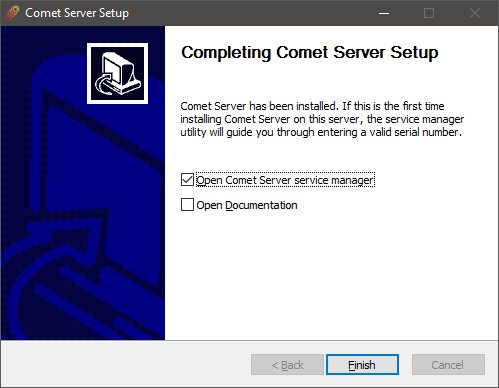

## System Requirements​

- CPU:
  - x86_64 or ARM64 CPU architecture
    -No minimum requirement (CPU usage scales with server load)
- RAM:
  - Suggest 2/4 GB minimum
  - No minimum requirement (RAM usage scales with server load)
- Operating System:

  - Windows 7 or newer
  - Windows Server 2008 R2 or newer (Comet 21.12.1 or newer)
  - Windows Server 2008 (Comet 21.12.0 or older)

    - As of Comet 19.12.5, TLS 1.2 is mandatory in Comet Server. Windows Server 2008 users may require KB4019276 to continue accessing Comet Server; this update is also required for ESU (Extended Security Updates) for Windows Server 2008.

  - Ubuntu 16.04 or newer
  - Debian 8 "Jessie" or newer
  - CentOS 7 or newer
  - Any other recent Linux operating system version (kernel 2.6.23 or later)
  - Must support [ISRG Root X1 certificates](https://letsencrypt.org/docs/certificate-compatibility/) to communicate with the licensing system.

- Disk space:
  - Approximately 100MB for the server software application itself; plus
  - a few 10s of MB for customer metadata, job history logs, etc; plus
  - any space required for actual customer backup data (if you are not using cloud storage).
- Internet access
  - The Comet Server needs internet access to contact the licensing system. See [Licensing](https://docs.cometbackup.com/latest/application-architecture#licensing) for more detail.
  - The licensing system uses Let's Encrypt for SSL certificates. Only operating systems that trust ISRG Root X1 certificates will be able to validate. See: https://letsencrypt.org/docs/certificate-compatibility/

## Windows

Run the installer file and follow the prompts.

By default, the software is installed into the `C:\Program Files\Comet Server` directory. Configuration files and log files are stored in the `C:\ProgramData\Comet` directory.



Before starting the server for the first time, a serial number must be entered, as described in following sections.

Once the server software is installed, it can be started via

- Comet Server Service Manager (recommended), or
- the Services snap-in, or
- via the Services tab in Task Manager.

For troubleshooting purposes only, the server can be started from an interactive terminal:

1. Open a command prompt as Administrator
2. cd `C:\Program Files\Comet Server`
3. `cometd -Chdir C:\ProgramData\Comet`

### Upgrading

To upgrade Comet Server on Windows, run the updated installer file. The old version will be uninstalled and replaced with the new version. Your configuration will be preserved. Any running backup jobs should resume automatically.

## Linux - DEB​

Comet Server is available as a `.deb `package for Debian and Ubuntu Server.

Install by running `dpkg -i cometd_x.y.z_amd64.deb ; apt-get -f install `(replacing `x.y.z` as appropriate based on the downloaded `.deb` filename).

The package installs into `/opt/cometd/`, but otherwise respects standard Debian policy:

- The configuration file is kept in `/etc/cometd/cometd.cfg`.
- Database files are stored in `/var/lib/cometd/`.
- The server log files are stored in `/var/log/cometd/`.
- Standard `service` or systemd `systemctl` commands can be used to start, stop, restart, and view logs for the server.

<iframe width="100%" height="440" src="https://www.youtube.com/embed/HxhJthE0UY0" title="Ubuntu/Debian Comet Server Installation" frameborder="0" allow="accelerometer; autoplay; clipboard-write; encrypted-media; gyroscope; picture-in-picture" allowfullscreen></iframe>

### Compatibility

The `.deb` package supports Ubuntu Server 12.04, 14.04, 16.04, 18.04, 20.04 or compatible; and Debian 6 "Squeeze", 7 "Wheezy", 8 "Jessie", 9 "Stretch", 10 "Buster" or compatible. The package supports both SysVinit and systemd. End-of-life debian-based products may continue to work, however, continued support and compatibility cannot be guaranteed.

The package may be compatible with future versions of Debian and Ubuntu, and compatible derivative distributions; however, this cannot be guaranteed at the time of writing.

#### Upgrading from SysVinit to systemd​

When upgrading from a distribution using SysVinit or Upstart (e.g. Debian 6, Debian 7, Ubuntu 12.04, Ubuntu 14.04) to a distribution using systemd (e.g. Debian 8, Ubuntu 16.04), the Comet Server unit is not enabled in systemd and will not start automatically. You can resolve this issue by

- reinstalling the Comet Server package, or
- upgrading the Comet Server package to the latest version, or
- running `systemctl enable cometd`

### Upgrading

To upgrade Comet Server on Debian-based distributions, install the updated `.deb` file. The old version will be uninstalled and replaced with the new version. Your configuration will be preserved. Any running backup jobs should resume automatically.

### Debian Silent Installation​

You will need:

```txt
1. The new Comet Server serial number in the form of "XXXX-XXXX-XXXX-XXXX-XXXX-XXXX"
2. A means of remotely executing instructions on the target machine
```

#### Steps

```txt
1. Clear the debconf, and insert your new serial

`echo "cometd cometd/serial-number string XXXX-XXXX-XXXX-XXXX-XXXX-XXXX" | sudo debconf-set-selections`

2. Install the server

`sudo DEBIAN_FRONTEND=noninteractive apt-get --fix-broken -yq install ./cometd_X.X.X_amd64.deb`

2a. Restart the server (only needed if reinstalling)

`sudo service cometd restart`
```

## Linux - RPM​

_The RPM package is available for Comet 19.3.9 and later._

Comet Server is available as an `.rpm` package for RPM distributions. The single `.rpm` package is designed to work on multiple Linux distributions that meet the following high-level requirements:

- Systemd
  - It is not generally feasible to install `systemd` on older Linux distributions (e.g. CentOS 6 / RHEL 6 and earlier).
- RPM with xz support
  - The RPM installer uses `xz` compression, that is not supported on older Linux distributions (e.g. CentOS 5 / RHEL 5 and earlier).

The package uses typical file locations:

- The package installs into `/opt/cometd/`
- Database files are stored in `/var/lib/cometd/`
  - The configuration file is kept in this directory, with a helper symlink in `/etc/cometd/cometd.cfg`
- The server log files are stored in `/var/log/cometd/.`
- Standard service or systemd `systemctl` commands can be used to start, stop, restart, and view logs for the server.

### Installing

Use your distribution package manager to install the .rpm file and its dependencies:

#### DNF

_DNF is the recommended package manager in Fedora 22 and later, CentOS 8, Red Hat Enterprise Linux (RHEL) 8, Oracle Linux 8, and others._

1. `dnf localinstall ./cometd-*.x86_64.rpm`
2. Edit `/etc/cometd/cometd.cfg` to enter your serial number
3. `systemctl start cometd`

#### YUM

_YUM is the recommended package manager in Fedora 15 and later, CentOS 7, Red Hat Enterprise Linux (RHEL) 7, Oracle Linux 7, and others._

1. `yum localinstall ./cometd-*.x86_64.rpm`
2. Edit `/etc/cometd/cometd.cfg` to enter your serial number
3. `systemctl start cometd`

#### Zypper

_Zypper is the recommended package manager in OpenSUSE 12, SLES 12 and later, and others._

1. `zypper install --recommends ./cometd-*.x86_64.rpm`
   - Choose to **ignore** warning that cometd rpm is unsigned
2. Edit `/etc/cometd/cometd.cfg` to enter your serial number
3. `systemctl start cometd`

#### Other RPM/systemd distribution​

The basic RPM program does not automatically install necessary package dependencies.

1. Manually install dependencies

   - `setcap`, `tzdata`, `ca-certificates`, `adduser/useradd`

2. `rpm -i ./cometd-*.x86_64.rpm`
3. Edit `/etc/cometd/cometd.cfg` to enter your serial number
4. `systemctl start cometd`

#### Converting from "Other Distribution" to RPM package​

The RPM package was introduced in Comet 19.3.9. If you were using Comet Server on an RPM-based Linux distribution prior to this version of Comet, you may wish to upgrade from the `.tar.xz` package to the RPM package.

The RPM is a repackaged version of Comet Server that installs it in a predefined, standardized way. But the actual content of the installation is the same as for the existing `.tar.xz` package; the program and all settings files are compatible.

The RPM

- installs Comet Server to the `/opt/cometd/` directory
- configures it to look for its database and configuration files under `/var/lib/cometd/`
- creates helper symlinks in `/etc/cometd/` and `/var/log/cometd/` to help system administrators find the configuration and log files, respectively
- creates a `cometd` system user/group to run the service
- installs a startup script using systemd

Some of the above steps may have been optional in the `.tar.xz` package.

The RPM does not contain any settings files and will not overwrite any existing settings- or database files in any directory.

To migrate from the `.tar.xz` package to the `.rpm` package version, a safe set of rough steps should be:

1. Stop the running Comet Server service
2. Remove any custom Comet Server startup script or systemd unit; if using systemd, run `systemctl daemon-reload` for it to pick up on the removal
3. If your existing Comet Server installation used the `/opt/cometd/` directory or the `/var/lib/cometd/` directory, rename them to something different (e.g. `/opt/cometd-previous/ and /var/lib/cometd-previous/`)
4. Install the RPM. The new Comet Server service does not start up automatically
5. Move the `comet-*.db` files, the `comet-*.db3` files, the `cometd.cfg` file, the `/resources/` subdirectory, and (if present) the `/autossl/` subdirectory, all into place from the old configuration directory to the new configuration directory (`/var/lib/cometd/`)

- Example copy which preserves permissions, owner and group: `cd /opt/cometd-backup ; tar -cf - autossl comet-*.db* `cometd.cfg` resouces | ( cd /var/lib/cometd ; tar -xpf - )`

6. Move the `/logs/` subdirectory to the new logs directory (`/var/log/cometd/`) and ensure there is a symlink in place from `/var/lib/cometd/logs/` to this directory. The RPM should have created this symlink for Comet Server's use.
7. If you were using local disk storage, move the storage directory (default `/userdata/`) back into place and/or check in the `cometd.cfg `file that the Comet Server is looking in the correct location for local disk storage
8. Ensure that all the moved database/configuration files above are owned and/or writable by the new `cometd` user account (e.g. by running `chown -R cometd:cometd /var/lib/cometd/)`
9. Start the Comet Server service

### Upgrading

To upgrade Comet Server on RPM distributions, install the updated `.rpm` file. The old version will be uninstalled and replaced with the new version. Your configuration will be preserved. Any running backup jobs should resume automatically.

## Linux NAS (Synology, QNAP)​

You can install Comet Server using the "Other distribution" package.

## Linux (Other distribution)​

If you are using a Linux distribution without an available package, your support agent will be unable to assist with any issues related to your specific operating system. Different Linux distributions use different service managers, init systems, user management scripts, and filesystem hierarchies; the following instructions are deliberately vague as a result.

The server software can be installed as follows:

1. Create a new restricted user to run the application.
2. Extract the provided archive.
   - Set permissions on the extracted files to match the created user, and mark the `cometd` binary as executable.
3. Switch to the restricted user, and run the application once with the argument `-ValidateConfigOnly`. This will cause a default configuration file to be generated.
4. Write a service management script (e.g. systemd unit file) to manage the service.
5. Proceed to enter a serial number in the configuration file, as described in following sections.

On Linux, binding to ports below 1024 (e.g. the common 80 or 443) requires authorization from the root user. There are many ways to achieve this: for example, you can run `setcap CAP_NET_BIND_SERVICE=+eip /path/to/cometd` as root (requires kernel 2.6.24 or newer), or investigate the `authbind` package for more granular control.

The server can be started at any time, by either

- opening a terminal as the restricted user, and typing `./cometd` ; or
- by starting the service using the service management script (e.g. systemd unit).

The latter should be preferred in general, but the former may be more convenient during initial configuration and for diagnostic purposes.

Comet Server for Linux requires the IANA timezone database to be available unpacked in the `/usr/share/zoneinfo/` directory. This package is likely already installed by your distribution vendor.

- Alternative directories supported are `/usr/share/lib/zoneinfo/`, or `/usr/lib/locale/TZ/`.

## Command-line arguments​

The Comet Server binary (i.e. `cometd.exe` on Windows / `cometd` on Linux) accepts a number of command-line arguments to configure its behavior.

`-ValidateConfigOnly`

This flag causes Comet Server to validate the `cometd.cfg` file, creating it if it does not already exist, and then exit immediately.

`-LogAccesses`

This flag causes Comet Server to add log entries for all HTTP accesses. This option can cause a lot of information to be generated and should be used sparingly when troubleshooting network issues.

`-Chdir=C:/custom-path/`

This flag causes Comet Server to look in a different directory for its read-write files, such as `cometd.cfg` and database files.

`-Instdir=C:/custom-path/`

This flag causes Comet Server to look in a different directory for its read-only files, such as `/vendor/`.

`-WebrootDir=C:/custom-path/`

This flag causes Comet Server to not use the built-in web interface, and instead use a custom web interface from the supplied directory. This option could be used to enable advanced customization of the web interface, or to disable the web interface entirely.

The built-in web interface is entirely API-driven; modifying or disabling the web interface in this way has no impact upon any other uses of the product (including backup or restore operations).
