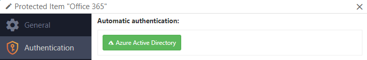

# Protected Item types

## Overview

Comet supports a range of different types for your Protected Item configuration, including file, application, system, and VM backup types.

Protected Items are private to each device. To move or duplicate Protected Items from one device to another see here: [https://docs.cometbackup.com/latest/installation/comet-server-usage#copy-and-paste](https://docs.cometbackup.com/latest/installation/comet-server-usage#copy-and-paste)

## "Files and Folders" items

The "Files and Folders" option lets you back up files and folders on the PC.

Use the Plus button to browse files and folders for backup. You can also drag-and-drop files and folders into the Comet Backup client to select them.

The "Choose files" dialog displays a live estimate of the selected filesize (before compression and deduplication).

### Filesystem snapshots

On Windows, the "Take filesystem snapshot" option creates a VSS snapshot.

This enables Comet to back up files that are currently in-use. It also provides disk-wide "crash-consistency", as all files for backup will originate from the precisely same timestamp.

Non-Windows platforms do not currently require the use of this feature to back up in-use files, however, they also do not benefit from the disk-wide consistency.

Current versions of Comet cannot take filesystem snapshots of a Protected Item located on a network share; be sure to disable the "Take filesystem snapshot" option on the Protected Item.

Windows supports taking VSS snapshots of `NTFS` and `ReFS` filesystems. Comet can snapshot these filesystems for backup.

Windows does not support taking VSS snapshots of `FAT` or `exFAT` filesystems. Protected Items backing up these filesystems must not use the "Take filesystem snapshot" option.

This feature is enabled by default for new Protected Items.

### Network shares

Comet supports backing up Windows network shares (SMB / CIFS). You should prefer to install Comet Backup directly on the network device; this will offer increased backup performance.

On Windows,

- The "Choose Items" dialog lets you browse through mapped network drive letters. You can also use the "Options > Browse UNC Path" option to directly browse a UNC path.
- Comet supports entering custom Windows Network Authentication credentials via the "Log in to network share" option. If you select a network share for backup, you may need to enter custom credentials in order for the service user account to access the network share.
- Because mapped network drives are private to a user session, Comet Backup automatically converts mapped network drive letters into their UNC path equivalent, so that it can still be accessed by the service user account.

Current versions of Comet cannot take (VSS) filesystem snapshots of a Protected Item located on a network share; be sure to disable the "Take filesystem snapshot" option on the Protected Item.

On non-Windows platforms,

- You should mount the network share locally before backing it up.

### Encrypted files (Windows EFS)

EFS is a Windows feature that allows you to encrypt individual files on disk. Comet supports backing up EFS-encrypted files on Windows. The files will be silently decrypted if possible (e.g. if Comet Backup is running as the encryption user, or if Comet Backup is running as the EFS Recovery Agent user).

If it is not possible to automatically decrypt the file for backup, Comet will back up the file in its encrypted form, and will only be able to restore it in its encrypted form. EFS-encrypted files are displayed with green text in the Restore browser dialog in Comet Backup.

If you have a PC failure, the EFS encryption keys may be lost. In this situation, the EFS-encrypted files may be unusable, even after restoring from backup. Comet warns you about this situation by adding a warning message in the backup job log.

In order to safely prepare for this scenario, you should export the PC's EFS encryption keys, so that the files can be accessed after a PC failure. On Windows, you can do this via `certmgr.msc`; or on Windows Server, taking a System State backup may be sufficient.

Once you have safely backed up the PC's EFS encryption keys, you can suppress the warning in Comet Backup by enabling the "I confirm EFS keys are exported" option in the Protected Item settings.

If you have only a partial PC failure (e.g. files lost, but OS installation and user accounts remain intact) the EFS-encrypted files will be restorable without any further attention to the EFS keys.

#### Finding files using EFS

You can use the `cipher /u /n` command to list all files on the local PC that are EFS-encrypted.

Alternatively, you can use this Powershell snippet, to list all EFS-encrypted files on `C:\` into a new `EFS-FileList.txt` file:

    get-childitem C:\ -Recurse -Force -ErrorAction SilentlyContinue | Where-Object {$_.Attributes -ge "Encrypted"} | format-list fullname, attributes | Out-File -FilePath .\EFS-FileList.txt -NoClobber

#### Finding the certificate used to encrypt a file

You can use the `cipher /C C:\path\to\file.txt` command to display the user accounts and certificates that are able to decrypt a file. This may indicate which user originally encrypted the file and/or which EFS certificates are necessary for backup.

### Windows Server Deduplication

Windows Server 2012 and later have a data deduplication feature that is separate- and unrelated- to Comet's own deduplication, that can be used to increase free disk space on NTFS volumes. A scanning process runs in the background to find and merge duplicate file content. By default, the scanning process runs overnight.

Deduplicated files look and behave like normal files; however, they are stored on disk in a special format, that can only be read by Windows Server (and Linux). Non-Server versions of Windows are entirely unable to read these files from disk.

When backing up deduplicated files with Comet, it backs up the full (rehydrated) file content, and then applies its own deduplication to it. This means that Windows Server deduplicated files can be safely restored to non-Server versions of Windows.

When restoring deduplicated files from Comet, the files are restored in their full (rehydrated) format, and are not re-deduplicated until Windows runs its next background scanning pass. This means that you may not have enough free disk space to completely restore a Comet backup to the same source drive.

### Advanced filters

You can include or exclude a range of files or directories with Comet.

### Include filters

An inclusion filter will scan out the matched files or directories under the specified top directory from backup, using either a glob pattern or a regex (regular expression).

There is no limit to the number of inclusion filters you can add to a single Protected Item.

The speed of file-matching relies upon the top directory location and the complexity of the glob pattern or regex.

#### Glob pattern match

Comet can include files based on a glob pattern. Any files matching the glob pattern under the specified top directory will be included from the backup job.

The expression is tested against the top directory path to the file.

Some special characters and wildcards are allowed:

- A star (`*`) skips zero or more characters within a filename
- A double-star (`/**/`) skips any number of directory components
- A question-mark (`?`) skips a single character within a filename
- Square brackets denote a character class (e.g. `[0-9]`) within a directory or file name

Example: Top directory is `C:\Users\`, pattern is `*\Documents`

- This will include all Documents directories under the first subdirectories of `C:\Users\` .

An invalid glob pattern will prevent a backup job from running.

#### Regular expression match

Comet can include files based on a regex (regular expression). Any files matching the regex under the specified top directory will be included from the backup job. The specific syntax flavor is that of the [Go regexp library](https://golang.org/pkg/regexp/syntax/#hdr-Syntax).

The regex is tested against the top directory path to the file.

By default, the regex is:

- case-sensitive. You can perform a case-insensitive match by adding an `(?i)` expression
- non-anchored. You can restrict your regex to the start- or end- of the file path by using the `^`, `$`, `\A` and/or `\z` expressions.

Forwardslash (`/`) is not a special character and does not require escaping with `\/`.

An invalid regex will prevent a backup job from running.

#### Popular examples

On Windows,

| Top Directory   | Path                | Match Option |
| --------------- | ------------------- | ------------ |
| `C:\Users\`     | `*\Documents`       | pattern      |
| `C:\Users\User` | `**\*.docx`         | pattern      |
| `C:\Users\`     | `[^\\]+\\Documents` | regex        |

On Linux,

| Top Directory | Path        | Match Option |
| ------------- | ----------- | ------------ |
| `/etc/`       | `**/*.conf` | pattern      |

On MacOS,

| Top Directory | Path          | Match Option |
| ------------- | ------------- | ------------ |
| `/Users/`     | `*/Documents` | pattern      |

### Exclude filters

You can exclude a range of files from the backup job. An exclusion filter checks whether to exclude each file from backup, using either a glob pattern or a regex (regular expression).

There is no limit to the number of exclusion filters you can add to a single Protected Item.

#### Glob pattern match

Comet can exclude files based on a glob pattern. Any files matching the glob pattern will be excluded from the backup job.

The expression is tested against the full disk path to the file. Your glob expression can be a partial match (e.g. `*.txt`) or a fully anchored match (e.g. `C:\path\to\file.docx`).

Some special characters and wildcards are allowed:

- A star (`*`) skips zero or more characters within a filename
- A double-star (`/**/`) skips any number of directory components
- A question-mark (`?`) skips a single character within a filename
- Square brackets denote a character class (e.g. `[0-9]`) within a directory or file name

Example: `C:\Users\**\AppData\Local\Microsoft\WindowsApps`

- This will exclude the automatically re-downloaded non-critical and normally non-accessible windows-app files.

An invalid glob pattern will prevent a backup job from running.

#### Regular expression match

Comet can exclude files based on a regex (regular expression). Any files matching the regex will be excluded from the backup job. The specific syntax flavor is that of the [Go regexp library](https://golang.org/pkg/regexp/syntax/#hdr-Syntax).

The regex is tested against the full disk path to the file. This enables filtering by path component, or (on Windows) drive letter.

By default, the regex is:

- case-sensitive. You can perform a case-insensitive match by adding an `(?i)` expression
- non-anchored. You can restrict your regex to the start- or end- of the file path by using the `^`, `$`, `\A` and/or `\z` expressions.

Forwardslash (`/`) is not a special character and does not require escaping with `\/`.

Note: An invalid regex will prevent a backup job from running.

#### System exclusions

The Comet Backup system automatically excludes certain folders.

On Windows, Comet skips

- The `$RECYCLE.BIN` and `System Volume Information` directories in any drive root
- The `C:\Recovery` directory
- The `C:\pagefile.sys`, `C:\hiberfil.sys`, and `C:\swapfile.sys` files
- Reparse points of the `IO_REPARSE_TAG_APPEXECLINK` type, such as `MicrosoftEdge.exe` or the `WindowsApps/` subdirectory
  - This is intended to work around an issue with `The file cannot be accessed by the system` messages affecting Windows 1803 and later.
- Invalid `.DFSFolderLink` files

On Linux, Comet skips

- The `/proc` directory
- The `/sys` directory
- The `/selinux` directory
- The `/dev` directory

On macOS, Comet skips

- The `/dev` directory
- The `/Users/.../Library/VoiceTrigger/SAT` directory
  - This is a protected `AF_DATAVAULT` directory that is inaccessible with SIP enabled (the default).

### Rescan unchanged files

In a regular "Files and Folders" backup, Comet will skip over files that have the same file size and modification time as the last backup job. If these properties are the same, Comet will refer to previous chunks and not re-chunk the file. This dramatically improves performance.

If you are working with certain types of files that change content without updating their modification time attribute on the filesystem - for instance, applications that use direct disk I/O instead of filesystem functions; some database data files; or VeraCrypt container files - then the above is obviously unsatisfactory for ensuring backup integrity. In this case, you can enable the "Rescan unchanged files" feature to cause Comet to chunk every encountered file. This has some performance penalty but does ensure backup integrity in the presence of such files.

## "Program Output" items

The "Program Output" backup type backs up the `stdout` (Standard Output) stream of any command execution. This allows you to make use of application-specific tooling for taking consistent, point-in-time snapshots of certain application software.

You may use the "Program Output" Protected Item type as an integration point to back up a variety of different programs with Comet. This includes, but is not limited to

- [MySQL](https://www.mysql.com/) and [MariaDB](https://mariadb.org/) using the `mysqldump` command
  - More integrated support is available using the dedicated MySQL Protected Item type
- [MongoDB](https://www.mongodb.com/), using the `mongodump` command
  - More integrated support is available using the dedicated MongoDB Protected Item type
- [PostgreSQL](https://www.postgresql.org/), using the `pg_dump` command
- [Materialize DB](https://materialize.io/product/), using the Postgres-compatible `pg_dump` command
- [Interbase](https://www.embarcadero.com/products/interbase), using the `gbak` command
- [Firebird](https://firebirdsql.org/), using the `gbak` command
- [Wordpress](https://wordpress.com/), using the `wp db export` command
- [Docker](https://www.docker.com/), using the `docker save` command
- [OpenVZ](https://openvz.org/), using the `vzdump` command
- [Proxmox VE](https://www.proxmox.com/en/proxmox-ve), using the `vzdump` command
- [CockroachDB](https://www.cockroachlabs.com/), using the `cockroach dump` command
- [Neo4j](https://neo4j.com/), using the `neo4j-admin dump` command
- [RethinkDB](https://rethinkdb.com/), using the `rethinkdb dump` command

### Behavior

The program is run as part of the backup job. Any streamed data on `stdout` is saved as a virtual file within the backup job. The data is streamed directly to the backup destination and never touches the local disk. This has the consequence that no progress bar or ETA can be calculated or displayed during backup jobs.

You can choose any file name for the resulting virtual file within the backup job.

If the target application produces any content on `stderr` (Standard Error), it will be logged in the job report, and the final job status will not be less severe than "Warning".

If the target application exits with a non-zero error code, the error code will be logged in the job report, and the final job status will not be less severe than "Error".

## "Microsoft Exchange Server" items

_Using this Protected Item type may incur a Booster charge._

This Protected Item type backs up Microsoft Exchange Server databases. The underlying technology is `VSS` and is compatible with Microsoft Exchange Server 2007 and later, including Exchange Server 2016 (the latest version at the time of writing).

The appropriate VSS writer must be installed.

As Exchange Server can only be installed on Server SKUs of Windows, this backup type is only applicable when running on Windows Server.

Some forms of Exchange Server backup will cause log truncation to occur on the Exchange Server. For more information, please see the official Exchange Server documentation. If circular logging is enabled on the Exchange Server, the 'Incremental' and 'Differential' backup types have limited effect.

### Exchange Server 2007

By default, Exchange 2007 does not enable the VSS writer. The VSS writer may have been enabled by another backup system installed on the PC.

If you encounter error messages like `Couldn't find Exchange Server installation on this device` or `Failed to perform VSS snapshot` on a machine running Exchange 2007, the Exchange VSS writer (`MSExchangeIS`) may not be enabled.

- You can confirm whether this is the case by checking for `Microsoft Exchange Writer` in the output of `vssadmin list writers`, or, in the Browse dialog for a new "Application Aware Writer" Protected Item.

You can manually activate the Exchange VSS writer by making the following steps:

1.  Open `regedit` and navigate to `HKEY_LOCAL_MACHINE\SYSTEM\CurrentControlSet\Services\MSExchangeIS\ParametersSystem`
2.  Change the `Disable Exchange Writer` value from `1` to `0`
3.  Restart the `Microsoft Exchange Information Store` service

For more information on this issue, please see Microsoft's own documentation at [http://support.microsoft.com/kb/838183/en-us](http://support.microsoft.com/kb/838183/en-us) .

### Restore

The Comet Backup snapshot of Exchange Server includes the `*.edb` file, the `*.log`/`*.stm`/`*.chk` files, and/or other files.

To restore data, you can either

- reinstate the Information Store files directly as a whole. This approach is suitable in a disaster recovery situation; or
- recover individual items. This allows you to access individual mailboxes and messages without affecting the existing mounted database. This approach is suitable if you only need to access some small parts of past data that has since been deleted or corrupted, without affecting the current running Exchange Server state.

#### Full EDB Recovery

One option for restoring the Exchange EDB is to replace the full EDB file.

You can replace the EDB and log files on the Exchange Server with the restored versions. This approach is suitable for disaster recovery.

In the Exchange Server console:

1.  Dismount the existing Exchange Server Store
2.  Replace files on disk with the restored copies.
    - The path must match the original copy because the transaction log files include an embedded path to the `*.edb`/`*.stm` files. If the EDB file was backed up from a different disk location, you should first use the "Move database" feature to update Exchange Server to look for the database files in their original location. For more information, see [this Microsoft article](https://social.technet.microsoft.com/Forums/exchange/en-US/54186102-2608-41bb-b5b8-ddafdc7d279c/newmailboxdatabase-with-existing-edb-file-possible?forum=exchange2010).
3.  Mount the Exchange Server Store

#### Recovery Database mode

Another option for restoring the Exchange EDB is to mount it as a recovery database (RDB).

Once mounted, you can attach Outlook to the recovery database, or use the `New-MailboxRestoreRequest` PowerShell command to extract a PST mailbox.

For more information, see [this Microsoft article](https://docs.microsoft.com/en-us/exchange/high-availability/disaster-recovery/restore-data-using-recovery-dbs).

#### Extract EDB contents

Another option for restoring the Exchange EDB is to use a third-party application to extract content.

Third-party applications can read the content of the EDB file to extract individual messages, contacts, or other mailbox items.

At the time of writing, the following programs were available:

- [Stellar](https://www.stellarinfo.com/edb-exchange-server-recovery.htm) products, including but not limited to Stellar Converter for EDB, Stellar Repair for Exchange, Stellar Toolkit for Exchange
- [Quest Recovery Manager for Exchange](https://www.quest.com/products/recovery-manager-for-exchange/)
- [Kernel Exchange EDB Viewer](https://www.nucleustechnologies.com/exchange-edb-viewer.html)
- [Systools Exchange EDB Viewer](https://www.edbviewer.org/)

## "Microsoft Hyper-V" items

_Using this Protected Item type may incur a per-hypervisor Booster charge._

This Protected Item type backs up Microsoft Hyper-V virtual machines. The underlying technology is `VSS` and is compatible with all versions of Hyper-V running on Windows Server, including Windows Server 2016 (the latest version at the time of writing).

This backup type is only applicable when running on Windows Server. Hyper-V on Windows Desktop is not supported by this Protected item type.

Comet integrates with the Hyper-V VSS writer to perform a Hyper-V backup snapshot, including support for in-VM quiescence on supported guest operating systems.

Backing up a Hyper-V virtual machine with Comet includes, but is not limited to:

- its configuration file
- all attached virtual drives
- the contents of memory (if the machine was running)
- the full tree of saved checkpoints

You can select individual virtual machines for backup, or choose "All virtual machines".

### Consistency and guest additions

_The following information applies to all products that perform Hyper-V backup._

When backing up a guest VM, it's important to get a consistent state of the VM. There are some different ways this happens.

If the guest OS has all necessary Hyper-V integration services installed, then the host can request for the guest VM to take a VSS snapshot. The snapshot is then exposed to Hyper-V on the host for Comet to back up. It shouldn't interrupt the guest OS. The VM backup is application-consistent. This is known as a "Production checkpoint".

If the host OS is running Server 2012 R2 or newer, but there are no integration services inside the guest OS, then Hyper-V will take a checkpoint of the VM; Comet will back up the checkpoint; and then the checkpoint will be removed. This kind of checkpoint does not interrupt the guest OS. The VM backup is crash-consistent. This is known as a "Standard checkpoint".

- You can also achieve this behavior by disabling "Production checkpoints" in the Hyper-V settings for the VM.

If the host OS is older than Server 2012 R2, and there are no integration services inside the guest OS, then the VM will be paused; Windows will take a VSS snapshot of Hyper-V's files in paused state; the VM will be resumed and Comet will back up from the VSS snapshot. It would cause a short interruption to the guest OS. The VM backup is crash-consistent.

- You can also achieve this behavior by disabling checkpoints in the Hyper-V settings for the VM.

### Replica VM

_The following information applies to all products that perform Hyper-V backup._

If you are using Hyper-V replication, you can back up your virtual machines from either the primary or replica host.

A backup taken on the primary VM host is application-consistent (if possible), by quiescing a VSS snapshot inside the VM guest; or crash-consistent otherwise. A backup taken on the secondary VM host is only ever crash-consistent, because the replica VM is not running in order for guest integration services to take a VSS snapshot.

Current versions of Hyper-V do not allow backing up a VM that is currently replicating. If a VM is found to be currently replicating at the time of backup, Comet will retry the operation a few times. If you repeatedly see errors of the form `The virtual machine '...' cannot start a backup operation because it is currently executing a conflicting operation. Try the backup again.`, and you are running backups from the replica VM host, you could consider

- scheduling the backup job to run at a time when it's more likely that the VM replication is up-to-date; or
- using Before / After commands in Comet to temporarily stop VM replication while the backup job is running.

For more information about backing up a replica VM, see [https://blogs.technet.microsoft.com/virtualization/2014/04/24/backup-of-a-replica-vm/](https://blogs.technet.microsoft.com/virtualization/2014/04/24/backup-of-a-replica-vm/)

### Pass-through disks

_The following information applies to all products that perform Hyper-V backup._

Hyper-V supports passthrough disks, to attach a physical disk from the host directly into the guest VM. This unmounts it from the host OS.

Hyper-V itself does not support backing up passthrough disks (nor does it support replicating them). A Hyper-V backup of the guest machines can be taken from the host, but does not include any data from passthrough disks.

You can work around this issue by either

- installing Comet Backup inside the guest VM, and backing up the extra data at a file level (this will use an extra Device license); or
- changing your passthrough disks to be a real disk containing a large `.vhd` or `.vhdx` file. The "New Virtual Disk Wizard" in Hyper-V Manager has an option to convert an existing disk to a `.vhd` or `.vhdx` file.

For more information about backing up passthrough disks in Hyper-V, see [https://blogs.technet.microsoft.com/virtualization/2009/03/03/working-around-the-pass-through-limitations-of-the-hyper-v-vss-writer/](https://blogs.technet.microsoft.com/virtualization/2009/03/03/working-around-the-pass-through-limitations-of-the-hyper-v-vss-writer/)

## "Microsoft SQL Server" items

_Using this Protected Item type may incur a Booster charge._

This Protected Item type backs up a Microsoft SQL Server database. The underlying technology is `VDI` and is compatible with SQL Server 2005 and later, including SQL Server 2019 (the latest version at the time of writing).

No data is spooled to the local disk. As per the "Program Output" type, no progress bar or ETA appears during a Microsoft SQL Server backup.

Databases are backed up one-at-a-time. If you require point-in-time consistency across multiple databases, please use the "Application-Aware Writer" option instead.

### Connection details

Connection details should be supplied before selecting databases. Comet will only connect to SQL Server running on the local machine. You must enter the instance name, or leave the field blank to use the default instance.

#### Address

The address is always `localhost`, but Comet does not use TCP addresses or TCP ports to connect to SQL Server instances. Comet uses "Shared Memory" to connect to SQL Server instances.

Comet's use of "Shared Memory" connection does improves performance for some operations, at the expense of only working on the local machine; but Comet's use of VDI requires it to run against the local machine anyway.

If you encounter issues connecting to your SQL Server, you must ensure that "Shared Memory protocol" is enabled in SQL Server Configuration Manager.

#### Driver

`OLE DB` and `ODBC` are data access methods that use pluggable "drivers" / "providers" for connecting to databases like SQL Server. The following drivers for `OLE DB` / `ODBC` support SQL Server:

| Driver       | TLS 1.2 Support | Notes                                                                                                                                                                                           |
| ------------ | --------------- | ----------------------------------------------------------------------------------------------------------------------------------------------------------------------------------------------- |
| `MSOLEDBSQL` | Yes             | Included with SQL Server 2016 and 2017; Optional download from [https://www.microsoft.com/en-us/download/details.aspx?id=56730](https://www.microsoft.com/en-us/download/details.aspx?id=56730) |
| `SQLNCLI11`  | Yes             | Included with SQL Server 2012 and 2014; Optional download from [https://www.microsoft.com/en-us/download/details.aspx?id=50402](https://www.microsoft.com/en-us/download/details.aspx?id=50402) |
| `SQLNCLI10`  | No              | Included with SQL Server 2008                                                                                                                                                                   |
| `SQLNCLI`    | No              | Included with SQL Server 2005                                                                                                                                                                   |
| `SQLOLEDB`   | No              | Included with SQL Server (all versions); Included with Windows since XP / Server 2003                                                                                                           |

You can list your installed drivers

- for `ODBC`, via the `odbcad32.exe` program > "Drivers" tab; or
- for `OLE DB`, via [this PowerShell snippet](https://stackoverflow.com/a/48298700).

Comet prefers to use the `MSOLEDBSQL` driver if it is available. If this driver is not available, the `SQLNCLI11` and `SQLOLEDB` drivers will be attempted as a fallback.

#### Authentication

Comet allows you to connect to SQL Server using either Windows authentication or native SQL Server authentication.

If you are using SQL Server authentication, you must enter a valid username and password to connect to SQL Server.

If you are using Windows authentication, you can either

- enter valid Windows credentials to impersonate that user account; or
- leave the field blank, to connect as the logged-on account of the background `backup.elevator` service (normally running as the `LOCAL SYSTEM` Windows user account); or
- enter `NT SERVICE\backup.delegate` with no password, to connect as the logged-on account of the background `backup.delegate` service (normally running as the `NT SERVICE\backup.delegate` Windows user account)

In addition, you may assign any Windows user account to have `sysadmin` rights within SQL Server.

#### Multiple instances

Comet supports backing up multiple instances from SQL Server. You can select an instance for backup, by entering the instance name in the "Instance Name" field. Leave this field blank to use the default instance.

Comet Backup automatically lists available instances for selection in the drop-down menu.

### Backup mode

By default, Comet opts to make a full database export from SQL Server, and then uses its own deduplication system to optimise the stored/uploaded data.

This is the "Full (copy only)" option. It is equivalent to the `BACKUP WITH COPY_ONLY` T-SQL statement.

Because Comet can efficiently deduplicate full image backups, it is normally sufficient to only take full backups of SQL Server in Comet.

#### Base images

You have the option to use SQL Server's own differential/log backup system. This may be more efficient, but it does require additional administrative work, and complicates the process of restoring data.

The SQL Server maintains one single point-in-time reference, from which it can produce differential backups and/or log-based backups. When you take a new "Full (base image)" backup, the point-in-time reference is moved forward, so that any future differential and/or log-based backups are based on the last base-image backup.

To use SQL Server's own differential/log backup system, you must create multiple Protected Items (each with a different schedule) in order to capture both a base image and a differential/log backups. By creating multiple Protected Items, you can individually schedule, report-on, and manage retention policies for both base and differential/log backups.

If you are using Comet alongside another product for SQL server backups, you should ensure that only one product is taking base-image backups. Otherwise, it's possible that a chain of differential/log backups would be incomplete.

#### Differential

Comet can use SQL Server's own systems for differential backup. In this mode, you can regularly make "differential base" backups, and then a series of small "differential increment" backups, each containing the difference from the last base backup. These operations are equivalent to the `BACKUP` and `BACKUP WITH DIFFERENTIAL` T-SQL statements respectively. Comet will still deduplicate multiple base backups that are sent to the same Storage Vault.

This is the "Differential increment" option.

#### Log

You can opt to use SQL Server's own systems for log backup. In this mode, you must periodically take full (base image) backups, and regularly take log backups.

You have the choice of whether to apply log truncation. These operations are equivalent to the `BACKUP LOG` and `BACKUP LOG WITH NO_TRUNCATE` T-SQL statements respectively. Comet will still deduplicate all data that is sent to the same Storage Vault.

To use SQL Server's own log system, you must create multiple Protected Items (each with a different schedule) in order to capture both full and log backups.

This mode requires that the database Recovery Model is set to "Full" or "Bulk Logged" in SQL Server. For more information, please see [https://msdn.microsoft.com/en-us/library/ms189275.aspx](https://msdn.microsoft.com/en-us/library/ms189275.aspx) .

#### Recommendations

In general, we would recommend using the default "Full" backup technique.

SQL Server's native differential/log systems may be used if you experience performance issues with the default mode, however, you must ensure that:

1.  No other backup systems are resetting the last base backup;
2.  Whenever the differential/log backs up successfully, that the base has also recently backed up successfully;
3.  Base backups are performed regularly to minimize differential overhead; and
4.  Retention is carefully managed to ensure that recovery is possible

### Alternative ways to back up Microsoft SQL Server

You can use the "Application-Aware Writer" type to back up SQL Server using the VSS Writer. Compared to Comet's standard VDI approach, this option enables more detailed progress information, and can take a consistent point-in-time snapshot of multiple databases at once; but offers more limited control over SQL Server features such as log truncation. The resulting files also must be restored in a different way.

You can use Comet's "Commands" feature to call `osql`/`sqlcmd` to run a T-SQL `BACKUP` statement against the database, and then back up the resulting spooled file with the "Files and Folders" type. This option requires more temporary disk space than the built-in system above.

You can use the "Files and Folders" type to back up individual database files if the "Take filesystem snapshot" option is selected. The "Files and Folders" backup type does not invoke SQL Server's VSS writer, so this would (at best) produce a "crash-consistent" backup and is _not recommended_.

## "MySQL" items

This Protected Item type backs up a MySQL database. It is also compatible with MySQL-compatible servers such as [MariaDB](https://mariadb.org/), [Percona Server for MySQL](https://www.percona.com/software/mysql-database/percona-server), and [TiDB](https://pingcap.com/products/tidb). It works at the logical (SQL) level.

No data is spooled to the local disk. As per the "Program Output" type, no progress bar or ETA appears during a MySQL backup. The data is fed directly into the Comet compression and encryption 'chunking' engine. There is a quick cryptographic hash-check to determine whether these chunks are duplicated in the storage location, and then any new chunks are sent directly to the Storage Vault.

Databases are backed up one-at-a-time. Point-in-time consistency is only preserved on a per-database basis.

### Connection details

Connection details should be supplied before selecting databases. Fill in the fields on the Authentication tab to connect to your MySQL server.

Comet always connects to the MySQL server over TCP, using an IP address and port. Using a Unix socket file is not currently supported.

As of Comet 21.9.7, Comet supports configuring SSL / TLS parameters to secure the MySQL TCP connection.

- You can configure whether to allow self-signed server SSL certificates, or supply a path to a server CA file or directory.
- You can configure paths to a client SSL certificate. The client certificate should be in PEM (x.509) file format, usually with the `.crt` and `.key` file extensions.

### Selecting databases

Use the plus button on the right to open a database browser, allowing you to select individual databases for backup. Use the dropdown-plus button to add a custom property.

### Custom mysqldump

Comet Backup's MySQL support works at the logical (SQL) level using `mysqldump`. A copy of this program must be found on the device in order for the backup job to run.

The `mysqldump` binary is selected as follows:

- If a custom path to `mysqldump` has been set, this binary is used.
- Otherwise, if there is a version of `mysqldump` installed (e.g. you are backing up a MySQL server from the server itself), the local version of `mysqldump` will be used to ensure maximum compatibility.
- Otherwise, if no copy of `mysqldump` can be found, the Windows version of Comet Backup bundles a recent `mysqldump` binary in compliance with its license.
- If no suitable `mysqldump` binary is found, the MySQL backup job will fail with an error message `Couldn't find 'mysqldump' anywhere`. This failure can be detected via the backup job's status or its log entries.

On Linux, you can install a copy of `mysqldump` as follows:

| Distribution   | Command                        |
| -------------- | ------------------------------ |
| Debian, Ubuntu | `apt-get install mysql-client` |
| CentOS, RHEL   | `yum install mysql`            |

### System databases

Comet supports backing up the built-in system databases if desired.

- The `mysql` database contains server configuration, including user accounts and grants. It should only be restored to the same major release of MySQL.
- The `information_schema` database is a set of read-only views and does not need to be restored.
- The `performance_schema` database is a set of aggregated statistics and does not need to be restored.
- [The `sys` database](https://dev.mysql.com/doc/refman/5.7/en/sys-schema.html) (in MySQL 5.7.7 and higher) is a set of performance statistics and does not need to be restored. If your version of MySQL does not successfully back up this table, it is safe to exclude it from the Comet Backup settings.

### Isolation modes

Comet allows you to select the isolation mode used when reading data from MySQL. You should select the most appropriate isolation mode for your MySQL engine type.

The following options are available:

<!-- Isolation Mode

InnoDB

MyISAM

Detail

Transaction

Consistent

Inconsistent

Wrap all read access in a single transaction, so that the read data is consistent

Lock tables _(default)_

Consistent, but slow

Consistent, but slow

Lock access to database before reading it, so that the read data is consistent. This requires that the MySQL user account has been granted the `LOCK TABLES` permission

None

Inconsistent

Inconsistent

Do not take a transaction and do not lock tables. -->

| Isolation Mode          | InnoDB               | MyISAM                 | Detail                                                                                                                                                                  |
| ----------------------- | -------------------- | ---------------------- | ----------------------------------------------------------------------------------------------------------------------------------------------------------------------- |
| Transaction             | Consistent           | Inconsistent           | Wrap all read access in a single transaction, so that the read data is consistent                                                                                       |
| Lock tables _(default)_ | Consistent, but slow | Inconsistent, but slow | Lock access to database before reading it, so that the read data is consistent. This requires that the MySQL user account has been granted the `LOCK TABLES` permission |
| None                    | Inconsistent         | Inconsistent           | Do not take a transaction and do not lock tables.                                                                                                                       |

## "MongoDB" items

_Using this Protected Item type may incur a Booster charge._

[MongoDB](https://www.mongodb.com/) is a general purpose NoSQL database developed by MongoDB, Inc.

Comet Backup supports backing up MongoDB databases as a Protected Item type.

No temporary disk space is required: database content is streamed directly from the MongoDB server into Comet's chunking deduplication engine without requiring any temporary disk space. All backup jobs require only incremental storage using Comet's chunking technology.

Backing up data from your MongoDB server will cause some additional load on the MongoDB server for the duration of the backup job.

### Version support

The underlying technology is `mongodump`. Comet will use your system installed `mongodump` version for best compatibility with the exact feature set of your MongoDB server. This is the officially supported mechanism for backing up a MongoDB database.

This technology is also compatible with MongoDB forks, variants and cloud services, including but not limited to

- Self-hosted MongoDB server software
  - MongoDB Community Server
  - MongoDB Enterprise Server
  - TokuMX / Percona Server for Mongo
- Cloud hosted MongoDB services (SaaS)
  - [MongoDB Atlas](https://www.mongodb.com/cloud/atlas)
  - [Amazon DocumentDB with MongoDB Compatibility](https://aws.amazon.com/documentdb/)
  - [Azure CosmosDB's API for MongoDB](https://azure.microsoft.com/en-us/services/cosmos-db/)
  - [Alibaba Cloud ApsaraDB for MongoDB](https://www.alibabacloud.com/product/apsaradb-for-mongodb)

Comet will search the PC for the system installed `mongodump` and `mongo` shell binaries. If your binaries are installed in a normal system location, Comet will find and use the most recent available binary. If you have special requirements, or if Comet is unable to automatically detect the binary path, you can override the binary path to use a custom `mongodump` and `mongo` shell binary.

### Connection details

Connection details should be set before picking databases for backup. Enter your MongoDB connection details in the lower part of the window.

Comet supports connecting to MongoDB in different ways:

- Direct connection
  - Enter a hostname and port for the MongoDB server (`mongod` / `mongos`). The default port is 27017.
- Direct connection through SSH tunnel
  - Comet will open an SSH tunnel to the remote server, and then run the locally installed `mongodump` binary against the forwarded port connection. The use of SSH as a transport layer is independent of whether SSL is also enabled (described below).
- Replica set
  - You must specify the name of the replica set (e.g. `rs0`)
  - Add the hostname and port for each of the replica set members that are reachable from the Comet device.
  - When using Replica Set connection in Comet, Comet will only read data from one of the members. You can use the "read preference" option to choose which MongoDB server Comet will prefer to back up from.
    - Primary
      - Comet will attempt to back up from the primary. If the primary server is unreachable, the backup job will fail.
    - Primary preferred
      - Comet will attempt to back up from the primary, but will back up from the secondary if the primary is unreachable.
    - Secondary
      - Comet will attempt to back up from the secondary. If the secondary server is unreachable, the backup job will fail.
    - Secondary preferred
      - Comet will attempt to back up from the secondary, but will back up from the primary if the secondary is unreachable.
    - Nearest
      - This option will back up data from the server in the replica set that has the lowest latency (ping) to the Comet device.

Comet supports the following transport layers:

- Plain
- SSL (TLS)
  - If your MongoDB server is using self-signed certificates, you can choose whether to trust an invalid SSL certificate from the MongoDB server.

### Authentication

Comet supports the following authentication mechanisms:

- Unauthenticated
- Username/password (`SCRAM`)
  - You must specify the authentication database for looking up the credentials inside MongoDB. The default authentication database is `admin`.
- Client certificates (`MONGODB-X509`)
  - This option is only available if the MongoDB server connection is going over an SSL (TLS) transport layer.
  - To use this feature, you should have a `.pem` file that contains the client SSL (TLS) certificate, intermediates, and private key in text `X.509` format.
  - A private key password is optionally supported.

Other authentication mechanisms are not currently supported in Comet (e.g. neither Kerberos / LDAP when using MongoDB Enterprise; nor, custom authentication mechanisms used by MongoDB software variants).

### Sharding

Comet can backup a MongoDB replica set with a consistent point-in-time snapshot.

Comet can back up a sharded MongoDB cluster, but depending on your MongoDB server version, there are some limitations:

- In MongoDB 4.2 and later, the backup may not be point-in-time consistent, unless writes are temporarily suspended to the MongoDB cluster (e.g. by running custom Before and After commands on the Comet Protected Item configuration).
- If you are using a variant MongoDB engine (e.g. Amazon DocumentDB or Azure CosmosDB), different consistency guarantees may apply to sharded backups. You should check with your vendor for additional information.

To back up a sharded cluster in Comet, enter the `mongos` front-end server in the Comet connection details.

When backing up from a `mongos` server, Comet cannot make use of the "read preference" selection as data is proxied through `mongos`. The backup will read from the primary replica set member of each shard replica set.

### Selecting databases

Use the plus button on the right to open a database browser, allowing you to select individual MongoDB databases for backup.

Comet will back up all MongoDB collections within the selected MongoDB databases.

### Restore

Comet's MongoDB Protected Item type produces a `.bson` file for each selected MongoDB database. You can restore all databases, or selected databases only.

When restoring, you can choose to either

- restore back to a `.bson` files on disk, and then import them into your MongoDB server; or
- you can use the Program Input restore type to pipe the restore data directly back into your MongoDB server

## "Windows Server System State" items

Comet Backup integrates with Windows Server System State to support backing up System State `.vhd` files using the `wbadmin` technology. This feature is only available on certain versions of Windows Server with the "Server Backup Role" feature enabled.

A Windows Server System State backup may include Active Directory, boot files, the COM+ registration, the system Registry hive, and/or other system files.

A local path must be used for spooling temporary data. Spooled temporary data will be removed once the backup job completes. The selected path

- must be a bare root drive, and
- must support VSS, and
- must have at minimum 10GB free space, and
- on Server 2008 and Server 2008 R2, must not reside on a "critical" volume
  - You can work around this issue by applying the registry change in [Microsoft KB944530](http://support.microsoft.com/kb/944530).
- must appear to Windows as fixed, not removable - regardless of whether it is physically an internal or external drive
  - You can work around this issue for a removable drive by sharing a folder on the drive, and setting its UNC path as the spool directory.

For more information about Windows Server System State backups, please see

- Backing Up System State Data [https://technet.microsoft.com/en-us/library/cc938537.aspx](https://technet.microsoft.com/en-us/library/cc938537.aspx)
- Wbadmin [https://technet.microsoft.com/en-us/library/cc742124(v=ws.11).aspx](<https://technet.microsoft.com/en-us/library/cc742124(v=ws.11).aspx>)

### Restoring

Once you restore the `.vhd` file with Comet, you can use the `wbadmin start systemstaterecovery` command to apply a System State `.vhd` backup to an installed copy of Windows Server.

### Alternative ways of backing up System State

Note that because `wbadmin` is used, spool space is required. As an alternative, you can back up System State by using the "Application-Aware Writer" Protected Item type. This produces a similar result, but

- no spool space is required; and
- the files are not collected in a `.vhd` file. This may produce better deduplication at the expense of missing bootloader files.

## "Windows System Backup" items

Comet Backup integrates with Windows System Backup to support backing up entire system volumes as `.vhd` / `.vhdx` files using the `wbadmin` technology.

Choose volumes to back up, and/or choose "all critical volumes".

- You can choose a volume by its drive letter (e.g. `C:\`), or by a qualified Windows volume reference for volumes without a drive letter (see the output of `fsutil volume list`).

A local path must be used for spooling temporary data. Spooled temporary data will be removed once the backup job completes. The selected spool path

- must be a bare root drive, and
- must not be included as one of the selected volumes, and
- must appear to Windows as fixed, not removable - regardless of whether it is physically an internal or external drive
  - You can work around this issue for a removable drive by sharing a folder on the drive, and setting its UNC path as the spool directory.

### Restoring (Data drive)

Once you restore the `.vhd` file with Comet, it can be mounted in Windows, or it can be browsed (e.g. in 7-Zip), or it can be attached to a virtual machine, or it can be written out to a physical volume. This will allow you to access and extract individual files and folders within the backup.

### Restoring (Bootable Operating System)

If you included the OS drive in the backup, it is possible to restore the OS to a bootable state, provided some additional conditions are met:

The following method of restoring the OS requires that you included the "System Reserved" partition in the backup job; either by manually including the volume, or by choosing "All Critical Volumes" in the volume selection.

If you do not include the "System Reserved" partition in the backup job, the resulting `.vhd` / `.vhdx` is a data-only file. In that situation you may need to manually recreate an NTLDR bootloader (using the `bootsect` and `bcdedit` commands) before the machine can be booted.

If you are backing up a machine that booted via EFI, you may also need to backup and restore the EFI System Partition (ESP).

Note that Windows OS installations do specialize themselves for the current hardware, and backup images are not automatically pre-prepared for hardware independence. An operating system image may only boot on identical- or highly-similar hardware. This issue originates from the `wbadmin` "Windows System Backup" technology and is not specific to Comet's implementation. You may find more information online.

#### Using Windows Recovery

Once you restore the `.vhd` / `.vhdx` file(s) with Comet, you can boot into either Windows Recovery or the Windows install media, and choose the "System Image Recovery" option.

It may be mandatory to keep the files in the `WindowsImageBackup` subdirectory on the root drive, in order for the "System Image Recovery" GUI to find the files. "System Image Recovery" is only able to restore a system image if the backup included the "System Reserved" partition.

- In this dialog, you can click the "Select a system image" option to find the `.vhd` / `.vhdx` file, so that Windows can write it back to your physical disk.
- More information is available online, including a visual walkthrough:

  - Windows 10 / Server 2016: [via answers.microsoft.com](https://answers.microsoft.com/en-us/windows/forum/windows_10-update/how-to-restore-a-windows-10-system-image-to-an/e20992ca-5641-4f7c-bb09-3895d0732162)
  - Windows Vista / Server 2008: [via dell.com](https://www.dell.com/support/article/nz/en/nzbsd1/sln156956/windows-server-how-to-restore-a-windows-server-2008-or-2008-r2-domain-controller-from-a-backup?lang=en)

- Later versions of the Windows install media are able to recover vhd files of older versions of Windows, and may have better driver support. For instance, if you experience problems recovering a `.vhd` file using the Server 2008 install media, consider trying with install media from a newer version of windows.

#### Using wbadmin

You can use the `wbadmin start recovery` or `wbadmin start sysrecovery` commands to restore the OS without using the Windows "System Image Recovery" GUI.

#### Using qemu-img

The `.vhd` file can be manually written out to a physical volume using `qemu-img` (e.g. `qemu-img convert -f vpc image.vhd /dev/sda`) or any similar tool.

#### Using the hypervisor

The `.vhd` file can be attached to a virtual machine and booted as-is.

### Alternative ways of backing up Windows System Backup

Note that because `wbadmin` is used, spool space is required. It may be preferable to use the "Files and Folders" backup type instead, that does not require spool space. Backing up a Windows OS installation in this way does not result in a bootable image.

## "Application-Aware Writer" items

_Using this Protected Item type may incur a Booster charge._

### About

VSS is a technology for taking a consistent point-in-time snapshot of a disk volume. A VSS Writer is an extra software plugin that detects when this action is taking place and ensures that application-specific files are in a safe state on disk. Comet's "Application-Aware Writer" feature allows you to invoke a single VSS Writer, or a sub-component of a single VSS Writer, and back up only the files that it was protecting.

This is also an important third-party integration point for application vendors. If your third-party application includes a VSS Writer, you can use this Protected Item type to back it up using Comet.

Some products that can be backed up with this Protected Item type are:

- Oracle DB;
- MailStore Server;
- Microsoft Dynamics CRM;
- Microsoft SharePoint;
- Pervasive PSQL (Actian Zen);
- other products natively supported by Comet, including Microsoft Exchange Server, Microsoft Hyper-V, and Microsoft SQL Server;
- and other products.

In early versions of Comet, this Protected Item type was named "VSS-Aware Component".

**NOTE:** This Protected Item type is intended for integration with specific custom applications. If you want to back up normal files with a VSS snapshot, use the "Files and Folders" Protected Item type with the "take filesystem snapshot" option enabled.

### Selecting components

In Comet Backup, click the Edit button (pencil icon) to browse the available VSS Writers installed on your device.

You can select the top-most checkbox to include all components within the VSS Writer, or you can select individual components within the VSS Writer. For instance, the Microsoft SQL Server VSS Writer allows you to select individual databases for backup.

The VSS Writer itself may mark some components as non-selectable. This is shown in Comet as a grey subcomponent without a checkbox.

### VSS Mode

You can perform the operation in "VSS Full", "VSS Copy", "VSS Incremental", or "VSS Differential" modes. If a specific VSS Writer does not support the selected backup mode, it will perform the backup in "Full" mode.

The actual behavior of these modes is specific to each VSS Writer. For more information, consult the documentation for your VSS Writer.

The modes are a set of general-purpose options that each VSS Writer can implement in different ways. We would recommend that you set it to the same mode as you had it for your regular backup job, usually either 'Full' or 'Copy'.

### Backing up Oracle Database

Comet can back up the contents of any installed VSS Writer using the "Application Aware Writer" option. Oracle Database officially supports backup via its installed VSS Writer.

You may need to install the Oracle VSS Writer separately. It is available with Oracle Database 11g and later (including 12c and 18c); newer versions of the Oracle VSS Writer can be installed separately to back up a 10g or 9i database.

You should use the "Application Aware Writer" option and select the `Oracle VSS Writer - ORCL` component. Inside this option, you can select individual tablespaces for backup, or select the entire component.

The Oracle VSS Writer reads the database with `SYSDBA` privileges.

The Oracle VSS Writer supports log, copy, full, differential, and incremental backups.

- "Full" or "Copy" backups at the VSS component will allow Comet to deduplicate them together, producing its own incremental backups
- a "VSS FULL" backup will take the full database, and all log files, \[and possibly truncate the logs(1)\];
- a "VSS COPY" backup will take the full database, all log files, \[and possibly not truncate the logs (2)\];
- a "VSS Incremental" backups at the VSS component may be slightly more space-efficient than Comet's incremental system, as Oracle has more specific understanding of the file formats. When restoring, you must take care to restore the full backup and all incremental/log backups too, that adds complexity.

(1), (2) Truncating the logs is specifically how MS SQL handles the mode. Oracle DB may handle modes in a different manner, and may not truncate.

More information about the Oracle VSS Writer is available in [Oracle's documentation](https://docs.oracle.com/cd/B28359_01/win.111/b32010/vss.htm#NTQRF280).

### Backing up MS SQL Database

The MS SQL VSS Writer supports log, copy, full, differential, and incremental backups.

- "Full" or "Copy" backups at the VSS component will allow Comet to deduplicate them together, producing its own incremental backups
- a "VSS FULL" backup will take the full database, and all log files, and truncate the logs;
- a "VSS COPY" backup will take the full database, all log files, and not truncate the logs, useful if you have two backup systems running since truncation will apply to everyone;
- a "VSS Incremental" backups at the VSS component may be slightly more space-efficient than Comet's incremental system, as Oracle has more specific understanding of the file formats. When restoring, you must take care to restore the full backup and all incremental/log backups too, that adds complexity.

## "Disk Image" items

_Using this Protected Item type may incur a Booster charge._

_This feature requires Comet Backup 20.8.0 or later._

Comet supports taking disk image backups.

This backup type is only applicable when running on Windows. Disk Image backup on other operating systems is not currently supported by this Protected Item type.

When using the "Disk Image" Protected Item type, on the Items tab, you can select any currently-attached drives for backup, or individual partitions from any drive. It is possible to select "all drives" and exclude individual disks or partitions.

Any change to the partition structure of a drive will cause that drive to be recognized differently in Comet. If you had selected such a drive, Comet will warn you that the drive can no longer be found. You would need to reselect the drive and/or partitions in the Comet Backup app interface.

Comet feeds raw data from each disk partition directly into its chunking deduplication engine. The disk image is deduplicated, compressed, and encrypted as it is being saved to the Storage Vault. No extra temporary spool data is generated and no additional disk space is required.

The backed-up disk image data will deduplicate with other data inside the Storage Vault. A 'Files and Folders' type backup of the same data volumes should achieve a high degree of space savings. The effectiveness of any such deduplication may be negatively affected by: (A) filesystem fragmentation on the physical volume; and/or (B) small file sizes.

Comet does not allow additional file exclusions within a partition.

### Operating system compatibiltiy

The "Disk Image" Protected Item type in Comet is only available with full functionality on Windows 7, or Windows Server 2008 R2, or later (including Windows 10 and Windows Server 2019). Older versions of Windows such as Windows Vista or Windows Server 2008 RTM may operate with limited functionality, including- but not limited to- the inability to skip over free space on some filesystem partition types.

### Unused disk sectors

On supported filesystems, Comet will exclude unused space from the disk in the backup image. Unused space is represented as zero ranges, that are compressed during the backup phase. When restoring the disk image, the file will include uncompressed zero ranges. Please see the "Supported volume types" section for more information about what filesystems are compatible with this feature. You may disable skipping free space by enabling the "Include unused disk sectors for forensic data recovery" option.

The disk must be set as Online in Windows for Comet to exclude unused space. If the disk is set as Offline in Windows, Comet is unable to exclude free space, even from a supported filesystem. You can change a disk's Online/Offline state from Disk Management (`diskmgmt.msc`) or from `diskpart`.

If a disk extent does not contain a filesystem (e.g. if it is a raw byte range), then Comet is unable to determine which disk sectors are needed. If you select a "Raw byte range" extent, it is backed up in its entirety, even if the "Include unused disk sectors for forensic data recovery" option is selected. If the raw data contains mostly zero bytes, it will be highly compressed during the backup phase and when stored as chunks in the Storage Vault; however, if the raw data contains mostly random data, it will not compress well.

Comet always skips backing up the pagefile of the booted Windows installation (`pagefile.sys` / `swapfile.sys`), even if the "Include unused disk sectors for forensic data recovery" option is enabled.

### Supported volume types

Please refer to the following table of filesystem support notes:

| Filesystem        | Skip unused space | Consistency             |
| ----------------- | ----------------- | ----------------------- |
| NTFS (Microsoft)  | Yes               | Snapshot                |
| ReFS (Microsoft)  | Yes               | Snapshot                |
| FAT32 (Microsoft) | Yes               | If volume is not in use |
| exFat (Microsoft) | Yes               | If volume is not in use |
| UDF (Microsoft)   | No                | If volume is not in use |

Third-party filesystem drivers (e.g. WinBtrfs, Ext2Ifs, Paragon Linuxfs, ZFSin) have not been officially tested against Comet.

Please refer to the following table of special volume type notes:

<!-- Volume type

Supported

Notes

Basic disks

Yes

Fully supported

Dynamic disks

Yes

The underlying volume will appear as "Raw byte range". For a span or striped volume, you should make sure to only select the dynamic volume for backup, not the underlying raw disk. Please also note that Dynamic disks are deprecated in Windows 8 and above.

Storage Spaces

Yes

The underlying volume will appear as "Orphaned volume". You should make sure to select only the Storage Space for backup.

Bitlocker

Yes, while unlocked

The backup can succeed if the Bitlocker volume is unlocked. If the Bitlocker volume is locked, it should be unlocked before running the backup job, otherwise you may experience an error `This drive is locked by BitLocker Drive Encryption. You must unlock this drive from Control Panel.`. The resulting partition backup is not protected by Bitlocker and you may extract single files from it without the Bitlocker encryption key, as described below. If you restore to a physical partition, you may wish to re-enable Bitlocker after restoring, via the Windows Control Panel.

Cluster Shared Volume

_not tested_

_not tested_

Truecrypt / Veracrypt

_not tested_

_not tested_ -->

| Volume Type           | Supported           | Notes                                                                                                                                                                                                                                                                                                                                                                                                                                                                                                                                                                                       |
| --------------------- | ------------------- | ------------------------------------------------------------------------------------------------------------------------------------------------------------------------------------------------------------------------------------------------------------------------------------------------------------------------------------------------------------------------------------------------------------------------------------------------------------------------------------------------------------------------------------------------------------------------------------------- |
| Basic disks           | Yes                 | Fully supported                                                                                                                                                                                                                                                                                                                                                                                                                                                                                                                                                                             |
| Dynamic disks         | Yes                 | The underlying volume will appear as "Raw byte range". For a span or striped volume, you should make sure to only select the dynamic volume for backup, not the underlying raw disk. Please also note that Dynamic disks are deprecated in Windows 8 and above.                                                                                                                                                                                                                                                                                                                             |
| Storage Spaces        | Yes                 | The underlying volume will appear as "Orphaned volume". You should make sure to select only the Storage Space for backup.                                                                                                                                                                                                                                                                                                                                                                                                                                                                   |
| Bitlocker             | Yes, while unlocked | The backup can succeed if the Bitlocker volume is unlocked. If the Bitlocker volume is locked, it should be unlocked before running the backup job, otherwise you may experience an error `This drive is locked by BitLocker Drive Encryption. You must unlock this drive from Control Panel.`. The resulting partition backup is not protected by Bitlocker and you may extract single files from it without the Bitlocker encryption key, as described below. If you restore to a physical partition, you may wish to re-enable Bitlocker after restoring, via the Windows Control Panel. |
| Cluster Shared Volume | _not tested_        | _not tested_                                                                                                                                                                                                                                                                                                                                                                                                                                                                                                                                                                                |
| Truecrypt / Veracrypt | _not tested_        | _not tested_                                                                                                                                                                                                                                                                                                                                                                                                                                                                                                                                                                                |

Please refer to the following table of physical media notes:

| Physical media      | Supported | Notes                                                                                                                                                                                     |
| ------------------- | --------- | ----------------------------------------------------------------------------------------------------------------------------------------------------------------------------------------- |
| Hard drive (512n)   | Yes       | Fully supported                                                                                                                                                                           |
| Hard drive (AF)     | Yes       | 512e and 4Kn (Advanced Format) harddrives are supported.                                                                                                                                  |
| Mounted VHD / VHDX  | Yes       | Fully supported                                                                                                                                                                           |
| Removable USB drive | Yes       | Some removable drives cannot be completely offlined by the operating system; a restore operation back to the physical removable USB drive may be interrupted by other programs on the PC. |
| Remote iSCSI LUN    | Yes       | Tested successfully against the Windows Server File and Storage Services iSCSI implementation                                                                                             |
| Mounted ISO         | No        | Only harddrive (HDD / SSD) disks are supported.                                                                                                                                           |
| Optical drive       | No        | Only harddrive (HDD / SSD) disks are supported.                                                                                                                                           |
| Floppy drive        | No        | Only harddrive (HDD / SSD) disks are supported.                                                                                                                                           |

Please refer to the following table of partition table notes:

<!-- Partition table

Supported

Notes

MBR

Yes

Fully supported, including Extended partitions (EBR)

GPT

Yes

Fully supported -->

| Partition table | Supported | Notes                                                |
| --------------- | --------- | ---------------------------------------------------- |
| MBR             | Yes       | Fully supported, including Extended partitions (EBR) |
| GPT             | Yes       | Fully supported                                      |

### Consistency

Comet tries to take a VSS snapshot of the selected partition (_without_ invoking any specific writers for quiesence). If this succeeds, the partition backup is crash-consistent.

Comet tries to lock the volume handle. If this succeeds, the partition backup is crash-consistent.

Otherwise, Comet will print a warning to the job log, and back up the partition in a rolling way. The backup may be inconsistent if other processes are writing to the partition at the same time.

### Restoring

Comet stores the disk image files in VMDK format. You can restore these files normally using Comet.

There is one plain-text VMDK descriptor file representing metadata about the whole drive, plus separate raw image files for each partition's extent on the disk.

Partitions of the disk that were not selected for backup are represented as zero extents in the VMDK descriptor file. This means the restored disk image appears to have the full disk size, even if only a small amount of partitions inside it were selected. The zero extents will be compressed inside the Storage Vault.

On Windows, the Comet Backup desktop app offers the option to restore the disk images either back to physical partitions, or as files.

#### Recovery of single files, with spooling

You can restore the VMDK disk images and then extract single files from them.

At the time of writing, we recommend the following software:

- [7-Zip](https://www.7-zip.org/)
  - Free and Open Source, Windows (GUI) and macOS / Linux (command-line)
  - Can open VMDK disk descriptor and also the individual extent files
    - Supports many filesystems, including NTFS, FAT32, EXT 2/3/4, UDF, HFS, SquashFS
  - Known issues:
    - When loading the VMDK disk descriptor directly instead of the extent files, if no partition table is present (i.e. "Raw byte range" containing the MBR/GPT area at the start of the disk was not selected for backup) then the descriptor will only show an interior 'disk.img' file instead of partition contents
      - You can workaround this issue by opening the individual partition extent files
        - Early versions of 7-Zip had only limited support for disk image features. Please manually ensure your 7-Zip installation is up-to-date, as 7-Zip does not have a built-in software update feature.
- [DiskInternals Linux Reader](https://www.diskinternals.com/linux-reader/)
  - Freeware, Windows-only
  - Despite the product name, also supports Windows filesystems (NTFS, FAT)
  - Can mount VMDK files as a drive letter
    - from the menu > Drives > Mount Image > "VMware virtual disks (\*.vmdk)"
  - Known issues:
    - Fails to open the VMDK disk descriptor if there is junk data in "Raw byte range" areas.
      - You can workaround this issue by editing the descriptor file to replace these with zero extents.
      - e.g. edit `disk.vmdk` change `RW 16065 FLAT "disk-f0000.vmdk" 0` to `RW 16065 ZERO`
- [Passmark OSFMount](https://www.osforensics.com/tools/mount-disk-images.html)
  - Freeware, Windows-only
  - Can mount VMDK extent files as a drive letter
  - Known issues:
    - When loading the VMDK disk descriptor directly instead of the extent files, the disk partitions can be discovered, but mounting fails - both of the individual partitions and also when attempting to mount the VMDK as a raw disk ("Physical Disk Emulation" mode)
      - You can workaround this issue by selecting the individual extent files to mount (works using "Logical Drive Emulation" mode)
- [ImDisk Virtual Disk Driver](https://sourceforge.net/projects/imdisk-toolkit/)
  - Freeware, Windows-only
  - Can mount individual RAW extents
  - Can parse the VMDK disk descriptor, scanning for disk volumes, and allows mounting them individually
  - Not able to mount the VMDK as a whole physical disk, only able to mount its discovered volumes
- [VMware Workstation](https://www.vmware.com/)
  - Commercial software with free trial available (Windows / macOS / Linux)
  - Has a feature to mount VMDK files as a local drive letter. From the "File" menu, choose "Map Virtual Disks"
  - See more information in the [VMware Documentation (docs.vmware.com)](https://docs.vmware.com/en/VMware-Workstation-Pro/15.0/com.vmware.ws.using.doc/GUID-896E61F5-0865-4D3B-975E-DE476AFC7168.html).
- [Guestfs](http://libguestfs.org/)
  - Free and Open Source (Linux-only, command-line)
  - Install the guestfs-tools package (Debian/Ubuntu: `libguestfs-tools`, SuSE: `guestfs-tools`, RHEL/CentOS/Fedora: `libguestfs-tools-c`)
  - Supports mounting the VMDK disk descriptor file using an unprivileged FUSE backend
    - Usage: `guestmount -a disk.vmdk`
- Loop device
  - Free and Open Source (part of the Linux kernel, command-line)
  - Use the `losetup` tool (from `util-linux`)
  - Supports mounting individual partition extents, but not the VMDK disk descriptor file

#### Recovery of single files, without spooling

Not currently supported

#### Booting into a recovered Windows OS installation

When migrating a Windows OS installation to different hardware, any products which use hardware identifiers as a software licensing component may lose their activation status. This includes, but is not limited to

- Windows OS activation, and
- Comet device detection. See ["Change of hardware causes registration dialog to appear"](https://docs.cometbackup.com/latest/troubleshooting#change-of-hardware-causes-registration-dialog-to-appear).

The "C:" does not contain everything needed to boot an operating system. For best results when creating a bootable image, you may wish to ensure that your backup includes

- the disk's non-partition space (that includes the GPT/MBR partition table)
- the "System Reserved Partition", if present (that contains the volume boot record)
- the EFI ESP partition, if present (on GPT disks and/or UEFI-booting machines)

##### Windows 8.1, Windows 10, and later

Current versions of Windows do generally handle being booted on dissimilar hardware without any issues.

##### Earlier versions of Windows

When you boot a Windows OS installation, it may automatically become specialized for the running hardware (physical or virtual). This improves performance, but can prevent the same OS installation from booting on different hardware if the hardware is sufficiently different. The tolerable differences depend on the hardware in question.

If you experience errors booting a backed-up Windows OS disk image on different hardware (physical or virtual), it may be necessary to prepare the Windows installation for hardware-independence. You can do this by running `sysprep` inside the installation before taking the disk image; or, you can do this by booting a Windows recovery environment, mounting the image, and running `sysprep` against the attached disk.

The `sysprep` tool is installed in the `C:\Windows\system32\Sysprep\` directory and is available on all Windows SKUs. From Windows 8.1 onward, its GUI is deprecated in favor of command-line use.

#### Filesystem smaller than target volume

When restoring a smaller partition into a larger one, Comet will automatically extend the restored filesystem to the fill the target partition. This feature is available on Windows if the filesystem driver supports it (the NTFS and ReFS file systems).

In other cases, the result will be a large partition containing a small filesystem. It appears to have the large size in Disk Management (that looks at the partitions) but the small size in This PC (that looks at the filesystem). The extra space from the new larger partition cannot be practically used until the filesystem is extended, to fill the partition around it.

On Windows, you can independently repeat Comet's attempt at manually extending the filesystem to fill its containing partition by

1.  opening Command Prompt as administrator
2.  run `diskpart.exe`
3.  type `list volume`
4.  Identify the target volume from the list, and then type `select volume TARGET_NUMBER`
5.  type `extend filesystem`

On Linux, you can resolve this issue by using the `ntfsresize` command.

#### Filesystem larger than target volume

Comet does not support restoring a large backed-up partition into a smaller physical partition. If you are trying to do this, please shrink the partition using the OS's partition manager prior to performing the backup.

#### Recovery to physical hardware

In order to restore to physical hardware, the target disk or partition should be unmounted. Comet Backup may be able to do this automatically from your current booted OS, if no programs are using the target drive (e.g. for a non-boot drive); but in order to restore to your boot drive, you should first reboot the PC into a recovery environment.

The Comet Backup desktop app supports creating a USB Recovery Media or an ISO image file from the wizard on the Account screen.

The following options are available:

##### 1\. WinRE USB

WinRE USB is the default option for creating Recovery Media within the Comet Backup desktop app.

Selecting this option allows you to create a minimal USB Recovery Media based on the Windows Recovery Environment. It requires a removable USB drive of at least 2GB in size. The size requirements may be larger if additional drivers get installed into the image.

This option requires that Windows Recovery Environment is installed and available on your PC. If it is not installed, you may be able to install it via the `reagentc /info` command.

If you choose to create a WinRE drive from inside the Comet Backup desktop app, the resulting USB drive is created as follows:

- Choose an available removable USB drive
- Select options

  - You can choose whether the current OS drivers are embedded into the image

        - This feature extracts in-use third-party drivers from the current OS using the `dism /export-driver` technology. The exact selected drivers may depend on your running OS. In our experience it mostly includes OEM drivers. The included drivers could be of any type (chipset/network/graphics/audio/usb/pcie/storage/...). There are no guarantees about what drivers will be added, but it should generally be helpful in making sure you can use the device.

    - You can choose to add (slipstream) additional drivers and programs into the image
      - You can add drivers in `*.inf` file format. This is the standard file format for driver installation packages on Windows. When choosing this option, the Comet Backup desktop app will open a file picker to the `C:\Windows\System32\DriverStore\FileRepository\` directory that contains most currently-installed driver packages on the current PC.
      - You can add custom files and folders. These will be copied to the resulting media under the virtual `X:\custom\` directory.
      - You can add a custom command to run during startup. For instance, this may be useful to run any driver installer that was only available as a custom installer exe file. Because custom files and folders are copied under the virtual `X:\custom\` directory, your resulting custom command to run should take the form `X:\custom\my-installer.exe`.
      - The most recent successful settings are preserved in the Windows registry for the next use.

- The drive is created
  - No additional download is required to create the drive
  - The drive uses a hybrid MBR/EFI boot and should boot correctly on both MBR and UEFI PCs
  - The drive uses the Microsoft ntldr bootloader and should boot correctly on UEFI PCs requiring Secure Boot. If you experience issues booting the USB Recovery Media drive, you could try to temporarily disable Secure Boot from your UEFI firmware menu
  - The drive preserves the custom branding of the installed Comet Backup application
  - The drive impersonates your own Device ID and will appear to Comet as the same device (when booted on the same physical hardware)
  - The drive will be either x86_32 only, or x86_64 only, depending on your installed Windows OS version
  - When booting the drive, the Comet desktop app will appear directly. You can use Comet to restore data. When exiting Comet, the Windows Recovery Environment will appear, allowing you to perform any other pre-boot tasks (e.g. boot repair or access Command Prompt) before rebooting the PC normally.
    - Note: Set the timezone to the appropriate one, using the `tzutil` command, then adjust the date and times with the `date` and `time` commands. A device which is out-of-sync with internet time may experience difficulties with backups to some cloud storage providers.

##### **Limitations**

When using a USB-boot environment, the available hard-drives are enumerated as-found. If a local-path Storage Vault has been used for backups, sometimes the listing of drives will correspond to drive-letter-mappings in the existing Windows system, but when it does not, the drive letters will need to be explicitly set.

###### Setting the newly-enumerated drive-letters:

- Boot using the USB
- Drop into the command-line via 'Tools' -> 'Command Prompt'
- type `DISKPART` to start the program
- type `LIST VOLUME` to show all available volumes and their current drive letters
- identify which volume is the one which needs to be reassigned the label 'F' (e.g. volume 5)
- type `SELECT VOLUME 5`
- type `ASSIGN LETTER=F`
- type `LIST VOLUME` to verify

Usage of UNC paths for Storage Vault locations, rather than drive-letters, normally avoids this issue

Some features are currently unavailable from inside the created WinRE USB drive:

- Wifi support
  - Workaround: Connect to the network via wired Ethernet instead
  - Alternative workaround:
    1.  Find the currently used driver for your hardware's Wifi adapter (device manager - network adapters - find wifi adapter - properties - driver tab - 'driver details' button - get file name as `*.sys`)
    2.  In Comet's USB Recovery Media wizard, choose 'add custom driver', find the folder with the same name as the `*.sys` driver and choose its `*.inf` file
    3.  Boot the Comet USB Recovery Media drive and open a Command Prompt
    4.  Start the Wifi subsystem using `net start wlansvc`
    5.  Ensure that the wifi network interface appears in `netsh wlan show interfaces`
    6.  Browse wifi Access Points using `netsh wlan show networks` and connect to one
- VSS for backup operations
  - Workaround: It should not be necessary to use VSS for backup operations from inside the WinRE boot environment
- The Windows Disk Management GUI
  - Workaround: Use `diskpart` commands

The resulting WinRE USB drive is based on your PC's version of WinRE. WinRE is provided and updated by Microsoft and contains a version of the Windows kernel that is specific to the latest feature upgrade (e.g. 1903 / 1909 / 2004). For best results when using the "fix Windows boot problems" feature after a full disk restore, you should avoid using an old USB Recovery Media drive for a newer version of Windows (e.g. using a 2004-based WinRE should be able to boot-repair a 1903-based Windows installation, but perhaps not vice-versa).

##### 2\. WinRE ISO

WinRE ISO is the option for creating an ISO image file within the Comet Backup desktop app.

Selecting this option allows you to create a minimal ISO image file based on the Windows Recovery Environment.

This option requires that Windows Recovery Environment is installed and available on your PC. If it is not installed, you may be able to install it via the `reagentc /info` command.

If you choose to create an ISO image file from inside the Comet Backup desktop app, the resulting ISO image file is created as follows:

- Choose a target ISO image file
- Select options

  - You can choose whether the current OS drivers are embedded into the image

        - This feature extracts in-use third-party drivers from the current OS using the `dism /export-driver` technology. The exact selected drivers may depend on your running OS. In our experience it mostly includes OEM drivers. The included drivers could be of any type (chipset/network/graphics/audio/usb/pcie/storage/...). There are no guarantees about what drivers will be added, but it should generally be helpful in making sure you can use the device.

    - You can choose to add (slipstream) additional drivers and programs into the image
      - You can add drivers in `*.inf` file format. This is the standard file format for driver installation packages on Windows. When choosing this option, the Comet Backup desktop app will open a file picker to the `C:\Windows\System32\DriverStore\FileRepository\` directory that contains most currently-installed driver packages on the current PC.
      - You can add custom files and folders. These will be copied to the resulting media under the virtual `X:\custom\` directory.
      - You can add a custom command to run during startup. For instance, this may be useful to run any driver installer that was only available as a custom installer exe file. Because custom files and folders are copied under the virtual `X:\custom\` directory, your resulting custom command to run should take the form `X:\custom\my-installer.exe`.
      - The most recent successful settings are preserved in the Windows registry for the next use.

- The ISO image file is created
  - No additional download is required to create the ISO image file
  - The ISO image file should boot correctly on both MBR and UEFI mode
  - The ISO image file should boot correctly on UEFI mode setting with Secure Boot. If you experience issues booting the ISO image file, you could try to temporarily disable Secure Boot from your UEFI firmware menu
  - The ISO image file preserves the custom branding of the installed Comet Backup application
  - The ISO image file impersonates your own Device ID and will appear to Comet as the same device (when booted on the same physical hardware)
  - The ISO image file will be either x86_32 only, or x86_64 only, depending on your installed Windows OS version
  - When booting the ISO image file, the Comet Backup desktop app will appear directly. You can use Comet to restore data. When exiting Comet, the Windows Recovery Environment will appear, allowing you to perform any other pre-boot tasks (e.g. boot repair or access Command Prompt) before rebooting the PC normally.
    - Note: Set the timezone to the appropriate one, using the `tzutil` command, then adjust the date and times with the `date` and `time` commands. A device which is out-of-sync with internet time may experience difficulties with backups to some cloud storage providers.

Some features are currently unavailable from inside the created WinRE ISO image file:

- Wifi support
  - Workaround: Connect to the network via wired Ethernet instead
  - Alternative workaround:
    1.  Find the currently used driver for your hardware's Wifi adapter (device manager - network adapters - find wifi adapter - properties - driver tab - 'driver details' button - get file name as `*.sys`)
    2.  In Comet's Recovery Media wizard, choose 'add custom driver', find the folder with the same name as the `*.sys` driver and choose its `*.inf` file
    3.  Boot the Comet Recovery Media drive and open a Command Prompt
    4.  Start the Wifi subsystem using `net start wlansvc`
    5.  Ensure that the wifi network interface appears in `netsh wlan show interfaces`
    6.  Browse wifi Access Points using `netsh wlan show networks` and connect to one
- VSS for backup operations
  - Workaround: It should not be necessary to use VSS for backup operations from inside the WinRE boot environment
- The Windows Disk Management GUI
  - Workaround: Use `diskpart` commands

The resulting WinRE ISO image file is based on your PC's version of WinRE. WinRE is provided and updated by Microsoft and contains a version of the Windows kernel that is specific to the latest feature upgrade (e.g. 1903 / 1909 / 2004). For best results when using the "fix Windows boot problems" feature after a full disk restore, you should avoid using an old ISO image file for a newer version of Windows (e.g. using a 2004-based WinRE should be able to boot-repair a 1903-based Windows installation, but perhaps not vice-versa).

##### 3\. Windows To Go

Windows To Go is an alternative option for creating USB Recovery Media within the Comet application.

Selecting this option allows you to create a full Windows boot environment. It requires an external harddrive of at least 32GB in size.

This option requires the Portable Workspace Creator (`pwcreator.exe`) to be installed and available on your PC. This tool is included in Windows Server 2012, Windows 8 Pro, Windows 8.1 Pro, Windows 10 Pro but was removed in Windows 10 update 2004 owing to the difficulty of deploying critical software updates to this platform.

No customisations are applied to the generated Windows To Go boot drive. You should boot into the drive, then install Comet normally and use it to perform recovery operations such as restoring data.

##### Other boot environment

You may also create a recovery environment in any other way. Either Windows or Linux can be used as a suitable recovery environment. Some possible methods include

- creating a Linux bootable USB drive, or
- using a third-party tool like [Rufus](https://rufus.ie/) to create a Windows To Go drive, or
- using recovery media from your PC OEM vendor (e.g. Lenovo / Dell / HP)

In these cases you will need to manually launch the Comet Backup app once booted into the recovery environment.

##### Restore from Windows boot environment

From the Windows boot environment, run Comet Backup, and open the Restore wizard. The Restore wizard inside Comet Backup allows restoring the backed-up disks and partitions directly to your physical disks and partitions, without requiring any temporary spool space.

You can use the "edit" button to repartition the local drives using Windows Disk Management. After doing so, use the "refresh" button to refresh the local disks and partitions for restore.

To do so:

1.  Select a backed-up disk or partition to restore, from the left-hand pane
2.  Select a target disk or partition to write to, from the right-hand pane
3.  Click the "Add to restore queue" button
4.  Repeat steps 1-3 as necessary
5.  Click the "Restore" button to begin the restore job.

##### Restore from Linux boot environment

**To restore an entire disk, with spooling:**

Restore all the `*.vmdk` disk image files to a spool drive.

Convert the main vmdk descriptor file to a physical drive, using the following command: `qemu-img convert disk.vmdk -O raw /dev/sdx`

Alternatively, you can mount the main vmdk descriptor file as an NBD volume if your kernel has NBD support (you may need to `modprobe nbd` first):

    qemu-nbd --connect /dev/nbd0 disk.vmdkdd if=/dev/nbd0 of=/dev/sdx bs=8M status=progress

**To restore an entire disk, without spooling:**

1.  Restore just the `disk.vmdk` file (without the data extents), and open it in a text editor in order to read the partition sizes.
2.  Recreate partitions to the exact target size.
3.  Then you can restore single partitions without any local spool disk, using the "Program Output" restore option, and selecting only a single partition file for restore: `dd of=/dev/sdx1 bs=8M`

**To restore a single partition, with spooling:**

Recreate a partition to the exact target size.

Restore the target extent file (e.g. `disk-f0000.vmdk`)

Use `dd` to clone the selected extent file (e.g. `disk-f0000.vmdk`) to a physical partition (e.g. `/dev/sdx1`) as follows: `dd if=disk-f0000.vmdk of=/dev/sdx1 bs=8M status=progress`

**To restore a single partition, without spooling:**

Recreate a partition to the exact target size.

Select the file for backup, and use the "Program Output" restore option to stream the file into a command like `dd of=/dev/sdx1 bs=8M`, choosing a single partition only

#### Recovery to local VM

You can attach the `*.vmdk` disk image files to a new- or existing Virtual Machine. If the disk image contains a Windows OS installation, it may be bootable.

| Virtualisation platform              | Supports Comet's `*.vmdk` file format                                                      |
| ------------------------------------ | ------------------------------------------------------------------------------------------ |
| VMware Fusion / Player / Workstation | Yes                                                                                        |
| VMware ESXi                          | No - does not support multiple extents, must convert to a different variety of vmdk format |
| QEMU                                 | Yes                                                                                        |
| Virtualbox                           | Yes                                                                                        |
| Hyper-V                              | No - must convert to VHD or VHDX format                                                    |

If your PC boots using EFI - for instance, if the source disk contains an EFI System Partition (ESP) - then you should configure the VM to boot in EFI mode ("Generation 2" in Hyper-V). Otherwise, you should configure the VM to boot in "Legacy" / MBR mode ("Generation 1" in Hyper-V).

##### Converting VMDK variant for VMware ESXi

VMware ESXi supports booting a restored Disk Image from a Comet backup job (Physical-to-virtual / P2V). However, the VMDK file format used by Comet uses multiple extents, which is not supported by ESXi until it is converted first.

You can boot your restored Comet disk image vmdk files in ESXi following these steps:

1.  Make Comet's restored vmdk files accessible to your VMware Datastore.
    - For instance on a single ESXi server, you can upload the files through the Datastore browser; or on a SAN environment, you can copy them out-of-band to the SAN storage.
2.  SSH into the ESXi server.
    - You can temporarily enable SSH from the ESXi web console.
3.  Enter the datastore directory containing the restored Comet vmdk files: `cd /vmfs/volumes/my-datastore-name/path-to-comet-disk-images/`
4.  Start to convert the disk. `vmkfstools -i ./disk.vmdk converted.vmdk -d thin`
    - This will require additional temporary disk space, up to the size of the disk image.
    - You can replace `-d thin` with `-d zeroedthick` to preallocate the full disk size. For more information on the available VMDK types, see [VMware's documentation](https://kb.vmware.com/s/article/1028042).
    - Once the conversion has completed, you should see a new `converted.vmdk` and `converted-flat.vmdk` files.
5.  Delete the original Comet vmdk files: `rm ./disk*.vmdk`
6.  Continue to configure the ESXi virtual machine
    - on the Virtual Hardware tab, ensure the converted disk is attached to the VM, not the original disk
    - on the Virtual Hardware tab, ensure it is connected to the SATA controller, not the SCSI controller
    - on the VM Options tab, ensure the VM is configured for either BIOS or EFI boot as appropriate

##### Converting VMDK to VHDX for Hyper-V

Hyper-V supports booting a restored Disk Image from a Comet backup job (Physical-to-virtual / P2V). However, Hyper-V does not support Comet's file format; it must be converted first.

You can convert Comet's vmdk files to Hyper-V-compatible vhdx files using `qemu-img`:

1.  Download `qemu-img` for Windows from [qemu.org](https://www.qemu.org/download/#windows)
2.  From a command prompt, run `C:\path\to\qemu\qemu-img.exe convert -f vmdk -O vhdx C:\path\to\comet\disk.vmdk C:\path\to\output.vhdx -p`
    - This will require additional temporary disk space, up to the size of the disk image.
3.  You may also need to run the command `fsutil sparse setflag C:\path\to\output.vhdx 0` if you run into sparse file errors.
4.  Delete the original Comet vmdk files.

#### Recovery to cloud server

You can upload the `*.vmdk` disk image files to a cloud provider. Depending on the cloud provider's capabilities, it may be possible to boot a new VM from them, or to attach them as extra disks to an existing VM.

If the disk image contains a Windows OS installation, it may be bootable. Not all cloud providers support booting Windows OS installations.

<!-- Provider

Supports `*.vmdk` file format

Information

Amazon EC2

Yes

[https://aws.amazon.com/ec2/vm-import/](https://aws.amazon.com/ec2/vm-import/)
[https://docs.aws.amazon.com/vm-import/latest/userguide/vmimport-image-import.html](https://docs.aws.amazon.com/vm-import/latest/userguide/vmimport-image-import.html)

Azure

No - must convert to VHD format

[https://docs.microsoft.com/en-us/azure/virtual-machines/windows/upload-generalized-managed](https://docs.microsoft.com/en-us/azure/virtual-machines/windows/upload-generalized-managed)

DigitalOcean

Yes

[https://blog.digitalocean.com/custom-images/](https://blog.digitalocean.com/custom-images/)

UpCloud

Yes

[https://upcloud.com/community/tutorials/import-vmware-images/](https://upcloud.com/community/tutorials/import-vmware-images/) -->

| Provider     | Supports Comet's `*.vmdk` file format | Information                                                                                                                                                                              |
| ------------ | ------------------------------------- | ---------------------------------------------------------------------------------------------------------------------------------------------------------------------------------------- |
| Amazon EC2   | Yes                                   | https://aws.amazon.com/ec2/vm-import/ https://docs.aws.amazon.com/vm-import/latest/userguide/vmimport-image-import.html                                                                  |
| Azure        | No - must convert to VHD format       | [https://docs.microsoft.com/en-us/azure/virtual-machines/windows/upload-generalized-managed](https://docs.microsoft.com/en-us/azure/virtual-machines/windows/upload-generalized-managed) |
| DigitalOcean | Yes                                   | [https://blog.digitalocean.com/custom-images/](https://blog.digitalocean.com/custom-images/)                                                                                             |
| UpCloud      | Yes                                   | [https://upcloud.com/community/tutorials/import-vmware-images/](https://upcloud.com/community/tutorials/import-vmware-images/)                                                           |

## "Microsoft Office 365" items

_Using this Protected Item type may incur additional charges._

_This feature requires Comet Backup 21.9.x or later._

The "Microsoft Office 365" Protected Item type allows you to back up data from your Office 365 cloud account. The backup job runs on the local device, using Comet's client-side encryption, compression and deduplication to store data efficiently.

The following Office 365 services are supported:

- Exchange Online
  - Mailbox (Email)
  - Calendar
  - Contacts
- Sites
  - SharePoint
  - OneDrive for Business
  - Teams Files

NOTE: Microsoft Online Services are responsible for the availability of the Office 365 online service and meeting their SLA guarantees. There are first-party archival and history solutions such as Retention Policy and Litigation Hold. Back up your Office 365 cloud account, for purposes of data safety; redundancy; resilience to tampering, misconfiguration, and accidental loss; legal compliance; unified reporting with other backup sources; and ease of restoring single items.

### Overview - Office 365 services

When selecting mailboxes for backup  you can choose ALL user, or Individual users or specific Azure AD groups

<!-- Services

Backup

Restore to Local

Restore to Cloud

Supported

Not Supported

**Exchange Online**

Mailbox (Email)

Yes

Yes

Yes

Active users, shared mailboxes

Guest users, Deleted users, Discovery mailbox, Archive mailbox, Journal mailbox, Outlook group mailboxes

Calendar

Yes

Yes

Yes

Restore to local:JSON format

Contacts

Yes

Yes

Yes

Restore to local:JSON format

Tasks

No

No

No

**SharePoint Online**

Sites

Yes

Yes

No

Restore lists, documents and pages individually

Lists

Yes

Yes

Yes

Pages

Yes

Yes

No

**OneDrive for Business**

Document Library (Word, Excel, PowerPoint, OneNote)

Yes

Yes

Yes

Displayed under "Documents" in associated SharePoint site

**Teams**

Files

Yes

Yes

Yes

Displayed under "Documents" in associated SharePoint site

Chat

No

No

No

Calendar

No

No

No

Meetings

No

No

No

Call

No

No

No -->

| Service                                             | Backup | Restore to Local | Restore to Cloud | Supported                                                 | Not Supported                                                                                            |
| --------------------------------------------------- | ------ | ---------------- | ---------------- | --------------------------------------------------------- | -------------------------------------------------------------------------------------------------------- | --- | --- |
| Exchange Online                                     |        |                  |                  |                                                           |                                                                                                          |     |     |
| Mailbox (Email)                                     | Yes    | Yes              | Yes              | Active users, shared mailboxes                            | Guest users, Deleted users, Discovery mailbox, Archive mailbox, Journal mailbox, Outlook group mailboxes |
| Calendar                                            | Yes    | Yes              | Yes              | Restore to local:JSON format                              |                                                                                                          |
| Contacts                                            | Yes    | Yes              | Yes              | Restore to local:JSON format                              |                                                                                                          |
| Tasks                                               | No     | No               | No               |                                                           |                                                                                                          |
| **SharePoint Online**                               |        |                  |                  |                                                           |                                                                                                          |
| Sites                                               | Yes    | Yes              | No               | Restore lists, documents and pages individually           |                                                                                                          |
| Lists                                               | Yes    | Yes              | No               |                                                           |                                                                                                          |
| Pages                                               | Yes    | Yes              | No               |                                                           |                                                                                                          |
| **OneDrive for Business**                           |        |                  |                  |                                                           |                                                                                                          |
| Document Library (Word, Excel, PowerPoint, OneNote) | Yes    | Yes              | Yes              | Displayed under "Documents" in associated SharePoint site |                                                                                                          |
| **Teams**                                           |        |                  |                  |                                                           |                                                                                                          |
| Files                                               | Yes    | Yes              | No               | Displayed under "Documents" in associated SharePoint site |                                                                                                          |
| Chat                                                | No     | No               | No               |                                                           |                                                                                                          |
| Calendar                                            | No     | No               | No               |                                                           |                                                                                                          |
| Meetings                                            | No     | No               | No               |                                                           |                                                                                                          |
| Call                                                | No     | No               | No               |                                                           |                                                                                                          |

### Authentication

For backups, grant Comet the ability to read data from your Office 365 account. Please pay attention to the credentials provided as a significant amount of access to the Office 365 organization occurs. This grant is done by creating an "Application" inside Azure AD. This application can be created automatically or manually.

#### Automatic application registration

Click the "Azure Active Directory" button. This opens a registration application wizard dialog that steps you through the process to automatically register. Authenticate with Azure as a top-level administrator. 

#### Manual application registration

If you are unable to use the automatic application registration, you can register the application manually via the Azure AD web interface via the following steps:

1.  Register a branded application inside the Azure Active Directory panel:

    

    - Visit [https://aad.portal.azure.com/](https://aad.portal.azure.com/)
    - Click "Azure Active directory"

    

    - Click "App registrations" > "New registration"
    - Enter an application name (e.g. "My Branded Office 365 Backup Product"). The other options can be left as default
    - Click the "Register" button.
    - Copy the `Application (client) ID` field into Comet's `Application ID` field
    - Copy the `Directory (tenant) ID` field into Comet's `Tenant ID` field
      - Ensure that there are no extra spaces in the field after the Tenant ID

2.  Register an authentication secret for the application:

    

    - Click the "Certificates & secrets" left-hand tab
    - In the "Client secrets" section, click the "New client secret" button
    - Create a new secret
      - Specify any name (e.g. "My Comet integration credentials") and any expiry (e.g. "Forever / No expiry")
    - Copy the `Value` column into Comet's `Application Secret` field

3.  Grant this application permission to read Office 365 data:

    - Click the "API permissions" left-hand tab
    - Click the "Add a permission" button

    

    - Find and add the following permissions:
      - "APIs my organization uses" > "Office 365 Exchange Online" > Application permissions > ...
        - "Other permissions" > `full_access_as_app`
      - "Microsoft APIs" > "Microsoft Graph" > Application permissions > ...
        - `Application.Read.All`
        - `Calendars.Read`
        - `ChannelMessage.Read.All`
        - `Contacts.Read`
        - `Directory.Read.All`
        - `Files.Read.All`
        - `Files.ReadWrite.All`
        - `Group.Read.All`
        - `GroupMember.Read.All`
        - `Mail.Read`
        - `Notes.Read.All`
        - `Reports.Read.All`
        - `Sites.FullControl.All`
        - `Sites.Manage.All`
        - `Sites.Read.All`
        - `Sites.ReadWrite.All`
        - `TeamMember.Read.All`
        - `TeamMember.ReadWrite.All`
        - `User.Read.All`

    

    - Back on the API permissions page, click the top "Grant admin consent for (My Organization Name)" button

The authentication details are automatically populated in the desktop app, use the "Test Connection" button to validate the Office 365 credentials.

### Configuring selections

Comet supports backing up different items from your Office 365 account. Use the pencil button in the desktop app to configure which mailboxes and sites will be backed up. Make separate selections for both mailboxes and sites using the dropdown arrow beside the plus button.

User has the following options for backups:

- Back up all mailboxes/sites
- Back up only the selected mailboxes/sites
- Back up all mailboxes/sites except for the selected ones

When selecting users or sites for backup, the first dialog shows your current selection. Inside the first dialog, click the plus button to open a second dialog, to find users and sites from the Office 365 server.

The Search field in the second dialog box can be used to quickly filter for a known user or site.

When selecting users, the dialog also shows groups (Azure AD groups of user accounts). If you select a group, Comet will backup all the mailboxes for user accounts belonging to this group.

Comet supports Azure AD groups of user accounts, but does not currently support Outlook groups. If email messages are in an Outlook group, Comet will not be able to to back them up. You can see the Outlook groups via the Sites view, but group messages are not included via the Sites backup job.

The only mailboxes available for selection are

- Active Users (as shown in the Office 365 Admin Center), and
- Shared Mailboxes (created with an Exchange E5 license plan or higher).
  - Comet supports backing up Shared Mailboxes. Shared Mailboxes are counted as a full separate mailbox for the purposes of billing, regardless of the number of other accounts with access to the Shared Mailboxes.

The Protected Item configuration is also available remotely via the Comet Server web interface. This feature can be used when the device is online with a live-connection to the Comet Server.

### Performance considerations

The backup job uses Microsoft Office 365 API to read data from the cloud and store it in the Storage Vault. A large amount of data will be downloaded to the local device.

The backup job takes advantage of Office 365 server-side delta change APIs to efficiently perform incremental backup jobs.

- This applies to Mailbox (Email), Calendars, Contacts, OneDrive files, and Teams files, allowing for high-performance incremental backup.
  - Deleting any file from within a backup job snapshot will disassociate the backup job snapshot from the server-side delta change. If you delete a file from the most recent backup job snapshot, the next incremental backup job will require a longer duration.
- This does not apply to SharePoint lists, which may re-download data during each backup job, reducing performance.

The Office 365 API imposes some rate-limiting on the backup operation. This may limit the total performance of the backup job.

- One of the multiple imposed rate-limit rules is based on the target mailbox account. Each mailbox has its own rate limits. Comet backs up multiple mailboxes in parallel; if the Office 365 tenant has a large number of mailboxes, the overall backup job performance would be balanced evenly across all the mailboxes. If the Office 365 tenant contains mailboxes with very different sizes, the single largest mailbox may reduce performance owing to the tail effect.

Hosting the Comet device inside Microsoft Azure provides the lowest possible latency to the Office 365 servers improving the performance.

### Restore

Select files for restore. When browsing files to restore, different columns are displayed depending on the type of item being browsed.

Preview an email before restoring it, by using the right-click menu. The email preview shows the rich HTML content if the email contains it. Email preview contains the header fields, such as the `From`, `To`, and `Subject` fields; information about attached files; and embedded images.

#### Restoring Office 365 items to the local PC

Emails are restored in MIME format (`*.eml`). These files can be opened with Microsoft Outlook on your PC, or in any other email program (MUA) such as Mozilla Thunderbird. Microsoft Outlook supports importing `*.eml` files in bulk by dragging-and-dropping into an Outlook folder.

If the email represents a meeting invite, the email contains a calendar appointment attachment in vCalendar format. These attachments can be renamed to `*.vcf` and opened with Microsoft Outlook on your PC.

Contacts and Calendars are restored in JSON format. These files require further processing to convert to standard vCalendar format (`*.vcf`) before opening with Microsoft Outlook.

SharePoint file attachments, including OneDrive items and Teams files, are found within associated SharePoint site. OneDrive files can be restored as regular files and folders underneath the "Documents" subdirectory of the associated SharePoint site.

#### Restoring Office 365 items back to the cloud

You can choose to restore Office 365 items back to the cloud. You can choose to restore either to the original Office 365 cloud location, or a custom location.

All items will be restored with the default retention policy.

Any existing emails will not be overwritten. If an email selected for restore already exists in the target Office 365 cloud location, it will be restored as a duplicate email.

#### Microsoft Office 365 Cloud to Cloud:

Use Comet as a backup service provider to offer a fully "cloud to cloud" service to your end customers. Setup steps:

- Install Comet Server, or use the Comet-Hosted Comet Server service offering
- Create a single user account
- Register for a VM on Azure and install Comet into it
- Create a Protected Item for each target Office 365 tenant organization.

Each "cloud to cloud" Office 365 organization that you want to back up would be represented as a Protected Item, not as a separate user account. This allows you to easily centrally manage the worker VM and set any schedule frequency.

You can monitor the worker VM's CPU and memory resources, and increase the instance's resources as necessary; or you can split into multiple worker VMs.

Comet supports sending job report emails to different recipients for different Protected Items.

Comet Server does not have a built-in customer signup mechanism, so representing a customer as a Protected Item instead of as a user does not change that. You may use the Comet Server API to build a custom signup form that onboards customers as a Protected Item instead of as a user.

The full feature set of the Comet Server web interface is available from the API, including browsing an Office 365 organization's resources and registering application credentials.
