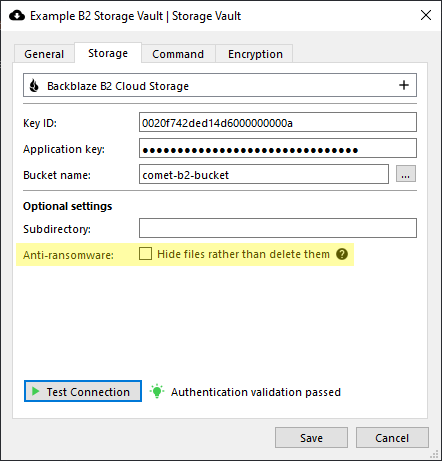
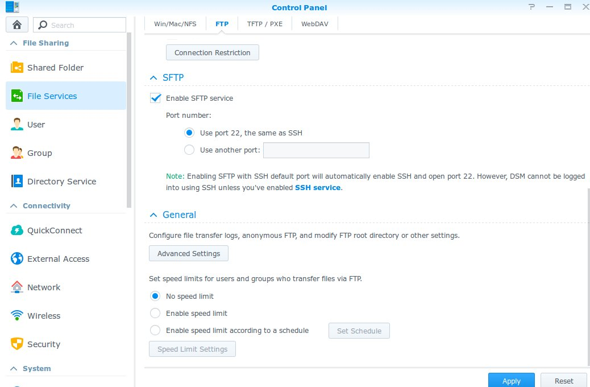
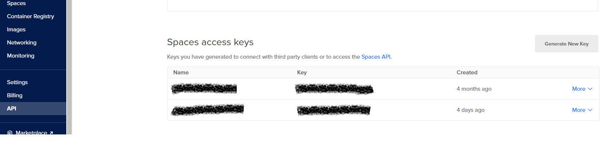

# Storage configuration

## Overview

This document describes the storage locations available in Comet. The information applies to both (A) configuring a data storage location in Comet Server, and (B) configuring a Storage Vault location for a Comet Backup user (either locally in the Comet desktop client, or remotely via the Comet Server web interface).

There is a unified storage model across both Comet Server and the Comet Backup client. This means that you can use any of the supported storage locations as a data location for a Storage Role Comet Server; or, you can configure a Storage Vault in Comet Backup to enable backing up to any of the supported storage locations.

The former allows you to leverage cloud resources while still providing a completely opaque front to your customers. The latter may be more efficient and avoids double-handling the bandwidth.

### Virtual storage locations

As well as physical storage locations (e.g. local disk, an SFTP server, or Amazon S3), Comet also has a number of virtual storage locations available. These virtual storage locations may combine aspects of physical storage locations in order to offer additional features.

### Utilizing Cloud Storage with Comet

Comet supports any S3-compatible cloud storage provider. The cloud storage provider can be configured at the Comet Server level, or at the client level. It is recommended to setup cloud storage at the [client level](https://docs.cometbackup.com/latest/installation/comet-server-configuration#configure-a-requestable-storage-vault-to-backup-directly-to-a-cloud-provider) for better performance.

#### Utilizing cloud storage at the **client level** (direct-to-cloud)

The backup data will go directly from the desktop client to the cloud storage provider. The cloud storage credentials will be exposed; even though the information is hidden in the Comet Backup client GUI, the customer could still discover it by network analysis or with a software debugger.

It's possible to use the direct-to-cloud method as a [requestable Storage Vault](https://docs.cometbackup.com/latest/installation/comet-server-configuration#authentication-role-request-storage-vault). This means that you only have to setup your cloud provider details once, and then request Storage Vaults when required. Comet will manage the data within the cloud provider's bucket, and generate unique sub-directory level access keys per Storage Vault to minimize the impact this could have if the credentials are acquired.

Direct-to-cloud also applies for custom Storage Vaults; ensure credentials are exclusive to the user, i.e. generated per-user credentials with separate buckets.

[Video tutorial](https://docs.cometbackup.com/latest/installation/comet-server-configuration#configure-a-requestable-storage-vault-to-backup-directly-to-a-cloud-provider)

#### Utilizing cloud storage at the **Comet Server level**

The backup data will pass through the Comet Server first and then the server will upload the data to the cloud storage provider (in memory). Cloud storage credentials won't be exposed to the client using this method. If your Comet Server is hosted in the same region as the cloud storage account, this may or may not have zero-rated bandwidth cost.

This method can be configured at the [Storage Role](https://docs.cometbackup.com/latest/installation/comet-server-configuration#storage-role) location on your Comet Server's Settings page. When setting up a Storage Vault for an account, simply assign it a [requestable Storage Vault](https://docs.cometbackup.com/latest/installation/comet-server-configuration#authentication-role-request-storage-vault). Your Comet Server will automatically create subdirectories to store the data for each new Storage Vault.

When using cloud storage in Comet Server as the Storage Role, the upload stream is proxied through to the cloud storage account (if possible), or buffered in memory. No data touches the local disk (no IOPS penalty). However, under memory pressure, the operating system may write to the swap file in proportion to the transfer load.

## Available storage locations

### Local Path

Data will be stored on the local filesystem.

#### Configuration

The following configuration options are available:

| Option     | Requirement | Description            |
| ---------- | ----------- | ---------------------- |
| Local Path | Mandatory   | The path to store data |

#### Simultaneous connections

In this mode, Comet does not place a limit on the number of simultaneous accesses to the storage.

#### Windows

Some versions of Windows have a limit of 255 characters in a path name. As of Comet Server 2.8.6, Comet works around this issue, so there is no restriction on the path length that you use for local storage.

If the storage path is a mapped network drive, then ensure that you consider any path restrictions on both the mapped drive and its source drive.

### Comet Server Storage Role Bucket

_In the Comet Backup client application, this option appears under a rebranded name._

Comet Server includes the "Storage Role" microservice. The Storage Role is an object storage system; you can create any number of "buckets", each with a secret authorization key, which can be used to store and retrieve structured data from the bucket.

A Storage Role Bucket is a supported data storage location for a Comet Backup Storage Vault. In the interest of preventing confusion, Comet Server does not accept using another Storage Role Bucket as a data storage location; if you want to store data from one Comet Server on another physical Comet Server, consider enabling server replication instead.

#### Configuration

| Option     | Requirement | Description                                                    |
| ---------- | ----------- | -------------------------------------------------------------- |
| Hostname   | Mandatory   | The URL of the Comet Server (Storage Role) hosting this bucket |
| Bucket ID  | Mandatory   | The name of the bucket                                         |
| Bucket Key | Mandatory   | The secret key, to authorize bucket access                     |

#### Simultaneous connections

Comet Backup makes up to 10 simultaneous connections to the Comet Server Storage Role.

If multiple operations are running simultaneously in Comet Backup, the number of connections may be higher.

### SFTP

Data will be stored on an SFTP server, such as OpenSSH.

#### Configuration

The following configuration options are available:

| Option             | Requirement                                           | Description                                                                                                                                                                                                                   |
| ------------------ | ----------------------------------------------------- | ----------------------------------------------------------------------------------------------------------------------------------------------------------------------------------------------------------------------------- |
| Address            | Mandatory                                             | The hostname for the SFTP server. You may specify a port by adding a `:22` suffix. The default port is `22`.                                                                                                                  |
| Username           | Mandatory                                             | The username to log in to the SFTP server.                                                                                                                                                                                    |
| Remote path        | Optional                                              | A remote path or subdirectory where data will be stored on the SFTP server. If the path starts with `/`, it is an absolute path. If the path does not start with `/`, the path is relative to the SFTP user's home directory. |
| Authentication     | Mandatory                                             | The authentication type to log in to the SFTP server. Must be one of `Native`, `Password`, or `Private key`. In Native mode, the system OpenSSH configuration is used to log in to the server.                                |
| Password           | Required when Authentication is `Password`            | The account password.                                                                                                                                                                                                         |
| Private key        | Required only when Authentication is `Private key`    | The account private key, unencrypted, in OpenSSH format.                                                                                                                                                                      |
| Verification       | Required only when Authentication is not `Native`     | Whether to verify host keys for the SFTP server. Must be one of `Native`, `Allow any host key`, or `Custom path to known_hosts file`. In Native mode, the system OpenSSH configuration is used to check known hosts.          |
| `known_hosts` file | Required only when Verification is `Custom path` only | A local file path, used to keep track of SFTP server host keys.                                                                                                                                                               |

#### Simultaneous connections

During a job, Comet Backup performs up to 10 simultaneous actions upon an SFTP destination.

If multiple operations are running simultaneously to an SFTP Storage Vault in Comet Backup, the number of network connections may be higher.

### FTP

Data will be stored on an FTP server, such as FileZilla Server or ProFTPd.

**WARNING:** The FTP protocol has a number of inherent limitations, making this storage type a "last resort" for accessing certain remote data locations. If possible, you may achieve better performance and connectivity by using an alternative server, such as SFTP or the "Local Path" type over a mounted SMB or NFS share.

#### Configuration

The following configuration options are available:

| Option                     | Requirement                                                 | Description                                                                                                 |
| -------------------------- | ----------------------------------------------------------- | ----------------------------------------------------------------------------------------------------------- |
| Address                    | Mandatory                                                   | The hostname for the FTP server. You may specify a port by adding a `:21` suffix. The default port is `21`. |
| Security                   | Mandatory                                                   | The FTP over TLS (FTPS) mode.                                                                               |
| Username                   | Mandatory                                                   | The username to log in to the FTP server.                                                                   |
| Password                   | Mandatory                                                   | The account password.                                                                                       |
| Use default home directory | Optional                                                    | Whether to store data in the FTP user's home directory.                                                     |
| Custom directory           | Required only when `Use default home directory` is disabled | A remote path to store data in. Paths are relative unless anchored with a leading `/`.                      |
| Connections                | Mandatory                                                   | The number of simultaneous FTP connections. The defalut connection limit is 5.                              |
| Accept invalid SSL         | Optioinal                                                   | Whether to accept invalid SSL Certificate from the FTP server.                                              |

#### Simultaneous connections

The number of simultaneous connections can be configured for the FTP server (default 5).

If multiple operations are running simultaneously to an FTP Storage Vault in Comet Backup, the number of network connections may be higher.

### Amazon S3

Data will be stored in an Amazon S3 bucket.

With Amazon S3, bucket names are globally unique across all of the standard regions, so it's not necessary to specify which region the bucket is contained in (e.g. `us-east-1`, `eu-central-1`) as this can be determined automatically.

If you specify a bucket name that does not exist, Comet will attempt to create it automatically in the default `US East (N. Virginia)` region.

It's possible to connect to Amazon S3 using the "S3-compatible" storage type, however, a dedicated option is available owing to the popularity of this service.

Comet supports Amazon S3 since the very first release.

#### Configuration

The following configuration options are available:

| Option       | Requirement | Description                                                                                                                                               |
| ------------ | ----------- | --------------------------------------------------------------------------------------------------------------------------------------------------------- |
| Access key   | Mandatory   | The access key for the Amazon S3 account                                                                                                                  |
| Secret key   | Mandatory   | The secret key for the Amazon S3 account                                                                                                                  |
| Bucket       | Mandatory   | The globally unique name of the storage bucket                                                                                                            |
| Subdirectory | Optional    | A prefix to add to all stored blobs. This may be useful to isolate Comet's data within the bucket if the bucket is being shared with another application. |

#### Simultaneous connections

Comet makes up to 10 network connections to the Amazon S3 server.

If multiple operations are running simultaneously to an Amazon S3 Storage Vault in Comet Backup, the number of network connections may be higher.

### Amazon S3 (China)

Data will be stored in an Amazon China S3 bucket.

Most people have learned that an S3 bucket name must be unique across all regions in AWS, but this does not include the AWS China Region. Due to its special status you can have one bucket in the China region and one in a global region which both use the same name. The current avaiable Amazon China regions are `China (Beijing) Isolated Region` and `China (Ningxia) Isolated Region`.

It's possible to connect to Amazon China S3 using the "S3-compatible" storage type, however, a dedicated option is available owing to the popularity of this service.

#### Configuration

The following configuration options are available:

| Option       | Requirement | Description                                                                                                                                               |
| ------------ | ----------- | --------------------------------------------------------------------------------------------------------------------------------------------------------- |
| Region       | Mandatory   | The endpoint for accessing Amazon China S3                                                                                                                |
| Access key   | Mandatory   | The access key for the Amazon China S3 account                                                                                                            |
| Secret key   | Mandatory   | The secret key for the Amazon China S3 account                                                                                                            |
| Bucket       | Mandatory   | The globally unique name of the storage bucket                                                                                                            |
| Subdirectory | Optional    | A prefix to add to all stored blobs. This may be useful to isolate Comet's data within the bucket if the bucket is being shared with another application. |

#### Simultaneous connections

Comet makes up to 10 network connections to the Amazon China S3 server.

If multiple operations are running simultaneously to an Amazon China S3 Storage Vault in Comet Backup, the number of network connections may be higher.

### Google Cloud Storage

Google Cloud Storage is an S3-compatible storage product within the Google Cloud Platform.

It's possible to connect to Google Cloud Storage using the "S3-compatible" storage type, however, a dedicated option is available owing to the popularity of this service.

You can retrieve credentials under the "Interoperability" section of the Google Cloud Platform web interface.

#### Configuration

| Option       | Requirement | Description                                                                                                                                               |
| ------------ | ----------- | --------------------------------------------------------------------------------------------------------------------------------------------------------- |
| Access key   | Mandatory   | The access key for the Google Cloud Platform account                                                                                                      |
| Secret key   | Mandatory   | The secret key for the Google Cloud Platform account                                                                                                      |
| Bucket       | Mandatory   | The globally unique name of the storage bucket                                                                                                            |
| Subdirectory | Optional    | A prefix to add to all stored blobs. This may be useful to isolate Comet's data within the bucket if the bucket is being shared with another application. |

#### Simultaneous connections

Comet makes up to 10 network connections to the Google Cloud Storage server.

If multiple operations are running simultaneously to a Google Cloud Storage Storage Vault in Comet Backup, the number of network connections may be higher.

### S3-compatible

The protocol for object storage on Amazon S3 eventually became widespread enough to be called a pseudo-standard. A number of alternative storage providers offer S3-compatible object storage, in order to interoperate with the large body of available software and services surrounding this pseudo-standard.

A number of commercial storage providers offer an S3-compatible API. For more information about S3-compatible cloud storage providers, please see the "Cloud Storage Providers" document.

Alternatively, you can run your own S3-compatible storage server as a replacement for Comet Server's Storage Role. A number of server software packages are available for this purpose, such as

- [Minio](https://www.minio.io/)
- [OpenStack Swift](https://docs.openstack.org/developer/swift/)
- [Ceph Object Store](http://ceph.com/ceph-storage/object-storage/)
- [OpenIO](http://www.openio.io/)
- [LeoFS](https://leo-project.net/leofs/)
- [Pithos](http://pithos.io/) on [Apache Cassandra](http://cassandra.apache.org/)
- [Scality Zenko CloudServer](https://www.zenko.io/) (formerly Scality S3 Server)
- [SeaweedFS](https://github.com/chrislusf/seaweedfs)
- Read more on [Wikipedia](https://en.wikipedia.org/wiki/Amazon_S3#S3_API_and_competing_services)

#### API Compatibility

Comet uses S3's streaming APIs to improve performance. You should ensure that any S3-compatible server implements streaming APIs in order to maintain compatibility.

In late August 2017, the S3-compatible storage provider [Wasabi](https://wasabi.com/) added support for S3's streaming APIs, and is now compatible with all versions of Comet Backup.

#### Configuration

| Option                     | Requirement | Description                                                                                                                                     |
| -------------------------- | ----------- | ----------------------------------------------------------------------------------------------------------------------------------------------- |
| Hostname                   | Mandatory   | The hostname for the S3-compatible server                                                                                                       |
| Region                     | Optional    | Custom region for the S3 endpoint                                                                                                               |
| Access key                 | Mandatory   | The access key for your user account                                                                                                            |
| Secret key                 | Mandatory   | The secret key for your user account                                                                                                            |
| Bucket                     | Mandatory   | The bucket in which to store all data                                                                                                           |
| Subdirectory               | Optional    | A prefix to apply to all objects stored in the bucket                                                                                           |
| Use encrypted transmission | Optional    | Whether to access the S3-compatible server using the HTTPS protocol. Data is encrypted and authenticated regardless of whether HTTPS is in use. |

#### Simultaneous connections

Comet makes up to 10 network connections to the S3-compatible Storage server.

If multiple operations are running simultaneously to an S3-compatible Storage Vault in Comet Backup, the number of network connections may be higher.

### Wasabi

Wasabi Cloud Storage is an S3-compatible storage product.

It's possible to connect to Wasabi Cloud Storage using the "S3-compatible" storage type, however, a dedicated option is available owing to the popularity of this service.

You can retrieve your access keys under the hamburger button on the top left section and then clicking on **Access Keys**

#### Configuration

| Option       | Requirement | Description                                                                                                                                               |
| ------------ | ----------- | --------------------------------------------------------------------------------------------------------------------------------------------------------- |
| Access key   | Mandatory   | The access key for the Wasabi Cloud Storage account                                                                                                       |
| Secret key   | Mandatory   | The secret key for the Wasabi Cloud Storage account                                                                                                       |
| Bucket       | Mandatory   | The globally unique name of the storage bucket                                                                                                            |
| Subdirectory | Optional    | A prefix to add to all stored blobs. This may be useful to isolate Comet's data within the bucket if the bucket is being shared with another application. |

#### Simultaneous connections

Comet makes up to 10 network connections to the Wasabi Cloud Storage server.

If multiple operations are running simultaneously to a Wasabi Cloud Storage Storage Vault in Comet Backup, the number of network connections may be higher.

#### Immutability / Anti-Ransomware

If malicious software gains access to the access key and secret key used by Comet, it would be able to delete files within the Wasabi storage location. Comet is not able to defend against misuse of these credentials - however, the Wasabi storage platform does offers multiple features for defending against this:

**[Compliance mode](https://wasabi.com/wp-content/themes/wasabi/docs/User_Guide/topics/Enabling_Compliance.htm)**

Comet does not support the Wasabi Compliance Mode. Comet needs to have read/write access to the backups, and Compliance Mode will prevent this.

Enabling Compliance Mode, even if disabling afterwards, may have unwanted consequences, and therefore enabling Compliance Mode is not recommended.

**[Object Locking](https://wasabi.com/object-lock/)**

Comet does not support Object Lock. Comet never modifies a file after creation, and almost all files are named after their SHA256 hash to reinforce this immutability; however, Comet does require the regular ability to delete files (such as for index rollup, retention passes, lock file management) and Object Lock will prevent this. It is not currently suitable for use with Comet.

**[Bucket Versioning](https://wasabi.com/wp-content/themes/wasabi/docs/User_Guide/topics/Enabling_Disabling_Bucket_Versioning.htm)**

Comet does support Bucket Versioning. It is safe to enable this feature in Wasabi for use with Comet. No additional configuration is required within Comet itself.

When you enable Bucket Versioning for a Wasabi bucket, each file stored in that bucket is redefined to comprise of a stack of versions. In this mode, when Comet (or any malicious software using Comet's access key / secret key pair) goes to delete a file, then instead of it being actually deleted, a "delete marker" or "tombstone version" is placed on top of the file's version stack.

A "tombstoned" file generally seems to have been deleted; it is not available via regular use of the access key. The file will appear to be missing when viewing a subdirectory and will not be available for download. However, such files can later be undeleted by removing the tombstone from on top of the version stack.

When using Bucket Versioning there are some further key points to be aware of:

- Cost
  - Wasabi will continue to charge you for the ongoing storage of deleted files, until the entire version-stack is deleted.
- Regaining access to deleted files
  - You can regain access to deleted files by removing the "tombstone" from each of the version stacks.
  - Because Comet never modifies a file after creation, one way to achieve this is to delete the top-most version from all files that have multiple versions in their version stack. This may cause some excess files to reappear, but a single retention pass and/or Unlock operation should resolve any issues.
  - Another way to achieve this is to use timestamp metadata on each files' version stack to roll back the versioned-bucket to a specific point in time.
  - This operation can be performed in bulk from the command-line via an S3 command-line tool such as [Minio Client](https://docs.min.io/minio/baremetal/reference/minio-cli/minio-mc.html), [awscli](https://aws.amazon.com/cli/), or [s3cmd](https://s3tools.org/s3cmd): e.g.
    - `mc rm --recursive --rewind "2021.11.29"` ([Read more](https://docs.min.io/minio/baremetal/reference/minio-cli/minio-mc/mc-rm.html#roll-object-back-to-previous-version))
- Lifecycle policy
  - To avoid ever-increasing costs, it is important to periodically delete tombstoned files in order to reduce costs. For instance, you may want to fully delete a file from Wasabi 90 days after it has been tombstoned.
    - This extra time period is in addition to the retention policy configured within Comet itself.
  - _(As of November 2021)_ Wasabi does not currently have built-in retention settings for the Bucket Versioning feature. It does have built-in retention settings for the Compliance Mode feature and we do expect this to become available for Bucket Versioning in the near future.
  - Until that time, you can periodically prune tombstoned files either
    - Manually, by following Wasabi's instructions at [https://wasabi-support.zendesk.com/hc/en-us/articles/360042534431-How-do-I-delete-old-object-versions-](https://wasabi-support.zendesk.com/hc/en-us/articles/360042534431-How-do-I-delete-old-object-versions-) ; or
    - In bulk, by running Wasabi's example python script at [https://wasabi-support.zendesk.com/hc/en-us/articles/360045760851-How-do-I-mass-delete-current-and-non-current-objects-inside-a-bucket-](https://wasabi-support.zendesk.com/hc/en-us/articles/360045760851-How-do-I-mass-delete-current-and-non-current-objects-inside-a-bucket-)
- Permissions
  - The additional security of this model is predicated on Comet's access key / secret key not having permission to delete entire version stacks (`s3:DeleteObjectVersion`), and only being able to tombstone a file (`s3:DeleteObject`).
  - If you use the Requestable Storage Vault feature in Comet Server to automatically provision new access key / secret key pairs for each customer, they only have the more restricted `s3:DeleteObject` API available. For a versioning-enabled bucket, this means that deletions will only tombstone a file instead of deleting the entire version stack.
  - If you use the root Wasabi key, it has permission to delete entire version stacks. Although Comet will still only call the `s3:DeleteObject` API, to tombstone a file instead of deleting it, any malicious user who gains access to these keys would still be able to delete the entire version stack via the broader `s3:DeleteObjectVersion` API, meaning that you do not gain any additional security from enabling this feature.
  - If you are declaring a custom IAM policy document, please consider taking the above detail into account in the `Action` array.

### Backblaze B2 Cloud Storage

B2 is a low-cost storage offering from Backblaze.

BackBlaze B2 supports multiple Application Keys for different access permission to B2 Buckets. You can configure Comet to use either the Master Application Key, or a per-bucket Application Key.

#### Configuration

| Option                             | Requirement | Description                                                                                                                                                                                                                                                                                                                                                                           |
| ---------------------------------- | ----------- | ------------------------------------------------------------------------------------------------------------------------------------------------------------------------------------------------------------------------------------------------------------------------------------------------------------------------------------------------------------------------------------- |
| Application key ID / Account ID    | Mandatory   | If you are using the Master Application Key, enter the Account ID for your Backblaze B2 account here. For a per-bucket Application Key, enter the Application Key ID.                                                                                                                                                                                                                 |
| Application key                    | Mandatory   | Enter your Master Application Key or for per-bucket, enter the Application key (this is shown when creating the Application key).                                                                                                                                                                                                                                                     |
| Bucket name                        | Mandatory   | The bucket in which to store all data                                                                                                                                                                                                                                                                                                                                                 |
| Subdirectory                       | Optional    | A prefix to apply to all objects stored in the bucket                                                                                                                                                                                                                                                                                                                                 |
| Hide files rather than delete them | Optional    | When enabled, Comet will hide files rather than deleting them from the bucket when deleting old backups. This setting should only be enabled alongside bucket lifecycle rules which remove hidden files after a certain length of time; see [Hiding deleted files](https://docs.cometbackup.com/latest/installation/storage-configuration#hiding-deleted-files) for more information. |

#### Alternative connectivity

As an alternative, you can also access Backblaze B2 Cloud Storage using the "S3-compatible" storage type if you run a S3-to-B2 gateway server, such as [Minio](https://blog.minio.io/experimental-amazon-s3-api-support-for-backblaze-b2-cloud-storage-service-685e0f35a6d7).

#### Hiding deleted files

Comet supports hiding files which would be deleted from a B2 bucket rather than deleting them. This setting provides improved protection against ransomware; when this setting is enabled, Comet can use keys which do not have the B2 `deleteFiles` capability (see [Application Keys](https://www.backblaze.com/b2/docs/application_keys.html#capabilities)) and thus cannot delete files from the bucket, preventing a compromised key from being used to delete backed up data. While this setting can be enabled and used with a key that _does_ have the `deleteFiles` capability, it does not offer improved protection against ransomware in this configuration, as if compromised the key can still be used to delete files.

This setting should only be enabled alongside bucket lifecycle rules which remove hidden files after a certain length of time. If no such rule is enabled, Comet will not delete old files and the bucket size can grow indefinitely. See the [B2 Lifecycle Rules](https://www.backblaze.com/b2/docs/lifecycle_rules.html) documentation for more information on setting up appropriate rules.

When this setting is enabled, [Requestable Storage Vaults](https://docs.cometbackup.com/latest/installation/comet-server-configuration#configure-a-requestable-storage-vault-to-backup-directly-to-a-cloud-provider) will automatically generate keys which do not have the `deleteFiles` capability. It is safe to toggle this setting on or off for an existing Requestable Storage Vault; future keys generated by the Requestable Storage Vault will reflect the changed setting, while existing requested Storage Vaults and keys will be unaffected and will continue to use the setting value from the time at which the Storage Vault was requested.

Comet does not automatically detect the capabilities of the key that is used for a storage vault. If a storage vault that uses a key without the `deleteFiles` capability has this option toggled off, it will attempt and fail to delete files in future operations. To remedy this, when this option is toggled off the vault should also be updated to use a key with the `deleteFiles` capability.

#### Backblaze B2 Fireball

To perform a backup to the Backblaze Fireball, connect your Backblaze Fireball to your network or computer and ensure the **SFTP** is enabled.

On the Comet client in the **Account** tab, select **\+ Add Storage Vault** and click **Custom**.

Create a name and in the **Storage** tab, select the **SFTP** option. Enter the Fireball’s address, path, username and password (change **Authentication** to **Password**).

Now you can backup to Backblaze Fireball.

After you have backed up the data to the Fireball, follow Backblaze’s instructions to courier the Fireball to their datacentre. You will then need to update the storage vault details so that it points to the Backblaze B2 bucket.

### Azure Blob Storage

Azure Blob Storage is a public-cloud object storage service operated by Microsoft under the Azure branding.

#### Compatible implementations

Comet's support for Azure Blob Storage can also be used to connect to third-party storage services that are compatible with the Azure Blob Storage API.

You can enter a custom "Realm Address" in the configuration to use a third-party storage service.

Comet is compatible with storage providers based on

- Microsoft Azure Stack
- [Azurite](https://github.com/arafato/azurite)
- Microsoft Azure Storage Emulator _(not recommended for production data storage)_

#### Alternative connectivity

You can access Azure Blob Storage using the "S3-compatible" storage type if you run a S3-to-Azure gateway server, such as [Minio](https://github.com/minio/minio/blob/master/docs/gateway/azure.md).

#### Configuration

| Option        | Requirement | Description                                                                                                                                            |
| ------------- | ----------- | ------------------------------------------------------------------------------------------------------------------------------------------------------ |
| Realm address | Mandatory   | The hostname or URL for the Azure Blob Storage realm (usually `core.windows.net`). Use a scheme-qualified URI (e.g. `http://`) in order to toggle TLS. |
| Account name  | Mandatory   | The name of your user account                                                                                                                          |
| Account key   | Mandatory   | The key for your user account                                                                                                                          |
| Container     | Mandatory   | The container in which to store all data                                                                                                               |
| Subdirectory  | Optional    | A prefix to apply to all objects stored in the container                                                                                               |

#### Simultaneous connections

During a job, Comet Backup performs up to 10 simultaneous actions upon an Azure Blob Storage destination.

If multiple operations are running simultaneously to a Azure Blob Storage -based Storage Vault in Comet Backup, the number of network connections may be higher.

### Filebase

Filebase Cloud Storage is an S3-compatible storage product powered by Blockchain.

It's possible to connect to Filebase using the "S3-compatible" storage type, however, a dedicated option is available owing to the popularity of this service.

To perform a backup to the Filebase, on the Comet client in the **Account** tab, select **\+ Add Storage Vault** and click **Custom**. Create a name and in the **Storage** tab, click the **+** button.

Select **Filebase** option and click **OK** button.

Enter the Filebase **Access key**, **Secret key** and **Bucket**. You can test the connectivity to Filebase storage by clicking the **Test Connection** button.

You can retrieve your access keys by clicking on **Access Keys** on the left section

#### Configuration

| Option       | Requirement | Description                                                                                                                                               |
| ------------ | ----------- | --------------------------------------------------------------------------------------------------------------------------------------------------------- |
| Access key   | Mandatory   | The key for the Filebase Cloud Storage account                                                                                                            |
| Secret key   | Mandatory   | The secret for the Filebase Cloud Storage account                                                                                                         |
| Bucket       | Mandatory   | The globally unique name of the storage bucket                                                                                                            |
| Subdirectory | Optional    | A prefix to add to all stored blobs. This may be useful to isolate Comet's data within the bucket if the bucket is being shared with another application. |

#### Simultaneous connections

Comet makes up to 10 network connections to the Filebase Cloud Storage server.

If multiple operations are running simultaneously to a Filebase Cloud Storage Storage Vault in Comet Backup, the number of network connections may be higher.

### IDrive e2

IDrive e2 Cloud Storage is a S3-compatible storage product.

It's possible to connect to IDrive e2 using the "S3-compatible" storage type, however, a dedicated option is available owing to the popularity of this service.

Access keys can be retrieved by navigating **Access Keys** on the left menu and then clicking on **Create Access Key**

#### Configuration

Option

Requirement

Description

Access key

Mandatory

The access key id for the IDrive e2 Cloud Storage account

Secret key

Mandatory

The secret access key for the IDrive e2 Cloud Storage account

Bucket

Mandatory

The globally unique name of the storage bucket

Subdirectory

Optional

A prefix to add to all stored blobs. This may be useful to isolate Comet's data within the bucket if the bucket is being shared with another application.

#### As Storage template

IDrive e2 can be configured as a storage template. Storage vault's created from IDrive e2's template will create a separate credentials and private bucket on the same IDrive e2 account.

| Option     | Requirement | Description                                                                |
| ---------- | ----------- | -------------------------------------------------------------------------- |
| Access key | Mandatory   | The access key id with at least write access across all buckets in account |
| Secret key | Mandatory   | The secret access key associated with the access key                       |

#### As Constellation remote server

The IDrive e2 credentials entered for Constellation will be used to clean up any unreferenced buckets and account keys previously used in a user's storage vault. This does not recognize IDrive e2 buckets behind a Comet Server storage role. It is advised to have a separate account for user buckets and another for the storage role to avoid Constellation deleting buckets used for the Comet Server storage role.

### Storadera

Storadera Cloud Storage is an S3-compatible storage product.

It's possible to connect to Storadera using the "S3-compatible" storage type, however, a dedicated option is available owing to the popularity of this service.

You can retrieve your access keys by navigating **Keys** on the top section and then clicking on **Create**.

#### Configuration

| Option       | Requirement | Description                                                                                                                                               |
| ------------ | ----------- | --------------------------------------------------------------------------------------------------------------------------------------------------------- |
| Access key   | Mandatory   | The access key id for the Storadera Cloud Storage account                                                                                                 |
| Secret key   | Mandatory   | The secret access key for the Storadera Cloud Storage account                                                                                             |
| Bucket       | Mandatory   | The globally unique name of the storage bucket                                                                                                            |
| Subdirectory | Optional    | A prefix to add to all stored blobs. This may be useful to isolate Comet's data within the bucket if the bucket is being shared with another application. |

#### Simultaneous connections

Comet makes up to 10 network connections to the Storadera Cloud Storage server.

If multiple operations are running simultaneously to a Storadera Cloud Storage Storage Vault in Comet Backup, the number of network connections may be higher.

### Digital Ocean Spaces

Digital Ocean Spaces is an S3-compatible storage product with a built-in CDN. The current avaiable Digital Ocean Spaces regions are `San Francisco Region`, `Frankfurt Region`, `Amsterdam Region`, `New York Region` and `Singapore Region`.

It's possible to connect to Digital Ocean Spaces using the "S3-compatible" storage type, however, a dedicated option is available owing to the popularity of this service.

You can retrieve your access keys by navigating **API** on the left section and then clicking on **Generate New Key** on the Space access keys section.

#### Configuration

| Option       | Requirement | Description                                                                                                                                               |
| ------------ | ----------- | --------------------------------------------------------------------------------------------------------------------------------------------------------- |
| Access key   | Mandatory   | The key for the Digital Ocean Spaces                                                                                                                      |
| Secret key   | Mandatory   | The secret for the Digital Ocean Spaces                                                                                                                   |
| Bucket       | Mandatory   | The globally unique name of the storage bucket                                                                                                            |
| Subdirectory | Optional    | A prefix to add to all stored blobs. This may be useful to isolate Comet's data within the bucket if the bucket is being shared with another application. |

#### Simultaneous connections

Comet makes up to 10 network connections to the Digital Ocean Spaces server.

If multiple operations are running simultaneously to a Digital Ocean Storage Vault in Comet Backup, the number of network connections may be higher.

### Catalyst Cloud Object Storage

Catalyst Cloud Object Storage is an S3-compatible storage product based in New Zealand. The Catalyst Cloud has three regions (separate geographical locations) that can operate independently of each other. Each region provides local redundancy and high availability for increased service levels. The current avaiable regions are `New Zealand Hamilton Region`, `New Zealand Porirua Region` and `New Zealand Wellington Region`.

It's possible to connect to Catalyst Cloud Object Storage using the "S3-compatible" storage type, however, a dedicated option is also available.

You can retrieve your access keys by navigating **API Access** on the left section and then clicking on **Create EC2 Credentials**.

#### Configuration

| Option       | Requirement | Description                                                                                                                                               |
| ------------ | ----------- | --------------------------------------------------------------------------------------------------------------------------------------------------------- |
| Access key   | Mandatory   | The EC2 Access Key for the Catalyst Cloud account                                                                                                         |
| Secret key   | Mandatory   | The EC2 Secret Key for the Catalyst Cloud account                                                                                                         |
| Bucket       | Mandatory   | The globally unique name of the storage bucket                                                                                                            |
| Subdirectory | Optional    | A prefix to add to all stored blobs. This may be useful to isolate Comet's data within the bucket if the bucket is being shared with another application. |

#### Simultaneous connections

Comet makes up to 10 network connections to the Catalyst Cloud server.

If multiple operations are running simultaneously to a Catalyst Cloud Storage Vault in Comet Backup, the number of network connections may be higher.

### Cynny Space The SwARM

Cynny Space The SwARM is an S3-compatible storage product based on ARM CPU. The current avaiable regions are `Italy Isolated Region 1` and `Italy Isolated Region 2`.

It's possible to connect to Cynny Space The SwARM using the "S3-compatible" storage type, however, a dedicated option is also available.

You can retrieve your access keys by navigating **S3 Access** on the left section.

#### Configuration

| Option       | Requirement | Description                                                                                                                                               |
| ------------ | ----------- | --------------------------------------------------------------------------------------------------------------------------------------------------------- |
| Access key   | Mandatory   | The S3 compatible API access key for the Cynny Space account                                                                                              |
| Secret key   | Mandatory   | The S3 secret key for the Cynny Space account                                                                                                             |
| Bucket       | Mandatory   | The globally unique name of the storage bucket                                                                                                            |
| Subdirectory | Optional    | A prefix to add to all stored blobs. This may be useful to isolate Comet's data within the bucket if the bucket is being shared with another application. |

#### Simultaneous connections

Comet makes up to 10 network connections to the Cynny Space The SwARM server.

If multiple operations are running simultaneously to a Cynny Space Storage Vault in Comet Backup, the number of network connections may be higher.

### OpenStack Swift

OpenStack Swift is an open-source data storage system that can be implemented by a storage provider. A number of commercial storage providers using this system are listed on the "Cloud Storage Providers" document.

Comet's integration with OpenStack Swift also supports compatible implementations of the Swift protocol, such as [Ceph Object Store](http://ceph.com/ceph-storage/object-storage/).

#### Configuration

Your connection to OpenStack is authenticated using one of the following methods:

- Identity API v1 is a basic system available from all OpenStack providers.
- Identity API v2 introduced "Tenants", to isolate multiple users.
- Identity API v3 introduced "domains", as another layer of isolation. Additionally, Tenants were renamed to "Projects".

Comet automatically determines the API version to use based on the URL set in the "Auth Endpoint" field. For security reasons, we recommend using the highest possible API version that is supported by both Comet and your OpenStack provider.

| Option           | Requirement | Description                                                                                                                       |
| ---------------- | ----------- | --------------------------------------------------------------------------------------------------------------------------------- |
| Auth Endpoint    | Mandatory   | The URL for the OpenStack Auth server, including protocol (`http://` or `https://`). These URLs commonly end in `v1.0` or `v2.0`. |
| Username         | Mandatory   | The username for your account.                                                                                                    |
| API Key          | Mandatory   | The API key for your user account.                                                                                                |
| Container        | Mandatory   | The container in which to store all data. It will be created if it does not yet exist.                                            |
| Subdirectory     | Optional    | A prefix to apply to all objects stored in the container                                                                          |
| Domain Name      | Optional    | The domain name. _Applies to v3 only_                                                                                             |
| Region           | Optional    | The region to use (e.g. `LON` or `ORD`). If not specified, a region may be automatically selected. _Applies to v2 / v3_           |
| Tenant name      | Optional    | Name of the tenant/project. _Applies to v2 / v3_                                                                                  |
| Tenant ID        | Optional    | The ID of the tenant/project. _Applies to v2 / v3_                                                                                |
| Tenant Domain    | Optional    | Name of the tenant/project's domain, if it differs from the user domain. _Applies to v3 only_                                     |
| Trust ID         | Optional    | The ID of the trust _Applies to v3 only_                                                                                          |
| Container Policy | Optional    | The policy to use when creating the container, if it does not yet exist.                                                          |

#### Simultaneous connections

Comet makes up to 10 network connections to an OpenStack Swift server.

If multiple operations are running simultaneously to an OpenStack Swift Storage Vault in Comet Backup, the number of network connections may be higher.

### Spanned

The 'Spanned' storage location is a virtual location that pools disk space from multiple other storage locations. It is implemented similarly to a union filesystem, where all locations are viewed as one. Data files can be spread between all locations.

#### File placement strategy

Multiple file placement strategies are available in Comet.

##### Default (Automatic)

If multiple storage volumes are configured, then new data will be automatically written in a balanced way between applicable drives.

Comet must determine which volume to write to. New files are placed on one of the constituent targets in a way that is intended to balance the priorities of (A) storage space, (B) keeping disks busy, and (C) minimizing overheads associated with measuring disk free space and disk IOPS.

At first, when all volumes have a lot of free space, writes are randomly distributed evenly between all storage volumes. This strategy means that disk space is used roughly efficiently across all volumes, and all drives will simultaneously serve the writing load on the server, providing the maximum benefit.

Once any volume has less than a certain amount of free space, Comet gradually switches to a different strategy, in which it writes solely to a particular volumes with the most free space available. This means that the remaining disk space will be used efficiently, although only one drive at a time will service the writing load (all drives will still service the reading load).

It is not generally feasible to determine the free space available on a cloud storage provider. When spanning between local disks and cloud storage providers, cloud storage providers are preferred.

When using the Default file placement method, you can add a new spanned drive location at any time. This has the effect of increasing the space available for storage.

There is zero overhead when using the Spanned type with one single location. There is a small overhead when using multiple locations, as Comet must check each location to find any requested file.

##### Static locations

_(This feature is available in Comet 20.12.3 and later.)_

The default automatic Spanned file placement strategy puts files in any location that has free space. That means when Comet needs to get a file back, it has to check in all locations to find it, reducing performance.

"Static locations" is an alternative file placement strategy where files are consistently placed in one of the span targets based on the file name. Comet will immediately know where to look for any given filename.

The placement algorithm hashes the requested filename and dividing its integer hash between the number of total targets.

This has several limitations:

- This is only feasible for brand-new Span targets, since if you have an existing one, the files will be in any of the constituent targets, instead of exactly where Comet expects them
- It is not safe to add additional targets
- It is not safe to reorder the targets
- The targets should also all have roughly the same total free space, for the same reasons

If you are creating a brand new Spanned storage location, and you can abide by the above restrictions, this may provide higher performance.

If at any time you are no longer able to abide by the above restrictions (e.g. need to expand storage to an additional location) it is always safe to convert from "Static locations" into "Default" file placement, but not vice versa.

#### Using "Spanned" with Comet Server

When using the Spanned type as a storage location for a Comet Server, this allows your Storage Role server to virtually offer data that is hosted on a remote server (e.g. Amazon S3).

#### Cloud Failover

When using the Spanned type with Comet Server, you can achieve a best-performance scenario by configuring a Spanned storage with only a Local Path location, and then expanding to a cloud storage provider once local resources are exhausted. (This requires the "Default" file placement strategy.)

#### Simultaneous connections

Each constituent data location that comprises the Spanned data location is subject to its individual connection limit. There is no additional connection limit for Spanned data locations.

#### Rebalancing

The "Spanned" virtual storage location does not actively rebalance data between the underlying locations.

However, some rebalancing will happen passively, as retention passes will delete files from the old unbalanced layout, and new data is always written in a balanced way.

If you are using the "Default" file placement strategy, you may manually rebalance the constituent storage locations by moving files between storage locations. This operation is safe to perform live while Comet Server is running.

If you are using the "Static locations" file placement strategy, you may not rebalance the constituent storage locations.

#### Expanding available storage space by changing Storage Type to Span

Whilst the principle of adding a new Span Target to increase storage space already applies to all storage types, this guide will address the straight-forward addition of a single new hard drive to expand the storage of a Comet Server.

In the following example, the Comet Server has the Storage Role enabled, and currently stores data on an almost-full hard drive, which shows as "D:\\". A new hard drive has been attached to the Comet Server, and this new drive shows as "E:\\".

The steps to add this additional storage to the Comet Server so as to expand its storage space are as follows:

- Open the Settings page to the _Storage Role > Locations_ section
- _Choose where data will be stored_ will show the current type of storage, as well as the physical storage location.
- In this example, the type is `Local Path` and the path is "D:\\".
- Change the type from `Local Path` to `Spanned`.
- Add a Span Target, using the existing location used previously, i.e.: `Local Path` and "D:\\".
- Add a _new_ Span Target, using the new drive and location, e.g: `Local Path` and "E:\\"
- Leave the _File Placement Strategy_ as `Default`, as "D:\\" already has data stored on it.
- Click 'Save' at the top of the Settings page, and the Comet Server will restart.

If, after applying the changes, you experience issues with accessing your Comet Server, check your server logs for any errors related to storage, and edit the storage settings through the Comet Server Service Manager, or config file. It is possible to change from `Spanned` to a different storage type, such as `Local Path`, however, this is a potentially lengthy and complex process. Contact Support for more details.
