# User configuration

## Overview

An administrator can change user account properties, Protected Item, Storage Vault, Device, and Policy settings via the Comet Server web interface.

A user can change their own Protected Item and Storage Vault settings via the Comet Backup client application and the web interface.

The descriptions in this section apply to both situations.

## Profile

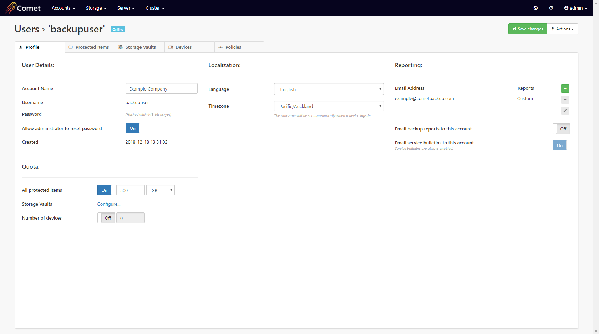

### Username

Usernames must be at least one character long (or at least six characters long in versions of Comet older than 21.9.10), using only the characters `a-z`, `A-Z`, `0-9`, underscore (`_`), period (`.`), at (`@`), and hyphen (`-`).

Usernames are case-sensitive.

#### Changes to username support

Certain versions of Comet expanded the list of characters allowed in usernames and changed the minimum username length. Usernames that are valid for newer versions of Comet may be invalid when used with older versions of Comet. This may impact certain scenarios including software downgrades and/or mixed-server-version replication.

If you have usernames that would be invalid under older versions of Comet, please take care to ensure that all your Comet infrastructure is upgraded past the point of conversion, to prevent any potential issues that may occur.

### Password

Passwords must be at least eight characters long.

The password must be on one line (no CR/LF bytes are permitted).

Any other characters are permitted, including spaces, special characters, symbols, and characters from international alphabets.

#### Allow administrator to reset password

Enabling this option allows the administrator to reset the user account's password. The feature may be used for account recovery if the password is forgotten.

If you have heightened privacy requirements, you may disable this feature to prevent an administrator from using this functionality. If this option is disabled, it cannot be remotely re-enabled by the administrator. A user account may verify that the feature is disabled from the Account tab in the Comet Backup desktop app.

The service provider may choose to enforce that the setting is always on, and that passwords can always be reset for account recovery. In that case, the customer may verify their privacy status by viewing the checkbox state from the Account tab in the Comet Backup desktop app.

#### Allow administrator to view file names

Enabling this option allows users of the Comet Server web interface to remotely control the Comet Backup desktop app, to

- browse filenames in past backup jobs
- browse files on the PC when configuring Protected Items; and
- browse folders on the PC when selecting a restore path.

If you have heightened privacy requirements, you may disable this feature to prevent an administrator from using this functionality. If this option is disabled, it cannot be remotely re-enabled by the administrator. A user account may verify that the feature is disabled from the Account tab in the Comet Backup desktop app.

The service provider may choose to enforce that the setting is always on, and that filenames can always be browsed remotely. In that case, the customer may verify their privacy status by viewing the checkbox state from the Account tab in the Comet Backup desktop app.

### Two-factor authentication for end-users

Two-factor authentication is available for end-users. TOTP is supported (administrator accounts may additionally use FIDO2 WebAuthn).

You can set up a TOTP code in the Comet Server web interface. If so, the TOTP code will also be required when using the Comet Backup desktop app.

**WARNING:** This is a limited-security feature only, protecting only (A) registering new devices; (B) opening the desktop app; and (C) logging in to the Comet Server web interface as an end user. Because backup jobs need to run unattended without 2FA prompting, this feature does not provide full 2FA protection in all cases.

### Language

The user is able to set their own language.

As of Comet 21.9.11, the following languages are supported:

| Language           | Language (English)    | Code    | Minimum version |
| ------------------ | --------------------- | ------- | --------------- |
| English            | English               | `en_US` |                 |
| Dansk              | Danish                | `da_DK` | \>= 21.9.11     |
| Deutsch            | German                | `de_DE` | \>= 17.9.2      |
| Español            | Spanish               | `es_ES` |                 |
| Français           | French                | `fr_FR` | \>= 17.9.2      |
| Hrvatski           | Croatian              | `hr_HR` | \>= 17.12.6     |
| Italiano           | Italian               | `it_IT` | \>= 17.9.0      |
| Nederlands         | Dutch                 | `nl_NL` | \>= 17.3.4      |
| Português (Brasil) | Portuguese (Brazil)   | `pt_BR` | \>= 17.3.2      |
| Português (Europa) | Portuguese (Europe)   | `pt_PT` | \>= 18.12.0     |
| Русский            | Russian               | `ru_RU` | \>= 18.5.0      |
| עברית‬             | Hebrew                | `he_IL` | \>= 18.6.0      |
| ภาษาไทย‬           | Thai                  | `th_TH` | \>= 21.9.10     |
| 中文 (繁體)        | Chinese (Traditional) | `zh_TW` | \>= 22.3.7      |

#### Help translate Comet

Our company is committed to making Comet available in multiple languages. Our staff mostly only speak English, so we contract translation companies to perform this work.

However, the best-quality translations come from our customers, who better understand the software and the backup industry. We would really appreciate any translation assistance you can offer.

If you want to correct a translation in Comet, or if you want to translate Comet into a new language, further information is available via [CometBackup/translations at GitHub](https://github.com/CometBackup/translations).

### Timezone

The Comet Backup client app resets the user's timezone automatically, to match the user's operating system timezone. An administrator can set the user's timezone to any valid IANA `tzdata` timezone. The default timezone for new accounts is always `Etc/UTC`.

The user's local timezone is used to calculate schedule times (e.g. a scheduled backup for "Friday 7 AM" means a different UTC instant depending on the customers' configured timezone).

### Email addresses

Comet Server has some built-in features to send email reports to customers. You can configure any number of email addresses for a user account.

Email addresses can be configured via Comet Server and via the Comet Backup client. An administrator can set an account policy to control whether users are allowed to modify their own email addresses.

#### Custom email reports

The default backup report is an immediate email as soon as any backup job finishes.

Comet supports customising the email reports received by customers.

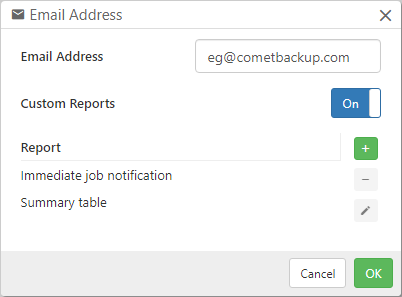

The following custom reports are available:

| Report type                | Available in | Schedule                             | Description                                 |
| -------------------------- | ------------ | ------------------------------------ | ------------------------------------------- |
| Immediate job notification | \>= 18.9.3   | Immediately when a job has completed | The report contains the full job log        |
| Summary table              | \>= 18.9.4   | Any schedule                         | A table of jobs matching your custom search |

Reports can be filtered to choose what jobs will be considered for the report. You can filter on a large number of criteria including but not limited to the job's type classification, status, start time, duration, Protected Item, and Storage Vault. For advanced queries, the search system supports boolean logic (AND/OR) and arbitrary-depth clause grouping.

You can send multiple reports for a single email address. This allows you to combine multiple report criteria.

For report templates allowing custom schedules, you can use any schedule supported by Comet's normal backup scheduler. Scheduled times are relative to each customer's configured local timezone.

##### Recipes

- **Terminology**

  - Size = the Protected Item's whole size. It is the amount of data that was protected by this backup job, the same sort of file-size on disk as shown when the end-client selects right-click -> 'properties' on the original data.
  - Uploaded = upload size.

- **Send jobs only on failure**

  - Report 1
    - Type: "Immediate job notification"
    - Filter: "Status" "not equal" "Success"

- **Send reports for different Protected Items to different email addresses**

  - Email address 1
    - Report 1
      - Type "Immediate job notification"
      - Filter: "Protected Item ID" "equal" "{one Protected Item}"
  - Email address 2
    - Report 1
      - Type "Immediate job notification"
      - Filter: "Protected Item ID" "equal" "{another Protected Item}"

- **Send only a daily summary of jobs**

  - Report 1
    - Type: "Summary table"
    - Schedule: Daily at 07:00
    - Filter: "Time since job start" "less or equal" "24 hours"

- **Send only a weekly summary of jobs, but, also send immediate notifications on failure**

  - Report 1
    - Type: "Immediate job notification"
    - Filter: "Status" "not equal" "Success"
  - Report 2
    - Type: "Summary table"
    - Schedule: Weekly on Friday at 12:00
    - Filter: "Time since job start" "less or equal" "7 days"

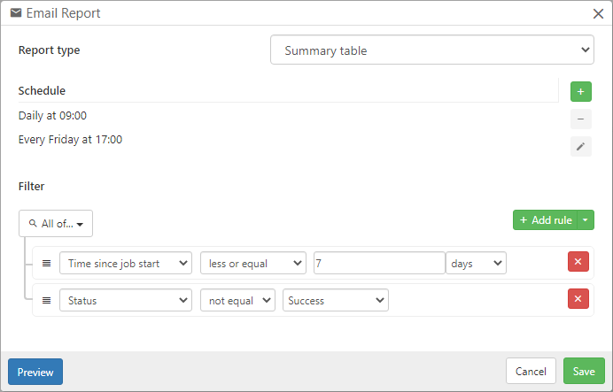

<iframe width="100%" height="440" src="https://www.youtube.com/embed/ZxguTdW1Fvs" title="Comet Backup - Custom Email Reports" frameborder="0" allow="accelerometer; autoplay; clipboard-write; encrypted-media; gyroscope; picture-in-picture" allowfullscreen></iframe>

### Quota

Comet Backup supports Quota restrictions based on different types of data measurements.

#### All Protected Items Quota

Protected Item quotas are applied to the total amount of data that a user is allowed to try to protect. The user will be unable to run a backup job that protects more data on disk than the quota level.

You can set a limit on the maximum size of all Protected Items in the user's account. If possible, the quota limits are checked before starting the backup. When a backup job is performed, the backup job will stop if it will exceed the quota.

Note: the Protected Item quota is the size-total of ALL the user-profile's Protected Items added together.

#### Device Limit

You can set a limit on the number of devices that may be registered into the user's account. If a user tries to log in to this account using a new device, the registration will fail with an error message.

#### Storage Vault quota

Storage Vault quotas are applied to the total amount of data that all users of a Storage Vault are allowed to store in the storage location. Similar to Protected Item quota, where possible, Storage Vault quotas are checked at the time of each backup attempt. For more information about Storage Vault quota, please see the [Storage Vault > Quota](https://docs.cometbackup.com/latest/installation/user-configuration#quota-storage-vault) section below.

### Suspending Accounts

An administrator is able to suspend user accounts in Comet Server. An administrator can suspend a user account by clicking the 'Actions' button and choosing the 'Suspend' option. You can unsuspend a suspended account in the same way.

A suspended user cannot log in to the Comet Backup client and cannot backup nor restore any data. A user is not able to un-suspend themselves.

The suspended account will continue to accrue charges for the period of the suspension. You must fully remove an account in order to prevent further charges from being applied. If a deleted account is later recreated with the same device IDs, the data has still been stored for that period of time, and services have been provided, and the system will apply back-dated charges to fill in the missing period.

## Protected Items

### Overview tab

In the "Description" field, enter a brief name describing what data is being backed up. Select which type of data is to be protected.

### Items tab

For more information about the settings for each Protected Item type, please see the Protected Item documentation.

### Schedules

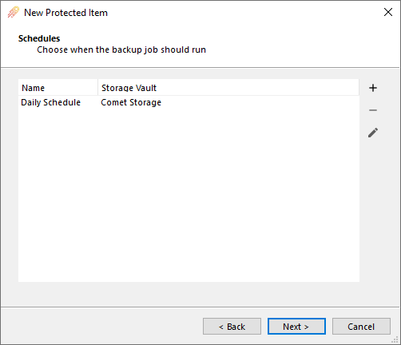

Comet can run backup jobs automatically on a schedule. It is strongly recommended to automate your backups on a regular schedule.

Click the plus button to add a new schedule.

#### General Schedule options

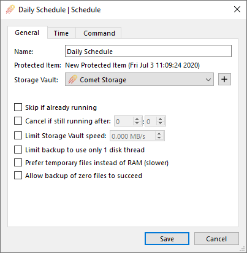

When a schedule is due to run, the backup job will run automatically to the selected Storage Vault.

You can also configure advanced backup runtime options:

- **Skip if already running**. If this option is enabled, and another backup job is known by the Comet Server to exist for the same Protected Item and Storage Vault in "Running" status, then this backup job will be skipped. Skipping a backup job creates a log entry for the job in "Skipped" status.
- **Cancel if still running after**. You can set a time limit for the backup job. If the backup job exceeds this time limit, the backup job would be cancelled.
- **Limit Storage Vault Speed**. This option allows you to limit the total speed that Comet reads and writes to the Storage Vault. The speed limit applies to the total combined read/write bandwidth.
- **Limit backup to use only 1 disk thread**. When reading multiple files from the local disk for backup, Comet Backup uses multithreading to improve performance. On some machines, this can impact PC performance. If you are experiencing low system performance while the backup job is running, you can try enabling this option to see if it resolves the issue.
- **Prefer temporary files instead of RAM (slower)**. This option reduces backup job performance.
- **Allow backup of zero files to succeed**. If a backup job completes successfully but did not include any files in the backup, Comet will by default mark the job as "Error" status. This is a useful feature to help detect against accidental path changes or incorrect file selections. However in some cases you may expect a backup job to succeed with no files included. In that case, you can enable this option.

#### Schedule times

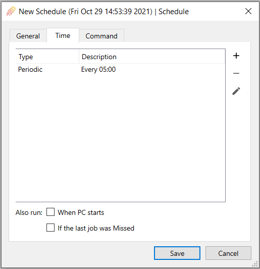

You can configure the times when this schedule will be executed. You can add multiple times to the same schedule.

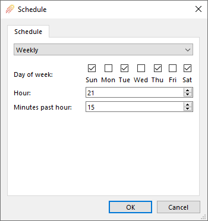

The available time-based schedule frequencies are:

- **Hourly**. The schedule would run every hour. You can choose the minutes past the hour.
- **Daily**. The schedule would run every day. You can choose the time of day (hours/minutes). The hours are specified in 24-hour time, from 0 to 23.
- **Weekly**. The schedule would run every week. You can choose the day of the week, and the time of day (hours/minutes). You can choose multiple days of the week.
- **Monthly**. The schedule would run every month.
- **Once only**. The schedule would run only when the specified date and time is reached.
- **Periodic**. The schedule would run regularly at the set frequency. You can use the "Offset" option to help stagger multiple devices that might otherwise all start running simultaneously.

If the device is online, Comet Backup will try to run the backup job. If the device is not online, or the backup job could not be started, the Comet Server will inject a "Missed" job into the customer's backup job log. Administrators can use these "Missed" backup job notifications when monitoring the job history for their customers, to ensure that backup jobs run on schedule.

Event-based schedule frequencies are also available.

The available event-based schedule frequencies are:

- **Also run when PC starts**. The schedule would be initiated immediately after the PC boots.
- **If the last job was Missed**. The schedule would be initiated immediately after the PC comes online if the last backup job for this Protected Item and Storage Vault pair has been missed. This allows you to "catch up" missed backups for PCs that are only online at irregular intervals (e.g. laptops).

Note: A laptop 'lid-close' or 'suspend' event is not the same as a device shut-down, and will not trigger the option 'Also run when PC starts, if the last job was Missed' when the device wakes up.

The time that the "PC starts" is defined as follows: the time that the Comet Backup background service started, if the system uptime is less than 10 minutes. _(This definition is subject to change.)_

#### Random job delay

To spread out CPU load when backups run at the same time, a 'Random job delay' can be utilized. This adds a random delay (in minutes) to a scheduled backup job before it finally executes thus spreading out the start time of the affected job/s (maximum 300 minutes/5 hours). When a lot of schedule jobs start at exactly the same time, this can cause a high CPU load for the server and this can help to spread it out.

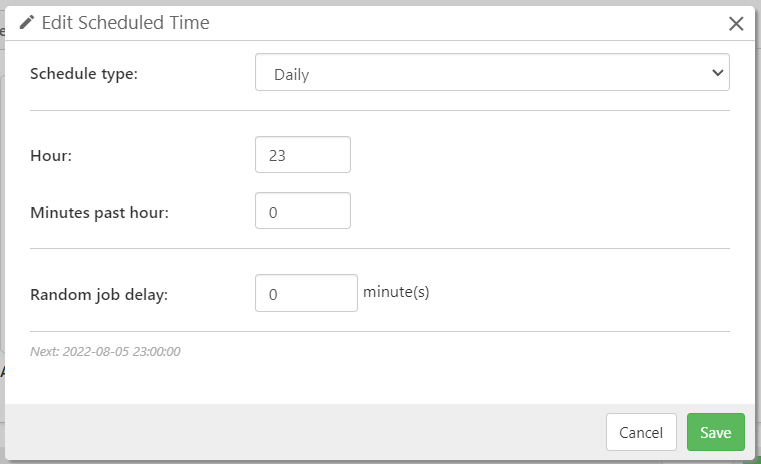

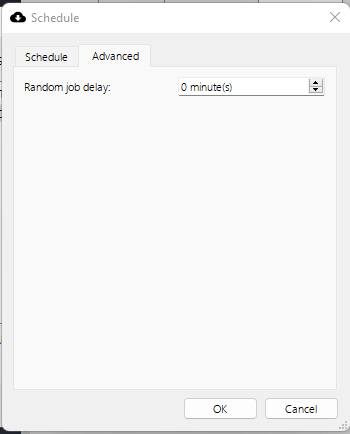

#### Commands (Schedule)

You can configure Commands that run before/after this Schedule runs.

The Commands feature on a Schedule works the same way as for Commands on a Protected Item or on a Storage Vault. For more information about the Commands feature, please see details under the [Overview and Concepts](https://docs.cometbackup.com/latest/application-architecture#overview-and-concepts) section.

### Commands (Protected Item)

You can configure Commands that run before/after this Protected Item is backed up.

The Commands feature on a Protected Item works the same way as for Commands on a Storage Vault or on a Schedule. For more information about the Commands feature, please see details under the [Overview and Concepts](https://docs.cometbackup.com/latest/application-architecture#overview-and-concepts) section.

## Retention

`Retention` is the concept of determining what data should be kept, for how long, as well as when and what data can be safely removed in order to free up disk space. Retention rules can be configured for individual Protected Items, or for Storage Vaults.

All Comet retention rules are stackable, and they can be added automatically by Policy.

### Retention (Protected Item)

In the Retention section, you can configure a retention policy to apply when backing up this Protected Item to a specific Storage Vault. If no policy is configured for a specific Storage Vault, the default retention policy for the Storage Vault will apply.

The retention section will display `(default)` to indicate that the Storage Vault default rules apply, `Keep (X rules)` to indicate that specific Protected Item retention rules have been applied.

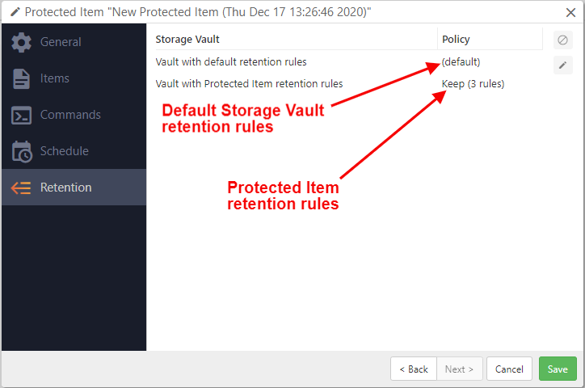

### Retention (Storage Vault)

Storage Vault retention rules are the default for all data stored, unless a Protected Item has its own set of retention rules. When a Storage Vault is first created, the default, no-change-by-policy retention rule is 'Keep all data forever'. This can be automatically altered by user-profile policy, or by later manual changes.

If a Protected Item is given its own set of retention rules, these Protected Item rules will normally take precedence over the Storage Vault retention rules.

If a Protected Item is removed from the list of things to backup, or has its retention rules removed, then the Storage Vault retention rules will take precedence once more, and the data associated with the Protected Item will be kept, or removed, in accordance with the Storage Vault retention rules.

#### Example usages of retention rules:

- Change the default Storage Vault retention rule to 'Keep all data for 60 days', plus
- add a Protected Item rule to keep all snapshots for 90-days, plus
- add a Protected Item rule to keep a representative snapshot from each week, on a Monday at 6am, for 2 years.

- A customer permanently retires a single device. The device is revoked from the user-profile list of devices. Once the device is deleted, the Protected Items for the device are also deleted, as well as any retention rules. The snapshot data will now be governed by the Storage Vault retention rules. If no changes have been made, the default Storage Vault retention rules are 'Keep all data forever', so the unwanted data from the Protected Item would never be deleted.

#### Explanation

- When you revoke a device, it will remove all its Protected Items, and all of their retention rules.
- If the user-profile still has at least one live device that stores data in the Storage Vault, it will run the retention pass into the Vault, eventually deleting the old Protected Item data.

#### Example Solution

- Set all Storage Vaults to have a changed-default retention rule of 'keep all data for 60 days', or some other period.
- When a device is revoked, or a Protected Item is removed from the list of Items to protect, the next retention pass will fallback to the Storage Vault rules.
- A Storage Vault retention period of 60 days will allow for mistakes to be discovered. A mistakenly-deleted Protected Item can be reinstated into the list of things to protect; or the snapshots of the Protected Item can be restored via another device registered to the same user-profile.
- A Storage Vault retention period of 60 days will allow for genuinely-unwanted data to be automatically removed at the end of 60 days, thereby keeping storage sizes to a minimum.

### Retention Pass

A "retention pass" is the act of cleaning up data from the Storage Vault that exceeds the configured retention policy.

During a retention pass, Comet Backup looks at each backed-up job within the Storage Vault and determines whether it meets the retention policy. If the retention policy states that the backed-up job can be safely removed, the backed-up job is removed from the Storage Vault. Once all backed-up jobs are checked against the retention policy, any data chunks that are no longer referenced by a backed-up job can then be pruned to save disk space.

#### Automatic retention passes

A retention pass may run automatically after each backup job.

An automatic retention pass is not necessarily critical, and so if a backup job comes to an end without a retention pass being possible to run, the retention pass is not immediately "overdue".

The "overdue" rules for automatic retention passes are based on the time since the previous successful retention pass, and, the number of jobs exceeding the configured retention policy. The exact rules are subject to change in future versions of Comet.

As of Comet 21.9.7, the rules are determined based on the "Apply retention policy after backup" option in the backup job settings or backup job schedule settings. This option can be set to "Automatic", "Run immediately", "Run more often", or "Run less often". The default option is "Automatic".

##### Automatic

If the "Apply retention policy after backup" option is set to "Automatic",

If there is only a single device in the account, Comet follows the "Run more often" rule set.

If there are multiple devices in the account, then Comet tries to determine if the PC is a "high power" device or a "low power" device.

A device is considered a "high power" device if it meets 2/3 of the criteria:

- over 7 days uptime
- running Windows Server or Linux
- having over 8 GB useable physical RAM
  - Devices running a 32-bit operating system are considered to have a maximum of 2GB usable physical RAM. Devices with 2 GB or less of usable RAM are always considered a "low power" device.

If the device is a "high power" device, Comet follows the "Run more often" rule set. If the device is a "low power" device, Comet follows the "Run less often" rule set.

##### Run immediately

If this option is selected, Comet will attempt a retention pass after each backup job, and will throw an error if it could not be performed.

##### Run more often

| Last retention pass                  | 0-2 jobs exceeding policy | 3-9 jobs | 10-49 jobs | 50+ jobs |
| ------------------------------------ | ------------------------- | -------- | ---------- | -------- |
| less than 24 hours ago               | None                      | Attempt  | Attempt    | Require  |
| between 24 hours ago and 14 days ago | None                      | Attempt  | Require    | Require  |
| between 14 days ago and 21 days ago  | Attempt                   | Attempt  | Require    | Require  |
| over 21 days ago, or never ran       | Require                   | Require  | Require    | Require  |

##### Run less often

| Last retention pass                  | 0-2 jobs exceeding policy | 3-9 jobs | 10-49 jobs | 50+ jobs |
| ------------------------------------ | ------------------------- | -------- | ---------- | -------- |
| less than 24 hours ago               | None                      | None     | None       | Attempt  |
| between 24 hours ago and 14 days ago | None                      | None     | Attempt    | Require  |
| between 14 days ago and 21 days ago  | None                      | Attempt  | Attempt    | Require  |
| over 21 days ago, or never ran       | Attempt                   | Require  | Require    | Require  |

In the above tables,

- "None" means that no automatic retention pass will be attempted at the end of the backup job
- "Attempt" means that Comet will attempt a retention pass, but not throw an error if it could not be performed
- "Require" means that Comet will attempt a retention pass, and will throw an error if it could not be performed

_Previous versions of Comet between 21.9.3 and 21.12.6 inclusive always used the Automatic rule set, without exceptions for single devices, nor for 32-bit devices, nor for 2GB RAM._

_Previous versions of Comet between 19.12.4 and 21.9.2 inclusive always use the "high power" rules above._

_Prior to Comet 21.9.4, it was not possible to run backup and retention jobs simultaneously to the same Storage Vault._

#### Manual retention passes

You can run a retention pass for a Storage Vault on demand, by right-clicking the Storage Vault within the Comet Backup application, or an administrator can remotely initiate this by using the live-connection action from the Comet Server web interface.

In this case because the action was explicitly taken, an error will be raised if the job fails to be performed for any reason.

### Preferences

Comet allows you to configure retention for a Storage Vault, as well as for a Protected Item / Storage Vault pair.

The retention rule for the pair will be used in preference to the retention rule for the Storage Vault. The retention rule for the Storage Vault is therefore only applied when

- there is no overridden retention rule for the Protected Item / Storage Vault pair; or
- the Protected Item is unknown, deleted, or belongs to a different Comet user account

### Retention policies

There are two categories of retention policy:

- A policy that keeps all data forever, and
- A policy that keeps data as long as it falls within any of a set of configurable ranges. You can combine multiple ranges to create a more complex policy.

#### Retention ranges

A retention range is a time period or job count during which a backup job should be kept.

The following ranges are available:

| Range                                              | Parameters                                       | Description                                                                                                                    |
| -------------------------------------------------- | ------------------------------------------------ | ------------------------------------------------------------------------------------------------------------------------------ |
| `Last [...] backups`                               | Specify a number of backups to keep.             | If the backup job was within the last `X` backups, then the backup job will be kept                                            |
| `Most recent [...] backups, at most one per day`   | Specify a number of backups to keep.             | The most recent backup job each day will be retained until `X` backups are selected                                            |
| `Most recent [...] backups, at most one per week`  | Specify a number of backups to keep.             | The most recent backup job each day will be retained until `X` backups are selected                                            |
| `Most recent [...] backups, at most one per month` | Specify a number of backups to keep.             | The most recent backup job each day will be retained until `X` backups are selected                                            |
| `All backups in the last [...]`                    | Specify a number of days, weeks, and/or months.  | If the backup job occurred recently within the specified range, then the backup job will be kept                               |
| `All backups newer than a specific date`           | Specify a specific date.                         | If the backup job occurred after that specific date, then the backup job will be kept                                          |
| `One backup each day, for the last [...] days`     | Specify a number of days.                        | Comet will keep the single first backup job from each of that most recent days                                                 |
| `One backup each week, for the last [...] weeks`   | Specify a number of weeks, and a day of the week | Comet will keep the single first backup job that occurred on that day of the wek, for each of that number of most recent weeks |
| `One backup each month, for the last [...] months` | Specify a number of months, and a calendar date  | Comet will keep the single first backup job that occurred on that calendar date, for each of that number of most recent months |

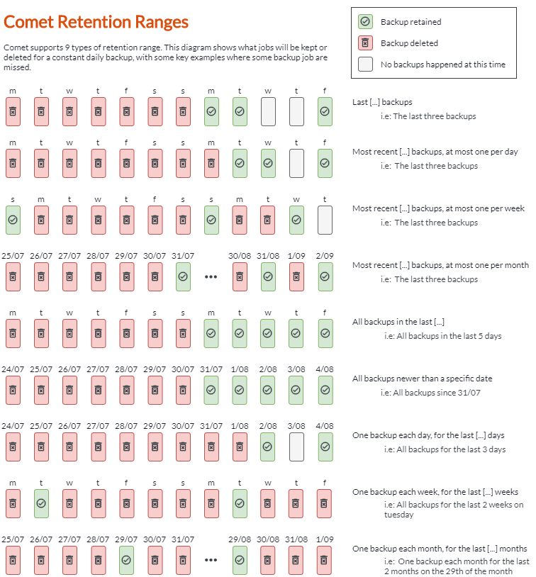

## Storage Vaults

### General tab

On this tab, you can give a name to the Storage Vault. You can use any name; if you have multiple Storage Vaults within an account, we would recommend using a name that identifies the content and/or purpose of the Storage Vault.

On this tab, you can also configure a retention policy for the Storage Vault.

#### Quota (Storage Vault)

On this tab, an administrator using Comet Server can configure a quota limit, restricting the total amount of data stored within this Storage Vault.

You can set this property on a per-Storage Vault basis. For example, you could use this feature to limit the amount of data stored on an expensive network storage account, but still allow any amount of data to be stored on a local hard drive.

When a backup job is performed, the total size of the Storage Vault is measured and checked against this quota limit. As the job proceeds, the amount of uploaded data is compared against the remaining available size, and the backup job will emit an error once reaching this limit.

##### After a quota has been exceeded

A backup job that is abandoned for reaching its Storage Vault quota does not remove the chunks that were uploaded to the Storage Vault. Future backup jobs will almost certainly fail immediately. In this situation, you have the choice between

1.  Raising the Storage Vault quota and retrying the backup. This will cause any existing chunks in the vault to be re-used, accelerating the backup quickly up to the point where it was interrupted; or
2.  Using the "Apply retention rules now" feature to clear unused chunks from the Storage Vault. This will reduce the data size within the Storage Vault and allow future backups to proceed.

Neither action is taken automatically - you should choose one action to take depending on the situation.

### Storage tab

On this tab, you can configure the data storage location for this Storage Vault. A number of types are available, including local disk storage, network accounts, and cloud storage providers. For more information about data storage locations, please see the [Storage Configuration](https://docs.cometbackup.com/latest/installation/storage-configuration#storage-configuration) documentation.

### Commands

The Commands feature on a Protected Item works the same way as for Commands on a Storage Vault or on a Schedule. For more information about the Commands feature, please see details under the [Overview and Concepts](https://docs.cometbackup.com/latest/application-architecture#overview-and-concepts) section.

### Encryption

Comet automatically enables encryption for all Storage Vaults. This is not customizable; this tab solely serves to indicate that fact to unaware users.

Storage Vault encryption is initialized upon first-use. You can use this tab to tell whether a Storage Vault has been initialized with an encryption key, and when the initialization was performed (according to records in the user account profile).

The encryption keys are stored inside the Storage Vault settings, in the user account profile, using an administrator-oblivious zero-knowledge ratchet. After initialization, any stored data files can only be used with this particular Storage Vault; recreating the Storage Vault to point to the same data location will result in a decryption error.

## Devices

You can log in to the same user account from multiple devices.

Each device in an account has their own private Protected Items, but shares the Storage Vaults. Because Storage Vaults are the unit of deduplication, all backups from all devices in the account can be deduplicated against each other. This also means that devices can restore each others' data.

An administrator can revoke devices from your account.

A device has a "friendly name" that is set by the device when it is first registered. The "friendly name" defaults to the hostname of the PC. An administrator can rename devices in an account.

Because additional devices may incur a cost, an administrator can also limit the total number of devices in an account.

If a device is live-connected to the Comet Server, an administrator can request that the device performs certain actions.

## Policies

An administrator can apply additional restrictions to user accounts, using the Policies feature in the Comet Server web interface. For more information about the Policies feature, please see details under the [Comet Server Usage - Policies](https://docs.cometbackup.com/latest/installation/comet-server-usage#policies) section.
