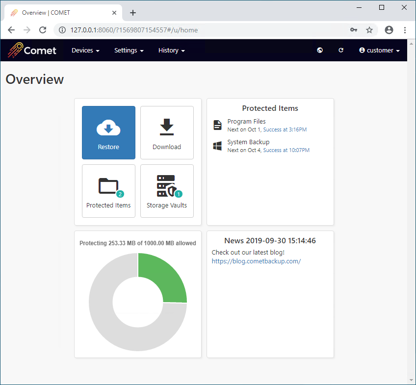
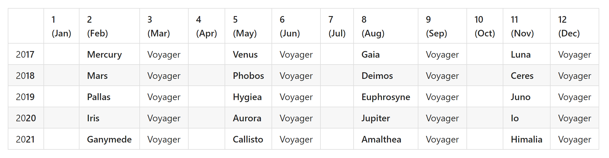

## Comet Server

### Server Roles

The Comet Server software is split into multiple roles. It can be considered to be (at least) two separate servers:

- the "Authentication" server role, which is responsible for handling users and logs; and
- the "Storage" server role, which is responsible for storing and replicating the raw data.

This design allows you to scale either role, without necessarily scaling the other.

For example, if a user or tenant requires storage in another region, you could run an additional Comet Server with Storage Role only while keeping users in the same server.

Alternatively, if your storage capacity is exceeded, you can create an additional physical "Storage" server role without needing to duplicate user handling.

In addition to these two, there are also roles for handling branded software downloads and for overseeing a cluster of Comet servers.

### Licensing

Comet Server requires network access to `lic.cometbackup.com` on port number `443`.

#### Serial Numbers

Your serial number for Comet is used to request a short-term exclusive lease from a central licensing server. The Comet Server will not start without a valid lease, and no other running instance of Comet Server can use the same serial number until the short-term exclusive lease expires. There is a grace period of a few days to allow for temporary license-server unavailability or non-contactability (exact details will not be published).

At the time of writing, Comet Server stores data about the current lease within the `comet-license.db` file. Loss of this file results in loss of lease.

The external IP address and hardware configuration (exact details will not be published) should not change for an existing Comet Server. Otherwise, the central licensing server may refuse to grant a new lease for the serial, or might cause a running instance of Comet Server to refuse the existing lease (exact details will not be published). The external IP address is locked to the Comet Server with a particular serial number. You can remove and/or turn off the IP Lock feature via the '[My Servers](https://account.cometbackup.com/my_servers)' page. This is useful if you are moving your Comet Server to a new location with a new external IP address.

You may grant any number of additional serial numbers via [https://cometbackup.com/](https://cometbackup.com/) . Your support representative is also able to 'relax' leases on an existing serial number (for instance, when moving IP addresses or upgrading hardware). You can also do this for yourself via the '[My Servers](https://account.cometbackup.com/my_servers)' page.

#### Telemetry

The Comet Server submits information about user accounts to a central licensing server, in order to correctly price your subscription.

## User configuration​

### Protected Items and Storage Vaults​

The user's configuration is broadly separated into Protected Items and Storage Vaults.

A Protected Item is a description of the set of data that should be backed up.

A Storage Vault is a location where the backed-up data can be stored. In most common configurations, this would be a Comet Server with the Storage Role enabled; but it's possible for the client software to back up to a local disk, or to a cloud storage provider.

All data within a Storage Vault is compressed, encrypted, and deduplicated. A Storage Vault is the unit of deduplication; data is not deduplicated between multiple Storage Vaults.

### Devices

Multiple devices (e.g. different computers, servers or laptops) can log in to the same Comet user account with a shared password. Each device has its own private set of Protected Items, but shares access to the same Storage Vaults. This allows you to deduplicate data between multiple devices.

Each device can also restore and delete each others' backed-up data, so it is important that multi-device accounts are only used in trusted contexts.

### Storage Templates​

When a new account is created, they have no Protected Items and also no Storage Vaults. The client must register a new Storage Vault either by manually entering details, or by requesting a Storage Vault from the server's Storage Templates. It is possible that the Comet Server administrator might offer multiple tiers of storage (e.g. RAID; SSD; ephemeral; cloud-backed; etc) each with different costing, that the user could request individually. When configuring the server, the list of Storage Template options can be configured. This feature is covered in more detail in later sections of this document.

### Encryption

**We strongly recommend that users use strong passwords**. Even the best security is foiled by a user choosing a weak or commonly-used password, such as `123456` or `letmein`.

Comet always encrypts all user data before storing it, using strong AES-256-CTR with Poly1305 in AEAD mode with high-entropy random keys.

Encryption keys are automatically generated and managed by the client. The data encryption keys are then encrypted against the customer's password, and stored on the Comet Server. This means that (A) the service provider is unable to decrypt data without the customer's password; and (B) in the event of a customer PC loss, only the customer's password is necessary to log in to the account and restore data.

For more technical details about the encryption formats and key management, please see the Appendix.

### Commands

You can register additional commands to run before- or after any backup job. For maximum flexibility, commands can be registered

- for a Protected Item (e.g. to dump a database), or
- for a Storage Vault (e.g. to perform custom network authentication), or
- for a Schedule (e.g. to shut down the computer afterward).
  During a backup job, the commands are run in this order: Schedule Before, Protected Item Before, Storage Vault Before, Backup, Storage Vault After, Protected Item After, Schedule After.

Shell built-ins can be used as part of the command execution - the specified command is passed to either `cmd.exe` or `/bin/sh` as appropriate for your operating system.

**Environment Variables**

Available since **22.3.0**

The following environment variable are made available when running custom before / after commands:

| Name                     | Type   | Comment                                                                                                                           |
| ------------------------ | ------ | --------------------------------------------------------------------------------------------------------------------------------- |
| `BACKUP_TOOL_USERNAME`   | string |                                                                                                                                   |
| `BACKUP_TOOL_DEVICE_ID`  | string |                                                                                                                                   |
| `BACKUP_TOOL_JOB_ID`     | string |                                                                                                                                   |
| `BACKUP_TOOL_JOB_STATUS` | int    | Job status is only available in After commands. [View possible values](https://docs.cometbackup.com/latest/api/api-constants#job) |

## Client Software​

### Application structure​

The client software is split into two components; `backup-tool` is a command-line tool which implements all the software functionality. The graphical user interface is `backup-interface`, which wraps this command-line tool. Backup schedules will still run even if logged out of the GUI, as the background service will still be logged in.

Additionally, clients can remotely control their installed software by logging in to the Comet Server web interface as a user.

On platforms without a desktop interface available (e.g. Linux server), only the `backup-tool` part is used, and you should control the application via the web interface.

### Device registration​

Each Comet user can be used by multiple devices. This allows you to deduplicate backups from multiple users, since backups can be targeted to the same Storage Vault.

When you log in to the same Comet user from another device, such as a laptop or tablet, you will see a private view of Protected Items but a public view of Storage Vaults.

- You can view, edit, and use Storage Vaults configured by other devices
- You cannot view, edit, nor use Protected Items configured by other devices
- You can restore data from any device's Protected Item (hidden by default)
- You can view job logs from any device (hidden by default)

## Backup Algorithm​

Comet backs up data by first splitting it into variable-sized chunks, which are individually compressed, encrypted, and uploaded. Comet uses data-dependent chunking, efficiently splitting a file into consistent chunks even in the face of random inserts.

A backup job consists of a list of files and which chunks would be needed to reconstruct them. Any successive incremental backup jobs simply realize that chunks already exist on the server and do not need to be re-uploaded.

This chunking technique has the following properties:

- Both the oldest and the most recent backup jobs can be restored with the same speed
- Duplicate data does not require any additional storage, since the chunks are the same ("deduplication")
- There is never any need to re-upload the full file, regardless of the number of backup jobs
- There is no need for the server to be trusted to decrypt data.

## Customer Web Portal​

You can log into the web interface with a user account to run backups and restores remotely. You can also edit Protected Item and Storage Vault settings, and view job history.

## Backward Compatibility​

"Upgrade Compatible" means that new versions of Comet are compatible with backup data and/or user configuration from previous versions of Comet. Comet strives to maintain upgrade compatibility wherever possible.

"Downgrade Compatible" means that old versions of Comet are compatible with backup data and/or user configuration from newer versions of Comet. Comet makes no guarantees about downgrade compatibility.

For a history of compatibility events, please see the Appendix

### What version should I use?​

In general, it is recommended to use the latest version of the software at all times.

If multiple devices are using the same Comet account, it is recommended that they all use the same version, in order for shared resources to be mutually understood.

### Version numbers and release schedule​

The first two parts of a Comet version number indicate the release track (e.g. `20.5` means the "Aurora" release track). These digits roughly correspond to the year and month that version was first released (future updates within the release track do not change these numbers).

