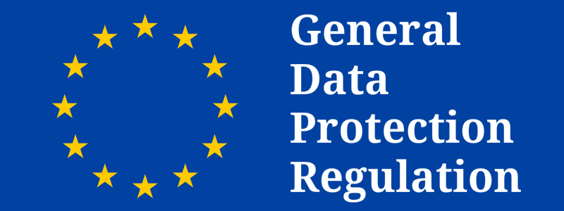

GDPR Compliance

---

### What is GDPR?

The EU General Data Protection Regulation (GDPR) replaces the Data Protection Directive 95/46/EC and was designed to harmonize data privacy laws across Europe, to protect and empower all EU citizens data privacy and to reshape the way organizations across the region approach data privacy. The enforcement date of GDPR is **25 May 2018**.

[You can read more about the regulation here on eugdpr.org](https://www.eugdpr.org/the-regulation.html)

### Is Comet GDPR Compliant?

Comet can be part of your GDPR compliant backup offering, however you will have to ensure that you fulfil your own GDPR obligations as well. It maybe advantageous to engage a GDPR consultant or agency to ensure your compliance.

### What aspects of using Comet will help with providing a GDPR compliant backup offering?

- Encryption: Comet always encrypts all user data before storing it. It remains encrypted during transfer and also at rest in the storage destination, even in a scenario where the storage destination is compromised the data remains unreadable. [Technical details about our encryption can be found here.](https://docs.cometbackup.com/latest/appendix#encryption-and-key-management)
- Server and Storage Locations: Self-Hosted Comet Servers are a self-hosted and managed product - you can choose where your server and storage destinations are located and what security measures you have in place. Comet-Hosted servers and their attached storage are hosted on Amazon AWS EC2 and the cloud storage platform of your choice. [More information is available here about the cloud security measures Amazon has in place.](https://aws.amazon.com/security/)
- Access: If you are using a Self-Hosted Comet Server, only you can access your Comet Server and grant/create additional system users. If you are using Comet-Hosted, we respect the privacy and security of your server instance. In the unlikely event that Comet Backup staff would require direct access your Comet Server instance, your consent will be sought first and this access will only be undertaken if consent is granted by you.
- Removal of data: In both Self-Hosted and Comet-Hosted Comet Servers, you have total control over the data including deletion options if a customer requests it from you.

### What information does Comet Server send back to us?

The only information that is transmitted back to us from your Comet Server is basic information in order to validate your server serial number and aggregate information for licensing and billing purposes.

### Where can I find more information about the handling of Personal Data, Privacy Policy and Data Processing?

[You can find this information here.](https://cometbackup.com/conditions)

HIPAA Compliance

---

### What is HIPAA?

The United States HIPAA (Health Insurance Portability and Accountability Act) is legislation that mandates data privacy and security provisions for the safeguarding of patient data by health organizations, including drugstores, hospitals and specialized insurance companies. This law was further amended in 2009 to include the HITECH Act (The Health Information Technology for Economic and Clinical Health). The act states that Protected Health Information (PHI) must be rendered “unusable, unreadable, or indecipherable” to unauthorized persons and that encryption for data ‘at-rest’ and ‘inflight’ should be addressed.

### HIPAA Compliant Cloud Storage Providers supported by Comet:

| Provider                                                                                                                                             | Compliance                                                                            |
| ---------------------------------------------------------------------------------------------------------------------------------------------------- | ------------------------------------------------------------------------------------- |
|                                          | [Documentation](https://aws.amazon.com/compliance/hipaa-compliance/)                  |
|                                      | [Documentation](https://www.microsoft.com/en-us/TrustCenter/Compliance/HIPAA)         |
|                                  | [Documentation](https://cloud.google.com/security/compliance/hipaa/)                  |
|  \]                                                | [Documentation](https://info.wasabi.com/hipaa)                                        |
|                               | [Documentation](https://www.rackspace.com/industry/healthcare)                        |
|  | [Documentation](https://console.bluemix.net/docs/security/compliance.html#compliance) |

### Is Comet HIPAA compliant?

#### Backing up:

Comet always encrypts all user data before sending or storing it, using strong AES-256-CTR with Poly1305 in AEAD mode with high-entropy random keys. The user's password is used to derive two 192-bit keys (the "L" and "R" keys) via PBKDF2-SHA512, with hard-coded parameters for repeatable output.

- The L-key is used to log in to the Auth Role server in place of the real password; the server stores only a bcrypt(sha512) hash of this L-key.
- The R-key never leaves the client, and is used to encrypt secret keys stored within the user's profile on the server.

#### During rest:

When Comet sets up a Storage Vault for the first time, it generates two high-entropy random keys (the 256-bit "A" and 128-bit "E" keys). All user data in the Storage Vault is stored encrypted with the A-key using AES-256 in CTR mode, and authenticated using Poly1305 in AEAD (encrypt-then-MAC) mode. The only party with the decryption key is your company/the backup user. This ensures total privacy of the PHI data.

### What is a Business Associate Addendum (BAA)

Under the Health Insurance Portability and Accountability Act (HIPAA), a "business associate" is a person or entity who performs functions or activities on behalf of, or provides certain services to, a covered entity and isn’t employed by the covered entity. A "business associate" also includes a subcontractor that creates, receives, maintains, or transmits protected health information on behalf of another business associate. Under the HIPAA regulations, using a Cloud Service Provider like Amazon/Azure/Wasabi etc would classify you as being in a business associate arrangement and require an agreement.

The HIPAA rules generally require that covered entities and business associates enter into contracts to ensure that the business associates will appropriately safeguard protected health information. The business associate contract also serves to clarify and limit, as appropriate, the permissible uses and disclosures of protected health information by the business associate, based on the relationship between the parties and the activities or services being performed by the business associate.

#### Do I need to sign a BAA with Comet?

No, you do not need a BAA with us. If you decide to use a third party storage provider, it is advisable that you sign a BAA with the storage company.

### Self-Hosted Comet Server and HIPAA

As you are running/hosting Comet yourself and backing up to your own selected storage/cloud storage provider you do not need a BAA with us. Data that is backed up using Comet is always encrypted during backup, transit and at rest. Only you and parties you nominate, have access to your Self-Hosted Comet Server.

### Comet-Hosted Comet Server and HIPAA

We do not recommend using Comet-Hosted Comet Server as a HIPAA backup solution.

[You can read more about HIPAA in general here on HHS.gov](https://www.hhs.gov/hipaa/index.html)
