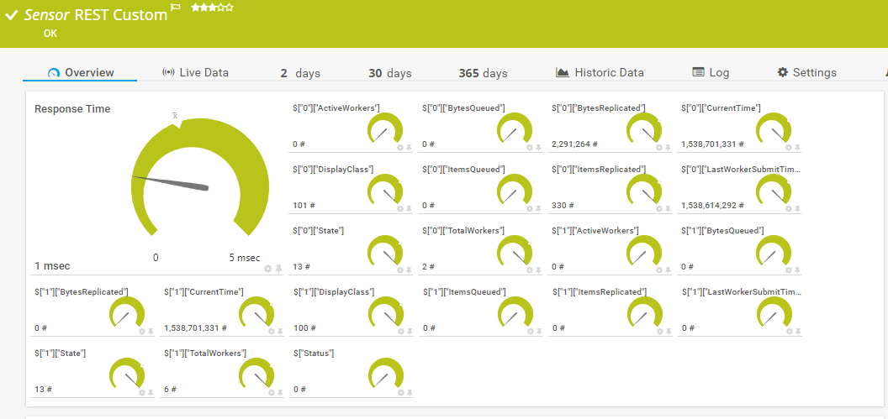
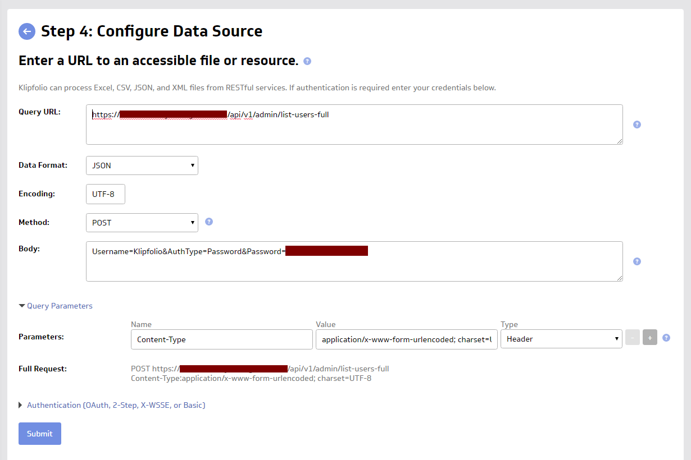

## Overview

Comet Server has a versatile API that can be used to integrate with third-party products and services. This may include

- Billing functionality
- Customer management (CRM) functionality
- Additional monitoring functionality
- Other professional services functionality

A non-exclusive list of third-party service integrations is below. If you represent an third-party service provider that integrates with Comet, please reach out to be added to this list.

None of the following companies offer end-user backup services, and do not compete with you as an MSP.

## MyClient

_MyClient is a product of MyClient Global.com Ltd._

[MyClient](https://www.myclientglobal.com/) is a backup monitoring and CRM tool.

> "MyClient brings together CRM, Support, Sales, Billing, Communication, Resellers, Automation and Server Management in a single unified fully customisable interface."

MyClient provides an official integration for Comet Backup, that allows you to create and manage customer accounts.

There is a close relationship between the MyClient and Comet companies. Comet CloudView is a Comet-focused edition of MyClient.

## WHMCS

_WHMCS is a product of WHMCS Ltd._

[WHMCS](https://www.whmcs.com/) is an ecommerce and billing platform.

> "WHMCS is the leading web host billing automation platform powering tens of thousands of web hosting companies."

Comet provides an official plugin for WHMCS, that allows you to use WHMCS to create and manage customer accounts.

For more information and installation instructions, please see [https://github.com/CometBackup/comet-whmcs-module](https://github.com/CometBackup/comet-whmcs-module) .

The plugin is also available via the [WHMCS Marketplace](https://marketplace.whmcs.com/product/6234-comet-backup).

## HostBill

_HostBill is a product of HostBill Krzysztof Pająk._

[Hostbill](https://hostbillapp.com/) is an ecommerce and billing platform.

> "All-in-One Hosting Command Center - Hosting Automation, Client Management, Help Desk System, Automated Billing, Domain Management"

HostBill provide an official module for Comet, that allows you to use Hostbill to create and manage customer accounts.

For more information and installation instructions, please see [https://hostbillapp.com/products-services/cometbackup/](https://hostbillapp.com/products-services/cometbackup/) .

See also:

- Announcement: [http://blog.hostbillapp.com/2019/10/14/sell-cometbackup-space-with-hostbill/](http://blog.hostbillapp.com/2019/10/14/sell-cometbackup-space-with-hostbill/)
- Module documentation: [https://hostbill.atlassian.net/wiki/spaces/DOCS/pages/750747649/CometBackup](https://hostbill.atlassian.net/wiki/spaces/DOCS/pages/750747649/CometBackup)

## CheckCentral

_CheckCentral is a product of Binary Fortress Software._

[CheckCentral](https://www.checkcentral.cc/) is an email alert monitoring tool.

> "CheckCentral handles your email alerts & notifications for you! Simply tell us what emails to expect and when to expect them. We'll let you know when something needs your attention."

For more information and installation instructions, please see ["Monitoring Comet Backup with CheckCentral"](https://www.checkcentral.cc/Discussions/View/monitoring-comet-backup-with-checkcentral/?ID=012493e6-b755-4a29-a2e4-32293f2ecc74).

## PRTG

_PRTG is a product of Paessler AG._

[PRTG](https://www.paessler.com/prtg) is a commercial solution for monitoring server health.

> "PRTG monitors your whole IT infrastructure 24/7 and alerts you to problems before users even notice. Find out more about the monitoring software that helps system administrators work smarter, faster, better."

There are many ways to integrate Comet Server with PRTG.

### Monitoring Comet Server replication with PRTG

One possible way is by using the "REST Custom Sensor" plugin to connect to the Comet Server API (`AdminReplicationState`).

To use this sensor, set

- Method: `POST`
- Post data: `Username=admin&AuthType=Password&Password=my-password`, replacing any special characters in your password with their URL-encoded equivalents
- HTTP Authentication: `None`
- Custom HTTP headers: `Content-Type: application/x-www-form-urlencoded; charset=UTF-8`
- REST Query: `:8060/api/v1/admin/replication/state`

This should make Comet Server's replication status available in PRTG.

Once the information is available in PRTG, you can then continue to configure alerts based on queue length.

You can also adapt this example to monitor other properties of Comet Server, using the Comet Server API.

## Klipfolio

_Klipfolio is a product of Klipfolio Inc._

[Klipfolio](https://www.klipfolio.com/) is a web-based dashboard platform.

> "Klipfolio is an online dashboard platform for building powerful real-time business dashboards for your team or your clients."

You can view information from your Comet Server in Klipfolio, by using the "REST/URL" Core Connector to create a Data Source, and then building custom "Klip" widgets based on this data.

- [Sign up for Klipfolio using Comet's promo code](https://app.klipfolio.com/apiAccount/trialRedirect?referralCode=1fb15fba748a9c214d489dea6d73cfc3&metrics=true)

### Comet Server data sources

Klipfolio reaches out to your Comet Server over the internet. You should create a separate admin account in your Comet Server for Klipfolio's use.

#### User accounts

In the Klipfolio web interface, click Data Sources > "Create a New Data Source" > "REST/URL" Core Connector.

Fill in the options as follows:

| Option           | Value                                                                                                                                                |
| ---------------- | ---------------------------------------------------------------------------------------------------------------------------------------------------- |
| Query URL        | The full URL to your Comet Server, followed by `/api/v1/admin/list-users-full`                                                                       |
| Data Format      | `JSON`                                                                                                                                               |
| Encoding         | `UTF-8`                                                                                                                                              |
| Method           | `POST`                                                                                                                                               |
| Body             | `Username=KlipfolioUserAccount&AuthType=Password&Password=xxxx`, replacing any special characters in the password with their URL-encoded equivalents |
| Query Parameters | Name `Content-Type`  Value `application/x-www-form-urlencoded; charset=UTF-8`  Type `Header`                                                 |

Click the "Submit" button to preview the data source. The user accounts on your Comet Server should be visible, along with all the settings for each user account.

Click the "Continue" button to confirm the data source.

#### Online devices

Create a new Data Source as above, making the following changes:

- Query URL: The full URL to your Comet Server, followed by `/api/v1/admin/dispatcher/list-active`

#### Server Replication

Create a new Data Source as above, making the following changes:

- Query URL: The full URL to your Comet Server, followed by `/api/v1/admin/replication/state`

#### Job history - Last 48 hours

Create a new Data Source as above, making the following changes:

- Query URL: The full URL to your Comet Server, followed by `/api/v1/admin/get-jobs-for-custom-search`
- Body: As above, but add to the end:

  &Query=%7B%22ClauseType%22%3A%22and%22%2C%22ClauseChildren%22%3A%5B%7B%22ClauseType%22%3A%22%22%2C%22RuleField%22%3A%22BackupJobDetail.TimeSinceStarted%22%2C%22RuleOperator%22%3A%22int_gt%22%2C%22RuleValue%22%3A%22172800%22%7D%5D%7D

Copy

#### Other data sources

The above data sources are examples based on the Comet Server API. You can also adapt the above examples to monitor other properties of Comet Server, using the Comet Server API.

### Klips

Once the data source is imported into Klipfolio, you can create widgets using this data.

_No further documentation is currently available for this topic._

## Prometheus

_Prometheus is copyright © Prometheus Authors and copyright © The Linux Foundation._

[Prometheus](https://prometheus.io/) is a server health metrics, monitoring, and alerting application.

> "From metrics to insight - Power your metrics and alerting with a leading open-source monitoring solution."

Comet provides an official exporter for Prometheus, that you can run as a sidecar container to pull metrics from Comet Server and export them in a Prometheus-compatible format.

For more information and installation instructions, please see [https://github.com/CometBackup/comet-prometheus-exporter](https://github.com/CometBackup/comet-prometheus-exporter) .

## Collectd

[Collectd](https://collectd.org/) is a flexible, open-source application for server health metrics collection and monitoring.

> "`collectd` \- The system statistics collection daemon"

Comet provides an official exporter for Collectd, that you can run as an `Exec` plugin to pull metrics from Comet Server into Collectd for use with any of its export or storage plugins.

For more information and installation instructions, please see [https://github.com/CometBackup/comet-collectd-exporter](https://github.com/CometBackup/comet-collectd-exporter) .

## Backup Radar

_Backup Radar is a product of Backup Radar LLC._

[BackupRadar](https://www.backupradar.com/) helps you identify blind spots in your backup monitoring and reporting.

Catch missed or failed backups in real time. Integrate with 14+ of your favourite MSP platforms including PSA, RMM, and other productivity tools. Streamline your policies and workflows, reduce overhead and human error with our world-class intelligent automation.

Setup is simple. Use these step-by-step instructions: [https://support.backupradar.com/hc/en-us/articles/1500009621962-Setup-Comet-API-Integration](https://support.backupradar.com/hc/en-us/articles/1500009621962-Setup-Comet-API-Integration)

For more information on this integration visit: [https://www.backupradar.com/integration/comet](https://www.backupradar.com/integration/comet)

## Integrations Webinar

In this Webinar, we explain in more detail about the various product integrations that can be used with Comet Backup.

<iframe width="100%" height="440" src="https://www.youtube.com/embed/tWzGlBpVlOU" title="Comet Backup Webinar - Integrations" frameborder="0" allow="accelerometer; autoplay; clipboard-write; encrypted-media; gyroscope; picture-in-picture" allowfullscreen></iframe>
