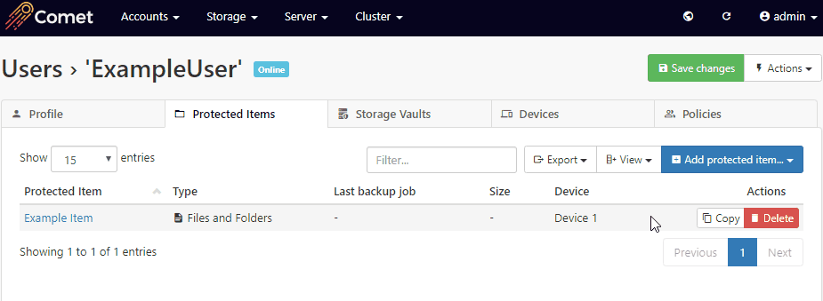
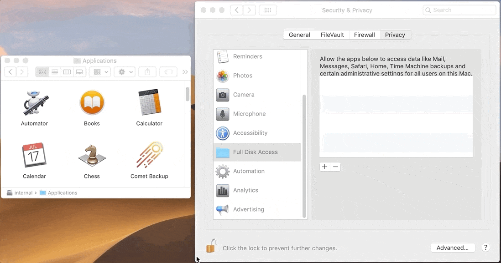
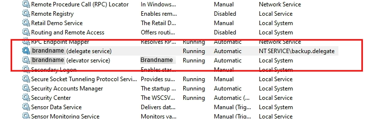

## Error "local error: tls: record overflow"

This message means the connection was corrupted over the network, and Comet's network library closed the connection.

This can happen because of random network conditions. Retrying the operation should fix the issue.

If the issue keeps happening repeatedly, this message indicates that something is interfering with packets in your network.

- Failing NIC
- Bad NIC driver or driver configuration
- Failing RAM, on either the endpoint machine or any of the intermediate routers
- Outdated firewall or proxy, performing incorrect SSL interception

For more information, please see the `record_overflow` section in [IETF RFC 5246](https://tools.ietf.org/html/rfc5246#page-31).

## "Paused" state on Windows service

Comet Server on Windows consists of two parts: `cometd.exe` and `cometd-service.exe`. The latter binary is registered as a service with Windows, and is responsible for ensuring that the former binary stays running.

If Comet Server encounters an error and closes, the service binary will restart it. If the Comet Server is repeatedly unable to start - if it closes immediately when launched, several hundred times consecutively - then the service manager will assume the error is permanent and abandon restarting the process. This condition is displayed as the "Paused" state.

You can resolve this issue by resolving the underlying issue with the service. The error message should be recorded in Comet Server's log file.

You can view Comet Server's log files

- in Comet Server Service Manager, use the Service menu > "Browse log files" option, or
- by browsing the `C:\ProgramData\Comet\logs` directory.

Comet Server makes one log file per day. The error should be recorded in the most recent file (highest number in name / latest modification date).

## Forgotten administrator password

If you are locked out of the Comet Server web interface, you can change your administrator password by editing the `cometd.cfg` file.

1.  Stop the server, and edit the `cometd.cfg` file
2.  Find the `AdminUsers` section for the administrator user in question
3.  Set `"PasswordFormat"` to `0`
4.  Set `"Password"` to e.g. `"admin"`
5.  Save the file and restart the server.

You should now be able to log in with the reset password. The password will be hashed and/or encrypted after first use.

## Storage server "127.0.0.1" in use by accounts but not managed by Constellation

A user account has a bucket on a Storage Role Comet Server at the address 127.0.0.1, but this address was not selected for management by Constellation. Aside from the standard warnings about managing Constellation, the 127.0.0.1 is a special case.

If Comet Server is configured to listen on all network interfaces, the server will be accessible on both 127.0.0.1 as well as LAN, WAN, or DNS addresses. If you log in to either the Comet Backup application or the Comet Server web interface at 127.0.0.1, and request a new Storage Vault from a Comet Server configured as "Local" (or `$self$` in `cometd.cfg`), the resulting Storage Vault will be configured using 127.0.0.1 as the remote network address.

However, 127.0.0.1 has a different meaning depending on where it is found. The connection will fail if the Comet Backup client is not running on the same machine. There may also be unintended consequences if the account is replicated to another server.

To avoid this problem, either

- always use the external DNS name for your Comet Server when requesting new Storage Vaults, or
- change the Request destination to use "Remote" with an external DNS name instead of "Local" (or `$self$` in `cometd.cfg`).

A similar caveat applies to the software downloads, which can include embedded server address details.

## Microsoft SQL Server backup encountered a VDI error

You should ensure that the necessary VDI `.dll` files are registered and are the correct version for your SQL Server installation. You can use [Microsoft SQL Server Backup Simulator](https://github.com/Microsoft/tigertoolbox/releases/) to check the status of the VDI `.dll` files.

## Error "Access is denied" when backing up files and folders on Windows

An "Access Denied" error message means that the Windows user account running the backup job does not have access to read the file content.

Current versions of Comet automatically creates a service account with all necessary permissions to read local files. If you are experiencing "Access Denied" errors, you may be trying to back up a network path that has been mounted as a directory. Please see the "Accessing Windows network shares and UNC paths" section below for more information. If you are experiencing "Access Denied" errors and you are certain that you are not backing up a mounted network path, please contact support. You may also be trying to backup a local Protected Item to which the backup software does not have read-access, such as a file within a user's home directory. In this case, you will need to alter the backup delegate service, and change it to 'logon as' an account which does have access to the Protected Item.

## Antivirus detects Comet Backup as a virus or malware

Comet Backup is a safe application. Any such detection is a "false positive".

When Comet Backup is rebranded, it might seem like a new, unknown program. An unknown program that installs system services, accesses files on the disk and uploads them to the network, might be considered to be malware if it was installed without consent. Unfortunately it's understandable for an Antivirus product to detect this.

In this situation, there are some actions you can take:

- Please ensure your Antivirus product is fully up-to-date.
- Please contact Comet Support with a screenshot of the error message. In some situations, it may be possible for our developers to resolve the issue.
- Choose to "allow" or "white-list" the file in the Antivirus software. This may send a signal to the Antivirus software vendor that the software is safe (e.g. ESET LiveGrid, Windows Defender Automatic Sample Submission, Kaspersky KSN, etc).
- Enable Authenticode signing on Windows. This may provide additional "reputation" to the software installer.

### Error "backup-tool.exe couldn't be launched. CreateProcess() failed: Access is denied" message

This error message indicates that something on the PC is blocking Comet's main `backup-tool.exe` program from running. It's likely this is the antivirus. Please follow the above steps to allowlist Comet in your antivirus application.

### Avast "FileRepMalware"

You will receive the "FileRepMalware" error message for any file that was

- downloaded from the internet; and
- does not have an Authenticode certificate; and
- has not been seen yet by many Avast users.

Many custom-branded Comet Backup installers do fall into this category.

You can resolve this issue by purchasing and installing an Authenticode certificate.

### Bitdefender

Bitdefender may flag the desktop client software, you can create an exclusion policy on Bitdefender to prevent this from happening.

#### Installation files exclusions

For the client installation files, you may or may not be required to install from the root directory. You can simply create a folder on each machine to put the installation files into. Exclusions should look similar to this:

##### Folder (On-Demand, On-Access, ATC/IDS):

- `C:\example\*`

##### File (On-Demand, On-Access):

- `C:\example\*`
- `C:\Windows\Temp\*\*\install.exe`
- `C:\Users\*\AppData\Local\Temp\install.exe`

##### Process (On-Demand, ATC/IDS):

- `C:\example\install.dat`
- `C:\example\install.exe`
- `C:\Windows\Temp\*\*\install.exe`
- `C:\Users\*\AppData\Local\Temp\install.exe`

#### Desktop client usage exclusions

If Bitdefender is still flagging Comet when trying to use it, then exclude the following:

##### Folder (On-Demand, On-Access, ATC/IDS):

- `C:\Program Files\PRODUCTNAME\*`

##### File (On-Demand, On-Access):

- `C:\Program Files\PRODUCTNAME\*`
- `C:\Users\*\Desktop\PRODUCTNAME.lnk`
- `C:\ProgramData\Microsoft\Windows\Start Menu\Programs\PRODUCTNAME.lnk`
- `C:\ProgramData\Microsoft\Windows\Start Menu\Programs\Startup\PRODUCTNAME (Background Tasks).lnk`

##### Process (On-Demand, ATC/IDS):

- `C:\Program Files\PRODUCTNAME\backup-interface.exe`
- `C:\Program Files\PRODUCTNAME\backup-mssql.exe`
- `C:\Program Files\PRODUCTNAME\backup-service.exe`
- `C:\Program Files\PRODUCTNAME\backup-tool.exe`
- `C:\Program Files\PRODUCTNAME\dispatchmgr.exe`
- `C:\Program Files\PRODUCTNAME\unelevate.exe`
- `C:\Program Files\PRODUCTNAME\Uninstall.exe`
- `C:\Program Files\PRODUCTNAME\launch.exe`
- `C:\Program Files\PRODUCTNAME\mysqldump.exe`

The [**PRODUCTNAME**](https://docs.cometbackup.com/latest/installation/comet-server-configuration#software-build-role) refers to what you set it as in your branding settings.

## Network connectivity errors

Comet Backup uploads files to Comet Server (or to a cloud storage provider) over the internet. Occasionally, you may see errors such as the following:

- `Couldn't save data chunk:`
- `HTTP/1.x transport connection broken`
- `net/http: request canceled (Client.Timeout exceeded while awaiting headers)`
- `wsarecv`
- `wsasend`
- `An existing connection was forcibly closed by the remote host`
- `dial tcp: lookup [...]: no such host`
- `connectex: A connection attempt failed because the connected party did not properly respond after a period of time, or established connection failed because connected host has failed to respond.`

Comet Backup retries the upload several times, but eventually gives up. After a failed data chunk upload, you may see several more messages of the form `Couldn't save data chunk: context canceled` while Comet terminates the other upload threads.

Network errors have many possible causes:

- Customer's PC
- Customer's network
- Customer's ISP
- Internet-wide outages between customer's ISP and your ISP
- Your ISP
- Your network
- Your Comet Server hardware
- Comet Server software

To troubleshoot these issues, please check:

- Does the backup succeed if it is retried?
  - Many network errors are temporary and will only occur rarely. In addition, a repeated second backup job will often run faster because many of the existing data chunks have already been uploaded. (Any unused data chunks in the Storage Vault will be automatically cleaned up by the next retention pass.)
- Does the error message always happen at a certain time of day?
  - It may be possible to reschedule the backup to avoid times of heavy internet congestion.
- Are there any corresponding messages for around the same time in your Comet Server logs?
  - This is important to determine the cause of some failures.
  - Some relevant Comet Server log messages take the form `Error saving upload stream` or `Blocking re-upload of preexisting file`

## Accessing Windows network shares and UNC paths

_This section applies to both Comet Server and Comet Backup._

Comet can back up Windows network paths, and back up to Windows network storage (SMB / CIFS). However, because Comet runs as a service user, there are some issues with authentication to be aware of.

Please note that if you are using Comet Backup to back up data from a network device, you should prefer to install Comet Backup directly on the device instead of backing it up over the network. This will also significantly improve performance, as less data needs to be transferred over the LAN.

### Mapped network drives

On Windows, each logged-on user session has its own set of mapped network drives. The service user account is unlikely to have any mapped drives. If you see error messages like `WARNING Missing: 'Z:\'`, this is probably the reason. You can work around this by using a UNC path instead.

The Comet Backup desktop application will automatically convert mapped network drives to their UNC path equivalents.

### Authentication

If the UNC share requires authentication, the service user account is probably not logged-in to the UNC share. If you see error messages like `WARNING Lstat: CreateFile \\?\UNC\...: Access is denied.`, this is probably the reason.

Comet 18.6.5 and later have built-in options for setting Windows network authentication credentials.

For versions of Comet prior to 18.6.5, workarounds are available for both Comet Backup and Comet Server. Ranked in order of preference:

- If you are using Comet Server to store data on a network device, you may be able to install Comet Server on the network device. If the network device is a NAS box (e.g. Synology / QNAP), Comet Server can be installed on Linux x86_64 NAS boxes.
- If you are storing data on a network share, you can also work around this issue by switching from Windows network shares (SMB) to a network protocol that has built-in credential support. For instance, a S3-compatible server (e.g. the free Minio server) or an SFTP server.
- In Comet Backup, you can work around this issue by adding `net use \\HOST\SHARE /user:USERNAME PASSWORD` as a "Before" command to the backup job.
  - If you are storing data on a UNC path, you can add this "Before" command on the Storage Vault instead of on the Protected Item. This will ensure it is run for all backup jobs going to that Storage Vault.
- You can work around this issue in Comet Backup or in Comet Server by changing the Windows Service to use a different user account.
  - For Comet Server, this is the `Comet Server` service.
  - For Comet Backup, this is the `Comet Backup (delegate service)` service.
  - If you are using Comet on a Windows Server machine that is acting as the Domain Controller, you must choose a domain account.

## Error "Couldn't take snapshot: The specified object was not found" using DESlock+

Some individual software, while it is launched from the within the users session, it may elevate itself when running or run under the System user account. If this happens, the encryption keys will not be available to that software's process and access will be denied to the containers.

Example scenarios where the above behavior may be experienced are when software is running under a different user context within the users session. Comet runs the backup as a service user account (usually "NT SERVICE\\backup.delegate" or "LOCAL SYSTEM" in some cases). The DESlock virtual drive is unavailable for other user accounts on the system.

It's possible to mount a virtual disk globally so all users on the system will be able to access its contents. This is done using the \[DESlock+\] command line tool

Follow DESlock's own instructions to mount the drive for all users.

Source: [https://support.deslock.com/index.php?/Default/Knowledgebase/Article/View/244](https://support.deslock.com/index.php?/Default/Knowledgebase/Article/View/244)

## Error "VSS Error: Couldn't take snapshot..."

    Error "VSS Error: Couldn't take snapshot. The shadow copy provider had an unexpected error while trying to process the specified operation"

Possible causes for this error include:

- Backing up mapped network drives. You cannot use VSS on network share.
- Shadow storage on the source drives is not configured or not large enough. The shadow storage size can be checked and manually changed through command prompt:
  - To check the current limit set: `vssadmin list shadowstorage`
  - To change the limit: `vssadmin Resize ShadowStorage /For=X: /On=X: /Maxsize=XX%`
- Microsoft's native snapshot manager is only able to perform one snapshot at a time. If a snapshot process is already running when the backup job starts, then the backup job could fail. Stopping and restarting the Volume Shadow service can resolve this problem. To do this, open an elevated command prompt window and run the following commands:
  - `net stop vss`
  - `net start vss`

A reboot of the server has also been known to clean up the snapshot manager correctly, should a service restart not resolve the issue.

- Multiple backup products installed could cause this error. Many backup solutions have their own proprietary snapshot manager which can cause conflicts with other backup solutions installed on the system.
- VSS snapshots have been known to fail because an advanced format drive is connected to the machine.
- Check you have all the VSS writers installed and working. On an elevated command prompt: `vssadmin list writers`

If you're still having issues, please open a support ticket with your results on the above troubleshooting.

## Email delivery failed when using MX Direct

When using the "MX Direct" option to send email, your Comet Server is acting as an MTA (Mail Transfer Agent) to deliver the email directly to the recipient. There are strict requirements on MTAs to not have your outgoing emails discarded as spam.

You may find more information online about running an email server and not having your messages discarded as spam. The advice following are only general guidelines:

### IP block reputation

Many email servers will maintain a list of known-bad IP ranges that have served spam emails in the past. If you are hosting Comet Server on a cloud VPS or cloud server, it's likely that the IP address has been used by someone else in the past. This is especially likely with the very small size of the IPv4 internet.

Some IP reputation services allow you to submit your IP address for removal.

At the time of writing, the following web services allow you to check if your IP address is on an email spam denylist:

- [https://www.dnsbl.info/](https://www.dnsbl.info/)
- [https://mxtoolbox.com/blacklists.aspx](https://mxtoolbox.com/blacklists.aspx)

### Forward-confirmed reverse DNS

Reverse DNS is a system where, for an IP address `1.2.3.4`, looking up the special domain name `4.3.2.1.in-addr.arpa` produces a `TXT` record explaining the owner of the `1.2.3.4` IP address.

One anti-spam measure in email is Forward Confirmed Reverse DNS (FCrDNS). Looking up the DNS of the reverse DNS should produce the original domain name again. This is a method of ensuring that the domain name owner is also the IP address owner, an important authenticity check for anti-spam.

Many cloud server providers will automatically configure the RDNS record to a suitable value. However, by changing it to match your domain name exactly, you may help ensure the email delivery is successful. If you do not have the access necessary to configure reverse DNS then you will need to find out who owns your IP block (usually this is your ISP or hosting provider) and contact them to configure it.

Read more about FCrDNS:

- [https://en.wikipedia.org/wiki/Forward-confirmed_reverse_DNS](https://en.wikipedia.org/wiki/Forward-confirmed_reverse_DNS)
- [https://en.wikipedia.org/wiki/Reverse_DNS_lookup#IPv4_reverse_resolution](https://en.wikipedia.org/wiki/Reverse_DNS_lookup#IPv4_reverse_resolution)

### SPF

SPF (Sender Policy Framework) is a system that allows your domain name to restrict which servers are allowed to send email messages on behalf of that domain to a set of allowed mail servers. An SPF record is added to your domain's DNS zone file as a TXT record and it identifies authorized SMTP servers for your domain.

Generally speaking, and SPF policy will only block emails; lack of an SPF policy does not reduce deliverability rates. However, you may have an existing SPF policy added for your existing domain email provider (e.g Office 365, G Suite, Zoho Mail) that prevents other servers from sending email for your domain.

Example: `include:yourserver.example.com`

### DKIM signing

DKIM signing is a method of cryptographically ensuring that the mail server is authorized to send email. At the time of writing, Comet Server's built-in MTA does not support DKIM signing.

## Jobs left in Running state, Cancel a running job

Comet Backup is responsible for closing-off a job log with Comet Server. If the PC is shut down unexpectedly, a job would be left in "Running" state indefinitely.

The old, inactive "Running" jobs will be cleaned up automatically if Comet sees an opportunity to prove that they are no longer running.

As of Comet 21.9.4, the following actions will clean up old, inactive "Running" jobs:

- Run an exclusive action against the Storage Vault
  - For safety reasons, some operations require Comet to temporarily take exclusive control over a Storage Vault. Comet makes a number of checks to verify this exclusivity, but the practical benefit is that when such an operation runs, all past backup jobs must no longer be running by definition.
    - A reindex operation (n.b. may take a considerable amount of time), or _(prior to Comet 21.9.4)_ a retention pass
- Run a new backup job on the same device
  - Comet can compare lockfiles in the Storage Vault with the running process IDs in Task Manager. If a lockfile was created by a process that is no longer running, that job must have stopped.
- Run a software update
  - If a software update job completes successfully including a changed version number, the software update process must have terminated all prior jobs. All past backup jobs on this device are no longer running

Note: If a backup job has `before` or `after` commands, then the `Cancel` command may not appear to work. If the commands are stalled, then the cancellation request may have no apparent effect until the commands either finish, or are stopped. The commands are started by the `backup.delegate` service, and as such, are not readily visible in a normally-logged-in user-view of Processes in the Windows Task manager. The processes may be found in the 'details' view, and can usually be stopped from there. Once stopped, the cancellation should work normally.

## Out of memory

Comet Backup needs RAM to run. The main cause for this is to hold deduplication indexes; therefore the amount of RAM used is proportional to the size of the Storage Vault.

You might see these error messages:

- `runtime: VirtualAlloc of 1048576 bytes failed with errno=1455` on Windows
- `0x5AF ERROR_COMMITMENT_LIMIT: The paging file is too small for this operation to complete.` on Windows
- `fatal error: out of memory` on all platforms

On Linux, when the system is out of memory (OOM), the kernel "OOM Killer" subsystem will immediately terminate a process of its choosing, to free up memory. If you see an error message like `signal: killed` in Comet on Linux, this means the process was terminated by a user or a subsystem, that might possibly be the OOM Killer. You can check for this in `dmesg` or `kern.log`.

You can reduce Comet Backup's RAM usage by trying to limit how much data is in each Storage Vault. For instance, instead of having multiple devices backing up into a single Storage Vault, create multiple Storage Vaults for each device. This will reduce the deduplication efficiency, but it will also reduce the necessary memory usage.

### Trade-offs

Some trade-offs are possible, that can reduce Comet's memory usage at the expense of other system resource types:

#### Rescan unchanged files

This option causes Comet to read more data from the source disk, reading less data from the Storage Vault into in-memory indexes. This can have a varied impact on RAM usage, and may be positive or negative depending on the shape of your directories.

#### Prefer temporary files instead of RAM

The "Prefer temporary files instead of RAM" option on a backup job schedule will cause Comet to keep indexes in an on-disk database file, instead of a pure in-memory index. The on-disk database file is mapped into pageable memory, that can more easily be reclaimed by the OS when the system is under memory pressure.

Depending on how you measure Comet's memory usage, this option may not immediately appear to have lower memory usage if your measurement includes `mmap` disk sections. However, the resident working set is reduced.

There is a major performance penalty for using this option (approximately 5x or worse) and it is not generally recommended.

## Error "HTTP 500" in Comet Backup logs

If you see an `HTTP 500` error message in the Comet Backup logs, this means the server encountered an unspecified error.

If you see this while performing an operation to

- **Comet Server storage**, then you should check the Comet Server log file for around the same timestamp, to see if there was a corresponding error on the server.
- **Cloud storage**, then the cloud storage provider experienced an error at their end.
  - The error message may contain more detail; or
  - The operation may succeed if you retry it a short time later.
  - Open the cloud-provider web interface, and attempt to download a file from the backup in question. If it is not accessible, this points to a cloud-provider problem (such as hard-drive failure). Contact the cloud provider directly for more information.

## Change of hardware causes registration dialog to appear

Comet detects the current device based on a hardware ID.

The hardware ID may be changed in some situations:

- if you replace the motherboard or CPU; or
- if you upgrade the BIOS / UEFI, without preserving hardware IDs; or
- if you virtualise a physical server; or
- if you migrate a VM guest to a different VM host, without preserving hardware IDs; or
- if you install "sandboxing" software, or install certain PC security software that includes a "sandboxing" feature (e.g. Comodo Containment); or
- if you make certain specific modifications to the operating system.

In these situations, the device's hardware ID will change, and Comet will recognise the PC as a new device.

### Handling a changed device ID

If your device is recognised as a new device, you should register it again.

The original backup data is still preserved in the Storage Vault, and will be deduplicated against any future backups from this device.

You can move the Protected Item settings from one device to another, by using the /Paste buttons in the Comet Server web interface on the user's page > Protected Items tab.



The old device should be revoked once the new device has been properly set up to prevent it from incurring a license charge, alternatively, removing all Protected Item's from the old device will also prevent the device from being charged.

The backup job log history will be preserved in the customer's account, but, it will be associated with the old device.

- Once you de-register the original device, it would show as "Unknown device (XXXXX...)" in the job history.
- The customer can still see these old jobs in the Comet Server web interface.
- The customer can still see these old jobs in Comet Backup if they use the filter option > "All devices".

Because the device is detected as a new device, the billing period for this device will be restarted.

## Storage Vault Locks

_(This section applies to Comet prior to 21.9.4.)_

Lock files are an important part of Comet's safety design. Comet uses lock files to ensure data consistency during concurrent operations.

- See also [Error "Cannot proceed - Locked by device 'XXXXXXXX'..."](https://docs.cometbackup.com/latest/troubleshooting#error-cannot-proceed--locked-by-device-xxxxxxxx)

### Problem statement

Comet Backup supports multiple devices backing up into a shared Storage Vault simultaneously.

A retention pass first looks at what data chunks exist in the Vault, then secondly deletes the unused ones.

A backup job first looks at what data chunks exist in the Vault, then secondly uploads new chunks from the local data, and uploads a backup snapshot that relies on both pre-existing and newly-uploaded chunks.

It is perfectly safe for multiple backup jobs to run simultaneously, even from multiple devices.

In Comet 21.9.4 and later, it is also perfectly safe to run backup and retention jobs simultaneously. A mark-and-sweep algorithm is used to safely delete data chunks while other backup operations are proceeding concurrently.

### Lock files

In order to check whether a retention pass is currently running, Comet must communicate between all devices that could potentially be using the Storage Vault.

In order to determine whether any other device is actively using a Storage Vault, Comet writes a temporary text file into the Storage Vault, and deletes it when the job is completed. This is the only mechanism supported across all Storage Vault types (i.e. local disk / SFTP / S3 / etc). Then, any other job can look for these files to see what other operations are taking place concurrently.

### Downsides of lock file design

If Comet is stopped suddenly (e.g. PC crash), the lock file would not be removed. All other Comet processes would not realize that the job had stopped. This could prevent proper functioning of backup jobs and/or retention passes.

Comet will alert you to this issue by failing the job. The error message should explain which device and/or job was responsible for originating the now-stale lock file.

You may see error messages of the form:

- `Locked by user '...' on this device (PID #...) since ... (... days ago)`
- `Locked by user '...' on computer '...' (PID #...) since ... (... days ago)`
- `However, the responsible process might have stopped.`
- `If you investigate this process, and are absolutely certain it won't resume, then it's safe to ignore it and continue.`

It is possible to delete lock files to recover from this situation. However, you MUST investigate the issue to ensure that the responsible process really has stopped. Consider that a PC may go to sleep at any time, and wake up days or weeks later, and immediately resume from the middle of a backup or retention operation; **if the lock files were removed incorrectly, data loss is highly likely**.

If you are sure that the responsible process is stopped, you can delete the lock files.

You can initiate this either

- in Comet Backup, on the "Account" pane > right-click Storage Vault > "Advanced" > "Clean up lock files" option
- remotely via the Comet Server web interface (when logged in as an administrator). See [Error "Cannot proceed - Locked by device 'XXXXXXXX'..."](https://docs.cometbackup.com/latest/troubleshooting#error-cannot-proceed--locked-by-device-xxxxxxxx)

### Backup strategies to avoid lock file issues

- If you are experiencing lock file errors where the duration is 5 minutes or less, consider rescheduling the backups, moving a backup ahead or behind by 30 minutes.
- If you are experiencing lock file issues of more than 5 minutes (anywhere from several hours to multiple days of the storage vault being locked), consider moving one or more of the devices to a separate storage vault where the backups will not be affected by the other devices.

### Automatic unlock

Comet Backup will automatically delete stale lock files when it determines that it is safe to do so.

- When Comet is running on the same PC as a potentially-stale lock file, it can check the running processes to see if the originator process is still running.

### Recovering from unsafe unlock operations

If you encounter a `Packindex '...' for snapshot '...' refers to unknown pack '...', shouldn't happen` error, a data file has been erroneously deleted inside the Storage Vault. Data has been lost. This can happen if the "Unlock" feature is used without proper caution as advised above.

In this situation, you can recover the remaining data in the Storage Vault by following the instructions in the "[Recovering from file corruption](https://docs.cometbackup.com/latest/appendix#recovering-from-file-corruption)" section above.

### Error "Found X packs in index but not appearing on disk. Reindex needed!"

The message indicates that X number of index files refer(s) to data chunks that cannot currently be found inside the Storage Vault.

Encrypted data chunks in the Storage Vaults are carefully curated and indexed. It is still possible for the index of data chunks to become mismatched with the actual chunks stored. This can happen:

- if a file was manually deleted from the Storage Vault, or
- if your storage platform experienced data loss for any reason (e.g. RAID failure), or
- if the Unlock action was used in an unsafe way, or
- if a retention pass went back in time (e.g. via VM snapshot resumption)

#### Solution

- Toggle on Admin -> Advanced Options
- Accounts -> Users -> name -> Devices tab -> click 'Online' to open dialogue -> Storage Vault tab -> Reindex
- When done, Toggle off Admin -> Advanced Options
- Accounts -> Users -> name -> Devices tab -> click 'Online' to open dialogue -> Storage Vault tab -> Apply Retention Rules Now
- When done, Accounts -> Users -> name -> Actions -> View Job History -> 'Report' to view last job
- An absence of errors indicates the optimization pass found the missing data chunk(s) somewhere in the Storage Vault, and created a new index to reference them. The issue is solved.
- If errors, check documentation for solutions to the error message

### Error "&lt;packindex/pppppppp&gt; says &lt;snapshot/ssssssss&gt; depends on missing pack &lt;data/dddddddd&gt;, non-restorable!"

The message is similar to the 'Reindex needed' issue. It indicates that a specific backup snapshot, 'ssssssss', refers to data chunks, 'dddddddd', that cannot currently be found inside the Storage Vault. The specified backup snapshot is not currently restorable.

The error message may show more than one snapshot.

The index of encrypted data chunks in the Storage Vaults is carefully curated. It is still possible for the index of data chunks to become mismatched with the actual chunks stored. This can happen:

- if a file was manually deleted from the Storage Vault, or
- if your storage platform experienced data loss for any reason (e.g. RAID failure), or
- if the Unlock action was used in an unsafe way, or
- if a retention pass went back in time (e.g. via VM snapshot resumption)

#### Solution

We need to remove the packindex 'pppppppp' from the Storage Vault, then run a Retention Pass into the Vault to recalculate and regenerate the packindex.

Steps:

- Identify which bucket is used by the user-profile via: Accounts -> Users -> name -> Storage Vaults tab -> click the Vault link to open dialogue -> Storage section -> Bucket ID.
- Record the bucket ID, in the form of "969c047a-bb90-4a29-b6f8-07a2d56bee8f" (example ID only)
- Identify where the bucket is located via: Cluster -> About This Cluster -> Bucket Users.
- Record the 'Bucket Instance Location' for the bucket with the ID "969c047a-bb90-4a29-b6f8-07a2d56bee8f". The 'Bucket Instance Location' will be the 'friendly' name for one of your storage locations.
- Access the storage location using your file explorer program, web browser, or however you normally access the storage location, to view and edit files.
- In the storage location, find the folder which is the bucket with ID "969c047a...", and open the folder for editing.
- Open the 'packindex' sub-folder, and delete the file with ID which starts with 'pppppppp'. There may be more than one packindex files to delete.
- Accounts -> Users -> name -> Devices tab -> click 'Online' to open dialogue -> Storage Vault tab -> Apply Retention Rules Now. Check the log for errors.

Note: We recommend that you delete only the packindex files indicated by the error log. You could delete all packindex files, but, whilst technically a safe operation, the regeneration time for the files may be very long, especially for large data sizes.

- An absence of log errors indicates the optimization pass found the missing data chunk(s) somewhere in the Storage Vault, and created a new index to reference it. The issue is solved.
- If the optimization pass does NOT find the missing data chunk(s), then snapshot will never be recoverable, and we must remove it from the list of available snapshots. The following steps detail this procedure.

CAUTION: A deletion cannot be undone! Ensure you have followed all instructions above before proceeding!

- Open the 'snapshots' sub-folder, and delete the file with ID which starts with 'ssssssss'.
- Accounts -> Users -> name -> Devices tab -> click 'Online' to open dialogue -> Storage Vault tab -> Apply Retention Rules Now. Check the log for errors.
- An absence of log errors indicates the optimization pass removed any remaining unreferenced data chunks, preparing the Vault for the next backup. The issue is solved.
- If errors, check documentation for solutions to the error message

## Backup process stalled on "Preparing Storage Vault for first use"

The first step on accessing a new, uninitalised Storage Vault is to generate and store some encryption material.

If a backup to a new Storage Vault seems to hang at this initial step, it's likely that Comet Backup is failing to access the storage location, and repeatedly retrying- and timing-out. An error message may appear after some extended duration.

Some possible causes of this issue are

- Storage Vault misconfiguration
  - For Storage Vaults located in a Comet Server bucket: check the Storage Vault properties > "Hostname" field, that it points to a valid URL and not e.g. `127.0.0.1`
  - For Storage Vaults using cloud bucket credentials: double-check the credentials, and ensure there are no extra spaces pasted around the field values
- Outdated CA certificates
  - This would prevent Comet Backup from making an HTTPS / SSL connection to the storage location
  - On Windows, run Windows Update
    - For Storage Vaults located in a Comet Server bucket, you can also check if the system Internet Explorer browser is able to load the Comet Server's web interface
  - On Linux, update the `ca-certificates` package

## Errors accessing virtual cloud storage files

### Notes about virtual cloud storage

OneDrive, Google Drive, and similar cloud document editors/storage all operate alike in that user files are stored as on-demand files in the respective cloud server repositories. These locations which are not easily accessible by Comet, regardless of whether a device can view and access them. Backing up these files is _ONLY_ possible if you make a local copy of these files available to the Comet client software. This may have unwanted consequences on network loading and local disk space.

### OneDrive

To save on disk space, OneDrive (and some other cloud storage providers) use a system where some files are only "virtually" stored on the local disk, and are materialized from the cloud storage on-demand.

#### Error "Media is write protected" backing up OneDrive with VSS

When you use the "Take filesystem snapshot" option in Comet, Comet takes a VSS snapshot of the disk. This is a read-only snapshot.

When you back up the OneDrive directory with VSS enabled, OneDrive is not able to download files into the snapshot, because the snapshot is read-only. This causes the "Media is write protected" error message.

In this situation, your OneDrive data is not being protected by Comet and is not available for restore.

You can workaround this issue by creating two Protected Items: one with VSS enabled, that excludes the OneDrive directory; and a second one with VSS disabled, that only includes the OneDrive directory.

Note that if OneDrive needs to materialize a lot of data from the cloud, then backing up the OneDrive directory may cause a lot of data to be downloaded.

#### Error "Access to the cloud file is denied" backing up OneDrive

If you encounter the "Access to the cloud file is denied" error message, this means that file in question does not exist on the local PC, and the OneDrive virtual filesystem driver is refusing to download this file on-demand for Comet to read it.

At the time of writing, the only available workaround is to disable the "Files-On-Demand" feature in OneDrive. However, this may cause an unacceptable increase in local disk usage for some customers.

To disable the "Files-On-Demand" feature in OneDrive:

1.  Right-click OneDrive in the System Tray
2.  Click the menu icon -> Settings -> Settings tab -> "Files-On-Demand" section -> disable the "Save space and download files as you use them" option

### Google Drive

#### Error "G:\ not found" backing up Google File Stream items

The Google File Stream app creates a virtual drive, e.g. G:\\, that streams-in data from a business Google Drive account, over the internet, on-demand, without using any local disk storage, other than a small cache.

The virtual drive only exists for the interactive logged-in user session.

Comet Backup runs all backups (both interactive and scheduled backups) using a service user account. Different logon sessions have their own set of mapped drive letters, and the service session simply does not see that the virtual drive, G:\\, exists.

It's still visible in the Comet Backup GUI file picker, which runs as the interactive logged-on user for performance reasons.

Ideally it would be possible to mount the virtual G:\ drive "For all users", to resolve this issue.

Currently, this does not appear to be possible in File Stream: [https://productforums.google.com/forum/#!topic/apps/iRH9lD9NM90](https://productforums.google.com/forum/#!topic/apps/iRH9lD9NM90)

Note: If the virtual G:\ drive can be made available to all users, the process of backing up this data requires that it be downloaded first from the Google Drive, and this may cause large amounts of inbound network traffic.

There are third-party programs for mounting Google Drive as a drive letter that may support "All Users". StableBit Cloud Drive (commercial) may do this, as well as 'rclone mount'.

## Error "EFS-encrypted files may be unusable once restored..."

You may see a warning of this form in the backup job logs:

    EFS-encrypted files may be unusable once restored, unless you also backup the EFS encryption keys from this PC.To disable this warning, please ensure you have backed up the EFS encryption keys, and then tick the 'Dismiss the EFS warning' option in the Protected Item settings.

EFS is a Windows feature that allows you to encrypt individual files on disk. The backup job was successful, but if you restore the data to a new PC, the files might not be readable because the EFS encryption keys are tied to the Windows user account. In effect, the backup might not be restorable in a practical sense.

For more information, please see the full article on EFS in the "[Protected Items](https://docs.cometbackup.com/latest/installation/protected-items#protected-item-types#encrypted-files-windows-efs)" section,

## Error "The target path 'X:..."

    Error "The target path 'X:\WindowsImageBackup' already exists - please safely remove this directory and retry the backup."

The "Windows System Backup" Protected Item type uses the `wbadmin` program to write a disk image to the spool directory; backs up the spool directory with Comet; and then cleans up the spool directory. Comet automatically removes this directory after the backup, even if the backup failed.

If the directory exists at the start of a backup job, this could mean either

1.  Comet did not have the chance to clean up the directory (e.g. the PC was not shut down safely); or
2.  another Comet backup job is running simultaneously; or
3.  another non-Comet software on the PC is also using the `wbadmin` functionality for System State or Windows System Backup.

You can avoid case 2 above by using the "Skip if already running" option.

It's not generally possible to distinguish between case 1 and case 3 above. If you look at the job history or the customer's PC, and you are able to make a positive distinction between these cases, it may be safe to delete the directory.

You can temporarily add the following command as a "Before" command to the backup job:

`powershell -command "if (Test-Path -Path 'X:\WindowsImageBackup') { Remove-Item -Recurse -Force 'X:\WindowsImageBackup'} else { exit 0 }"`

You should then remove this command from the job settings after the command has run, because this command would cause problems if two Comet backup jobs ever run simultaneously in the future.

## Error "An attempt was made to access a socket...

    Error "An attempt was made to access a socket in a way forbidden by its access permissions" in Comet Server

This error message occurs when configuring Comet Server on Windows to listen on an IP/port combination that is either (A) forbidden by the firewall, or (B) in-use by another application. Usually this affects port `80` or `443`.

The following troubleshooting guidance is available:

### Firewall

One possibility is that the system firewall is preventing Comet Server from binding to this IP/Port. Comet Server automatically makes a firewall exception for itself in Windows Firewall.

- Is a third-party firewall installed, that could be preventing Comet Server from binding to this IP/port?

### In use by other application

- Is there any website visible when you browse to the IP/port in a web browser?
- Is IIS installed?

If you open Command Prompt as Administrator and run `netstat -o`, it shoudl list all the open network connections.

- Can you check if any process is using the affected port (e.g. `:80`), and compare the PID in Task Manager to find the process?

If the affected process is "SYSTEM" (PID 4), then the `http.sys` driver is responsible for binding the port. The network system from IIS (`http.sys`) is also a necessary component of some other Windows features and may have been installed automatically.

You can run `net stop http` to stop the driver and all the services that are using it.

Some common services that use this driver are

- World Wide Web Publishing Service (IIS)
- "Web Deployment Agent Service" (`MsDepSvc` service)
- "SQL Server Reporting Services" services
- Windows Remote Management (`WS-Management` service)

If you discover the services are essential, you could work around this issue by

- configuring Comet Server to listen on a different port; or
- configuring Comet Server to listen on a different port, and use NAT translation to make it seem like the in-use port to the outside world; or
- configuring Comet Server to listen on a specific interface or a different IP address.

## Error "too many open files"

A file handle is an abstract concept that includes network connections, temporary files, and disk files.

If you experience the `too many open files` error message, this means Comet is either

- (A) running at the same time as another process with high file-handle usage; or
- (B) has been restricted to use a very low available amount of file handles; or
- (C) is itself using an excessive number of file handles

During a backup job, Comet uses approximately

- approximately 10-20 handles for files being read from the disk; and
- approximately 10-20 handles for open network connections; and
- an unknown number of temporary cache files created during the "Building cache" phase

You may be able to work around this issue by

- raising the kernel file handle limit (described below); or
- ensuring no file-intensive processes are running at the same time as the Comet Backup job; or
- ensuring multiple Comet backup jobs are not running simultaneously; or
- for "File and Folder" protected items, by enabling the "Rescan unchanged files" option. This reduces the number of temporary files that Comet uses for local caching. However, it may reduce the backup performance.

If you discover your device has a different limit than the Operating System default, you should find the configuration file where the limit has been altered.

### On macOS

macOS supports system and per-process limits on the number of open file handles.

The default limits are fixed at a quite low value (at the time of writing: `12288` system-wide, `10240` per-process).

You can check the current system-wide limits by running: `sysctl kern.maxfiles`

You can check the current per-process limit by running: `sysctl kern.maxfilesperproc`

On macOS 10.12.x and later, you can raise the system-wide limits by creating a `.plist` file in the `/Library/LaunchDaemons/` directory. Please see [these instructions](https://superuser.com/a/1171026) for more information.

On macOS 10.11.x and earlier, you can raise the system-wide limits by updating the `kern.*` settings in `/etc/sysctl.conf`. Please see [these instructions](https://superuser.com/a/443168) for more information.

### On Linux

Linux supports system limits, per-process soft limits and per-process hard-limits on the number of open file handles.

The default limits are fixed at a quite high value (`1048576` on Debian 10 "Buster"). However, the limits may have been lowered by the system administrator, especially if the Linux PC is a multi-tenant server, web server, container server or OpenVZ server, in order to provide a limited but consistent experience to the system tenants. Any installed Linux Security Module (LSM) such as SELinux or AppArmor may also impact the value.

Any new child process will inherit the parent process's limit values.

#### Per-process limits

You can check the current limits for new processes spawned by the current user account, by running: `ulimit -n`

You can check the available hard and soft limits for any process by running (e.g.):

- Find the PID of each Comet Backup process: `pidof backup-tool`
- Check the soft/hard limits for the PID: `grep files "/proc/PID/limits"`

You can update the current limit for new child processes, by running: `ulimit -n 10485760` (for a 10x raise from the default) or `ulimit -n unlimited`.

- Only the `root` user has permission to raise their own `ulimit`.
- This will only affect newly spawned child processes. Existing processes will retain the previous limit. You should restart Comet Backup for the changes to take affect; or, you should restart the whole PC for the changes to affect all running processes, however, any changes may not survive a reboot.

You can set the per-process file handle limit for processes spawns by systemd, by adding a `LimitNOFILE=...` stanza to the systemd unit file. The `infinity` value is supported.

#### System-wide limits

You can view the current system-wide number of open file handles by running: `cat /proc/sys/fs/file-max`.

You can view the current system-wide number of open file handles by running: `cat /proc/sys/fs/file-nr`, or, by running `lsof | wc -l`. The values may differ slightly.

The default system-wide limit might be currently set

- in the `/etc/security/limits.conf` file, or
- by any file in the `/etc/security/limits.d/` subdirectory, or
- in the `/etc/sysctl.conf` file.

You can update the system-wide limit by running:

    echo "fs.file-max = 10485760" >> /etc/sysctl.conf/sbin/sysctl -p

This raises the system file handle limit 10x higher from the default, and then reloads the `sysctl` variables. On Debian, the `sysctl` program is in the `procps` package that also provides the `pidof` and `ps` programs.

### On Windows

Each process has a limit on the total number of open handle objects. The maximum number of open handles is 16711680 (16 million) on `x86_64` versions of Windows. However, it may be lower on other CPU architectures, or it might lowered by a system administrator via Group Policy.

There is also a per-session limit on the number of opened files over the network. The default value is 16384; you can see this by running: `net config server`.

You can see the current per-process handle count from Task Manager, on the Details tab by enabling the optional column "Handles".

## Error "Couldn't decrypt Vault contents" message in job reports

Comet tried to access the Storage Vault, but it contained data using an unknown encryption key. Probably this Storage Vault is using the same data location as another Storage Vault (from the same- or a different- user account).

Each Storage Vault in a user's profile is automatically encrypted on first use, with a randomly generated key. If you reuse the data storage location that was already used by another user's Storage Vault, Comet would not know the encryption key for the Storage Vault, and would be unable to access it.

If you intended to share the same Storage Vault between multiple users, you should log their devices into the same account. Otherwise, you should use a different physical location for each Storage Vault.

## Error "permission denied" when restoring from a Local Path Storage Vault on macOS

_This issue affects Comet 20.9.6 and earlier. The issue was resolved in Comet 20.9.7._

In Comet Backup for macOS, when you create a local path Storage Vault, the files are created by a background service account, using its own file permissions.

However, restores are performed as the normal user account. Your normal user account may not have the necessary permissions to access the local path folder if it was created by the background service account.

You may see error messages of the form:

- `Couldn't retrieve a list of snapshots from this Storage Vault`
- `Couldn't connect to Storage Vault: Can't access Storage Vault: Open: open *YOUR-STORAGE-VAULT-DIRECTORY* : permission denied`

To fix this, use "Get Info" on the Storage Vault's folder to change permissions to allow for read/write, and use the cog menu to choose 'Apply to enclosed items...'.

## Error "A specified logon session does not exist...

    Error "A specified logon session does not exist. It may already have been terminated" when accessing a Windows network share (SMB)

Some SMB servers don't seem to accept multiple SMB login sessions, if they use the same SMB credentials from the same host from different Windows user accounts.

On Windows, each user session has its own set of network login sessions. Comet performs the backup using a service user account. Therefore, this issue could occur with an affected SMB server if the interactive Windows user was logged in to the network share simultaneously.

### Known affected SMB servers

_If you are experiencing this issue, please contact support so that we can document any affected OSes and versions._

This issue is known to affect some Synology NAS devices.

- Workaround: Enable SMB3 in Synology DSM web interface (requires Windows 8 or later client OS)

### Verifying the issue

The "Run as Administrator" session also has its own separate network login sessions.

- Are you able to browse the network share from both an elevated and unelevated application? (e.g. "File > Open" from notepad and from a notepad launched with "Run as Administrator")

The interactive user account may have an open network session to the affected device.

- From a command prompt, can you run `net use` to see if the interactive user is logged in to the network share?
- From a command prompt, if you run `net use \\server_name\share_name /DELETE` to log the interactive user out of the network share, does this allow the backup to proceed?
  - Note that this may cause the same error to affect the interactive user. You may have to run this same command as an After command in the backup job, to log the background service account out of the network share, so that the interactive user can log back in.

### Workarounds

If you are backing up from the SMB server, you could work around this issue by

- installing Comet Backup directly on the network device (e.g. for Synology, use the [Synology SPK installer](https://docs.cometbackup.com/latest/installation/comet-backup-installation#synology)), to back up the files directly. This may have significantly better performance, as less data needs to travel across the LAN and the disk access latency is significantly improved.

Alternatively, by

- logging the interactive user account out of Windows entirely before the job starts. This will close their network sessions. Comet will successfully log in to the network share; you should add `net use /DELETE` as an After command in Comet to ensure the service user logs out again after the backup

Alternatively, by

- logging the interactive user account out of the network share before the job starts, and logging them back in afterward. You may be able to use Windows Task Scheduler for this with the "Run only when user is logged on" option to ensure that the commands run inside the correct logon session:
  - `net use /DELETE` in Task Scheduler before the backup window, to log the interactive user out
  - Enter network credentials in Comet, so the service user logs in
  - `net use /DELETE` as an After command in Comet, so the service user logs out
  - `net use` in Task Scheduler after the backup window, to log the interactive user back in again

If you are backing up _to_ the SMB server, you could work around this issue by

- enabling the SFTP system, or the Minio S3-compatible app, and configuring your Storage Vault to use that instead. These protocols support explicitly entering credentials, that should avoid this issue.

## Error "The term Get-VM is not recognized"...

    Error "The term Get-VM is not recognized" or "Please install 'Hyper-V Module for Windows PowerShell'" in Hyper-V backups

_This issue cannot occur with Comet 19.3.8 or later._

The `Hyper-V Module for Windows PowerShell` must be installed to use this feature. You can install this module from PowerShell or from Windows Server Manager.

You can install the module from PowerShell by running `Install-WindowsFeature -Name Hyper-V-PowerShell`.

You can install the module from Windows Server Manager, in "Add Roles and Features", in "Features".

For Windows Server 2016, the feature checkbox is located under "Remote Server Administration Tools" > "Role Administration Tools" > "Hyper-V Management Tools" > "Hyper-V Module for Windows PowerShell".

## Error "0xc0000142" in KERNELBASE.dll starting services on Windows Server 2012 R2

Windows was unable to launch Comet's process because of an internal error.

In our experience, this issue can be resolved by running Windows Update. Please ensure Windows Update is fully up-to-date on this PC.

If this does not resolve the issue, please contact support for further assistance,

## Multiple devices are detected as being the same device

Comet tells machines apart by their "device ID". This is automatically determined from a mix of hardware and software identifiers.

One possible cause of this issue is if the two VMs were originally clones of each other. If you have cloned a VM in the past, it might have the same hardware and software identifiers, and so appear to Comet as the same device.

If multiple devices appear to Comet as the same device, they will share the same Protected Items and job scheduling. This causes follow-on issues for logging and reporting.

You can resolve this issue by changing the hardware or software ID for the affected VM. This will influence Comet's device ID to force the devices to be detected as different devices.

On both Linux and MacOS, the SSH host keys are one signal that influences the generated device IDs. Installing SSH, or regenerating the SSH host keys, will cause the device ID to change.

On Windows, you can add extra data to influence the generated device ID by creating a registry key.

1.  Open Registry Editor (`regedit.exe`)
2.  Browse to the `HKEY_LOCAL_MACHINE\Software\backup-tool` folder key, creating it if it does not already exist
    - The `HKEY_LOCAL_MACHINE\Software\cometbackup` folder key is also recognized for backwards compatibility
3.  Create a "String Value" with name `DeviceIdentificationEntropy`
4.  Set any random text as the Data value. This value will influence the generated device ID.
5.  Restart all Comet services (e.g. `backup.delegate` and `backup.elevator`)

## Can't use %USERPROFILE% in selected backup paths on Windows

Comet does not expand Windows environment variables in the path selection.

The Comet Backup app runs backup jobs as a dedicated service account. If the `%userprofile%` environment variable was expanded, it would refer to the "wrong" user account.

You can back up the `%USERPROFILE%\Documents` directory for all users, by

- including the entire `C:\Users` directory, and
- excluding other parts of it (e.g. pattern `C:\Users\**\Downloads` or regex `^C:\\Users\\[^\\+]\\Downloads`).

## Error "ciphertext verification failed" when using a Storage Vault

This error message can occur either immediately, when running any backup or restore operation; or, it can occur part-way through a job.

### Error occurs immediately

If this error message occurs immediately, it means Comet was unable to connect to the Storage Vault at all, because the encryption key in the user's Storage Vault settings does not match the files in the `/keys/` subdirectory in the data storage location.

When a Storage Vault is used for the first time, Comet generates a random encryption key, and stores it in an encrypted form in both (A) the user's profile, and (B) in the `/keys/` subdirectory in the data storage location. It's important that these match at all times. If they do not match, Comet will be unable to use the data inside the Storage Vault.

You may potentially encounter this issue in the following situations:

- If the first time this Storage Vault was used, multiple backup jobs ran simultaneously
  - The first-time initialization make take a few seconds. If multiple initialization jobs were running simultaneously, this may have caused a conflict when saving the encryption key into the user profile
- If you were performing a Seed Load, but...
  - created a new Storage Vault in the client instead of reusing the existing one; or
  - did not copy the `/keys/` subdirectory or the top-level `config` file; or
  - misconfigured the "subdirectory" or "path" option in the Storage Vault settings
- If you change the Storage Vault location to point to another user account's Storage Vault
  - Data locations cannot be simply reused by multiple user accounts - the other user account would have a different encryption key. If you want to share a single data storage location between multiple customers, you should have both customers log in to the same account as devices, so that they can share the Storage Vault settings including the encryption material.

### Error occurs part-way through a running job

This indicates that a file inside the Storage Vault is corrupted. Please run a "Deep Verify" action on the Storage Vault, and see the "Data validation" section in the Appendix for more information.

## Error "not a supported backup storage location" backing up System State to a USB flash drive

The "Windows Server System State" and "Windows System Backup" Protected Item types in Comet inherit some restrictions from the underlying technology (`wbadmin`).

It's not officially possible to spool the backup job to a USB flash drive:

> "You cannot store backups on USB flash drives or pen drives." - [https://docs.microsoft.com/en-us/previous-versions/windows/it-pro/windows-server-2008-R2-and-2008/cc753528(v=ws.11)](<https://docs.microsoft.com/en-us/previous-versions/windows/it-pro/windows-server-2008-R2-and-2008/cc753528(v=ws.11)>)

This is a preventative measure in case the drive is removed mid-backup.

The following workarounds are available:

1.  Modify the flash drive to appear as a non-removable disk

For more information, please see [https://social.technet.microsoft.com/Forums/windowsserver/en-US/c39c050f-d579-4222-8ad1-44d2ff53882b/windows-backup-cannot-see-usb-flash-drive?forum=windowsbackup#03e336a4-bc68-46f6-9a4c-be6907903da6](https://social.technet.microsoft.com/Forums/windowsserver/en-US/c39c050f-d579-4222-8ad1-44d2ff53882b/windows-backup-cannot-see-usb-flash-drive?forum=windowsbackup#03e336a4-bc68-46f6-9a4c-be6907903da6)

2.  Create a shared network directory on the flash drive, and tell Comet to use the UNC network path as the spool directory instead

For more information, please see [https://social.technet.microsoft.com/Forums/lync/en-US/e1f0fa4e-5fb0-4749-82d6-16b1bd427495/when-will-windows-server-backup-allow-usb-flash-drives-as-a-target?forum=windowsbackup#fc8affd9-378a-447e-a36e-c5af0bb1e40b](https://social.technet.microsoft.com/Forums/lync/en-US/e1f0fa4e-5fb0-4749-82d6-16b1bd427495/when-will-windows-server-backup-allow-usb-flash-drives-as-a-target?forum=windowsbackup#fc8affd9-378a-447e-a36e-c5af0bb1e40b)

## Error "The service did not start due to a logon failure"

This error may affect Comet Backup or Comet Server. Both products make use of a background Windows service.

Please check in Windows Event Viewer for more detail about the error message. There may be an error report in the "System" log category, from the "Service Control Manager" source.

One possible reason is that an account password was specified incorrectly.

Another possible reason for this issue is if the right to log on as a service is denied for this user account. Normally the Comet installer asserts this policy during installation; however, on a domain-joined machine, it might have been overwritten by Active Directory policy.

- If the machine is domain-joined, please check the Active Directory policy.
- If the machine is not domain-joined, you can check this policy inside `gpedit.msc`; on the left-hand tree, expand "Computer Configuration" > "Windows Settings" > "Security Settings" > "Local Policies" > "User Rights Assignment"; then open the "Log on as a service" item. The target user should appear in this list, or, the target user should be a member of a Windows group that appears in this list.

## Slow backup jobs

There are many possible reasons why a backup job might be slow.

### Recent changes

Did the issue suddenly start happening, on a certain time?

- New software
  - Any recently-installed software might change the performance profile of the customer's PC.
  - On Windows, check in "Programs And Features" and sort by Date to see any recently-installed software
  - Does the issue coincide with a Comet software update?

### Customer PC performance

Are multiple customers experiencing the issue, or just a single customer? This helps determine whether the issue is related to your general/server-side infrastructure or whether the issue is related to the customer's environment.

- Antivirus
  - Many antivirus programs will scan each file as Comet reads them, including but not limited to ESET NOD32 and Windows Defender.
  - Does it help to exclude Comet's `backup-tool.exe` program in the antivirus software?
    - Comet 19.3.13 and later automatically does this for Windows Defender.
  - Does the antivirus process show as having high usage in Task Manager when the backup is running?
- Use of slow settings
  - Ensure the "Limit backup to use only 1 disk thread" option is not enabled
  - Ensure the "speed limit" option is not enabled
  - Ensure the "Prefer temporary files instead of RAM (slower)" option is not enabled
  - Toggle the "Rescan unchanged files" option, to see if it increases- or decreases- performance
- RAM usage
  - With large (multi-TB) Storage Vaults, there are many different data chunks that could be deduplicated against. Comet will start to use a few GB of RAM to hold all the indexes for deduplication. If the local PC is low on RAM, it may use the swapfile / pagefile, that can significantly reduce performance.
- CPU usage
  - Comet compresses and encrypts all data before upload. On weak CPUs this may cause high CPU usage. The CPU usage may become a bottleneck.

### Storage performance

Check what kind of disks the customer is backing up.

Check what kind of storage the customer is using.

Check where the temporary directory is for the backup service user account.

- Avoid backing up files from a network share
  - If you are backing up files from a network location, Comet must make many network roundtrips to access the data. It may be substantially faster to install Comet on the network device instead.
- Backup storage on the same volume as the backup source
  - Using a mechanical harddrive for multiple tasks simultaneously may reduce its performance from the sequential-level down to the random-level, even for sequential tasks.
- Backup source is a single-queue block device
  - Comet issues many requests to the source disk in parallel. To avoid negatively affecting other programs on the PC, Comet tries to access the source disk at a low OS priority, but this may be ineffectual if your disk only supports a single queue. You can toggle the "Limit backup to use only 1 disk thread" option to force Comet to make only a disk request to the source disk at a time. This may have a positive effect on other programs on the PC, at the expense of backup job performance.
- Use of external harddrives
  - Is it USB 2 or USB 3?
  - Some disk drives may experience slow performance. You can use a benchmarking tool to determine the expected performance of the USB drive both in sequential reads, and in small random reads) independently of Comet, as a baseline to compare against Comet's performance.
    - At the time of writing, [CrystalDiskMark](https://crystalmark.info/en/software/crystaldiskmark/) is a popular freeware software for measuring disk performance on Windows.
  - Performance Mode
    - There is an option in Windows to control whether USB drives are configured for "Quick removal" (default) or "Better performance". Switching to the latter mode can significantly improve performance, but requires you to safely eject the drive. To change this setting:
      1.  Open Device Manager > Disk drives > Properties > Policies tab
      2.  If the "Quick removal" / "Better performance" radio option is available, ensure it is set to "Better performance"
      3.  If the "Enable write caching" checkbox option is available, ensure that it is enabled
- Backing up direct to cloud storage
  - Check the customer's internet connection
  - Check the service provider's status page, to ensure they are not currently experiencing any errors
- Backing up to Comet Server Storage Role bucket
  - Check the customer's internet connection
  - Check the end-to-end latency of the storage, from the customer's PC through to the final storage location. High latency can reduce Comet performance
  - Ensure the Comet Server is not experiencing high CPU or RAM usage.

## Error "ERR_SSL_VERSION_INTERFERENCE" connecting to Comet Server

_Comet Server 19.3.9 added support for TLS 1.3._

The latest 1.3 version of TLS reduces connection latency and improves connection security. Comet Server continues to support genuine TLS 1.2 connections.

If you see the `ERR_SSL_VERSION_INTERFERENCE` error, this message means that your web browser and the web server tried to use the latest TLS 1.3 standard, but, something inbetween them does not support TLS 1.3. Your web browser chose to abandon the connection rather than downgrading the connection security to TLS 1.2.

If there are middleboxes or software on the network path, that expect to be able to intercept SSL traffic but do not support TLS 1.3, then all TLS 1.3 connections will fail. These middleboxes or software on the network path may need a software update to support TLS 1.3.

- Are you using any "web security" software that intercepts SSL certificates? (e.g. ESET Internet Security, Symantec Web Security Service)
- Are you behind a corporate or education network proxy that intercepts SSL certificates? (e.g. BlueCoat / Microsoft Forefront TMG)
- Is the web browser up-to-date? Some web browsers use an early draft of the TLS 1.3 standard that might be incompatible with the final TLS 1.3 used by Comet Server
- A last-resort is to disable TLS 1.3 in your web browser, so that the web browser connects with TLS 1.2.

## Error "mysqldump: Couldn't execute 'SHOW PACKAGE STATUS..."

    Error "mysqldump: Couldn't execute 'SHOW PACKAGE STATUS WHERE Db = '[...]'': You have an error in your SQL syntax [...] (1064)" when backing up MySQL

This error can occur if you are using a version of `mysqldump` from MariaDB 10.3 prior to July 2019, connecting to an older MySQL database.

This version of `mysqldump` does not correctly limit itself to the remote server's capabilities.

For instance, this issue can occur with the defalt mysqldump in Debian Buster 10.0.

You can read more about this issue on the MariaDB bug tracker:

- [https://jira.mariadb.org/browse/MDEV-17429](https://jira.mariadb.org/browse/MDEV-17429)
- [https://github.com/MariaDB/server/commit/620f4f8af98666e2efb7e14fb26](https://github.com/MariaDB/server/commit/620f4f8af98666e2efb7e14fb26)
- [https://github.com/dbeaver/dbeaver/issues/6086](https://github.com/dbeaver/dbeaver/issues/6086)

### Workaround

You can work around this issue by disabling backup of stored procedures.

If this is acceptable, you can perform this workaround by stripping the `--routines` parameter that Comet passes to `mysqldump`. To do so on Linux,

1.  Create a file with the following content:

        #!/bin/bash    # This program is a wrapper for mysqldump that removes the --routines argument,    # to work around issue MDEV-17429 with older MySQL servers    args=("$@")    for ((i=0; i<"${#args[@]}"; ++i)); do        case ${args[i]} in            --routines)                unset args[i];            break;;        esac    done    /usr/bin/mysqldump "${args[@]}"

2.  Save this file as `/opt/CometBackup/mysqldump-no-routines`
3.  Mark the file as executable: `chmod +x /opt/CometBackup/mysqldump-no-routines`
4.  In the Protected Item settings, set "custom mysqldump path" to this file

## Error "Incorrect function"

This error message indicates the application tried to do something not supported by the disk, but all Comet is doing is reading those files and directories. If this error happens for a normal local disk, then that is certainly supported functionality.

One possibility is that the disk driver is reporting this error message as a symptom of disk corruption when it fails to read sectors for those files.

- Check if it is possible to open the affected files in any normal app.
- Use the disk health tools on the device. In Windows Explorer > "This PC" > right-click the drive affected (shown in the error) > "Tools" tab > "Check for errors".

## Error "operation not permitted" macOS

Since macOS 10.14, Apple has introduced a new privacy flow. The user is now asked for permission when an app requires access to certain features or functions. The user will need to explicitly grant "Full Disk Access" to the Comet Backup application.

1.  Open the System Preferences (Apple menu)
2.  Select "Security and Privacy" > "Privacy" tab
3.  Select "Full Disk Access"
4.  Add Comet Backup



Comet 20.9.6 and later will automatically prompt for Full Disk Access when opening the main application window.

## Error "The specified backup storage location..."

    Error "The specified backup storage location has the shadow copy storage on another volume" using Windows System Backup

This error is not specific to Comet. You may find more information online.

There is a problem with using the selected spool directory. The spool drive has its shadow storage configured in an unusual way that is incompatible with the `wbadmin` tool.

### Troubleshooting

- What kind of drive is the spool target? Is it a network share, or an external harddrive, or a SAN? If it is a SAN, is it a managed appliance?
- What is the output of running this command as Administrator: `vssadmin list shadowstorage`

### Workaround

You may be able to workaround this issue by creating a network share on the same drive, and entering the UNC path to the share instead of the actual local drive letter.

## Error "Dirty Shutdown" when restoring Exchange EDB content

Depending on the state of the last Exchange Server backup job, you may need to merge log files into the EDB file before it can be accessed. You can do this with the `eseutil` program included in Exchange Server.

For example, if the database was restored to `D:\restore-edb`:

- Check EDB file state: `eseutil /MH "D:\restore-edb\File\Mailbox.edb"`
- Apply log files: `eseutil /R E00 /D "D:\restore-edb\File" /D "D:\restore-edb\Logs" /S "D:\restore-edb\Logs"`

For more information, see [this Microsoft article](https://blogs.technet.microsoft.com/mspfe/2012/09/06/why-exchange-databases-might-remain-dirty-after-eseutil-r-recovery/).

## Error "Data error (cyclic redundancy check)" while backing up data

Comet Backup tried to read a file from the disk for backup, but Windows was unable to provide the file content.

This specific error message comes from the disk driver. If the local disk is a HDD or SSD, the most common cause is a bad sector in the physical hardware: please use the `chkdsk` tool to schedule a boot-time sector check.

## Re-keying a Comet Server bucket

The buckets in the Comet Server storage role all have an ID and a key which must match inside the customer's Storage Vault settings.

These are just login fields, and are not tied to the underlying data encryption.

This explains why you can use the "seed load" process to switch a Storage Vault to point to a different location. The access key is just about accessing the location, not about what's inside it.

Steps to re-key:

1.  make sure Constellation is not actively deleting anything; then
2.  on the Storage Buckets page, add a new bucket and note down the keys;
3.  on your server, move all the files from the old bucket to the new bucket;
4.  change the customer's existing Storage Vault so that it points to the new bucket;
5.  (undo step 1 if necessary)

This is just like seed loading, but, between two buckets on the same server

## Error "database disk image is malformed" in Comet Server logs

Comet Server stores all job log history and messages in the `comet-jobs.db3` file on the local disk. This file has become damaged.

The best possible solution is to repair the file. Please see the [Internal database integrity checks](https://docs.cometbackup.com/latest/installation/comet-server-configuration#internal-database-integrity-checks) section for instructions on how to perform an integrity check on this file. That may be sufficient to resolve the issue.

If the integrity check process is not sufficient to resolve the issue, you may resort to recovering a previous job history database file from your Server Self-Backup archives.

If you do not have Server Self-Backup archives, your last resort is to stop Comet Server, delete the `comet-jobs.db3` file, and start Comet Server again with no job history.

## Error "Cannot proceed - Locked by device 'XXXXXXXX'..."

The vault is temporarily locked by device 'XXXXXXXX', while that device finishes its backup and runs its retention pass.

- The log file may show something like: `Locked by device '[deviceID]' (PID #[XXXX]) since [timestamp] (400hrs59m59s ago)`
- The final automatic phase of the backup process is for the device performing the backup to temporarily 'lock' the Storage Vault for a few minutes so that it can delete old snapshots, unreferenced data, etc, per the retention policy.
- While the vault is locked, other devices cannot start writing to the vault. This lock ensures that data which is in the process of being added, but not yet fully-referenced in the index, is not deleted. As long as the Storage Vault is not under continuous use with over-lapping backup jobs, one backup job will eventually 'finish last', and will run the retention pass.
- If the device goes offline during this final phase (power-cut, sudden sleep mode, network connection lost, etc), then the final phase may not be completed. The 'lock' will stay in place, and the vault will remain in a not-writeable state.
- You can find which device is locking the vault via: Accounts -> Users -> name -> Devices tab -> View -> tick to enable 'Device ID'. Look in to the profile of a user whose device(s) backup to the same vault.

 

- The device which has locked the vault is the one whose ID starts with "XXXXXXXX...".
- NOTE: If you cannot find the device, it has been revoked, and will not now show up in the current device list. You SHOULD ensure that all running jobs for that device have been successfully cancelled, then proceed to the Unlocking the Vault section below.
- If the job has been running for an unusually long or extended period (as in the above example: '400hrs'), then it may be that the device has been shut-down unexpectedly before a stop signal could be acknowledged by either the Comet server or the device.
- If the job has been running for less than 5 minutes, you SHOULD let it complete by itself.

BEST OPTION IN ALL CIRCUMSTANCES - You SHOULD find the device and 'wake it up', switch it on, or whatever is needed to bring it back 'Online'. If it can not be brought back online, the next best thing is to verify that the device has been lost, stolen, or permanently revoked.

- If the device can be brought to 'Online' status, you SHOULD allow the backup to complete.
- If you believe that the job has genuinely stalled or cannot complete, you MAY send the 'Cancel' signal via: Accounts -> Users -> name -> Actions -> View Job History -> Report (the 'Cancel' button only shows for active jobs).

If the device is definitely lost, stolen, destroyed, etc, then the following applies:

Comet lock-files are discussed in detail here: [https://docs.cometbackup.com/latest/troubleshooting#storage-vault-locks](https://docs.cometbackup.com/latest/troubleshooting#storage-vault-locks)

Unlocking the Vault: IMPORTANT: You SHOULD review the documentation to ensure you understand lock-files before you proceed. Where there is a stalled backup, and you are CERTAIN that the device in question is not running, nor is it likely EVER to resume its backup, please do the following:

1.  You MUST ensure that no backup jobs are running in that Storage Vault.
2.  Click 'admin' account name (top right) -> toggle-on 'Advanced Options'
3.  Accounts -> Users -> name of a user of the storage vault -> Devices tab -> click 'Online' -> 'Storage Vault tab -> 'Unlock'. This will clear the lock files.
4.  Accounts -> Users -> name of a user of the storage vault -> Devices tab -> click 'Online' -> 'Storage Vault tab -> 'Apply retention rules now'. This will effectively finish-off any prior backup, tidying up old or unreferenced data, removing old snapshots, making it ready for the next backup.
5.  Toggle-off 'Advanced options'.
6.  When finished, check the server and job logs for any errors. Contact support if any insurmountable issues.

- Please consider different backup strategies: [https://docs.cometbackup.com/latest/troubleshooting#backup-strategies-to-avoid-lock-file-issues](https://docs.cometbackup.com/latest/troubleshooting#backup-strategies-to-avoid-lock-file-issues)

## Error "Couldn't determine the size of the Storage Vault"

This is a warning only.

Comet checks the size of the Storage Vault in order to see how much data is stored. This information is used for multiple purposes including some health checks (e.g. size should not decrease during an backup) and for enforcing storage quotas.

Most storage destinations (e.g. filesystem / SFTP / ...) do not have any quick way to determine the size of a directory, other than to add up the size of every file within. Comet Server does cache this size information in-memory when it is generated, and is able to return a stale measurement. However, around a backup job, an up-to-date size measurement is desirable.

Storage Vault size measurement is a necessary, but not critical, part of the backup process. If it fails, the logs shows an alert warning, the backup will proceed, but quota enforcement and the amount that you bill the client may be wrong.

## Error "A device which does not exist was specified" or "The device is not ready"

This is a VSS snapshot error. It indicates that the VSS snapshot may have been destroyed while the backup was in progress. VSS snapshots can be destroyed manually by malware, or by 'cleanup' type programs. They can also be destroyed if the device is low on disc space, and the device uses space in the 'shadow' area where the snapshot is being put together.

The error messages appears similar to: "Open failed because: open \\?\\GLOBALROOT\\Device\\HarddiskVolumeShadow16\\FOLDER\\FOLDER\\FILE: A device which does not exist was specified", and "Error for \\?\\GLOBALROOT\\Device\\FOLDER\\FOLDER\\FILE: BackupRead \\?\\GLOBALROOT\\Device\\FOLDER\\FOLDER\\FILE: The device is not ready".

- Run the backup again to see if the problem still persists - the issue may have been temporary.
- Check the disk space on the device - low disk space is outside of Comet control.

## Error "unexpected EOF" and my Linux Comet Server keeps restarting

Description:

- On Linux, the 'Out-Of-Memory (OOM) Killer' is a kernel feature designed to resolve OOM conditions by simply terminating a process with high memory usage.

Cause:

- In some cases, if a customer device uploads a very large file, it may cause increased memory usage on the Comet Server, resulting in the OOM Killer terminating the Comet Server process ('cometd'). In this case, the network connection will be lost between the Comet Backup client app and the Comet Server, resulting in 'unexpected EOF'.
- The Linux distribution's installed service manager (e.g. systemd) should automatically restart Comet Server. In practice, this may result in repeated 'unexpected EOF' errors in the client logs, and being repeatedly logged-out of your Comet Server web interface session.

To verify whether this is the case, note that any processes terminated by the kernel OOM killer are logged in the system log. Depending on your specific Linux distribution, you may check 'dmesg' / 'kern.log' / 'journalctl' for this information. Your Linux distribution may also have enabled an alternative OOM Killer (e.g. `oomd` from Facebook).

Solutions:

- Increase RAM available to the Linux VPS
- Enable or increase swap space on the Linux server, allowing it to temporarily use a greater amount of memory

## Error client log shows "Trust evaluate failure: \[leaf TemporalValidity\]"

This error is related to the MacOS 'MRT' or Malware Removal Tool, and is not controlled by Comet. The issue has been noted thus far only with externally-attached USB storage drives on 10.15.4 Catalina, but it may apply to other MacOS versions. The MRT removes or quarantines files arbitrarily, resulting in unexpected failures of Comet and its processes.

We have no current solution for this issue, should you encounter it. The suggested solution is to use storage vaults located which are on the local network or cloud-based.

## Error client log shows "An imminent failure indicates either bad privileges or WOW64"

- This error message originates from outside of Comet, and has to be interpreted.

Cause: This error is a result of the client background service not having permission to take a VSS snapshot.

The Comet client-installer explicitly grants permission to take VSS snapshots.

- Check the Comet service user account in services.msc. It should be running as the 'NT SERIVCE\\backup.delegate' account. This may have been removed by a group policy.
- If the device is an Active Directory domain-joined machine, then the AD controller may be enforcing a set of permissions which over-ride the ones that the Comet installer has created.

Solution: None directly through Comet, as an external action has changed the permissions.

Work-around: Reinstall the client software to ensure that the client has the correct permissions. Monitor the logs for the same error message - this will point to the time-range in which the permissions changed, and enable a remedy to be constructed and applied.

## Error server log shows "Couldn't initialize VSS (0x80070005: Access denied)"

This error originates outside of Comet, but shows up in the Comet server logs.

- Affects: Windows server, multiple years and versions.
- Cause: The addition of the DHCP role to the server.
- Solution: Follow the authoritative solution(s) suggested in the external links below.
- Summary: "Add Network Service account on this registry key HKLM\\System\\CurrentControlSet\\Services\\VSS\\Diag. After you give it full permission this error will be gone".

(source: [https://community.spiceworks.com/topic/2186246-vss-writer-access-denied-windows-server-2016](https://community.spiceworks.com/topic/2186246-vss-writer-access-denied-windows-server-2016) and [https://support.microsoft.com/en-us/help/2298620/vss-eventid-8193-is-logged-when-you-restart-the-cryptographic-services](https://support.microsoft.com/en-us/help/2298620/vss-eventid-8193-is-logged-when-you-restart-the-cryptographic-services))

## Server log shows Warning Lstat: CreateFile ..

When you see an error message like this in the server logs:

    Warning Lstat: CreateFile \\?\XXXX\Device\HarddiskVolumeShadowXX\Users\XXX\AppData\Local\Microsoft\WindowsApps\file.exe: The file cannot be accessed by the system

- Problem: Backup fails or shows warning similar to above.
- Cause: The files indicated don't need to be backed up, since the Windows Store will just reinstall them automatically.
- Solution: Exclude the directories. This can be done across multiple customers by using the policy feature.
- Discussed here: [https://docs.cometbackup.com/latest/installation/protected-items#exclude-filters](https://docs.cometbackup.com/latest/installation/protected-items#exclude-filters)
- Example `C:\Users\**\AppData\Local\Microsoft\WindowsApps`

## Upgrading Synology NAS DSM (Disk Station manager) software deletes Comet client installed in /opt directory

- Affects: all Synology NAS devices using the Linux (Other Distribution) installer
- Cause: Synology upgrade process does not respect the standard Linux third-party /opt location
- Solution: Use the [Synology SPK installer](https://docs.cometbackup.com/latest/installation/comet-backup-installation#linux-nas-synology-qnap) instead to install Comet as a Synology package. This installer is available from Comet 21.12.6 onwards.

## Server log shows: WARNING: Bucket \[ID-sequence\] ..

When you see an error message like this in the server logs:

     "WARNING: Bucket [ID-sequence]: Error saving upload data (Write: stream error: stream ID [number]; CANCEL)", or Job log shows: "Error for \\?\GLOBALROOT\Device\HarddiskVolumeShadow[X]\[directories]\[filename]: Couldn't save data chunk: Retried X times over [time]: Post [URL]: dial tcp [IP ADDRESS]: connectex: A connection attempt failed because the connected party did not properly respond after a period of time, or established connection failed because connected host has failed to respond".

- Might be solved via [https://docs.cometbackup.com/latest/troubleshooting#network-connectivity-errors](https://docs.cometbackup.com/latest/troubleshooting#network-connectivity-errors)
- If you are using a FreeNAS storage location, these have been noticed to be extremely slow in responding, causing the time-out messages in the log. This was true even for a well-specified machine.
- Solution: Move to the storage role to a different Linux NAS arrangement. Ubuntu OS has been shown to make the above issue disappear altogether. Change from an SMB share to NFS on the Ubuntu installation.

## Linux client fails to show as new device in user-profile 'Devices' tab

- Problem: Linux client does not show at all on user profile Devices tab
- Causes:
  1.  The software is not running, or
  2.  The software is not able to communicate with the Comet server

1.  The software is not running on the device

        * Check the output of terminal command: `ps aux | grep -i backup`* Expected output will be similar to ```root <snip> /bin/bash /opt/<name>/backup-daemon-start.shroot <snip> /opt/<name>/backup-tool cmd -ValidateConfig=false -Action=delegate-serverroot <snip> ./backup-tool stream```* If not running, restart the software via terminal command: `opt/BRANDNAME/backup-daemon-start-background.sh &* If the three processes above still do not show with `ps aux | grep -i backup`, reinstall the client software.

    `

2.  The software is not able to communicate with the Comet server

    - Simulate a login via the following terminal command from the Linux device running the client software, substituting appropriately for 'username', 'password', 'yourURL':

      curl -v -X POST --data-urlencode "Username=<username/>" --data-urlencode "AuthType=Password" --data-urlencode "Password=<password/>" <yourURL/>/api/v1/user/web/session/start

    - A successful output similar to the following will verify that the API is accessible from the device:

      {"SessionKey":"abc1fd20-7177-12362-88ba-863efgfe07b0","SessionType":"user","Status":200,"Message":"Logged in OK."}

    - Any failure may point to the cause (eg incorrect password, network issue).
    - Check network connectivity
    - Check Comet server firewall configuration allows incoming communications via the port specified on the Comet Server Settings page
    - Note: Linux installation is documented here: [https://docs.cometbackup.com/latest/installation/comet-backup-installation#linux-other-distribution](https://docs.cometbackup.com/latest/installation/comet-backup-installation#linux-other-distribution)

## Linux client only shows as 'Offline' in user-profile 'Devices' tab

- Problem: Client software has been installed, and has contacted the Comet server at least once, registering as a new device in user-profile Devices tab, but now only shows as 'offline'.
- Causes:
  1.  The software is not running, or
  2.  The software is not able to communicate with the Comet server

1.  The software is not running on the device

        * Check the output of terminal command: `ps aux | grep -i backup`* Expected output will be similar to ```root <snip> /bin/bash /opt/<name>/backup-daemon-start.shroot <snip> /opt/<name>/backup-tool cmd -ValidateConfig=false -Action=delegate-serverroot <snip> ./backup-tool stream```* If not running, restart the software via terminal command: `opt/BRANDNAME/backup-daemon-start-background.sh &* If the three processes above still do not show with `ps aux | grep -i backup`, reinstall the client software.

    `

2.  The software is not able to communicate with the Comet server

    - Simulate a login via the following terminal command from the Linux device running the client software, substituting appropriately for 'username', 'password', 'yourURL':

      curl -v -X POST --data-urlencode "Username=<username/>" --data-urlencode "AuthType=Password" --data-urlencode "Password=<password/>" <yourURL/>/api/v1/user/web/session/start

    - A successful output similar to the following will verify that the API is accessible from the device:

      {"SessionKey":"abc1fd20-7177-12362-88ba-863efgfe07b0","SessionType":"user","Status":200,"Message":"Logged in OK."}

    - Any failure may point to the cause (eg incorrect password, network issue).
    - Check network connectivity
    - Check Comet server firewall configuration allows incoming communications via the port specified on the Comet Server Settings page
    - Check that the software is starting correctly at boot: [https://docs.cometbackup.com/latest/installation/comet-backup-installation#restarting-at-boot](https://docs.cometbackup.com/latest/installation/comet-backup-installation#restarting-at-boot)
    - Note: Linux installation is documented here: [https://docs.cometbackup.com/latest/installation/comet-backup-installation#linux-other-distribution](https://docs.cometbackup.com/latest/installation/comet-backup-installation#linux-other-distribution)

## Linux client uninstallation

Uninstallation of the client software on Linux is documented here: [https://docs.cometbackup.com/latest/installation/comet-backup-installation#uninstall-3](https://docs.cometbackup.com/latest/installation/comet-backup-installation#uninstall-3)

- Stop all Comet client processes:
- `ps aux | grep -i backup`
- `sudo kill -9 <pid>`
- Delete the following directory and contents: `/opt/BRANDNAME/`
- For reinstallation: [https://docs.cometbackup.com/latest/installation/comet-backup-installation#installation-2](https://docs.cometbackup.com/latest/installation/comet-backup-installation#installation-2)

## Server log shows: "VSS Error:..."

    Server log shows: "VSS Error: Couldn't take snapshot (IVssBackupComponents::StartSnapshotSet: 0x80042316: Another shadow copy creation is already in progress"

- Cause: The Volume Shadow Service (VSS) is unable to run due to another instance of VSS already running. The VSS subsystem supports multiple snapshots existing simultaneously, but only one can be created at a time.
- Solution: Retry the backup later, or reschedule the backup ahead or behind by 30 minutes.

## Linux Comet Server: Ubuntu installer does not request server serial number at installation time

- Affects: Debian-based Linux distributions
- Description: Running the .deb installer does not request the server serial number
- Cause: The installer has already been run on this machine, and the serial number has already been recorded.
- Solution: Clear the debconf database for this package, then run the installer again.
- Run as root to clear debconf cache: `echo PURGE | debconf-communicate cometd`

## Commands executed before or after a backup don't run

- Problem: Commands executed before or after a backup don't run
- Description: Comet client is installed with the minimum permissions required to perform a backup, and little more. It is unlikely that the client software will have all the permissions to stop or start many processes or services.
- Possible causes and solutions:
  1.  the command may be located in a directory to which the Comet client cannot access. Place the batch file in a directory which can be accessed by the client software. Check that the command also has permission to execute the instructions contained in the batch file.
  2.  use services.msc to change the backup.delegate service to "log on as" LOCAL SYSTEM; or
  3.  grant additional permissions to the NT SERVICE\\backup.delegate user account. In fact each running Windows service has a full ACL set. A good overview is here: [http://woshub.com/set-permissions-on-windows-service/](http://woshub.com/set-permissions-on-windows-service/)

A cautionary note:

- Granting too many, or unwarranted, privileges to Comet client is not recommended. Care should be taken to ensure that only the bare minimum extra permissions are granted. Granting extra privileges should not be the default go-to solution.

## Windows client fails to show as new device in user-profile 'Devices' tab

- Problem: Windows client does not show at all on user profile Devices tab
- Causes:
  1.  The software is not running on the device, or
  2.  The software is not able to communicate with the Comet server

1.  The software is not running on the device
    - Check that the software widget is running in the system tray
    - If running, check that the client has been logged in and registered with the user-profile username and password
    - If not running, start the software from the 'Start' menu.
    - If still not running, consider reinstallation, or contact Support
    - Check that the client services are running normally. The 'delegate' service and the 'elevator' service should be running in the device as per example image.



2.  The software is not able to communicate with the Comet server

    - Check that the software can communicate: Simulate a login via the following terminal command from the Windows device running the client software, substituting appropriately for 'username', 'password', 'yourURL':

      curl -v -X POST --data-urlencode "Username=<username/>" --data-urlencode "AuthType=Password" --data-urlencode "Password=<password/>" <yourURL/>/api/v1/user/web/session/start

    \*\*Note: Requires Windows 1809 onwards, or that you install Curl: [https://curl.haxx.se/windows/](https://curl.haxx.se/windows/)

    - A successful output similar to the following will verify that the API is accessible from the device, and that the device likely has no network-related barriers to communication with the Comet Server::

      {"SessionKey":"abc1fd20-7177-12362-88ba-863efgfe07b0","SessionType":"user","Status":200,"Message":"Logged in OK."} Connection #0 to host <yourURL/> left intact

    - Any failure may point to the cause (eg incorrect password, network issue).
    - Check network connectivity
    - Check Comet server firewall configuration allows incoming communications via the port specified on the Comet Server Settings page

## Windows client only shows as 'Offline' in user-profile 'Devices' tab

- Problem: Client software has been installed, and has contacted the Comet server at least once, registering as a new device in user-profile Devices tab, but now only shows as 'offline'.
- Causes:
  1.  The software is not running, or
  2.  The software is not able to communicate with the Comet server

1.  The software is not running on the device
    - Check that the software widget is running in the system tray
    - If not running, start the software from the 'Start' menu.
    - If it won't run, consider reinstallation.
    - Check whether the local [antivirus](https://docs.cometbackup.com/latest/troubleshooting#antivirus-detects-comet-backup-as-a-virus-or-malware) program is interfering.
    - Check that the client services are running normally. The 'delegate' service and the 'elevator' service should be running in the device as per example image.


2.  The software is not able to communicate with the Comet server

    - Check that the software can communicate: Simulate a login via the following terminal command from the Windows device running the client software, substituting appropriately for 'username', 'password', 'yourURL':

      curl -v -X POST --data-urlencode "Username=<username/>" --data-urlencode "AuthType=Password" --data-urlencode "Password=<password/>" <yourURL/>/api/v1/user/web/session/start

    \*\*Note: Requires Windows 1809 onwards, or that you install Curl: [https://curl.haxx.se/windows/](https://curl.haxx.se/windows/)

    - A successful output similar to the following will verify that the API is accessible from the device, and that the device likely has no network-related barriers to communication with the Comet Server:

      {"SessionKey":"abc1fd20-7177-12362-88ba-863efgfe07b0","SessionType":"user","Status":200,"Message":"Logged in OK."} Connection #0 to host <yourURL/> left intact

    - Any failure may point to the cause (eg incorrect password, network issue).
    - Check network connectivity
    - Check Comet server firewall configuration allows incoming communications via the port specified on the Comet Server Settings page

## Server log message "Couldn't look up properties of... because: The specified key does not exist"

- Problem: Server log shows message "Bucket XXXX...: Couldn't look up properties of locks/YYYY.... because: The specified key does not exist."
- Description: Comet has found a reference to a lockfile in the list of lockfiles, but when attempting to read that lockfile, the lockfile no-longer exists.
- Cause: The normal sequence is that a backup job will complete, remove its lockfile, then immediately remove the lockfile from the list of lockfiles. Where there is high-volume usage of the vault, or multiple simultaneous backup jobs, it is possible for a backup job to read the list of lockfiles, and then to try to read all the lockfiles for their details, but find that a lockfile from the list has already been deleted in the split-second between reading the list and attempting to read the lockfiles. The backup job may hang while waiting to find the expected file.
- Immediate Solution:
  - Stop the backup jobs & restart them. This will reset the list of lockfiles.
- Long-term solution:
  - Stagger the schedule of backup jobs
  - Have fewer jobs into the same vault

## Job log message "Couldn't determine the size of the Storage Vault"

- Normally, this is a warning only.
- The backup can time-out if waiting for the storage location to count-up and supply the size of the Storage Vault.
- If the storage is a TrueNAS, and the Comet Server is Linux, then the following trick may assist greatly: - Mount the TrueNAS storage to the Comet Server via CIFS/SMB- Change Comet Server to use a Local Folder for the storage

  The size-determination should now be near-instantaneous.

## Error message "Failed to browse local disks" when adding Disk Image Protected Item using desktop client

- 'Show details' button produces `Partition unused error (shouldn't happen)`
  - Check Windows 'diskmgmt' for any virtual disks which are 'offline'.
  - Change the disks to 'online' status, and the issue should no longer be present.

## Missed backup job fails to start, even if the option 'When PC Starts, if last job was Missed' is selected

- Affects: Windows OS devices such as laptops, which can be switched-off or placed into 'sleep' or suspension mode arbitrarily.
- Cause:
  - Missed backup jobs are those which do not start at the scheduled time, \*/- 10 minutes.
  - If the device is a laptop which has had its lid closed or similar, the Windows OS _suspends_ all processes so that, when 'woken up', they resume as though nothing had happened.
  - If a scheduled backup for a suspended device does not start, the lack of a start will cause a 'Missed' log entry to be placed. When the laptop _wakes_, however, it is not _starting_, it is only _resuming_, so the backup option `When PC Starts, if last job was Missed` may not get triggered.
- Solution:
  - reschedule the backup for a time when the device is awake and online, or
  - leave the device on and awake, where possible, or to 'lock' the device only, or
  - acknowledge that a 'sleep' is not a shut-down, and the `When PC Starts, if last job was Missed` option won't currently trigger where there is not a startup.

## Job History shows a series of 'Missed' backups, possibly also closely followed by 'Successful' ones

- Affects: All devices, all OS's.
- Causes:
  - The device clock has drifted ahead or behind its time-zone by more than 10 minutes. This is a common thing to gradually happen to devices which do not sync their internal clock with an internet time-service.
  - Missed backup jobs are those which do not start at the scheduled time, \*/- 10 minutes.
- Effect:
  - The Comet Server has recorded the 'Missed' backup event, and the backup which started at a later (or earlier) time.
  - A backup schedule has been misconfigured to have simultaneous backups for the same Protected Item
- Solution:
  - Ensure the Comet Server is in sync with its internet time-zone
  - Ensure the device is in sync with its internet time-zone
  - Ensure the user-profile `Timezone` is selected correctly.
  - Check the Protected Item configuration for simultaneous schedules.
  - Check the Protected Item backup-schedule 'Time' dialogue for multiple simultaneous start times.

## Job Log shows warning regarding `Sync` errors

- Affects: USB storage locations
- Cause:
  - The `sync` function is an operation which ensures that data has been fully written onto a disk.
  - It is not uncommon for some storage types, especially USB sticks, to report 'finished' or 'completed' when in fact they are still writing, with the data unwritten but on-hand, buffered somewhere. Comet will normally run a `sync` process to check whether the writing has properly completed, and it should print any warnings and messages about it.
  - If the storage location is a special kind of drive (perhaps NAS, network share, or flash drive) which doesn't support `sync`, you may see this message in the log.
- Solution:
  - Change to a storage type which supports this function

## Error: Log shows `BucketExists: Get https://{server}/{bucket}/?location=: dial tcp: lookup {server}: no such host` error message

- Problem: An attempt to add a new Storage Vault, or perform a backup to a cloud storage location returns an error as above.

- The device shows as online, and can communicate with the Comet Server, but it fails when attempting to add a Storage Vault, or to perform a backup.

- Cause:

- The device cannot communicate with the storage location, and/or the device clock is out of sync with Wasabi.

- Steps to resolve:
  - Does this happen for all devices or just one?
  - Do you get the same result if you login to the client software with the user-profile username and password, but on a different device?
  - If isolated to a single device, use an S3-Compatible client, such as CyberDuck, to verify that you can view/list the storage bucket manually? - This will indicate whether the issue is likely in the device, or in the network.
  - Is the LAN environment a restricted one? Typically, schools and corporate offices have highly restricted and controlled networks. Check that
  - Does the device have up-to-date SSL root-certificate lists? The device may be rejecting a secure connection if its certificates are not up to date. Perform OS and security updates as needed.
    - Check the device for clock drift. Sync the device with internet time.

## Warning: Forcing protocol to TCP due to option specification. Please explicitly state intended protocol.

The version of mysqldump that is on your system needs the `--protocol` flag set.

In the Protected Item configuration, enter in the Commands tab the string `--protocol=tcp` to "extra parameters".
